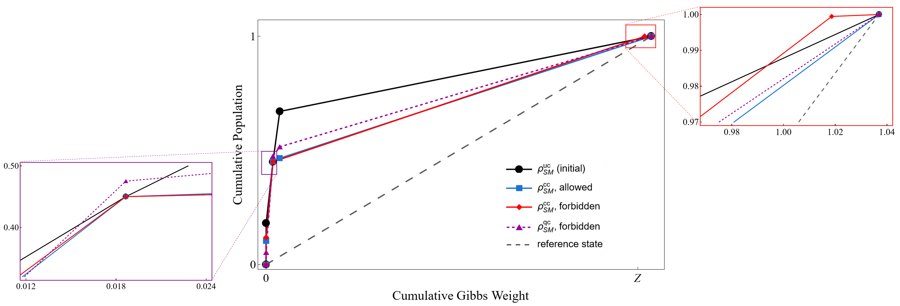
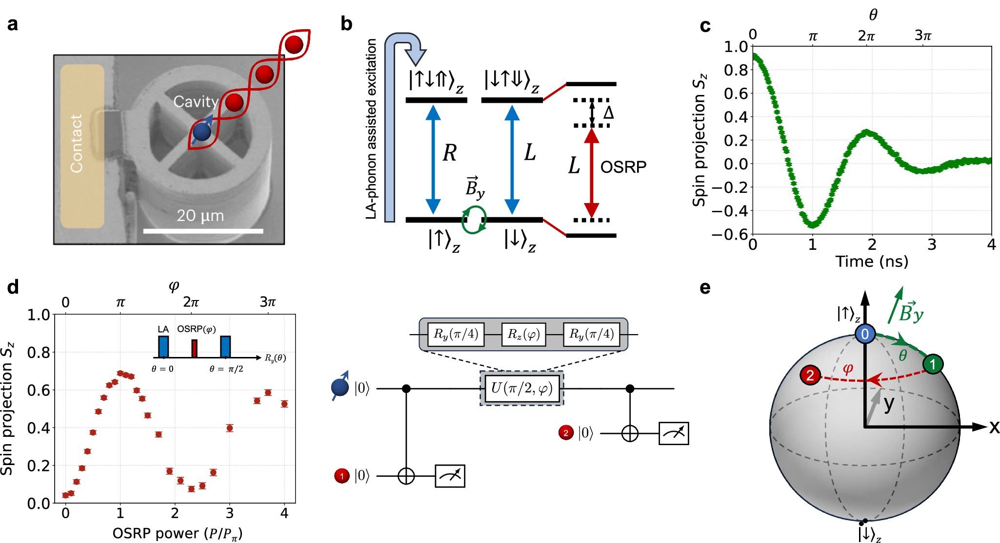
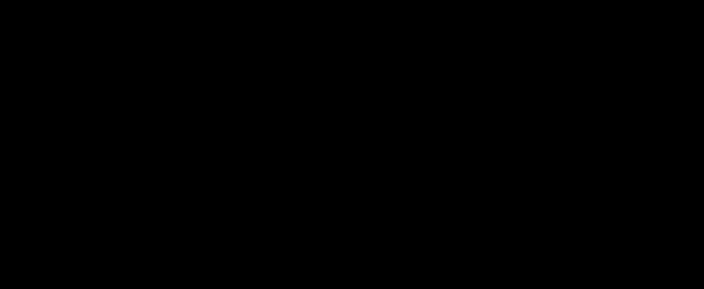

# arxiv quant-ph digest — 2026-04-24

*36 papers · 4 highlighted*

## ⭐ Highlighted (4)

*Papers by authors on your watch list. They also appear in their normal category below.*

### ⭐ [Algorithmic Locality via Provable Convergence in Quantum Tensor Networks](http://arxiv.org/abs/2604.21919v1)

**Highlighted author(s):** Sarang Gopalakrishnan  
**Authors:** Siddhant Midha, Yifan F. Zhang, Daniel Malz, Dmitry A. Abanin, Sarang Gopalakrishnan  
**Type:** theory · **PDF:** <https://arxiv.org/pdf/2604.21919v1>

**Summary.** The paper provides the first rigorous theoretical framework for the convergence of tensor network belief propagation (BP) on a specific class of many-body states. The authors prove that for sufficiently injective states, BP fixed points can be found efficiently and local perturbations only affect the solution locally, a property they call 'algorithmic locality.' This work bridges the gap between the widespread practical use of BP in numerical physics and formal algorithmic guarantees.

Abstract

Belief propagation has recently emerged as a powerful framework for evaluating tensor networks in higher dimensions, combining computational efficiency with provable analytical guarantees. In this work, we develop the first end-to-end theory of tensor network belief propagation for a class of projected entangled pair states satisfying \emph{strong injectivity}. We show that when the injectivity parameter exceeds a constant threshold, BP fixed points can be found efficiently, and a cluster-corrected BP algorithm computes physical quantities to $1/\mathrm{poly}(N)$ error in $\mathrm{poly}(N)$ time for an $N$ qubit system. We identify a striking phenomenon we term \emph{algorithmic locality}: local perturbations of the tensor network affect the BP fixed point with an influence decaying rapidly with distance. As a result, updates to the fixed point after a local perturbation can be carried out using only local recomputation. Moreover, through the cluster expansion, this locality extends to observables, implying that local expectation values can be approximated from local data with controlled accuracy. Our results provide the first rigorous guarantee for the effectiveness of tensor-network belief propagation on a wide class of many-body states, bridging a gap between widely used numerical practice and provable algorithmic performance.

### ⭐ [Quantum jump correlations in long-range dissipative spin systems](http://arxiv.org/abs/2604.21513v1)

**Highlighted author(s):** Rosario Fazio  
**Authors:** Giulia Salatino, Anna Delmonte, Zejian Li, Rosario Fazio, Alberto Biella  
**Type:** theory · **PDF:** <https://arxiv.org/pdf/2604.21513v1>

**Summary.** The paper investigates how the statistical properties of quantum jump trajectories can be used to identify nonequilibrium phase transitions in spin systems with long-range dissipation. By analyzing the correlations and waiting times of detection events, the authors demonstrate that trajectory-resolved observables reveal distinct signatures of paramagnetic and ferromagnetic phases. This work highlights the utility of monitoring individual quantum jumps as a powerful probe for studying collective behavior in open many-body systems.

Abstract

We characterize nonequilibrium phases in long-range dissipative spin systems through the statistical properties of quantum jump trajectories. While the average dynamics governed by the Lindblad master equation provides access to steady-state expectation values of order parameters, the quantum trajectory framework reveals features encoded in the spatial and temporal correlations of detection events. Focusing on a model exhibiting a paramagnetic-to-ferromagnetic phase transition, we investigate the full counting statistics of quantum jumps using a tilted Lindbladian approach. We combine this with cluster mean-field and cumulant expansion techniques, which allow us to capture, respectively, the short- and long-range structure of jump correlations. In addition, we study the waiting-time distributions of detection events. We show that quantum jump correlations display clear signatures of the underlying phases and reveal distinct dynamical features across the transition. Our results highlight the potential of trajectory-resolved observables as probes of collective behavior in open quantum many-body systems and provide new insights into the role of long-range interactions in shaping nonequilibrium dynamics.

### ⭐ [Symplectic split-operator method for the time-dependent unitary Tavis-Cummings model](http://arxiv.org/abs/2604.21778v1)

**Highlighted author(s):** Andrii G. Sotnikov, Denys I. Bondar  
**Authors:** Roman Ovsiannikov, Kurt Jacobs, Andrii G. Sotnikov, Denys I. Bondar  
**Type:** theory · **PDF:** <https://arxiv.org/pdf/2604.21778v1>

**Summary.** The authors introduce a new numerical method for simulating the time-dependent Tavis-Cummings model, which describes the interaction between a cavity mode and a multilevel spin system. By using a change of basis to transform the Hamiltonian into a tri-diagonal form, the method achieves linear computational complexity in both time and memory. This approach is highly efficient, preserves unitarity, and can be applied to any closed quantum system whose Hamiltonian can be tri-diagonalized.

Abstract

We present a fast, memory-efficient, unitarity-preserving numerical method beyond the rotating-wave approximation for the closed Tavis-Cummings model in which a multilevel spin system interacts with a cavity mode. This model can describe the interaction of an ensemble of spins with a cavity mode in which the spin frequency and other parameters are time-dependent. The method exploits the fact that, while the Tavis-Cummings model is not tri-diagonal, it can be brought into tri-diagonal form by a change of basis that can be implemented purely by re-indexing (permuting basis elements), which is a fast operation. By truncating the Fock basis of the cavity mode, the computational complexity of the method is linear in the total dimension of the coupled system, both in time and memory. The method can be employed to simulate any closed quantum system whose Hamiltonian terms can be brought into tri-diagonal form.

### ⭐ [Generalized stochastic spin-wave theory for open quantum spin systems](http://arxiv.org/abs/2604.21574v1)

**Highlighted author(s):** Rosario Fazio  
**Authors:** Zejian Li, Anna Delmonte, Rosario Fazio  
**Type:** theory · **PDF:** <https://arxiv.org/pdf/2604.21574v1>

**Summary.** The authors introduce a new semiclassical framework designed to simulate the dynamics of open, driven-dissipative spin systems. This method uses generalized spin-wave approximations to track quantum trajectories, allowing for the efficient study of large-scale systems even with local quantum jumps and short-range interactions. By applying this to a 2D Ising model, they demonstrate how the method can capture complex phenomena like symmetry-breaking phase transitions and changes in universality classes.

Abstract

We propose a semiclassical framework for solving open quantum dynamics in driven-dissipative spin systems. Our method consists of generalized spin-wave approximations tailored to describing quantum trajectories unravelled from the master equation, and generically applies to regimes beyond the reach of conventional spin-wave theories, including short-range interactions and local quantum jumps, enabling the efficient simulation of large-scale interacting spins. We illustrate the versatility of our framework by studying a variable-range driven-dissipative Ising model on a 2D lattice. When the dissipation acts along the drive axis, we find a continuous phase transition breaking the $\mathbb{Z}_2$ symmetry, and demonstrate that the interaction range, when tuned from fully-connected to nearest-neighbour, profoundly alters the universality class of the criticality. With the dissipation along the interaction axis, we show the emergence of a first-order transition. Demonstrated with both state-diffusion and quantum-jump types of trajectory dynamics, our framework provides a powerful toolbox for the efficient semiclassical description of non-equilibrium dynamics and many-body phases in spin systems.

## quantum information and computing (30)

### [Subsystem-Resolved Spectral Theory for Quantum Many-Body Hamiltonians](http://arxiv.org/abs/2604.21929v1)

**Authors:** MD Nahidul Hasan Sabit  
**Type:** theory · **PDF:** <https://arxiv.org/pdf/2604.21929v1>

**Summary.** The paper introduces a new framework for analyzing the spectral properties of many-body Hamiltonians by decomposing them into subsystem-based spectra. It demonstrates that these subsystem spectra are stable under local approximations and that the spectrum of a combined system is approximately the sum of the spectra of its disjoint parts. This approach provides a way to link the geometric structure of physical interactions directly to the resulting energy spectrum.

Abstract

We study spectral properties of quantum many-body Hamiltonians through a subsystem-based framework. Given a Hamiltonian of the form $H = \sum_{X \subseteq Λ} Φ(X)$ acting on a tensor product Hilbert space, we associate to each subset $S \subseteq Λ$ a subsystem Hamiltonian $H_S$ and its spectrum $\mathcal{S}(S) = σ(H_S)$. This produces a family of spectra indexed by subsystems, allowing spectral data to be organized according to interaction structure. We show that subsystem Hamiltonians admit local approximations: $H_S$ can be approximated by operators supported on finite neighborhoods with an error bounded by $\|H_S - H_{S,r}\| \le |S| e^{-μr} \|Φ\|_μ$. As a consequence, subsystem spectra are stable under truncation in the sense that $d_H(\mathcal{S}(S), σ(H_{S,r})) \le |S| e^{-μr} \|Φ\|_μ.$ We then prove that for disjoint subsets $S_1, S_2 \subseteq Λ$, the subsystem spectrum is approximately additive: $d_H\big(\mathcal{S}(S_1 \cup S_2), \mathcal{S}(S_1) + \mathcal{S}(S_2)\big) \le (|S_1| + |S_2|) e^{-μD} \|Φ\|_μ,$ where $D = d(S_1, S_2)$. In the finite-range case, this relation becomes exact. The results show that spectral properties reflect the locality of interactions not only at the level of operators, but also at the level of spectra. The framework provides a way to study many-body systems in which interaction geometry directly shapes spectral behavior.

### ⭐ [Algorithmic Locality via Provable Convergence in Quantum Tensor Networks](http://arxiv.org/abs/2604.21919v1)

**Highlighted author(s):** Sarang Gopalakrishnan  
**Authors:** Siddhant Midha, Yifan F. Zhang, Daniel Malz, Dmitry A. Abanin, Sarang Gopalakrishnan  
**Type:** theory · **PDF:** <https://arxiv.org/pdf/2604.21919v1>

**Summary.** The paper provides the first rigorous theoretical framework for the convergence of tensor network belief propagation (BP) on a specific class of many-body states. The authors prove that for sufficiently injective states, BP fixed points can be found efficiently and local perturbations only affect the solution locally, a property they call 'algorithmic locality.' This work bridges the gap between the widespread practical use of BP in numerical physics and formal algorithmic guarantees.

Abstract

Belief propagation has recently emerged as a powerful framework for evaluating tensor networks in higher dimensions, combining computational efficiency with provable analytical guarantees. In this work, we develop the first end-to-end theory of tensor network belief propagation for a class of projected entangled pair states satisfying \emph{strong injectivity}. We show that when the injectivity parameter exceeds a constant threshold, BP fixed points can be found efficiently, and a cluster-corrected BP algorithm computes physical quantities to $1/\mathrm{poly}(N)$ error in $\mathrm{poly}(N)$ time for an $N$ qubit system. We identify a striking phenomenon we term \emph{algorithmic locality}: local perturbations of the tensor network affect the BP fixed point with an influence decaying rapidly with distance. As a result, updates to the fixed point after a local perturbation can be carried out using only local recomputation. Moreover, through the cluster expansion, this locality extends to observables, implying that local expectation values can be approximated from local data with controlled accuracy. Our results provide the first rigorous guarantee for the effectiveness of tensor-network belief propagation on a wide class of many-body states, bridging a gap between widely used numerical practice and provable algorithmic performance.

### [Dual-use quantum hardware for quantum resource generation and energy storage](http://arxiv.org/abs/2604.21913v1)

**Authors:** Vaibhav Sharma, Yiming Wang, Shouvik Sur  
**Type:** theory · **PDF:** <https://arxiv.org/pdf/2604.21913v1>

**Summary.** The paper demonstrates a fundamental connection between the generation of quantum resources, like entanglement, and the charging of quantum batteries. The authors propose a dual-use hardware protocol for superconducting circuits that can switch between energy storage and quantum sensing. This approach allows for modular quantum architectures that provide multiple functionalities without requiring additional hardware.

Abstract

Quantum resources such as entanglement form the backbone of quantum technologies and their efficient generation is a central objective of modern quantum platforms. Independently, quantum batteries have emerged as nanoscale devices that utilize collective quantum effects to store energy with a charging advantage over classical strategies. Here, we show that these two pursuits can co-exist: protocols for fast generation of resourceful quantum states can simultaneously charge a quantum battery with a collective advantage, and conversely, a quantum battery protocol with a charging advantage can produce resource-rich states. Using this connection, we propose an integrated hardware protocol on superconducting circuits in which each experimental run can interchangeably accomplish either quantum battery charging, or quantum sensing through generation of metrologically useful states. Our results establish that quantum resources and stored energy are distinct yet co-producable quantities, opening the door to modular quantum architectures that dynamically switch between sensing and energy-storage functions, thereby producing additional functionalities without extra hardware cost.

### [Efficient Classical Simulation of Heuristic Peaked Quantum Circuits](http://arxiv.org/abs/2604.21908v1)

**Authors:** David Kremer, Nicolas Dupuis  
**Type:** theory · **PDF:** <https://arxiv.org/pdf/2604.21908v1>

**Summary.** The paper demonstrates that recently proposed 'peaked' quantum circuits, which were claimed to provide a path to verifiable quantum advantage, can actually be efficiently simulated on classical hardware. The authors introduce a tensor network contraction method that uses a process called 'unswapping' to bypass circuit permutations and reduce bond dimensions. Their approach allows the peak bitstring of a 56-qubit circuit to be extracted in about one hour on a single GPU, significantly faster than the original quantum hardware execution.

Abstract

Peaked quantum circuits, whose output distribution is sharply concentrated on a single bitstring, have emerged as a promising candidate for verifiable quantum advantage, as the correctness of the quantum output can be checked by simply comparing against the known peak. Recent work by Gharibyan et al. arXiv:2510.25838 claimed heuristic quantum advantage using peaked circuits executed on Quantinuum's 56-qubit H2 processor. These peaked circuits concentrate their output on a single hidden bitstring by training a shallow simulable circuit variationally and inserting an obfuscated permutation to increase the depth to a level that makes classical simulation intractable, with estimated runtimes of years for the largest instances. We show that these circuits can be efficiently simulated classically. We describe a method that efficiently performs a full tensor network contraction, allowing near-exact sampling and extraction of the peaked bitstring. The method exploits the mirrored structure of the circuit and iteratively cancels both halves into a Matrix Product Operator (MPO), and avoids the obfuscated permutation by greedily reducing the MPO bond dimension through a process we call unswapping. The method can fully contract and extract the peak of the largest circuit in approximately one hour on a single GPU, around half the time it took to run on the quantum hardware.

### [A Universal Quantum Information Preserving Photonic Switch for Scalable Quantum Networks](http://arxiv.org/abs/2604.21902v1)

**Authors:** Jiapeng Zhao, Stéphane Vinet, Amir Minoofar, Michael Kilzer, Lucas Wang, Galan Moody, Vijoy Pandey, Ramana Kompella, Reza Nejabati  
**Type:** both · **PDF:** <https://arxiv.org/pdf/2604.21902v1>

**Summary.** The authors present a 'Universal Quantum Switch' implemented in thin-film lithium niobate designed for dynamic routing in quantum networks. The device demonstrates high-speed electro-optic switching at 1 MHz with very low decoherence (≤ 4%) and supports reconfiguration speeds up to 1 GHz. This technology provides a scalable, encoding-agnostic building block for connecting disparate quantum platforms in a heterogeneous quantum internet.

Abstract

Quantum networks are a keystone of the quantum internet. However, existing implementations remain largely confined to static point-to-point links due to the absence of a switching paradigm capable of dynamically routing fragile quantum entanglement without introducing decoherence. Here, we propose the Universal Quantum Switch, a foundational building block allowing on-demand, non-blocking, and encoding-agnostic routing of quantum information, as well as seamless modality conversion between disparate quantum platforms. We develop a prototype in thin-film lithium niobate and experimentally demonstrate robust switching with $\le 4\%$ decoherence via thermo-optic modulation and high-speed electro-optic switching of arbitrary entangled states at 1 MHz. Moreover, we show that our platform can support reconfiguration speeds up to 1 GHz. To our knowledge, this work represents the first demonstration of multi-node dynamic entanglement distribution at these speeds. Complementing these experimental results, we project the architecture's scalability, showing dimension-independent decoherence, and provide a scalable, interoperable building block for heterogeneous quantum network fabrics.

### [Loss-biased fault-tolerant quantum error correction](http://arxiv.org/abs/2604.21876v1)

**Authors:** Laura Pecorari, Gavin K. Brennen, Stanimir S. Kondov, Guido Pupillo  
**Type:** theory · **PDF:** <https://arxiv.org/pdf/2604.21876v1>

**Summary.** The paper investigates how fast quantum error correction (QEC) cycles in neutral-atom processors can inadvertently amplify non-Markovian errors, such as Rydberg excitation hopping. To mitigate this, the authors propose 'loss biasing,' a technique that uses mid-circuit ionization to convert unwanted Rydberg excitations into detectable atom losses. This approach transforms complex correlated errors into erasure-like noise, potentially enabling faster, more efficient fault-tolerant quantum computing with reduced hardware overhead.

Abstract

We investigate the limits of quantum error correction (QEC) in neutral-atom processors approaching high-fidelity gates and fast cycle times. We show that shorter QEC cycles amplify platform-specific errors, notably Rydberg excitation hopping, and hinder decay of residual Rydberg population, leading to non-Markovian correlated errors that degrade logical performance. To address this, we introduce loss biasing, where spurious Rydberg excitations are rapidly converted into atom loss via mid-circuit ionization, transforming errors into erasure-like noise and suppressing their propagation. Loss biasing restores the fault-tolerant logical error scaling for intra-cycle Pauli errors; furthermore, we argue that when supported with loss-aware decoding, it can achieve the optimal scaling of erasures while enabling shorter QEC cycles with reduced hardware overhead. We outline an implementation using fast autoionization in alkaline-earth(-like) atoms, establishing loss biasing as a practical route toward fault-tolerant quantum computing with sub-millisecond QEC cycles.

### [Enhancing Coherence of Spin Centers in p-n Diodes via Optimization Algorithms](http://arxiv.org/abs/2604.21874v1)

**Authors:** Jonatan A. Posligua, David E. Stewart, Denis R. Candido  
**Type:** theory · **PDF:** <https://arxiv.org/pdf/2604.21874v1>

**Summary.** The paper presents a gradient descent optimization algorithm designed to maximize the spin coherence of defects in p-n diodes by minimizing their optical linewidth. By modeling the interplay between doping profiles, bias voltage, and charge noise, the authors provide a framework for optimizing diode parameters under realistic physical constraints. This work offers practical guidance for designing solid-state quantum devices with enhanced coherence times and narrower spectral lines.

Abstract

Solid-state spin defects hold great promise as building blocks for various quantum technologies. Embedding spin centers in $p$-$n$ diodes under reverse bias has proved to be a powerful strategy to narrow the optical linewidth and increase spin coherence, while also enabling control of the photoluminescence wavelength via Stark shift. Given the multitude of parameters influencing spin centers in diodes (e.g., doping densities and profiles, temperature, bias voltage, spin center position), a question that has not yet been answered is: which set of these design parameters maximizes spin center coherence? In this work, we address this question by developing a scaled gradient descent optimization algorithm that minimizes the optical linewidth of spin centers by combining the numerical solution of a diode's Poisson equation with calculated charge noise from the non-depleted regions. Our optimization is performed for both single- and multiple-parameter cases for divacancies in SiC $p$-$i$-$n$ diodes, including reverse-bias voltage, doping density and profile, and diode total length. Importantly, the optimization is subject to realistic physical constraints, such as small operating bias voltages, avoidance of the dielectric breakdown regime and physical thresholds for doping density. Additionally, due to the leakage current at reverse bias voltages, we develop a new formalism to investigate its influence on coherence. We show that the corresponding noise can be mitigated by implanting spin defects away from the diode's surfaces. Our work provides guidance on experimentally relevant diodes for hosting spin centers with the narrowest optical linewidths and longest coherence times.

### [High-performance cellular automaton decoders for quantum repetition and toric code](http://arxiv.org/abs/2604.21866v1)

**Authors:** Don Winter, Thiago L. M. Guedes, Markus Müller  
**Type:** theory · **PDF:** <https://arxiv.org/pdf/2604.21866v1>

**Summary.** The paper introduces SCALA, a new non-hierarchical cellular automaton decoder designed for quantum repetition and toric codes. Unlike hierarchical strategies, this decoder uses a local architecture where computational resources remain independent of the system size, making it highly scalable. The authors demonstrate that SCALA achieves a high error threshold and remains robust against measurement noise, offering a promising path for real-time error correction on large-scale quantum hardware.

Abstract

Execution of quantum algorithms on large-scale quantum computers will require extremely low logical error rates, which necessitates the development of scalable decoding architectures. Local decoders are promising candidates for this task, as they avoid the communication and data processing bottlenecks inherent in global decoding strategies. Cellular automaton (CA) decoders represent a distinct class of local decoders, offering a path toward the low-latency, real-time decoding required for practical applications. In this work, we present SCALA (Signaling CA with Local Attraction), a novel non-hierarchical cellular automaton decoder for quantum repetition and toric codes. By evaluating SCALA alongside the hierarchical CA decoder proposed by Harrington, we provide a direct comparison between non-hierarchical and renormalization-group-style local decoding strategies. We characterize SCALA across three key metrics: Performance, scalability, and robustness. Our results show that SCALA achieves a code-capacity threshold of approximately $p_c\approx 7.5\%$ and provides strong sub-threshold scaling of about $p_L\propto p^{d/4}$ on the toric code. In terms of scalability, our non-hierarchical design ensures that the local computational resources remain independent of system size, yielding a modular local architecture suitable for hardware implementation. Finally, SCALA demonstrates strong robustness to qubit measurement errors and noise within the decoder itself, a critical advantage for real-time decoding on noisy hardware. Our results establish SCALA as a high-performance, scalable, and robust local decoder for scalable quantum error correction.

### [Replay-buffer engineering for noise-robust quantum circuit optimization](http://arxiv.org/abs/2604.21863v1)

**Authors:** Akash Kundu, Sebastian Feld  
**Type:** theory · **PDF:** <https://arxiv.org/pdf/2604.21863v1>

**Summary.** This paper proposes new reinforcement learning techniques to improve the efficiency and robustness of quantum circuit optimization. The authors introduce an annealed replay rule to improve sample efficiency, a method to reduce the computational cost of evaluating circuit architectures, and a transfer scheme that allows training on noiseless data to accelerate learning for noisy hardware. These improvements significantly reduce the time and steps required to achieve chemical accuracy in molecular simulations.

Abstract

Deep reinforcement learning (RL) for quantum circuit optimization faces three fundamental bottlenecks: replay buffers that ignore the reliability of temporal-difference (TD) targets, curriculum-based architecture search that triggers a full quantum-classical evaluation at every environment step, and the routine discard of noiseless trajectories when retraining under hardware noise. We address all three by treating the replay buffer as a primary algorithmic lever for quantum optimization. We introduce ReaPER$+$, an annealed replay rule that transitions from TD error-driven prioritization early in training to reliability-aware sampling as value estimates mature, achieving $4-32\times$ gains in sample efficiency over fixed PER, ReaPER, and uniform replay while consistently discovering more compact circuits across quantum compilation and QAS benchmarks; validation on LunarLander-v3 confirms the principle is domain-agnostic. Furthermore we eliminate the quantum-classical evaluation bottleneck in curriculum RL by introducing OptCRLQAS which amortizes expensive evaluations over multiple architectural edits, cutting wall-clock time per episode by up to $67.5\%$ on a 12-qubit optimization problem without degrading solution quality. Finally we introduce a lightweight replay-buffer transfer scheme that warm-starts noisy-setting learning by reusing noiseless trajectories, without network-weight transfer or $ε$-greedy pretraining. This reduces steps to chemical accuracy by up to $85-90\%$ and final energy error by up to $90\%$ over from-scratch baselines on 6-, 8-, and 12-qubit molecular tasks. Together, these results establish that experience storage, sampling, and transfer are decisive levers for scalable, noise-robust quantum circuit optimization.

### [Odd Physics Off the Diagonal: Constraining CP-violating SMEFT with Quantum Tomography](http://arxiv.org/abs/2604.21857v1)

**Authors:** Avalon Roberts, Patrick Dougan, Alexander Oh, Savanna Shaw  
**Type:** theory · **PDF:** <https://arxiv.org/pdf/2604.21857v1>

**Summary.** The paper proposes using quantum tomography techniques to better identify CP-violating physics within the Standard Model Effective Field Theory (SMEFT). By reconstructing the spin density matrix of diboson systems, the authors demonstrate a method to distinguish CP-odd signatures from CP-even backgrounds more effectively than traditional angular observables. This approach allows for the exploitation of pure quadratic New Physics terms, providing superior sensitivity to physics beyond the Standard Model.

Abstract

New sources of charge-parity (CP) violation beyond those described in the Standard Model (SM) are required to explain the observed matter--antimatter asymmetry of the Universe. The Standard Model Effective Field Theory (SMEFT) provides a framework to introduce additional electroweak sources of CP-odd physics in a model-independent manner. However, these CP-violating signatures are mostly degenerate to CP-even SMEFT operators in polarisation-blind observables, distinguishable only in the SM-New Physics (NP) interference using the azimuthal decay angle. Using Quantum Tomography techniques, we present a new approach to constraining these NP effects. Reconstructing the spin density matrix (SDM) of a diboson system, we go beyond `interference resurrection' to exploit the full signature of the Beyond-SM physics, including the pure quadratic NP terms. We show that this approach provides superior simultaneous sensitivity to characteristic features of CP-even and CP-odd contributions, including effects not fully captured by traditional angular observables.

### [Deterministic generation of grid states with programmable nonlinear bosonic circuits](http://arxiv.org/abs/2604.21824v1)

**Authors:** Yanis Le Fur, Javier Lalueza-Puértolas, Carlos Sánchez Muñoz, Alberto Muñoz de las Heras, Alejandro González-Tudela  
**Type:** theory · **PDF:** <https://arxiv.org/pdf/2604.21824v1>

**Summary.** The paper proposes a deterministic method for generating bosonic grid states using programmable nonlinear circuits consisting of squeezing, displacement, and Kerr operations. The authors identify a new class of 'phased-comb states' that emerge from these circuits, which are unitarily related to standard GKP states but possess an intrinsic phase structure. They demonstrate that these states can form a scalable quantum error-correcting code with performance comparable to GKP states under boson loss and show how to implement a universal gate set for them.

Abstract

Bosonic quantum error correction enables hardware-efficient protection of quantum information by encoding logical qubits in harmonic oscillators. Bosonic grid states, such as Gottesman-Kitaev-Preskill (GKP) states, are particularly promising due to their potential to correct small displacements and boson loss. However, their generation remains challenging, typically relying on probabilistic protocols or auxiliary qubit systems. Here, we propose deterministic protocols for generating bosonic grid states using programmable nonlinear bosonic circuits composed solely of squeezing, displacement, and Kerr operations. We show that aiming to enforce GKP symmetries in the output of these circuits yields states with competitive performance with respect to current realizations, but whose quality saturates with increasing circuit depth due to imperfect symmetry restoration. Instead, we find that these bosonic circuits naturally give rise to a distinct class of states, that we label as phased-comb states, which are unitarily related to standard grid states but feature an intrinsic phase structure. We demonstrate that these states define a scalable bosonic quantum error-correcting code with near-optimal performance under boson loss comparable to that of approximate GKP states. We further analyze their logical operations and show how to implement a universal gate set for them. Our results establish programmable nonlinear bosonic circuits as a viable route towards the generation of scalable bosonic quantum error-correcting states beyond standard GKP encodings.

### [Unitary Time Evolution and Vacuum for a Quantum Stable Ghost](http://arxiv.org/abs/2604.21823v1)

**Authors:** Cédric Deffayet, Atabak Fathe Jalali, Aaron Held, Shinji Mukohyama, Alexander Vikman  
**Type:** theory · **PDF:** <https://arxiv.org/pdf/2604.21823v1>

**Summary.** The paper investigates a quantum system where a standard harmonic oscillator is coupled to a 'ghost' particle possessing negative kinetic energy. The authors demonstrate that despite the presence of the ghost, the system remains stable with a well-defined vacuum and unitary time evolution due to a specific integral of motion. This work is significant because it shows how certain mathematical constraints can prevent the catastrophic instabilities typically associated with negative-energy states.

Abstract

We quantize a classically stable system of a harmonic oscillator polynomially coupled to a ghost with negative kinetic energy. We prove that due to an integral of motion with a positive discrete spectrum: i) the Hamiltonian has a pure point spectrum unbounded in both directions, ii) the evolution is manifestly unitary, iii) the vacuum is well-defined, iv) expectation values for squares of canonical variables are bounded. Numerical solutions of the Schrödinger equation confirm these results. We argue that the discrete spectrum of the integral of motion enforces stability for extended interactions.

### [The clock ambiguity is back with a vengeance](http://arxiv.org/abs/2604.21805v1)

**Authors:** Ovidiu Cristinel Stoica  
**Type:** theory · **PDF:** <https://arxiv.org/pdf/2604.21805v1>

**Summary.** The paper challenges recent claims that the 'clock ambiguity' in relational time frameworks can be resolved by assuming no interaction between the clock and the system. The author demonstrates that this ambiguity actually extends to both system histories and Hamiltonians, even in non-interacting scenarios. This finding suggests that purely relational approaches to time face significant challenges, as ignoring this ambiguity would lead to incorrect physical predictions.

Abstract

Page and Wootters (1983) showed how time and dynamics can emerge in a stationary system containing a clock. Albrecht (1995) later showed, for discrete time, that within this framework any dynamical evolution can be obtained simply by choosing a different clock.   Marletto and Vedral (2017) claimed that this ambiguity disappears assuming that the clock and the rest of the world do not interact. I show that their proof relies on an incorrect mathematical assumption. Also, eliminating the ambiguity completely would obstruct spacetime symmetries.   Whereas the original clock ambiguity concerns all possible histories of a discrete-time system evolving under arbitrary Hamiltonians, but not the Hamiltonians themselves, I prove a stronger version for continuous and discrete unbounded time: the ambiguity extends to both histories and Hamiltonians, including noninteracting ones. Only the dimension of the Hilbert space remains.   One might hope to dismiss the ambiguity as merely perspectival, but I show that this would predict incorrect correlations between outcomes and their records, making even knowledge impossible. Purely relational approaches therefore face both the stronger and the original clock ambiguity problems. The ambiguity is removed by taking into account the physical meaning of the operators.

### [Variance Geometry of Exact Pauli-Detecting Codes: Continuous Landscapes Beyond Stabilizers](http://arxiv.org/abs/2604.21800v1)

**Authors:** Arunaday Gupta, Baisong Sun, Xi He, Bei Zeng  
**Type:** theory · **PDF:** <https://arxiv.org/pdf/2604.21800v1>

**Summary.** The paper investigates the geometric structure of exact quantum codes that detect specific Pauli errors, moving beyond traditional stabilizer-based approaches. The authors demonstrate that these codes often exist in continuous, connected families rather than as isolated points, characterized by a scalar parameter related to Pauli variance. By analyzing higher-rank numerical ranges, the study reveals that stabilizer codes are merely discrete subsets of a much larger, continuous landscape of nonadditive quantum codes.

Abstract

Exact quantum codes detecting a prescribed set of Pauli errors are approached through algebraic constructions--stabilizer, codeword-stabilized, permutation-invariant, topological, and related families. Geometrically, exact Pauli detection is governed by joint higher-rank numerical ranges of these Pauli operators, whose structure for rank $\geq 2$ is largely uncharted. From this viewpoint, we show that such codes often form connected continuous families rather than collections of disjoint solution regions. These families are characterized by a single scalar derived from the Knill-Laflamme conditions: denoted $λ^*$, it is the Euclidean norm of the signature vector of Pauli expectation values on the maximally mixed code state, and provides a one-parameter summary of the code's joint Pauli variance profile. Within these continuous landscapes, stabilizer codes occupy only discrete, measure-zero subsets of the attainable $λ^*$-spectrum, exposing a largely unexplored continuum of genuinely nonadditive exact codes. We establish this picture by analyzing the geometry of higher-rank operator compressions, and extend it to symmetry-restricted settings where cyclic and permutation symmetries are imposed on both the error model and the code projector. Small-system cases reveal interval, singleton, and empty regimes through eigenvalue interlacing and symmetry-sector decompositions; larger systems are treated numerically via Stiefel-manifold optimization and symmetry-adapted parameterizations. In every unrestricted and symmetry-compatible case analyzed, the attainable $λ^*$-spectrum forms a single closed interval whenever nonempty--although a general proof remains open. These results place stabilizer, symmetric, and nonadditive code families within a unified higher-rank variance framework, suggesting a continuous geometric perspective on the landscape of exact quantum codes.

### [Rigorous Security Proofs for Practical Quantum Key Distribution](http://arxiv.org/abs/2604.21791v1)

**Authors:** Devashish Tupkary  
**Type:** theory · **PDF:** <https://arxiv.org/pdf/2604.21791v1>

**Summary.** This thesis provides rigorous security proofs for practical Quantum Key Distribution (QKD) protocols against various attack models. The author develops new methods to bound phase error rates under imperfect detector conditions and introduces a general security analysis framework based on the entropy accumulation theorem. These results are significant because they bridge the gap between idealized theoretical security and the vulnerabilities found in real-world hardware implementations.

Abstract

This thesis is concerned with rigorous security analyses of practical Quantum Key Distribution (QKD) protocols, using a variety of modern proof techniques. The main results are as follows. First, we establish a security proof for variable-length QKD protocols against IID collective attacks, and extend this result to coherent attacks using the postselection technique. In doing so, we resolve a long-standing flaw in the application of the postselection technique to QKD, thereby placing it on a rigorous mathematical footing. Second, we develop a method to bound phase error rates in entropic uncertainty relation-based and phase error rate-based proofs, using only the observed statistics of the protocol, even when detectors are imperfect and only approximately characterized. This removes a key assumption of identical detector behaviour and enables these techniques to be applied in realistic settings. Third, we present a very general security analysis based on the marginal-constrained entropy accumulation theorem. The resulting framework can be readily adapted to practical imperfections and side channels, and is suitable for certification efforts. Finally, we show that the security of QKD protocols under realistic authentication assumptions can be reduced to the standard idealized setting, where authentication is assumed to behave honestly, with only minor protocol modifications. A distinctive feature of this thesis is its unified presentation of several major QKD security proof frameworks using consistent protocol descriptions and notation. Consequently, this thesis is intended not only as a collection of new technical results, but also as a useful reference for understanding rigorous security analysis in quantum key distribution.

### [Partial oracles quantum algorithm framework -- Part I: Analysis of in-place operations](http://arxiv.org/abs/2604.21788v1)

**Authors:** Fintan M. Bolton  
**Type:** theory · **PDF:** <https://arxiv.org/pdf/2604.21788v1>

**Summary.** This paper introduces a method for constructing the search iteration operator within the 'partial oracles' framework, specifically for oracle functions using in-place operations. The author introduces the 'reciprocal transform' and demonstrates its utility by applying it to components of the SHA-256 hash algorithm. While the current scope is limited to classically reversible operations, the work provides a foundational construction and a new Python library, QFrame, for automating quantum circuit design.

Abstract

The partial oracles framework is a quantum search algorithm that has the potential to exceed the quadratic speedup of Grover's algorithm, up to a theoretical maximum of an exponential speedup. Until now, however, the framework has lacked an explicit method for constructing the operator that represents the search iteration. In this paper, we provide the missing construction, for the special case of an oracle function definable using only in-place operations (that is, where the calculated result of the oracle function can be read just from the qubits in the search index). The restriction to in-place operations means that the current work does not yet exhibit quantum advantage: oracle functions constructed using only in-place operations are always classically reversible. To demonstrate quantum advantage, it will be necessary to extend this construction method to include out-of-place operations (part II). As part of the construction of the search iteration operator, we define a new type of transform, the reciprocal transform, which is applied to the oracle function. We show that the reciprocal transform obeys a chain rule, which makes it possible to break down complex transforms into simple steps. To illustrate the practical application of this search method, we apply the reciprocal transform to elementary operations from the SHA-256 hash algorithm: addition modulo $2^n$, the $Maj(a, b, c)$ function, the $Ch(a, b, c)$ function, and the bit shift functions. We also introduce the QFrame python library, which is used to automate the construction of quantum circuits that represent reciprocal transforms.

### [Photon Sorting with a Quantum Emitter](http://arxiv.org/abs/2604.21758v1)

**Authors:** Kasper H. Nielsen, Etienne Corminboeuf, Benedikt Tissot, Love A. Pettersson, Sven Scholz, Arne Ludwig, Leonardo Midolo, Anders S. Sørensen, Peter Lodahl, Ying Wang, Stefano Paesani  
**Type:** experiment · **PDF:** <https://arxiv.org/pdf/2604.21758v1>

**Summary.** The authors demonstrate a passive photon-sorting circuit that uses the nonlinearity from a single solid-state quantum emitter to distinguish between different photon numbers. This approach allows for Bell state measurements that exceed the 50% success probability limit of standard linear optics. Such advancements are crucial for reducing hardware overhead and improving the scalability of photonic quantum computing and communication networks.

Abstract

High-quality photonic Bell state measurements (BSMs) enable scalable universal quantum computing and long distance quantum communication. However, when implemented with linear optics, BSMs are fundamentally probabilistic, introducing substantial hardware overheads and limiting noise tolerance in photonic quantum computing architectures. Nonlinear interactions at the single-photon level can overcome these limitations by enabling near-deterministic photon-photon gates. Here, we demonstrate a passive photon-sorting circuit based on the induced nonlinearity arising from photon scattering in a solid-state quantum emitter. The scattering is implemented in a directional waveguide-emitter coupling interface and embedded on-chip into a linear optical circuit, through which we demonstrate sorting of one- and two-photon components with a success probability of 62%. We find that the current system can enable BSMs with a 57% post-selected success probability without ancillary photons, exceeding the linear-optical limit of 50%, and can be readily improved to >65% with design optimisations.

### [Quantum-information diagnostics of cosmological perturbations with nontrivial sound speed in inflation](http://arxiv.org/abs/2604.21755v1)

**Authors:** Shi-Cheng Liu, Lei-Hua Liu, Bichu Li, Hai-Qing Zhang, Peng-Zhang He  
**Type:** theory · **PDF:** <https://arxiv.org/pdf/2604.21755v1>

**Summary.** The paper investigates how a non-trivial sound speed during inflation affects the quantum-information properties of cosmological perturbations. Using a two-mode squeezed-state framework, the authors show that a modified sound speed alters the evolution of squeezing parameters, leading to changes in purity, entropy, and entanglement. Their results demonstrate that these dynamics can delay the onset of classicality and leave identifiable quantum signatures in the early universe's entanglement structure.

Abstract

In this work, we systematically investigate the quantum-information diagnostics of cosmological perturbations with a nontrivial sound speed, utilizing a normalized open two-mode squeezed-state framework. Rather than introducing new observables, our analysis focuses on how a modified sound speed dynamically reshapes the Schrödinger evolution of the squeezing parameters ($r_k$ and $φ_k$). We demonstrate how these dynamical changes are inherited by the reduced density matrix of the observable sector. By employing a sound-speed-resonance parametrization, we derive and evaluate the purity, von Neumann entropy, Rényi entropies, and logarithmic negativity. To overcome the intrinsic multiscale stiffness of the post-inflationary equations, we introduce a bounded variable $x = \tanh r_k$ as a partial regularization, which enables reliable numerical simulations exclusively within the inflationary regime. Our numerical results reveal that a nontrivial sound speed significantly suppresses the purity of the reduced state, indicating enhanced effective mixedness. Simultaneously, it strongly amplifies and modulates both the entropic and entanglement diagnostics. More precisely, a nontrivial sound speed postpones the onset of classicality by modulating the decoherence process. Ultimately, we show that a nontrivial sound speed leaves distinct and identifiable quantum-information signatures within the entanglement structure of the early universe.

### [Entanglement of two optical emitters mediated by a terahertz channel](http://arxiv.org/abs/2604.21723v1)

**Authors:** Yanis Le Fur, Diego Martín-Cano, Carlos Sánchez Muñoz  
**Type:** both · **PDF:** <https://arxiv.org/pdf/2604.21723v1>

**Summary.** The paper proposes a method to generate steady-state entanglement between two optical emitters using a terahertz (THz) photonic channel. By using strong visible-light driving to create tunable energy transitions, the researchers demonstrate how THz photons can mediate collective dissipation to achieve high entanglement (concurrence > 0.9). This approach is significant because it allows for the control and measurement of THz quantum states entirely through optical means, providing a scalable interface for THz-based quantum technologies.

Abstract

Quantum technologies in the terahertz (THz) require a coherent interface between addressable qubits and THz quantum channels -- a capacity that so far, remains largely underdeveloped. Here, we propose and demonstrate the generation of steady-state entanglement between polar quantum emitters, mediated by THz photons. We exploit strong visible-light driving of the emitters to create Rabi-split dressed eigenstates whose energy separation can be optically tuned into the THz regime. The polar nature of the emitters activates THz transitions within these eigenstates, allowing them to couple to a THz photonic mode that induces collective dissipative dynamics. A coherent driving and control of these effective THz emitters is achieved by using a sideband optical drive with detuning close to the THz transition frequency. The resulting interplay of collective dissipation and driving activates a mechanism to generate steady-state entanglement with high values of the concurrence ($C>0.9$), attainable under experimentally feasible parameters. Crucially, both coherent manipulation and quantum state tomography are implemented entirely through optical means, avoiding direct THz control and detection. This establishes a hybrid visible-THz quantum interface in which a THz channel mediates qubit-qubit entanglement (a key operational requirement for THz quantum technologies) while remaining optically accessible.

### [Near-Term Reduction in Nonlocal Gate Count from Distributed Logical Qubits](http://arxiv.org/abs/2604.21722v1)

**Authors:** Bruno Avritzer, Nathan Sankary  
**Type:** theory · **PDF:** <https://arxiv.org/pdf/2604.21722v1>

**Summary.** The paper addresses the challenge of minimizing noisy inter-processor operations in modular quantum computing architectures. By developing qubit allocation techniques using color codes, the authors demonstrate a 10% reduction in nonlocal gate counts for current-generation error correction cycles. The work also evaluates different strategies for achieving universal gate sets, such as magic state distillation and code switching, in a distributed setting.

Abstract

Modular quantum computing architectures require error correction schemes that remain effective in the presence of noisy inter-processor operations. As such, minimizing the number of such operations on logical circuits partitioned across quantum processors is a primary objective of distributed quantum computing. In this work, we develop basic techniques for qubit allocation using an exemplar color code family and explore generalizations to other color codes. In particular, we show that a 10% reduction in processor-nonlocal gates is achievable in a setting where syndrome extraction occurs after every logical gate, as in today's devices, and that this scales to significantly greater advantages in the multi-qubit case. We also explore methods of achieving universal gate sets efficiently in this distributed logical setting and evaluate the trade-offs of multiple approaches such as magic state distillation, code switching, and a new method based on logical swaps. Finally, we discuss some considerations for an allocation algorithm for these architectures to perform scalably and connect it to existing work on quantum circuit partitions.

### [Lagrange: Operating Italy's First Publicly-Accessible Quantum Computer for Research and Education](http://arxiv.org/abs/2604.21695v1)

**Authors:** Paolo Viviani, Fabrizio Bertone, Giacomo Vitali, Emanuele Dri, Federico Stirano, Giuseppe Caragnano, Francesco Lubrano, Antonino Nespola, Olivier Terzo, Matteo Cocuzza, Bartolomeo Montrucchio, Giovanna Turvani, Gianluca Bertaina, Marco Coisson, Davide Calonico, Fabrizio Pirri, Pietro Asinari  
**Type:** experiment · **PDF:** <https://arxiv.org/pdf/2604.21695v1>

**Summary.** The paper describes the development and deployment of a custom software management stack for 'Lagrange,' Italy's first publicly accessible superconducting quantum computer. The authors implemented a modular middleware layer that enables multi-user access, budget enforcement, and fair usage policies without altering vendor software. This infrastructure has successfully supported large-scale research and educational use, including its integration into university examinations.

Abstract

We describe the design, implementation, and nine-month operational experience of the software management stack for Lagrange, an IQM Spark five-qubit superconducting quantum computer jointly acquired by LINKS Foundation, Politecnico di Torino and the Italian National Institute of Metrological Research (INRiM), and managed by LINKS. Lagrange is, to our knowledge, the first quantum computer in Italy that is fully operational and accessible to students and researchers from multiple institutions under formal service agreements, and to the general public under commercial agreements. When installed in mid-2025, the IQM Spark hardware was delivered by the vendor with authentication only: no billing, project management or fair usage enforcement were provided. We developed a modular middleware layer that filled that gap without modifying any vendor client software, by intercepting API calls through a proxy that enforces project-based budgets, reservation-aware authorisation, and per-user fairness policies. The middleware adopts a plugin architecture that cleanly separates vendor-specific logic from site-specific policies, enabling reuse across different quantum hardware backends and deployment contexts. Since entering production in September 2025, the system has processed over 240,000 quantum jobs totalling more than 1 week of QPU execution time, with greater than 98% uptime. Notably, students at Politecnico di Torino regularly use the machine during both lectures and formal examinations -- a practice we believe to be unique in Europe. We report on the system architecture, the operational lessons learned, and the infrastructure choices that made this deployment possible.

### [Bipartite entanglement under frequency comb pumping in parametric Josephson circuits](http://arxiv.org/abs/2604.21692v1)

**Authors:** Mikael Vartiainen, Ilari Lilja, Ekaterina Mukhanova, Kirill Petrovnin, Gheorghe Sorin Paraoanu, Pertti Hakonen  
**Type:** both · **PDF:** <https://arxiv.org/pdf/2604.21692v1>

**Summary.** The paper investigates how using multiple pump tones in a frequency comb setup affects bipartite entanglement in Josephson parametric circuits. The researchers demonstrate that while additional pumps can redistribute correlations across a larger network of modes, they also reduce the initial two-mode squeezing by introducing entanglement with extra idler frequencies. This study provides both theoretical and experimental insights into managing entanglement in superconducting microwave circuits, which is crucial for developing large-scale continuous-variable quantum computing.

Abstract

The creation of high-quality cluster states in superconducting microwave circuits is a relevant ingredient in continuous-variable quantum computing. Although large-scale cluster states have been established in optical systems, dissipation prevents their direct applicability to the microwave realm. Recent improvements in superconducting parametric circuits, in particular Josephson parametric amplifiers (JPA) and traveling wave parametric amplifiers (TWPA), have permitted substantial progress in producing entangled states using microwave photons. In this paper, we examine experimentally and theoretically the effects of numerous parametric pump tones on the degree of two-mode squeezing in a quantum circuit and apply it to the JPA. We find that additional pumps diminish the initial two-mode correlations achieved with a single pump by redistributing it among a larger network of modes and by introducing entanglement with additional idler frequencies. Taking into account the actual heterodyne measurement conditions, the experimental results are consistent with theoretical expectations.

### [Speed-oriented quantum circuit backend](http://arxiv.org/abs/2604.21656v1)

**Authors:** Sören Wilkening  
**Type:** theory · **PDF:** <https://arxiv.org/pdf/2604.21656v1>

**Summary.** The paper introduces a new software package optimized for high-speed quantum circuit generation. By benchmarking with the Quantum Fourier Transform, the author demonstrates that this backend can handle up to 2000 qubits significantly faster than Qiskit or Q#. This speedup is crucial for preventing classical preprocessing bottlenecks in time-sensitive applications like combinatorial optimization.

Abstract

We present a new software package for efficient quantum circuit generation, designed to achieve optimal runtime performance. Despite being in an early stage of development, our implementation demonstrates significant advantages over existing tools. Using the quantum Fourier transform (QFT) as a benchmark, we show that our backend can generate circuits for systems with up to 2000 qubits faster than widely used frameworks such as Qiskit and Q#. This improvement is particularly relevant for applications where classical preprocessing time, including circuit generation, must be minimized to not diminish any potential quantum advantage - for example, in combinatorial optimization tasks. Additionally, our software provides high-level primitives for bit- and integer-level manipulations, offering a simplified interface for integration with high-level quantum programming languages.

### [The KMS and GNS Spectral Gap of Quantum Markov Semigroups](http://arxiv.org/abs/2604.21630v1)

**Authors:** Melchior Wirth  
**Type:** theory · **PDF:** <https://arxiv.org/pdf/2604.21630v1>

**Summary.** The paper proves a conjecture regarding the relationship between the decay rates of quantum Markov semigroups under different inner products. Specifically, it demonstrates that the decay rate with respect to the KMS inner product is bounded below by the decay rate for the GNS inner product. This result is shown to hold for all quantum Markov semigroups with a faithful normal invariant state on arbitrary von Neumann algebras, extending beyond the previously conjectured Gaussian case.

Abstract

We establish a relation between the exponential decay rates of quantum Markov semigroups with respect to different inner products. More precisely, it was conjectured by Fagnola, Poletti, Sasso and Umanità that for a Gaussian quantum Markov semigroup, the exponential decay rate with respect to the KMS inner product is bounded below by the exponential decay rate for the GNS inner product. We show that this is indeed the case and not limited to Gaussian quantum Markov semigroups, but holds for quantum Markov semigroups with a faithful normal invariant state on arbitrary von Neumann algebras. Additionally, the KMS inner product can be replaced by a whole class of inner products induced by operator monotone functions.

### [Composite quantum gates simultaneously compensated for multiple errors](http://arxiv.org/abs/2604.21594v1)

**Authors:** Hristo Tochev, Nikolay Vitanov  
**Type:** theory · **PDF:** <https://arxiv.org/pdf/2604.21594v1>

**Summary.** The authors present new composite pulse sequences designed to implement X and Hadamard gates while simultaneously correcting for amplitude, detuning, and duration errors. By using both derivative-based cancellation and direct infidelity minimization, they derive symmetric five-pulse sequences with closed-form phases and optimized longer sequences. This work provides a method to significantly boost gate fidelity by suppressing first-order and higher-order systematic control errors.

Abstract

Systematic control errors remain a primary obstacle to realizing high-fidelity single-qubit gates. We introduce composite pulse sequences that implement X and Hadamard gates while simultaneously compensating amplitude (Rabi-frequency), detuning (frequency), and duration errors. Our construction uses two complementary strategies: (i) derivative-based cancellation of error terms in the full unitary (not just the transition probability), formulated via the Cayley-Klein parametrization, and (ii) direct minimization of the average gate infidelity over prescribed error ranges. We derive symmetric five-pulse solutions with closed-form phases that cancel all first-order terms (including the mixed derivative), and numerically optimize longer sequences -- up to 15 pulses -- to achieve higher-order suppression. We also show that standard ``universal'' five-pulse sequences (U5a/U5b) emerge as simple phase-shifted instances of our symmetric solutions, yielding broad robustness to both detuning and amplitude errors. Finally, we construct variable-area sequences for $R_x(π/2)$, which, up to virtual Z rotations, benchmark the Hadamard gate. Across all families we observe the expected trade-off between sequence length and robustness window, with substantial boosts in fidelity over large error domains.

### [Pulse Shaping for Superconducting Qubits](http://arxiv.org/abs/2604.21565v1)

**Authors:** Animesh Patra, Ankur Raina  
**Type:** theory · **PDF:** <https://arxiv.org/pdf/2604.21565v1>

**Summary.** This paper provides a pedagogical guide to pulse-shaping techniques used to achieve high-fidelity control in superconducting transmon qubits. It covers the fundamentals of pulse envelopes, the implementation of the DRAG technique to suppress leakage, and the use of the Magnus expansion to analyze error channels. Additionally, it addresses practical hardware considerations like IQ mixing and extends the discussion to two-qubit cross-resonance gates.

Abstract

High-fidelity control of superconducting qubits requires carefully shaped microwave pulses that account for multiple error channels. In this work, we present a pedagogical introduction to pulse-shaping techniques for transmon qubits, aiming to provide a unified, accessible framework that integrates physical intuition for pulse design, analytical understanding of gate-level descriptions, and practical considerations of hardware. This article further aims to serve as a guide for students and early researchers entering superconducting quantum computing. We begin by examining simple pulse envelopes and their spectral properties, highlighting how finite bandwidth leads to leakage outside the computational subspace. These observations motivate the introduction of the derivative removal by adiabatic gate (DRAG) technique, which uses a quadrature component proportional to the pulse's time derivative to suppress off-resonant excitations. We analyze the single-qubit case using the Magnus expansion, which provides a clear understanding of the order-by-order introduction of error channels. We discuss the practical hardware realities of control pulse generation, focusing on arbitrary waveform generators (AWG), local oscillators (LO), and IQ mixing. Common imperfections are discussed in terms of their impact on the effective pulse shape and qubit Hamiltonian. Finally, we extend the discussion to two-qubit operations, focusing on the cross-resonance gate and the emergence of effective interactions.

### ⭐ [Quantum jump correlations in long-range dissipative spin systems](http://arxiv.org/abs/2604.21513v1)

**Highlighted author(s):** Rosario Fazio  
**Authors:** Giulia Salatino, Anna Delmonte, Zejian Li, Rosario Fazio, Alberto Biella  
**Type:** theory · **PDF:** <https://arxiv.org/pdf/2604.21513v1>

**Summary.** The paper investigates how the statistical properties of quantum jump trajectories can be used to identify nonequilibrium phase transitions in spin systems with long-range dissipation. By analyzing the correlations and waiting times of detection events, the authors demonstrate that trajectory-resolved observables reveal distinct signatures of paramagnetic and ferromagnetic phases. This work highlights the utility of monitoring individual quantum jumps as a powerful probe for studying collective behavior in open many-body systems.

Abstract

We characterize nonequilibrium phases in long-range dissipative spin systems through the statistical properties of quantum jump trajectories. While the average dynamics governed by the Lindblad master equation provides access to steady-state expectation values of order parameters, the quantum trajectory framework reveals features encoded in the spatial and temporal correlations of detection events. Focusing on a model exhibiting a paramagnetic-to-ferromagnetic phase transition, we investigate the full counting statistics of quantum jumps using a tilted Lindbladian approach. We combine this with cluster mean-field and cumulant expansion techniques, which allow us to capture, respectively, the short- and long-range structure of jump correlations. In addition, we study the waiting-time distributions of detection events. We show that quantum jump correlations display clear signatures of the underlying phases and reveal distinct dynamical features across the transition. Our results highlight the potential of trajectory-resolved observables as probes of collective behavior in open quantum many-body systems and provide new insights into the role of long-range interactions in shaping nonequilibrium dynamics.

### [Catalytic quantum thermodynamics beyond additivity and reduced-state monotones](http://arxiv.org/abs/2604.21509v1)

**Authors:** Ali Can Günhan, Onur Pusuluk, Thomas Oikonomou, G. Baris Bagci  
**Type:** theory · **PDF:** <https://arxiv.org/pdf/2604.21509v1>

**Summary.** The paper introduces a new framework for analyzing catalytic quantum thermodynamics using non-additive divergences. This approach allows for an explicit representation of the catalyst's contribution to thermodynamic inequalities, which is typically hidden in standard Rényi divergence formulations. Additionally, the authors demonstrate that for correlated transformations, information about the system and catalyst marginals alone is insufficient to determine thermodynamic accessibility, highlighting the need for a joint-state-sensitive description.

Abstract

The generalized second laws of quantum thermodynamics are usually formulated in terms of Rényi divergences and the associated family of generalized free energies. In catalytic thermal transformations, this framework typically certifies the existence of a suitable catalyst but does not make the catalytic contribution explicit in the resulting system-level inequalities. Here we develop a complementary formulation based on non-additive divergences, whose pseudo-additive structure yields a family of generalized free energies with an explicit catalyst-dependent correction term. For uncorrelated catalytic thermal transformations, we show that this leads to non-additive second-law relations that make the catalytic contribution explicit and provide nontrivial constraints on admissible catalysts when the catalyst is returned only approximately. We also analyze correlated catalytic thermal transformations and show, through explicit finite-dimensional examples, that reduced-state data are generally insufficient to characterize thermodynamic accessibility: the thermo-majorization behavior of the joint transformation can change while the system and catalyst marginals remain fixed, and even states with identical marginals and the same mutual information can exhibit different thermo-majorization accessibility. Our results show that non-additivity can be thermodynamically informative in uncorrelated catalysis, whereas correlated catalysis generally requires a genuinely joint-state-sensitive description beyond reduced-state monotones.

### [Suppressing the Erasure Error of Fusion Operation in Photonic Quantum Computing](http://arxiv.org/abs/2604.21475v1)

**Authors:** Xiangyu Ren, Yuexun Huang, Zhemin Zhang, Yuchen Zhu, Tsung-Yi Ho, Antonio Barbalace, Zhiding Liang  
**Type:** both · **PDF:** <https://arxiv.org/pdf/2604.21475v1>

**Summary.** The paper addresses the problem of fusion erasure errors caused by photon loss in photonic measurement-based quantum computing. The authors propose a new compilation scheme using tree-encoded fusion and a spin-qubit quantum memory to suppress these errors. Through simulations and a proof-of-concept hardware demonstration, they show that their approach significantly improves the robustness and efficiency of quantum program execution compared to existing compilers.

Abstract

Photonic quantum computing provides a promising route toward quantum computation by naturally supporting the measurement-based quantum computation (MBQC) model. In MBQC, programs are executed through measurements on a pre-generated graph state, whose construction largely depends on probabilistic fusion operations. However, fusion operations in PQC are vulnerable to two major error sources: fusion failure and fusion erasure. As a result, MBQC compilation must account for both error mechanisms to generate reliable and efficient photonic executions. Prior state-of-the-art MBQC compilation, represented by OneAdapt, is designed for all-photonic architectures and mainly focuses on handling fusion failures. Nevertheless, it does not explicitly model fusion erasures induced by photon loss, which can be substantially more damaging than fusion failures.   To mitigate fusion erasure errors, we introduce a new MBQC compilation scheme built upon the spin qubit quantum memory. We propose tree-encoded fusion, an encoding strategy that suppresses erasure errors during graph-state generation. We further incorporate this scheme into a compiler framework with algorithms that reduce the execution overhead of quantum programs. We evaluate the proposed framework using a realistic PQC simulator on six representative quantum algorithm benchmarks across multiple program scales. The results show that tree-encoded fusion achieves better robustness than alternative fusion-encoding strategies, and that our compiler provides exponential improvement over OneAdapt. In addition, we validate the feasibility of our approach through a proof-of-concept demonstration on real PQC hardware.

### [LightStim: A Framework for QEC Protocol Evaluation and Prototyping with Automated DEM Construction](http://arxiv.org/abs/2604.21472v1)

**Authors:** Xiang Fang, Ming Wang, Yue Wu, Sharanya Prabhu, Dean Tullsen, Narasinga Rao Miniskar, Frank Mueller, Travis Humble, Yufei Ding  
**Type:** theory · **PDF:** <https://arxiv.org/pdf/2604.21472v1>

**Summary.** The paper introduces LightStim, a new framework designed to automate the construction of Detector Error Models (DEM) during the circuit compilation process. By eliminating the need for manual annotation, LightStim allows for more efficient and less error-prone evaluation of complex quantum error correction protocols. The authors demonstrate the framework's utility by benchmarking it against existing tools and using it to explore a novel heterogeneous lattice surgery design.

Abstract

Fault-tolerant quantum computing increasingly demands rigorous, circuit-level evaluation of diverse quantum error correction (QEC) protocols and efficient prototyping of new ones. Such evaluation requires both the physical circuit and its Detector Error Model (DEM) to simulate end-to-end logical error rates. However, DEM construction today is performed by manual annotation, a tedious and error-prone process that effectively limits evaluation to simple memory experiments. We present LightStim, a framework that automates DEM construction concurrently with circuit compilation by maintaining a Pauli tableau augmented with measurement records, with no protocol-specific input required. We benchmark LightStim across protocols from memory experiments to end-to-end distillation circuits; cross-validation against public implementations confirms exact detector and observable counts and consistent logical error rates. LightStim additionally accelerates the exploration of new protocols, which we demonstrate through a novel heterogeneous cross-code lattice surgery design between surface and punctured quantum Reed-Muller codes. These capabilities together make LightStim a unified infrastructure for systematic QEC protocol evaluation and exploration.

## numerical methods (2)

### ⭐ [Symplectic split-operator method for the time-dependent unitary Tavis-Cummings model](http://arxiv.org/abs/2604.21778v1)

**Highlighted author(s):** Andrii G. Sotnikov, Denys I. Bondar  
**Authors:** Roman Ovsiannikov, Kurt Jacobs, Andrii G. Sotnikov, Denys I. Bondar  
**Type:** theory · **PDF:** <https://arxiv.org/pdf/2604.21778v1>

**Summary.** The authors introduce a new numerical method for simulating the time-dependent Tavis-Cummings model, which describes the interaction between a cavity mode and a multilevel spin system. By using a change of basis to transform the Hamiltonian into a tri-diagonal form, the method achieves linear computational complexity in both time and memory. This approach is highly efficient, preserves unitarity, and can be applied to any closed quantum system whose Hamiltonian can be tri-diagonalized.

Abstract

We present a fast, memory-efficient, unitarity-preserving numerical method beyond the rotating-wave approximation for the closed Tavis-Cummings model in which a multilevel spin system interacts with a cavity mode. This model can describe the interaction of an ensemble of spins with a cavity mode in which the spin frequency and other parameters are time-dependent. The method exploits the fact that, while the Tavis-Cummings model is not tri-diagonal, it can be brought into tri-diagonal form by a change of basis that can be implemented purely by re-indexing (permuting basis elements), which is a fast operation. By truncating the Fock basis of the cavity mode, the computational complexity of the method is linear in the total dimension of the coupled system, both in time and memory. The method can be employed to simulate any closed quantum system whose Hamiltonian terms can be brought into tri-diagonal form.

### ⭐ [Generalized stochastic spin-wave theory for open quantum spin systems](http://arxiv.org/abs/2604.21574v1)

**Highlighted author(s):** Rosario Fazio  
**Authors:** Zejian Li, Anna Delmonte, Rosario Fazio  
**Type:** theory · **PDF:** <https://arxiv.org/pdf/2604.21574v1>

**Summary.** The authors introduce a new semiclassical framework designed to simulate the dynamics of open, driven-dissipative spin systems. This method uses generalized spin-wave approximations to track quantum trajectories, allowing for the efficient study of large-scale systems even with local quantum jumps and short-range interactions. By applying this to a 2D Ising model, they demonstrate how the method can capture complex phenomena like symmetry-breaking phase transitions and changes in universality classes.

Abstract

We propose a semiclassical framework for solving open quantum dynamics in driven-dissipative spin systems. Our method consists of generalized spin-wave approximations tailored to describing quantum trajectories unravelled from the master equation, and generically applies to regimes beyond the reach of conventional spin-wave theories, including short-range interactions and local quantum jumps, enabling the efficient simulation of large-scale interacting spins. We illustrate the versatility of our framework by studying a variable-range driven-dissipative Ising model on a 2D lattice. When the dissipation acts along the drive axis, we find a continuous phase transition breaking the $\mathbb{Z}_2$ symmetry, and demonstrate that the interaction range, when tuned from fully-connected to nearest-neighbour, profoundly alters the universality class of the criticality. With the dissipation along the interaction axis, we show the emergence of a first-order transition. Demonstrated with both state-diffusion and quantum-jump types of trajectory dynamics, our framework provides a powerful toolbox for the efficient semiclassical description of non-equilibrium dynamics and many-body phases in spin systems.

## other (4)

### [Robust continuous symmetry breaking and multiversality in the chiral Dicke model](http://arxiv.org/abs/2604.21820v1)

**Authors:** Nikolay Yegovtsev, Sayan Choudhury, W. Vincent Liu  
**Type:** theory · **PDF:** <https://arxiv.org/pdf/2604.21820v1>

**Summary.** The authors introduce the chiral Dicke model, a variation of the standard Dicke model where light-matter interaction involves a two-mode cavity with chiral coupling. This model features a continuous U(1) symmetry and a superradiant phase characterized by broken symmetry. The study reveals a phenomenon called 'multiversality,' where the system's phase transitions can belong to different universality classes depending on the parameter regime.

Abstract

The Dicke model (DM) serves as a paradigm for understanding collective light-matter interactions. We introduce the chiral Dicke model, a generalization where an atomic ensemble couples to a two-mode cavity via chiral interactions. Unlike the standard DM, the chiral DM is endowed with an inherent continuous $U(1)$ symmetry associated with angular momentum conservation. The ground-state phase diagram and the associated quantum phase transitions are charted out, revealing a $U(1)$-broken superradiant phase that spans a broad parameter space. We demonstrate that the spectrum of quantum fluctuations is highly tunable in both the symmetric and broken phases. Strikingly, our calculations reveal that the system exhibits `multiversality', where distinct universality classes govern the transition between the same two phases. In particular, along a special line in parameter space, the dynamical critical exponent for the normal-superradiant phase transition changes from $zν=1$ to $zν=1/2$. Our work establishes the chiral Dicke model as a powerful platform to realize novel quantum phases and multiversal critical phenomena in light-matter coupled systems.

### [Testing Spontaneous Collapse Models with Coulomb Mediated Squeezing](http://arxiv.org/abs/2604.21705v1)

**Authors:** Suroj Dey, Peter Barker, Animesh Datta  
**Type:** theory · **PDF:** <https://arxiv.org/pdf/2604.21705v1>

**Summary.** The paper proposes a method to test Continuous Spontaneous Localization (CSL) models by measuring the reduction in thermal variance of the motional mode of two charged nanospheres. The authors demonstrate that detecting Coulomb-mediated squeezing can provide bounds on the CSL parameter that are competitive with X-ray emission experiments and more robust against noise extensions. This approach offers a potential new pathway for testing fundamental collapse models using optomechanical systems.

Abstract

We show that detecting steady-state Coulomb-mediated reduction in the thermal variance of the differential motional mode of two nanospheres can bound the Continuous Spontaneous Localization (CSL) parameter ($λ_{\text{CSL}}$). For realistic experimental parameters, the resulting bounds are comparable to those obtained from X-ray emission experiments and surpass those set by bulk-heating ones. Unlike these latter experiments, our bounds are robust against plausible coloured-noise extensions of collapse models. In the short-time regime, we find that a weak Coulomb-induced entanglement-based test between two charged nanospheres initialized in ground state can provide constraints on $λ_{\text{CSL}}$ comparable to limits set by early X-ray experiments.

### [Spectral Diffusion Mitigation with a Laser Pulse Sequence](http://arxiv.org/abs/2604.21659v1)

**Authors:** Kilian Unterguggenberger, Alok Gokhale, Aleksei Tsarapkin, Wentao Zhang, Katja Höflich, Herbert Fotso, Tommaso Pregnolato, Laura Orphal-Kobin, Tim Schröder  
**Type:** experiment · **PDF:** <https://arxiv.org/pdf/2604.21659v1>

**Summary.** The researchers experimentally demonstrate a method to mitigate spectral diffusion in solid-state single-photon emitters using a periodic sequence of optical pi-pulses. By driving the system with this pulse sequence, they successfully shifted the emission frequency and reduced the optical linewidth toward the lifetime-limited regime. This all-optical control technique allows for the engineering of photon properties and is applicable to various individual or ensemble quantum emitters.

Abstract

The optical spectrum of a quantum system is jointly determined by the properties of the emitter and the driving field. All-optical spectral control can hence be a promising method to engineer the properties of single photon emitters for quantum technological applications. It was proposed that driving a two-level system with a periodic sequence of optical pi-pulses during the excited state lifetime shifts the emission and absorption maximum to an arbitrarily detuned pulse carrier frequency, enabling the mitigation of spectral diffusion in noisy emitters. In this article, we report on the first experimental observation of this effect. We implement the protocol on a solid-state emitter and reduce its inhomogeneously broadened optical linewidth close to the lifetime limit. By detuning the excitation laser, we are able to concentrate approximately half of the absorption to a freely selectable target frequency. Our approach is solely based on properties of coherently evolving quantum systems, rendering it applicable to a wide range of individual and ensembles of quantum emitters.

### [Quantum plasmonics with N emitters: bright hybrid continuum selection](http://arxiv.org/abs/2604.21560v1)

**Authors:** Georgii Semin, Hans-Rudolf Jauslin, Gérard Colas des Francs, Stéphane Guérin  
**Type:** theory · **PDF:** <https://arxiv.org/pdf/2604.21560v1>

**Summary.** The paper develops effective models to describe the interaction between quantum emitters and the quantum plasmon-polariton field in a finite dielectric medium. By decomposing the field into bright and dark modes, the authors demonstrate that the complex interaction can be simplified into a much smaller set of non-degenerate one-dimensional continua. This approach provides a computationally efficient way to represent the system and shows that the effective interaction matches the results of the macroscopic Langevin model.

Abstract

We construct mode-selective effective models describing the interaction of the quantum plasmon-polariton field supported by a finite dielectric medium and one or several quantum emitters. The construction of the effective model is based on the decomposition of the field into bright modes relevant to the interaction with the emitters and dark modes, which do not interact with the emitters. We show that the quantum plasmon-polariton field can be represented equivalently by a double-continuum spectrum or by a single hybrid continuum spectrum for each emitter. The system of the electromagnetic field coupled to a finite medium is composed of two families of continuum modes, each of them with an infinite degeneracy. The two families are deformations of the free electromagnetic field and the free medium, induced by the interaction between them, as described by the Lippmann-Schwinger equations. We show that if there are $N$ emitters interacting with this plasmon-polariton field, the effective interaction involves a much smaller set of bosonic continuum modes: the interacting part of the continuum can be described by $N$ non-degenerate one-dimensional continua, one for each emitter. The representation of the interaction in terms of a single hybrid continuum spectrum coincides with the one within the macroscopic Langevin model with bulk medium. This coincidence is explained by an exact compensation of two terms, one in the coupling term of the Hamiltonian and the other one in a Green tensor identity.

