# arxiv digest (quant-ph + cond-mat) — 2026-04-24

*40 papers · 4 highlighted*

## ⭐ Highlighted (4)

*Papers by authors on your watch list. They also appear in their normal category below.*

### ⭐ [Algorithmic Locality via Provable Convergence in Quantum Tensor Networks](http://arxiv.org/abs/2604.21919v1)

**Highlighted author(s):** Sarang Gopalakrishnan  
**Authors:** Siddhant Midha, Yifan F. Zhang, Daniel Malz, Dmitry A. Abanin, Sarang Gopalakrishnan  
**Type:** theory · **PDF:** <https://arxiv.org/pdf/2604.21919v1>  
**Analysis basis:** full PDF text, analyzed in chunks

**Main problem.** The paper seeks to establish rigorous theoretical foundations for Tensor Network Belief Propagation (TN-BP), specifically addressing the lack of guaranteed convergence and the stability of fixed points under local perturbations in higher-dimensional PEPS.

**Main result.** The authors prove that for strongly injective PEPS, BP fixed points exist, are unique, and exhibit 'algorithmic locality,' meaning local perturbations to the network only affect the fixed point and local observables with exponentially decaying influence.

**Method.** The work employs a combination of Banach contraction mapping for message-passing dynamics, cluster expansion techniques from statistical mechanics, and perturbative analysis of the injectivity parameter.

**Summary.** This paper provides the first end-to-end theoretical guarantee for the effectiveness of Tensor Network Belief Propagation on a wide class of many-body states. It proves that for sufficiently injective PEPS, the algorithm converges efficiently and that local changes to the system can be updated using only local recomputations. This 'algorithmic locality' ensures that local expectation values can be computed with controlled accuracy in polynomial time. These results bridge the gap between the widely used empirical success of TN-BP and rigorous algorithmic performance, with direct implications for decoding quantum LDPC codes.

Abstract

Belief propagation has recently emerged as a powerful framework for evaluating tensor networks in higher dimensions, combining computational efficiency with provable analytical guarantees. In this work, we develop the first end-to-end theory of tensor network belief propagation for a class of projected entangled pair states satisfying \emph{strong injectivity}. We show that when the injectivity parameter exceeds a constant threshold, BP fixed points can be found efficiently, and a cluster-corrected BP algorithm computes physical quantities to $1/\mathrm{poly}(N)$ error in $\mathrm{poly}(N)$ time for an $N$ qubit system. We identify a striking phenomenon we term \emph{algorithmic locality}: local perturbations of the tensor network affect the BP fixed point with an influence decaying rapidly with distance. As a result, updates to the fixed point after a local perturbation can be carried out using only local recomputation. Moreover, through the cluster expansion, this locality extends to observables, implying that local expectation values can be approximated from local data with controlled accuracy. Our results provide the first rigorous guarantee for the effectiveness of tensor-network belief propagation on a wide class of many-body states, bridging a gap between widely used numerical practice and provable algorithmic performance.

### ⭐ [Symplectic split-operator method for the time-dependent unitary Tavis-Cummings model](http://arxiv.org/abs/2604.21778v1)

**Highlighted author(s):** Andrii G. Sotnikov, Denys I. Bondar  
**Authors:** Roman Ovsiannikov, Kurt Jacobs, Andrii G. Sotnikov, Denys I. Bondar  
**Type:** theory · **PDF:** <https://arxiv.org/pdf/2604.21778v1>  
**Analysis basis:** full PDF text, analyzed in chunks

**Main problem.** Simulating the time-dependent Tavis-Cummings model beyond the rotating-wave approximation is computationally expensive because standard solvers scale quadratically with the Hilbert space dimension.

**Main result.** The authors developed a symplectic split-operator method that achieves linear computational complexity, $O(D)$, in both time and memory for the Tavis-Cummings model.

**Method.** The method uses a second-order Trotter-Suzuki splitting combined with a basis-reindexing technique to transform the Hamiltonian into tridiagonal form, utilizing a Cayley-type Padé approximation to solve the propagation step.

**Summary.** This paper introduces a highly efficient numerical algorithm for simulating the dynamics of spin ensembles interacting with cavity modes. Unlike standard solvers that become prohibitively slow as the system size increases, this method exploits the sparse, tridiagonal structure of the Tavis-Cummings Hamiltonian to achieve linear scaling. This allows for much larger-scale simulations of driven quantum systems, including those where the rotating-wave approximation does not hold. The technique is particularly relevant for studying cavity QED, quantum control, and NV-center ensembles.

Abstract

We present a fast, memory-efficient, unitarity-preserving numerical method beyond the rotating-wave approximation for the closed Tavis-Cummings model in which a multilevel spin system interacts with a cavity mode. This model can describe the interaction of an ensemble of spins with a cavity mode in which the spin frequency and other parameters are time-dependent. The method exploits the fact that, while the Tavis-Cummings model is not tri-diagonal, it can be brought into tri-diagonal form by a change of basis that can be implemented purely by re-indexing (permuting basis elements), which is a fast operation. By truncating the Fock basis of the cavity mode, the computational complexity of the method is linear in the total dimension of the coupled system, both in time and memory. The method can be employed to simulate any closed quantum system whose Hamiltonian terms can be brought into tri-diagonal form.

### ⭐ [Generalized stochastic spin-wave theory for open quantum spin systems](http://arxiv.org/abs/2604.21574v1)

**Highlighted author(s):** Rosario Fazio  
**Authors:** Zejian Li, Anna Delmonte, Rosario Fazio  
**Type:** theory · **PDF:** <https://arxiv.org/pdf/2604.21574v1>  
**Analysis basis:** full PDF text, analyzed in chunks

**Main problem.** Simulating the open quantum dynamics of large-scale many-body spin systems is challenging due to the breakdown of conventional spin-wave theories in regimes with short-range interactions, local quantum jumps, and non-Gaussian mixed states.

**Main result.** The development of a Generalized Stochastic Spin-Wave Theory (GSWT) that uses a quaternion-based non-singular parametrization to efficiently simulate quantum trajectories and capture phase transitions and universality class crossovers.

**Method.** The framework employs a Gaussian ansatz and Holstein-Primakoff expansion within a quaternion-based local comoving frame, utilizing stochastic differential equations for both heterodyne and quantum-jump unraveling.

**Summary.** This paper introduces a new semiclassical framework called Generalized Stochastic Spin-Wave Theory (GSWT) for studying driven-dissipative quantum spin systems. By using quaternions to avoid coordinate singularities and applying a Gaussian approximation to quantum trajectories, the method allows for the efficient simulation of much larger systems than exact methods. The authors demonstrate that the theory can accurately capture complex phenomena, such as the crossover from mean-field to 2D Ising universality classes in power-law interacting models. This provides a powerful new toolbox for exploring non-equilibrium phase transitions and many-body dynamics in open quantum systems.

Abstract

We propose a semiclassical framework for solving open quantum dynamics in driven-dissipative spin systems. Our method consists of generalized spin-wave approximations tailored to describing quantum trajectories unravelled from the master equation, and generically applies to regimes beyond the reach of conventional spin-wave theories, including short-range interactions and local quantum jumps, enabling the efficient simulation of large-scale interacting spins. We illustrate the versatility of our framework by studying a variable-range driven-dissipative Ising model on a 2D lattice. When the dissipation acts along the drive axis, we find a continuous phase transition breaking the $\mathbb{Z}_2$ symmetry, and demonstrate that the interaction range, when tuned from fully-connected to nearest-neighbour, profoundly alters the universality class of the criticality. With the dissipation along the interaction axis, we show the emergence of a first-order transition. Demonstrated with both state-diffusion and quantum-jump types of trajectory dynamics, our framework provides a powerful toolbox for the efficient semiclassical description of non-equilibrium dynamics and many-body phases in spin systems.

### ⭐ [Quantum jump correlations in long-range dissipative spin systems](http://arxiv.org/abs/2604.21513v1)

**Highlighted author(s):** Rosario Fazio  
**Authors:** Giulia Salatino, Anna Delmonte, Zejian Li, Rosario Fazio, Alberto Biella  
**Type:** theory · **PDF:** <https://arxiv.org/pdf/2604.21513v1>  
**Analysis basis:** full PDF text, analyzed in chunks

**Main problem.** The paper investigates how quantum jump statistics, such as spatial/temporal correlations and waiting-time distributions, can characterize nonequilibrium phase transitions in long-range dissipative spin systems.

**Main result.** The authors show that quantum jump correlations provide clear signatures of paramagnetic and ferromagnetic phases, specifically revealing anti-correlated jumps in the ferromagnetic phase and diverging waiting times in the paramagnetic phase.

**Method.** The study employs a tilted Lindbladian approach for full counting statistics, combined with cluster mean-field theory for short-range structures and a second-order cumulant expansion for long-range correlations.

**Summary.** This paper explores the dynamics of open quantum many-body systems subject to continuous monitoring. By analyzing the statistics of 'quantum jumps' (detection events), the authors demonstrate that trajectory-resolved observables can identify dissipative phase transitions more effectively than standard steady-state order parameters. They specifically examine how long-range power-law interactions influence the spatial and temporal patterns of these jumps. The findings highlight the potential of using jump-based signatures to probe collective behavior in experimental platforms like trapped ions or Rydberg atom arrays.

Abstract

We characterize nonequilibrium phases in long-range dissipative spin systems through the statistical properties of quantum jump trajectories. While the average dynamics governed by the Lindblad master equation provides access to steady-state expectation values of order parameters, the quantum trajectory framework reveals features encoded in the spatial and temporal correlations of detection events. Focusing on a model exhibiting a paramagnetic-to-ferromagnetic phase transition, we investigate the full counting statistics of quantum jumps using a tilted Lindbladian approach. We combine this with cluster mean-field and cumulant expansion techniques, which allow us to capture, respectively, the short- and long-range structure of jump correlations. In addition, we study the waiting-time distributions of detection events. We show that quantum jump correlations display clear signatures of the underlying phases and reveal distinct dynamical features across the transition. Our results highlight the potential of trajectory-resolved observables as probes of collective behavior in open quantum many-body systems and provide new insights into the role of long-range interactions in shaping nonequilibrium dynamics.

## quantum information and computing (16)

### [Dual-use quantum hardware for quantum resource generation and energy storage](http://arxiv.org/abs/2604.21913v1)

**Authors:** Vaibhav Sharma, Yiming Wang, Shouvik Sur  
**Type:** theory · **PDF:** <https://arxiv.org/pdf/2604.21913v1>  
**Analysis basis:** full PDF text, analyzed in chunks

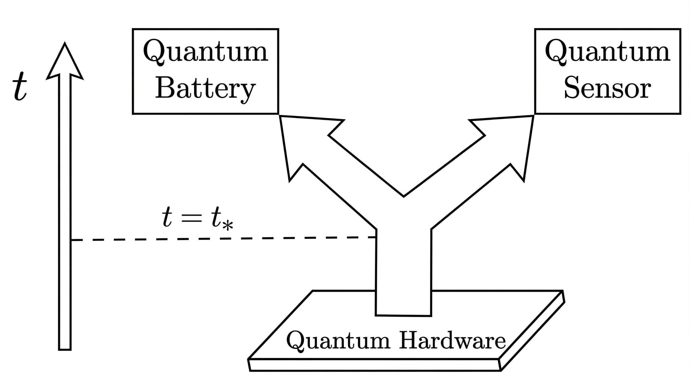

**Main problem.** The paper investigates whether the hardware used for quantum battery charging (energy storage) can be the same hardware used for generating metrologically useful quantum states (quantum sensing).

**Main result.** The authors demonstrate a 'dual-use' connection where protocols for fast quantum battery charging simultaneously generate resource-rich states like squeezed and NOON states, allowing a single superconducting circuit to switch between sensing and energy-storage functions.

**Method.** The study uses a theoretical framework mapping state preparation to battery charging, employing Heisenberg picture dynamics, short-time expansions, and exact diagonalization on models of coupled superconducting LC resonators.

**Summary.** This paper proposes a way to make quantum hardware more efficient by making it multifunctional. It shows that the same physical process used to charge a quantum battery can also create highly entangled states useful for precision sensing. By using superconducting circuits, the authors demonstrate that a single device can interchangeably act as an energy storage unit or a quantum sensor. This approach reduces the need for extra hardware and paves the way for modular, integrated quantum architectures.

Abstract

Quantum resources such as entanglement form the backbone of quantum technologies and their efficient generation is a central objective of modern quantum platforms. Independently, quantum batteries have emerged as nanoscale devices that utilize collective quantum effects to store energy with a charging advantage over classical strategies. Here, we show that these two pursuits can co-exist: protocols for fast generation of resourceful quantum states can simultaneously charge a quantum battery with a collective advantage, and conversely, a quantum battery protocol with a charging advantage can produce resource-rich states. Using this connection, we propose an integrated hardware protocol on superconducting circuits in which each experimental run can interchangeably accomplish either quantum battery charging, or quantum sensing through generation of metrologically useful states. Our results establish that quantum resources and stored energy are distinct yet co-producable quantities, opening the door to modular quantum architectures that dynamically switch between sensing and energy-storage functions, thereby producing additional functionalities without extra hardware cost.

### [A Universal Quantum Information Preserving Photonic Switch for Scalable Quantum Networks](http://arxiv.org/abs/2604.21902v1)

**Authors:** Jiapeng Zhao, Stéphane Vinet, Amir Minoofar, Michael Kilzer, Lucas Wang, Galan Moody, Vijoy Pandey, Ramana Kompella, Reza Nejabati  
**Type:** both · **PDF:** <https://arxiv.org/pdf/2604.21902v1>  
**Analysis basis:** full PDF text, analyzed in chunks

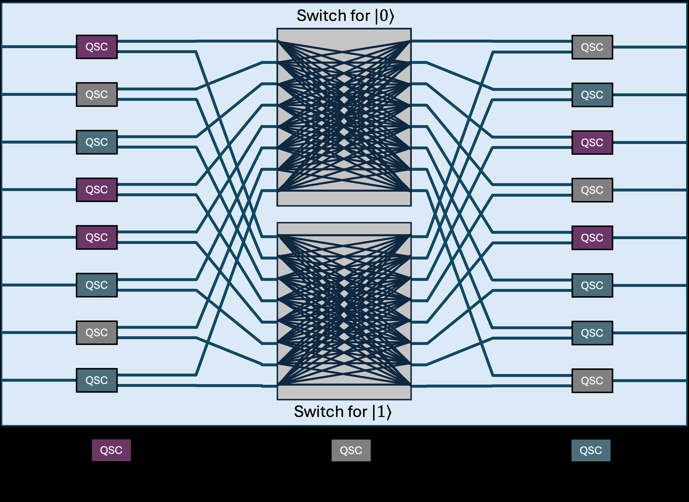

**Main problem.** Existing quantum networks are limited to static, point-to-point links because current optical switches introduce significant decoherence and lack the ability to dynamically route different types of quantum encodings.

**Main result.** The authors demonstrated a Universal Quantum Switch (UQS) on a thin-film lithium niobate platform that achieves high-speed, encoding-agnostic routing with less than 4% decoherence and reconfiguration speeds up to 1 GHz.

**Method.** The researchers developed a 2×2 photonic integrated circuit using a dual-actuation strategy (thermo-optic and electro-optic modulation) and a three-stage architecture involving quantum state converters to map various encodings into path information.

**Summary.** This paper introduces a new architecture for a 'Universal Quantum Switch' designed to enable scalable, dynamic quantum networks. By using thin-film lithium niobate technology, the device can route quantum information without destroying its fragile entanglement, regardless of whether the information is encoded in polarization, time-bin, or frequency-bin. The experimental prototype demonstrates extremely high-speed switching (up to 1 GHz) with very low decoherence. This is a significant step toward building a 'quantum internet' where different types of quantum nodes can be seamlessly interconnected and reconfigured on demand.

Abstract

Quantum networks are a keystone of the quantum internet. However, existing implementations remain largely confined to static point-to-point links due to the absence of a switching paradigm capable of dynamically routing fragile quantum entanglement without introducing decoherence. Here, we propose the Universal Quantum Switch, a foundational building block allowing on-demand, non-blocking, and encoding-agnostic routing of quantum information, as well as seamless modality conversion between disparate quantum platforms. We develop a prototype in thin-film lithium niobate and experimentally demonstrate robust switching with $\le 4\%$ decoherence via thermo-optic modulation and high-speed electro-optic switching of arbitrary entangled states at 1 MHz. Moreover, we show that our platform can support reconfiguration speeds up to 1 GHz. To our knowledge, this work represents the first demonstration of multi-node dynamic entanglement distribution at these speeds. Complementing these experimental results, we project the architecture's scalability, showing dimension-independent decoherence, and provide a scalable, interoperable building block for heterogeneous quantum network fabrics.

### [Loss-biased fault-tolerant quantum error correction](http://arxiv.org/abs/2604.21876v1)

**Authors:** Laura Pecorari, Gavin K. Brennen, Stanimir S. Kondov, Guido Pupillo  
**Type:** theory · **PDF:** <https://arxiv.org/pdf/2604.21876v1>  
**Analysis basis:** full PDF text, analyzed in chunks

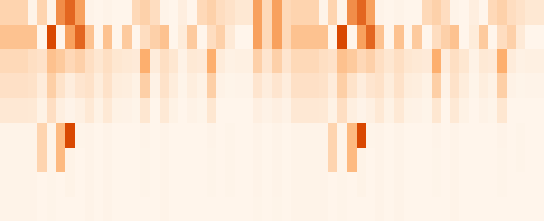

**Main problem.** In neutral-atom processors, fast quantum error correction (QEC) cycles can introduce non-Markovian, correlated errors due to Rydberg excitation hopping and residual Rydberg populations. This prevents the achievement of optimal fault-tolerant scaling in surface codes.

**Main result.** The authors propose 'loss-biasing,' a technique that uses mid-circuit ionization to convert spurious Rydberg excitations into atom loss (erasures). This process restores fault-tolerant scaling and, when paired with loss-aware decoding, can achieve optimal erasure-like error suppression.

**Method.** The study uses the Clifford simulator Stim to simulate surface codes (distances $d=3$ to $9$) and models Rydberg-mediated gate errors and ionization-induced decay using Lindblad dynamics and randomized compiling.

**Summary.** This paper addresses a critical bottleneck in scaling neutral-atom quantum computers: the buildup of correlated errors during high-speed error correction cycles. By intentionally ionizing Rydberg atoms to turn complex errors into simple atom losses, the authors show that fault tolerance can be preserved even with sub-millisecond cycle times. This 'loss-biasing' strategy is particularly promising for alkaline-earth-like atom platforms. Ultimately, this approach provides a practical pathway toward large-scale, fault-tolerant quantum computing with reduced hardware overhead.

Abstract

We investigate the limits of quantum error correction (QEC) in neutral-atom processors approaching high-fidelity gates and fast cycle times. We show that shorter QEC cycles amplify platform-specific errors, notably Rydberg excitation hopping, and hinder decay of residual Rydberg population, leading to non-Markovian correlated errors that degrade logical performance. To address this, we introduce loss biasing, where spurious Rydberg excitations are rapidly converted into atom loss via mid-circuit ionization, transforming errors into erasure-like noise and suppressing their propagation. Loss biasing restores the fault-tolerant logical error scaling for intra-cycle Pauli errors; furthermore, we argue that when supported with loss-aware decoding, it can achieve the optimal scaling of erasures while enabling shorter QEC cycles with reduced hardware overhead. We outline an implementation using fast autoionization in alkaline-earth(-like) atoms, establishing loss biasing as a practical route toward fault-tolerant quantum computing with sub-millisecond QEC cycles.

### [Enhancing Coherence of Spin Centers in p-n Diodes via Optimization Algorithms](http://arxiv.org/abs/2604.21874v1)

**Authors:** Jonatan A. Posligua, David E. Stewart, Denis R. Candido  
**Type:** theory · **PDF:** <https://arxiv.org/pdf/2604.21874v1>  
**Analysis basis:** full PDF text, analyzed in chunks

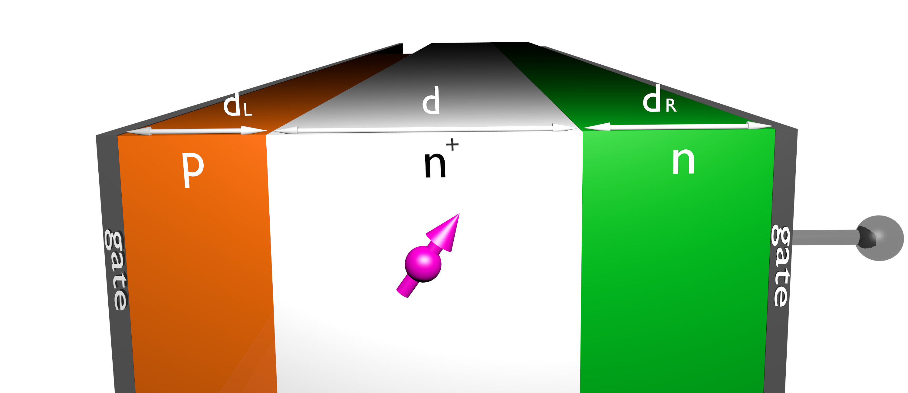

**Main problem.** The study aims to identify the optimal diode design parameters (doping profiles, bias voltage, and layer thickness) to minimize the optical linewidth and maximize the spin coherence of divacancies in 4H-SiC p-n diodes.

**Main result.** The authors demonstrated that a twenty-fold suppression of linewidth is possible by optimizing reverse bias voltage and found that placing spin centers deeper within the diode (away from surfaces) mitigates leakage current-induced noise.

**Method.** The researchers developed a scaled gradient descent optimization algorithm that combines numerical solutions of the Poisson equation with a new formalism for modeling electromagnetic noise from leakage currents.

**Summary.** This paper addresses the challenge of decoherence in solid-state spin centers used for quantum technologies. By optimizing the design of SiC p-n diodes, the authors show how to balance the reduction of charge noise through carrier depletion against the increase in noise from leakage currents. The work provides a practical guide for experimentalists to engineer diodes with the narrowest possible optical linewidths and longest coherence times. This is crucial for developing reliable quantum networks and sensors based on semiconductor spin defects.

Abstract

Solid-state spin defects hold great promise as building blocks for various quantum technologies. Embedding spin centers in $p$-$n$ diodes under reverse bias has proved to be a powerful strategy to narrow the optical linewidth and increase spin coherence, while also enabling control of the photoluminescence wavelength via Stark shift. Given the multitude of parameters influencing spin centers in diodes (e.g., doping densities and profiles, temperature, bias voltage, spin center position), a question that has not yet been answered is: which set of these design parameters maximizes spin center coherence? In this work, we address this question by developing a scaled gradient descent optimization algorithm that minimizes the optical linewidth of spin centers by combining the numerical solution of a diode's Poisson equation with calculated charge noise from the non-depleted regions. Our optimization is performed for both single- and multiple-parameter cases for divacancies in SiC $p$-$i$-$n$ diodes, including reverse-bias voltage, doping density and profile, and diode total length. Importantly, the optimization is subject to realistic physical constraints, such as small operating bias voltages, avoidance of the dielectric breakdown regime and physical thresholds for doping density. Additionally, due to the leakage current at reverse bias voltages, we develop a new formalism to investigate its influence on coherence. We show that the corresponding noise can be mitigated by implanting spin defects away from the diode's surfaces. Our work provides guidance on experimentally relevant diodes for hosting spin centers with the narrowest optical linewidths and longest coherence times.

### [Replay-buffer engineering for noise-robust quantum circuit optimization](http://arxiv.org/abs/2604.21863v1)

**Authors:** Akash Kundu, Sebastian Feld  
**Type:** theory · **PDF:** <https://arxiv.org/pdf/2604.21863v1>  
**Analysis basis:** full PDF text, analyzed in chunks

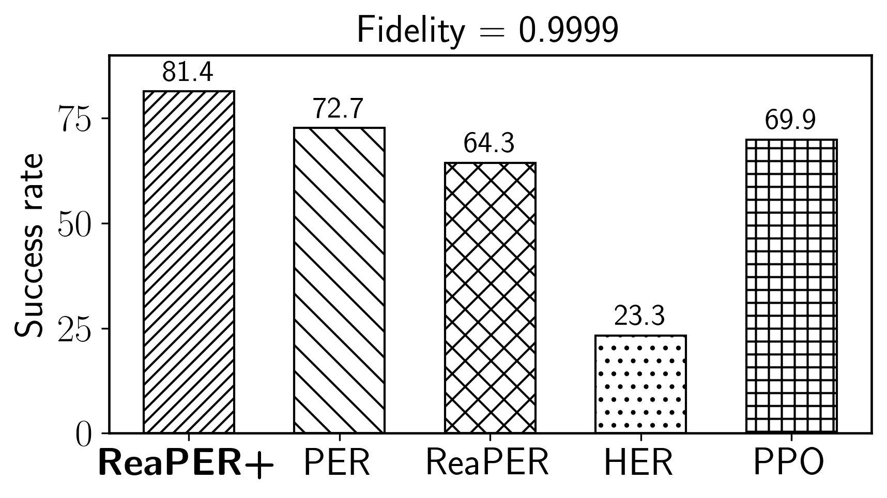

**Main problem.** Deep reinforcement learning for quantum circuit optimization suffers from inefficient replay buffers, high computational costs during architecture search, and the loss of useful training data when transitioning from noiseless to noisy hardware environments.

**Main result.** The authors introduce ReaPER+, which achieves 4–32× gains in sample efficiency, and OptCRLQAS, which reduces wall-clock time by up to 67.5%, while a new buffer transfer scheme reduces steps to chemical accuracy by up to 90%.

**Method.** The paper proposes an annealed replay rule (ReaPER+) that transitions from TD-error prioritization to reliability-aware sampling, an amortized evaluation strategy (OptCRLQAS), and a lightweight transfer scheme for reusing noiseless trajectories in noisy settings.

**Summary.** This paper presents a suite of algorithmic improvements to make reinforcement learning more effective for quantum circuit compilation and architecture search. By re-engineering the replay buffer, the authors allow the learning agent to better handle noisy targets and more efficiently transfer knowledge from ideal simulations to real-world noisy hardware. These methods significantly reduce the computational time and the number of training samples required to find high-fidelity, hardware-efficient quantum circuits. The approach is validated on both quantum tasks, such as molecular ground-state preparation, and classical benchmarks.

Abstract

Deep reinforcement learning (RL) for quantum circuit optimization faces three fundamental bottlenecks: replay buffers that ignore the reliability of temporal-difference (TD) targets, curriculum-based architecture search that triggers a full quantum-classical evaluation at every environment step, and the routine discard of noiseless trajectories when retraining under hardware noise. We address all three by treating the replay buffer as a primary algorithmic lever for quantum optimization. We introduce ReaPER$+$, an annealed replay rule that transitions from TD error-driven prioritization early in training to reliability-aware sampling as value estimates mature, achieving $4-32\times$ gains in sample efficiency over fixed PER, ReaPER, and uniform replay while consistently discovering more compact circuits across quantum compilation and QAS benchmarks; validation on LunarLander-v3 confirms the principle is domain-agnostic. Furthermore we eliminate the quantum-classical evaluation bottleneck in curriculum RL by introducing OptCRLQAS which amortizes expensive evaluations over multiple architectural edits, cutting wall-clock time per episode by up to $67.5\%$ on a 12-qubit optimization problem without degrading solution quality. Finally we introduce a lightweight replay-buffer transfer scheme that warm-starts noisy-setting learning by reusing noiseless trajectories, without network-weight transfer or $ε$-greedy pretraining. This reduces steps to chemical accuracy by up to $85-90\%$ and final energy error by up to $90\%$ over from-scratch baselines on 6-, 8-, and 12-qubit molecular tasks. Together, these results establish that experience storage, sampling, and transfer are decisive levers for scalable, noise-robust quantum circuit optimization.

### [Deterministic generation of grid states with programmable nonlinear bosonic circuits](http://arxiv.org/abs/2604.21824v1)

**Authors:** Yanis Le Fur, Javier Lalueza-Puértolas, Carlos Sánchez Muñoz, Alberto Muñoz de las Heras, Alejandro González-Tudela  
**Type:** theory · **PDF:** <https://arxiv.org/pdf/2604.21824v1>  
**Analysis basis:** full PDF text, analyzed in chunks

**Main problem.** The difficulty of deterministically and scalably generating high-fidelity bosonic grid states, such as GKP states, which are essential for hardware-efficient quantum error correction.

**Main result.** The discovery of 'phased-comb states'—a new class of states generated by programmable nonlinear bosonic circuits that provide near-optimal error correction against boson loss and support a universal gate set.

**Method.** The authors use a circuit model consisting of squeezing, displacement, and Kerr operations to iteratively generate states, analyzing their error-correcting performance and implementing a gate teleportation protocol for the Hadamard gate.

**Summary.** This paper addresses the challenge of creating robust bosonic quantum error-correcting codes without relying on probabilistic methods or complex auxiliary systems. The authors propose using programmable nonlinear circuits (using Kerr nonlinearity) to deterministically generate a new class of states called 'phased-comb states.' These states are unitarily related to standard GKP states but possess an intrinsic phase structure. The study demonstrates that these states are scalable, provide excellent protection against photon loss, and allow for the implementation of a universal set of quantum gates.

Abstract

Bosonic quantum error correction enables hardware-efficient protection of quantum information by encoding logical qubits in harmonic oscillators. Bosonic grid states, such as Gottesman-Kitaev-Preskill (GKP) states, are particularly promising due to their potential to correct small displacements and boson loss. However, their generation remains challenging, typically relying on probabilistic protocols or auxiliary qubit systems. Here, we propose deterministic protocols for generating bosonic grid states using programmable nonlinear bosonic circuits composed solely of squeezing, displacement, and Kerr operations. We show that aiming to enforce GKP symmetries in the output of these circuits yields states with competitive performance with respect to current realizations, but whose quality saturates with increasing circuit depth due to imperfect symmetry restoration. Instead, we find that these bosonic circuits naturally give rise to a distinct class of states, that we label as phased-comb states, which are unitarily related to standard grid states but feature an intrinsic phase structure. We demonstrate that these states define a scalable bosonic quantum error-correcting code with near-optimal performance under boson loss comparable to that of approximate GKP states. We further analyze their logical operations and show how to implement a universal gate set for them. Our results establish programmable nonlinear bosonic circuits as a viable route towards the generation of scalable bosonic quantum error-correcting states beyond standard GKP encodings.

### [Rigorous Security Proofs for Practical Quantum Key Distribution](http://arxiv.org/abs/2604.21791v1)

**Authors:** Devashish Tupkary  
**Type:** theory · **PDF:** <https://arxiv.org/pdf/2604.21791v1>  
**Analysis basis:** full PDF text, analyzed in chunks

**Main problem.** The gap between idealized security proofs and practical Quantum Key Distribution (QKD) implementations, specifically regarding imperfect hardware, variable-length protocols, and realistic authentication.

**Main result.** Developed rigorous security proofs for variable-length decoy-state BB84 protocols that account for imperfect detectors, basis-efficiency mismatch, and realistic authentication models.

**Method.** Utilized advanced mathematical frameworks including the marginal-constrained entropy accumulation theorem (MEAT), entropic uncertainty relations (EUR), and postselection techniques.

**Summary.** This thesis provides a rigorous mathematical foundation for the security of practical QKD protocols. It addresses critical real-world issues such as imperfect detectors, variable-length key generation, and the security of delayed authentication. By resolving long-standing flaws in existing proof techniques, the work enables more robust security certifications for quantum communication hardware. The author also provides a unified framework for comparing different security proof methodologies.

Abstract

This thesis is concerned with rigorous security analyses of practical Quantum Key Distribution (QKD) protocols, using a variety of modern proof techniques. The main results are as follows. First, we establish a security proof for variable-length QKD protocols against IID collective attacks, and extend this result to coherent attacks using the postselection technique. In doing so, we resolve a long-standing flaw in the application of the postselection technique to QKD, thereby placing it on a rigorous mathematical footing. Second, we develop a method to bound phase error rates in entropic uncertainty relation-based and phase error rate-based proofs, using only the observed statistics of the protocol, even when detectors are imperfect and only approximately characterized. This removes a key assumption of identical detector behaviour and enables these techniques to be applied in realistic settings. Third, we present a very general security analysis based on the marginal-constrained entropy accumulation theorem. The resulting framework can be readily adapted to practical imperfections and side channels, and is suitable for certification efforts. Finally, we show that the security of QKD protocols under realistic authentication assumptions can be reduced to the standard idealized setting, where authentication is assumed to behave honestly, with only minor protocol modifications. A distinctive feature of this thesis is its unified presentation of several major QKD security proof frameworks using consistent protocol descriptions and notation. Consequently, this thesis is intended not only as a collection of new technical results, but also as a useful reference for understanding rigorous security analysis in quantum key distribution.

### [Partial oracles quantum algorithm framework -- Part I: Analysis of in-place operations](http://arxiv.org/abs/2604.21788v1)

**Authors:** Fintan M. Bolton  
**Type:** theory · **PDF:** <https://arxiv.org/pdf/2604.21788v1>  
**Analysis basis:** full PDF text, analyzed in chunks

**Main problem.** The paper addresses the lack of an explicit construction method for the search iteration operator within the 'partial oracles' quantum algorithm framework, which aims to potentially exceed the quadratic speedup of Grover's algorithm.

**Main result.** The author provides a complete construction for the search iteration operator for in-place operations and introduces the 'reciprocal transform' and the QFrame Python library for automating quantum circuit construction.

**Method.** The framework utilizes a multi-bit oracle approach and a new 'reciprocal transform' that obeys a chain rule, allowing complex functions like SHA-256 components to be decomposed into simple, reversible steps.

**Summary.** This paper introduces a new framework for quantum search called 'partial oracles' that can theoretically achieve exponential speedup by iteratively narrowing the search space using multi-bit oracle conditions. The author provides the missing mathematical construction for the search operator specifically for in-place operations and defines a 'reciprocal transform' to manipulate quantum amplitudes in reciprocal space. To demonstrate the utility of this method, the paper applies it to the elementary components of the SHA-256 hash algorithm. While the current version is limited to in-place operations (meaning it does not yet demonstrate quantum advantage), it provides a scalable foundation for future work involving out-of-place operations.

Abstract

The partial oracles framework is a quantum search algorithm that has the potential to exceed the quadratic speedup of Grover's algorithm, up to a theoretical maximum of an exponential speedup. Until now, however, the framework has lacked an explicit method for constructing the operator that represents the search iteration. In this paper, we provide the missing construction, for the special case of an oracle function definable using only in-place operations (that is, where the calculated result of the oracle function can be read just from the qubits in the search index). The restriction to in-place operations means that the current work does not yet exhibit quantum advantage: oracle functions constructed using only in-place operations are always classically reversible. To demonstrate quantum advantage, it will be necessary to extend this construction method to include out-of-place operations (part II). As part of the construction of the search iteration operator, we define a new type of transform, the reciprocal transform, which is applied to the oracle function. We show that the reciprocal transform obeys a chain rule, which makes it possible to break down complex transforms into simple steps. To illustrate the practical application of this search method, we apply the reciprocal transform to elementary operations from the SHA-256 hash algorithm: addition modulo $2^n$, the $Maj(a, b, c)$ function, the $Ch(a, b, c)$ function, and the bit shift functions. We also introduce the QFrame python library, which is used to automate the construction of quantum circuits that represent reciprocal transforms.

### [Photon Sorting with a Quantum Emitter](http://arxiv.org/abs/2604.21758v1)

**Authors:** Kasper H. Nielsen, Etienne Corminboeuf, Benedikt Tissot, Love A. Pettersson, Sven Scholz, Arne Ludwig, Leonardo Midolo, Anders S. Sørensen, Peter Lodahl, Ying Wang, Stefano Paesani  
**Type:** both · **PDF:** <https://arxiv.org/pdf/2604.21758v1>  
**Analysis basis:** full PDF text, analyzed in chunks

**Main problem.** Linear-optical Bell state measurements (BSMs) are fundamentally limited to a 50% success probability, which imposes high hardware overhead and low noise tolerance in photonic quantum computing and communication architectures.

**Main result.** The authors demonstrated a passive photon-sorting circuit using a quantum dot that achieves a 62% sorting success probability and a BSM success probability of 57%, surpassing the 50% linear-optical limit.

**Method.** The researchers implemented a nonlinear Mach-Zehnder interferometer using a single semiconductor quantum dot in a nanobeam waveguide to induce photon-photon interactions via scattering, combined with theoretical modeling of noise and temporal filtering.

**Summary.** This paper presents an experimental demonstration of a photon sorter that uses the nonlinearity of a single quantum dot to distinguish between one- and two-photon states. By routing different photon numbers into distinct spatial modes, the device enables Bell state measurements that exceed the fundamental 50% efficiency limit of standard linear optics. This advancement is significant for scaling up photonic quantum computing architectures, such as fusion-based quantum computing, and improving the performance of quantum repeater networks. The results show that while current performance is limited by coupling efficiency and dephasing, the system is scalable and can be optimized for higher success rates.

Abstract

High-quality photonic Bell state measurements (BSMs) enable scalable universal quantum computing and long distance quantum communication. However, when implemented with linear optics, BSMs are fundamentally probabilistic, introducing substantial hardware overheads and limiting noise tolerance in photonic quantum computing architectures. Nonlinear interactions at the single-photon level can overcome these limitations by enabling near-deterministic photon-photon gates. Here, we demonstrate a passive photon-sorting circuit based on the induced nonlinearity arising from photon scattering in a solid-state quantum emitter. The scattering is implemented in a directional waveguide-emitter coupling interface and embedded on-chip into a linear optical circuit, through which we demonstrate sorting of one- and two-photon components with a success probability of 62%. We find that the current system can enable BSMs with a 57% post-selected success probability without ancillary photons, exceeding the linear-optical limit of 50%, and can be readily improved to >65% with design optimisations.

### [Entanglement of two optical emitters mediated by a terahertz channel](http://arxiv.org/abs/2604.21723v1)

**Authors:** Yanis Le Fur, Diego Martín-Cano, Carlos Sánchez Muñoz  
**Type:** theory · **PDF:** <https://arxiv.org/pdf/2604.21723v1>  
**Analysis basis:** full PDF text, analyzed in chunks

**Main problem.** The lack of efficient coherent interfaces and the difficulty of controlling/detecting quantum states in the terahertz (THz) spectrum hinder the development of THz-based quantum networks.

**Main result.** The authors propose a method to generate high-fidelity steady-state entanglement (concurrence $C > 0.9$) between two polar emitters using a THz channel, where all control and readout are performed via visible light.

**Method.** The study uses a master equation approach with a Generalized Rotating Wave Approximation (GRWA) and polaron transformation to model driven-dissipative dynamics in the bad-cavity limit.

**Summary.** This paper presents a theoretical framework for a hybrid visible-THz quantum interface. By using strong visible-light driving, the researchers create 'dressed' energy states in polar emitters that can be tuned to interact via THz photons. This allows a THz channel to mediate entanglement between qubits while all complex manipulation and state tomography are handled through much easier-to-manage optical means. This approach provides a scalable way to integrate THz quantum technologies with existing high-frequency optical platforms.

Abstract

Quantum technologies in the terahertz (THz) require a coherent interface between addressable qubits and THz quantum channels -- a capacity that so far, remains largely underdeveloped. Here, we propose and demonstrate the generation of steady-state entanglement between polar quantum emitters, mediated by THz photons. We exploit strong visible-light driving of the emitters to create Rabi-split dressed eigenstates whose energy separation can be optically tuned into the THz regime. The polar nature of the emitters activates THz transitions within these eigenstates, allowing them to couple to a THz photonic mode that induces collective dissipative dynamics. A coherent driving and control of these effective THz emitters is achieved by using a sideband optical drive with detuning close to the THz transition frequency. The resulting interplay of collective dissipation and driving activates a mechanism to generate steady-state entanglement with high values of the concurrence ($C>0.9$), attainable under experimentally feasible parameters. Crucially, both coherent manipulation and quantum state tomography are implemented entirely through optical means, avoiding direct THz control and detection. This establishes a hybrid visible-THz quantum interface in which a THz channel mediates qubit-qubit entanglement (a key operational requirement for THz quantum technologies) while remaining optically accessible.

### [Near-Term Reduction in Nonlocal Gate Count from Distributed Logical Qubits](http://arxiv.org/abs/2604.21722v1)

**Authors:** Bruno Avritzer, Nathan Sankary  
**Type:** theory · **PDF:** <https://arxiv.org/pdf/2604.21722v1>  
**Analysis basis:** full PDF text, analyzed in chunks

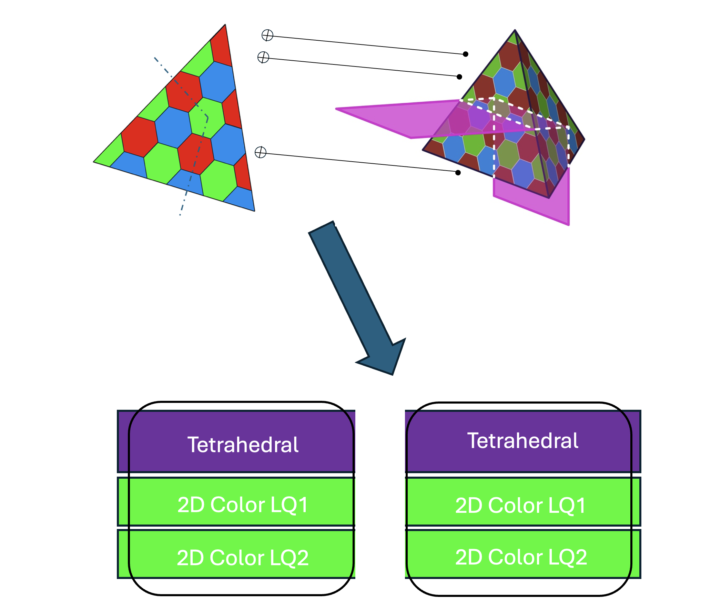

**Main problem.** How to minimize the number of costly processor-nonlocal (PNL) operations in distributed quantum computing architectures while maintaining fault-tolerant universality.

**Main result.** The authors demonstrate a ~10% reduction in PNL gates using distributed color codes and show that the advantage of partitioning qubits scales significantly as the code distance and number of processors increase.

**Method.** The study employs qubit allocation techniques using the square-octagon color code family, optimizes the problem via CP-SAT constraint programming, and evaluates various universality methods like magic state injection and code switching.

**Summary.** This paper addresses the challenge of inter-processor communication overhead in modular quantum computing. By partitioning logical qubits across multiple processors using specific color code families, the authors show it is possible to reduce the frequency of expensive non-local gates. They explore different strategies for achieving universal gate sets, such as magic state distillation and logical swaps, and provide a framework for optimal qubit allocation. This work is significant for designing scalable, distributed quantum architectures where inter-module connectivity is a bottleneck.

Abstract

Modular quantum computing architectures require error correction schemes that remain effective in the presence of noisy inter-processor operations. As such, minimizing the number of such operations on logical circuits partitioned across quantum processors is a primary objective of distributed quantum computing. In this work, we develop basic techniques for qubit allocation using an exemplar color code family and explore generalizations to other color codes. In particular, we show that a 10% reduction in processor-nonlocal gates is achievable in a setting where syndrome extraction occurs after every logical gate, as in today's devices, and that this scales to significantly greater advantages in the multi-qubit case. We also explore methods of achieving universal gate sets efficiently in this distributed logical setting and evaluate the trade-offs of multiple approaches such as magic state distillation, code switching, and a new method based on logical swaps. Finally, we discuss some considerations for an allocation algorithm for these architectures to perform scalably and connect it to existing work on quantum circuit partitions.

### [Lagrange: Operating Italy's First Publicly-Accessible Quantum Computer for Research and Education](http://arxiv.org/abs/2604.21695v1)

**Authors:** Paolo Viviani, Fabrizio Bertone, Giacomo Vitali, Emanuele Dri, Federico Stirano, Giuseppe Caragnano, Francesco Lubrano, Antonino Nespola, Olivier Terzo, Matteo Cocuzza, Bartolomeo Montrucchio, Giovanna Turvani, Gianluca Bertaina, Marco Coisson, Davide Calonico, Fabrizio Pirri, Pietro Asinari  
**Type:** experiment · **PDF:** <https://arxiv.org/pdf/2604.21695v1>  
**Analysis basis:** full PDF text, analyzed in chunks

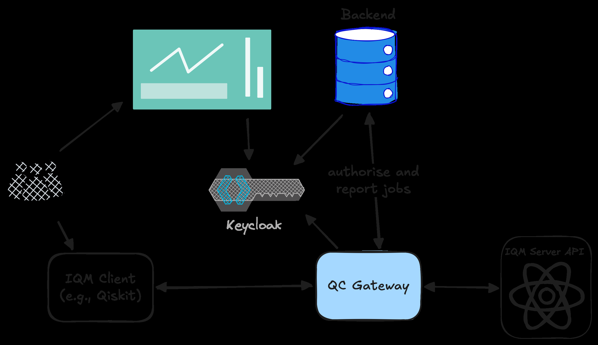

**Main problem.** The lack of a standardized software stack for managing, billing, and enforcing fair usage policies on shared, on-premises quantum hardware across multiple institutions.

**Main result.** The successful implementation and nine-month operation of 'Lagrange,' a modular middleware stack that enables secure, multi-tenant access to an IQM Spark superconducting quantum computer.

**Method.** A Python-based transparent reverse proxy architecture using a plugin system to separate vendor-specific API logic from site-specific policies like budget enforcement and identity federation.

**Summary.** The authors present the deployment of Lagrange, Italy's first publicly accessible quantum computer, which serves researchers and students. They developed a custom middleware layer that intercepts API calls to manage project budgets, user quotas, and authentication without requiring users to change their existing Qiskit or Cirq workflows. The system has demonstrated high reliability, processing over 240,000 jobs with 98% uptime. This work provides a blueprint for managing on-premises quantum infrastructure for both large-scale research and university-level education.

Abstract

We describe the design, implementation, and nine-month operational experience of the software management stack for Lagrange, an IQM Spark five-qubit superconducting quantum computer jointly acquired by LINKS Foundation, Politecnico di Torino and the Italian National Institute of Metrological Research (INRiM), and managed by LINKS. Lagrange is, to our knowledge, the first quantum computer in Italy that is fully operational and accessible to students and researchers from multiple institutions under formal service agreements, and to the general public under commercial agreements. When installed in mid-2025, the IQM Spark hardware was delivered by the vendor with authentication only: no billing, project management or fair usage enforcement were provided. We developed a modular middleware layer that filled that gap without modifying any vendor client software, by intercepting API calls through a proxy that enforces project-based budgets, reservation-aware authorisation, and per-user fairness policies. The middleware adopts a plugin architecture that cleanly separates vendor-specific logic from site-specific policies, enabling reuse across different quantum hardware backends and deployment contexts. Since entering production in September 2025, the system has processed over 240,000 quantum jobs totalling more than 1 week of QPU execution time, with greater than 98% uptime. Notably, students at Politecnico di Torino regularly use the machine during both lectures and formal examinations -- a practice we believe to be unique in Europe. We report on the system architecture, the operational lessons learned, and the infrastructure choices that made this deployment possible.

### [Bipartite entanglement under frequency comb pumping in parametric Josephson circuits](http://arxiv.org/abs/2604.21692v1)

**Authors:** Mikael Vartiainen, Ilari Lilja, Ekaterina Mukhanova, Kirill Petrovnin, Gheorghe Sorin Paraoanu, Pertti Hakonen  
**Type:** both · **PDF:** <https://arxiv.org/pdf/2604.21692v1>  
**Analysis basis:** full PDF text, analyzed in chunks

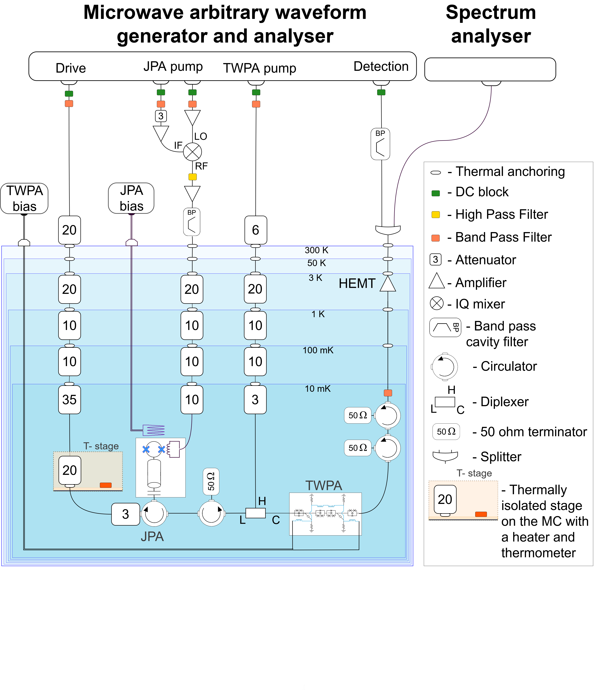

**Main problem.** The study investigates how bipartite entanglement and purity in a Josephson parametric amplifier (JPA) are affected by the addition of multiple pump tones in a frequency comb configuration.

**Main result.** The researchers found that increasing the number of pumps diminishes initial two-mode correlations by redistributing entanglement across a larger network of modes and introducing entanglement with additional idler frequencies.

**Method.** The authors combined experimental measurements using a SNAIL-based JPA with a theoretical Gaussian conditional-dynamics model that accounts for measurement backaction, dissipation, and noise.

**Summary.** This paper explores the dynamics of entanglement in superconducting microwave circuits when driven by a frequency comb of multiple parametric pumps. The study demonstrates that while adding pumps increases the connectivity of the mode network, it simultaneously degrades the bipartite entanglement between specific mode pairs due to entanglement redistribution. The researchers also compared symmetric and asymmetric pumping configurations, finding that the complexity of the resulting correlation structure depends heavily on the pump arrangement. These findings are crucial for the development of large-scale continuous-variable cluster states in the microwave domain, where dissipation and mode-coupling are significant challenges.

Abstract

The creation of high-quality cluster states in superconducting microwave circuits is a relevant ingredient in continuous-variable quantum computing. Although large-scale cluster states have been established in optical systems, dissipation prevents their direct applicability to the microwave realm. Recent improvements in superconducting parametric circuits, in particular Josephson parametric amplifiers (JPA) and traveling wave parametric amplifiers (TWPA), have permitted substantial progress in producing entangled states using microwave photons. In this paper, we examine experimentally and theoretically the effects of numerous parametric pump tones on the degree of two-mode squeezing in a quantum circuit and apply it to the JPA. We find that additional pumps diminish the initial two-mode correlations achieved with a single pump by redistributing it among a larger network of modes and by introducing entanglement with additional idler frequencies. Taking into account the actual heterodyne measurement conditions, the experimental results are consistent with theoretical expectations.

### [Speed-oriented quantum circuit backend](http://arxiv.org/abs/2604.21656v1)

**Authors:** Sören Wilkening  
**Type:** theory · **PDF:** <https://arxiv.org/pdf/2604.21656v1>  
**Analysis basis:** full PDF text, analyzed in chunks

**Main problem.** The classical preprocessing time required for quantum circuit generation (QCG) can become a significant computational bottleneck as quantum hardware scales, potentially negating the advantages of quantum algorithms.

**Main result.** The authors developed a new C-based software package (QCB) that generates large-scale quantum circuits significantly faster and with much lower memory usage than established frameworks like Qiskit, Q#, and Cirq.

**Method.** The backend utilizes a layered 2D array data structure for $O(1)$ gate access, implements lookup tables for efficient gate insertion, and employs a lightweight swap heuristic to reduce circuit depth.

**Summary.** This paper introduces a new, high-performance software backend designed specifically for the rapid generation of large-scale quantum circuits. By using optimized data structures and C-based implementation, the tool can generate circuits for up to 2000 qubits orders of magnitude faster than current industry-standard tools like Qiskit. This efficiency is crucial for large-scale applications like combinatorial optimization and fault-tolerant computing, where minimizing classical overhead is essential to maintaining a quantum advantage. The package also includes high-level primitives for complex operations like integer arithmetic.

Abstract

We present a new software package for efficient quantum circuit generation, designed to achieve optimal runtime performance. Despite being in an early stage of development, our implementation demonstrates significant advantages over existing tools. Using the quantum Fourier transform (QFT) as a benchmark, we show that our backend can generate circuits for systems with up to 2000 qubits faster than widely used frameworks such as Qiskit and Q#. This improvement is particularly relevant for applications where classical preprocessing time, including circuit generation, must be minimized to not diminish any potential quantum advantage - for example, in combinatorial optimization tasks. Additionally, our software provides high-level primitives for bit- and integer-level manipulations, offering a simplified interface for integration with high-level quantum programming languages.

### [Composite quantum gates simultaneously compensated for multiple errors](http://arxiv.org/abs/2604.21594v1)

**Authors:** Hristo Tochev, Nikolay Vitanov  
**Type:** theory · **PDF:** <https://arxiv.org/pdf/2604.21594v1>  
**Analysis basis:** full PDF text, analyzed in chunks

**Main problem.** Single-qubit gates are highly susceptible to systematic control errors, specifically simultaneous fluctuations in Rabi frequency (amplitude), detuning (frequency), and pulse duration.

**Main result.** The authors derived new composite pulse sequences for X and Hadamard gates that provide 'triple compensation' for amplitude, detuning, and duration errors, including closed-form five-pulse solutions and optimized longer sequences.

**Method.** The study employs two strategies: a derivative-based cancellation method using Cayley-Klein parametrization to nullify error terms in the full SU(2) propagator, and direct numerical minimization of average gate infidelity over specific error ranges.

**Summary.** This paper addresses the challenge of achieving high-fidelity quantum gates in the presence of multiple simultaneous control errors. The researchers developed new composite pulse sequences that protect the entire quantum propagator—not just the transition probability—against errors in amplitude, frequency, and timing. They provide both analytical solutions for short sequences and numerically optimized longer sequences that offer broader robustness windows. This work is significant for improving the reliability of single-qubit operations in quantum computing platforms like NMR and other systems subject to systematic drifts.

Abstract

Systematic control errors remain a primary obstacle to realizing high-fidelity single-qubit gates. We introduce composite pulse sequences that implement X and Hadamard gates while simultaneously compensating amplitude (Rabi-frequency), detuning (frequency), and duration errors. Our construction uses two complementary strategies: (i) derivative-based cancellation of error terms in the full unitary (not just the transition probability), formulated via the Cayley-Klein parametrization, and (ii) direct minimization of the average gate infidelity over prescribed error ranges. We derive symmetric five-pulse solutions with closed-form phases that cancel all first-order terms (including the mixed derivative), and numerically optimize longer sequences -- up to 15 pulses -- to achieve higher-order suppression. We also show that standard ``universal'' five-pulse sequences (U5a/U5b) emerge as simple phase-shifted instances of our symmetric solutions, yielding broad robustness to both detuning and amplitude errors. Finally, we construct variable-area sequences for $R_x(π/2)$, which, up to virtual Z rotations, benchmark the Hadamard gate. Across all families we observe the expected trade-off between sequence length and robustness window, with substantial boosts in fidelity over large error domains.

### [Pulse Shaping for Superconducting Qubits](http://arxiv.org/abs/2604.21565v1)

**Authors:** Animesh Patra, Ankur Raina  
**Type:** both · **PDF:** <https://arxiv.org/pdf/2604.21565v1>  
**Analysis basis:** full PDF text, analyzed in chunks

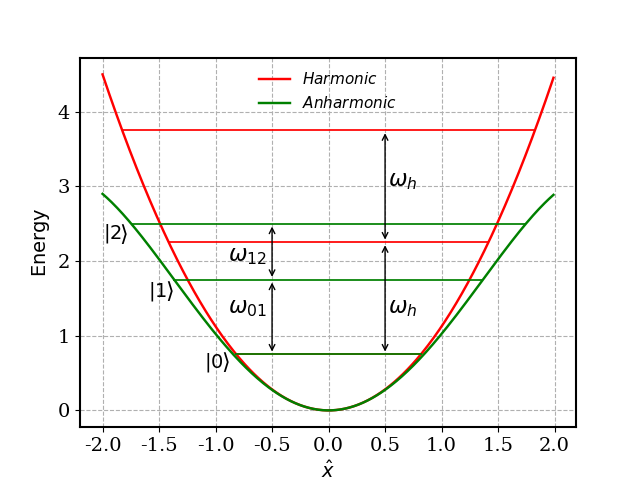

**Main problem.** Achieving high-fidelity control of superconducting transmon qubits by mitigating errors such as leakage to higher energy states, hardware-induced pulse distortion, and unwanted crosstalk in two-qubit gates.

**Main result.** The paper provides a unified framework for pulse-shaping techniques, specifically demonstrating how DRAG protocols and active cancellation can suppress leakage and error terms in single and two-qubit operations.

**Method.** The authors use the Magnus expansion and Rotating Wave Approximation (RWA) to analytically derive error terms, alongside numerical simulations in QuTiP and an analysis of hardware signal chains (AWG, IQ mixing).

**Summary.** This pedagogical article serves as a guide for researchers entering the field of superconducting quantum computing. It explores how different microwave pulse shapes affect qubit dynamics and introduces the DRAG technique to suppress leakage caused by the transmon's weak anharmonicity. The work also bridges the gap between abstract gate theory and physical hardware by discussing how imperfections in signal generators and mixers impact gate fidelity. Finally, it extends these concepts to two-qubit Cross-Resonance gates, proposing advanced pulse-shaping strategies to mitigate crosstalk and always-on interactions.

Abstract

High-fidelity control of superconducting qubits requires carefully shaped microwave pulses that account for multiple error channels. In this work, we present a pedagogical introduction to pulse-shaping techniques for transmon qubits, aiming to provide a unified, accessible framework that integrates physical intuition for pulse design, analytical understanding of gate-level descriptions, and practical considerations of hardware. This article further aims to serve as a guide for students and early researchers entering superconducting quantum computing. We begin by examining simple pulse envelopes and their spectral properties, highlighting how finite bandwidth leads to leakage outside the computational subspace. These observations motivate the introduction of the derivative removal by adiabatic gate (DRAG) technique, which uses a quadrature component proportional to the pulse's time derivative to suppress off-resonant excitations. We analyze the single-qubit case using the Magnus expansion, which provides a clear understanding of the order-by-order introduction of error channels. We discuss the practical hardware realities of control pulse generation, focusing on arbitrary waveform generators (AWG), local oscillators (LO), and IQ mixing. Common imperfections are discussed in terms of their impact on the effective pulse shape and qubit Hamiltonian. Finally, we extend the discussion to two-qubit operations, focusing on the cross-resonance gate and the emergence of effective interactions.

## numerical methods (5)

### ⭐ [Algorithmic Locality via Provable Convergence in Quantum Tensor Networks](http://arxiv.org/abs/2604.21919v1)

**Highlighted author(s):** Sarang Gopalakrishnan  
**Authors:** Siddhant Midha, Yifan F. Zhang, Daniel Malz, Dmitry A. Abanin, Sarang Gopalakrishnan  
**Type:** theory · **PDF:** <https://arxiv.org/pdf/2604.21919v1>  
**Analysis basis:** full PDF text, analyzed in chunks

**Main problem.** The paper seeks to establish rigorous theoretical foundations for Tensor Network Belief Propagation (TN-BP), specifically addressing the lack of guaranteed convergence and the stability of fixed points under local perturbations in higher-dimensional PEPS.

**Main result.** The authors prove that for strongly injective PEPS, BP fixed points exist, are unique, and exhibit 'algorithmic locality,' meaning local perturbations to the network only affect the fixed point and local observables with exponentially decaying influence.

**Method.** The work employs a combination of Banach contraction mapping for message-passing dynamics, cluster expansion techniques from statistical mechanics, and perturbative analysis of the injectivity parameter.

**Summary.** This paper provides the first end-to-end theoretical guarantee for the effectiveness of Tensor Network Belief Propagation on a wide class of many-body states. It proves that for sufficiently injective PEPS, the algorithm converges efficiently and that local changes to the system can be updated using only local recomputations. This 'algorithmic locality' ensures that local expectation values can be computed with controlled accuracy in polynomial time. These results bridge the gap between the widely used empirical success of TN-BP and rigorous algorithmic performance, with direct implications for decoding quantum LDPC codes.

Abstract

Belief propagation has recently emerged as a powerful framework for evaluating tensor networks in higher dimensions, combining computational efficiency with provable analytical guarantees. In this work, we develop the first end-to-end theory of tensor network belief propagation for a class of projected entangled pair states satisfying \emph{strong injectivity}. We show that when the injectivity parameter exceeds a constant threshold, BP fixed points can be found efficiently, and a cluster-corrected BP algorithm computes physical quantities to $1/\mathrm{poly}(N)$ error in $\mathrm{poly}(N)$ time for an $N$ qubit system. We identify a striking phenomenon we term \emph{algorithmic locality}: local perturbations of the tensor network affect the BP fixed point with an influence decaying rapidly with distance. As a result, updates to the fixed point after a local perturbation can be carried out using only local recomputation. Moreover, through the cluster expansion, this locality extends to observables, implying that local expectation values can be approximated from local data with controlled accuracy. Our results provide the first rigorous guarantee for the effectiveness of tensor-network belief propagation on a wide class of many-body states, bridging a gap between widely used numerical practice and provable algorithmic performance.

### [Efficient Classical Simulation of Heuristic Peaked Quantum Circuits](http://arxiv.org/abs/2604.21908v1)

**Authors:** David Kremer, Nicolas Dupuis  
**Type:** theory · **PDF:** <https://arxiv.org/pdf/2604.21908v1>  
**Analysis basis:** full PDF text, analyzed in chunks

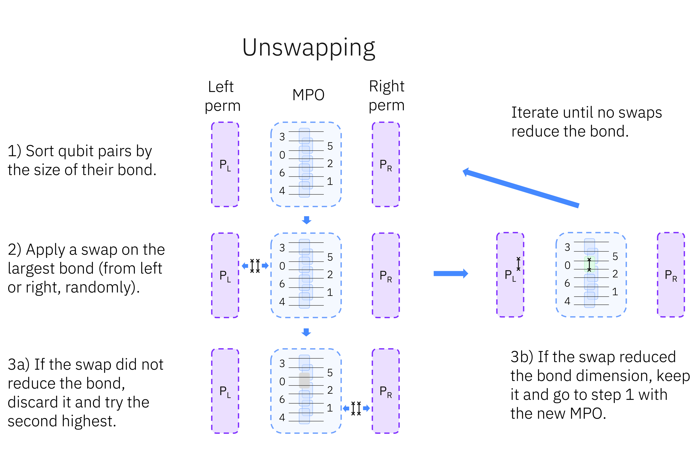

**Main problem.** The paper addresses the validity of recent claims regarding quantum advantage using 'peaked' quantum circuits, which were thought to be classically intractable due to permutation-based obfuscation.

**Main result.** The authors demonstrate that these specific peaked circuits can be efficiently simulated classically, achieving a simulation time on a single GPU that is roughly half the time of the original quantum hardware execution.

**Method.** The authors developed an iterative tensor network contraction method involving an 'absorption' phase, a greedy 'unswapping' heuristic to undo permutations, and a 'rewiring' step to reduce MPO bond dimension.

**Summary.** This paper challenges recent claims of quantum advantage by showing that a specific class of 'peaked' quantum circuits can be efficiently simulated on classical hardware. The authors introduce a new tensor network algorithm that uses a technique called 'unswapping' to bypass the complex permutations intended to make these circuits hard to simulate. By successfully contracting a 56-qubit circuit in about an hour on a single GPU, they demonstrate that the claimed quantum advantage is not held for these specific instances. This work highlights the importance of evaluating the classical hardness of new quantum circuit architectures.

Abstract

Peaked quantum circuits, whose output distribution is sharply concentrated on a single bitstring, have emerged as a promising candidate for verifiable quantum advantage, as the correctness of the quantum output can be checked by simply comparing against the known peak. Recent work by Gharibyan et al. arXiv:2510.25838 claimed heuristic quantum advantage using peaked circuits executed on Quantinuum's 56-qubit H2 processor. These peaked circuits concentrate their output on a single hidden bitstring by training a shallow simulable circuit variationally and inserting an obfuscated permutation to increase the depth to a level that makes classical simulation intractable, with estimated runtimes of years for the largest instances. We show that these circuits can be efficiently simulated classically. We describe a method that efficiently performs a full tensor network contraction, allowing near-exact sampling and extraction of the peaked bitstring. The method exploits the mirrored structure of the circuit and iteratively cancels both halves into a Matrix Product Operator (MPO), and avoids the obfuscated permutation by greedily reducing the MPO bond dimension through a process we call unswapping. The method can fully contract and extract the peak of the largest circuit in approximately one hour on a single GPU, around half the time it took to run on the quantum hardware.

### ⭐ [Symplectic split-operator method for the time-dependent unitary Tavis-Cummings model](http://arxiv.org/abs/2604.21778v1)

**Highlighted author(s):** Andrii G. Sotnikov, Denys I. Bondar  
**Authors:** Roman Ovsiannikov, Kurt Jacobs, Andrii G. Sotnikov, Denys I. Bondar  
**Type:** theory · **PDF:** <https://arxiv.org/pdf/2604.21778v1>  
**Analysis basis:** full PDF text, analyzed in chunks

**Main problem.** Simulating the time-dependent Tavis-Cummings model beyond the rotating-wave approximation is computationally expensive because standard solvers scale quadratically with the Hilbert space dimension.

**Main result.** The authors developed a symplectic split-operator method that achieves linear computational complexity, $O(D)$, in both time and memory for the Tavis-Cummings model.

**Method.** The method uses a second-order Trotter-Suzuki splitting combined with a basis-reindexing technique to transform the Hamiltonian into tridiagonal form, utilizing a Cayley-type Padé approximation to solve the propagation step.

**Summary.** This paper introduces a highly efficient numerical algorithm for simulating the dynamics of spin ensembles interacting with cavity modes. Unlike standard solvers that become prohibitively slow as the system size increases, this method exploits the sparse, tridiagonal structure of the Tavis-Cummings Hamiltonian to achieve linear scaling. This allows for much larger-scale simulations of driven quantum systems, including those where the rotating-wave approximation does not hold. The technique is particularly relevant for studying cavity QED, quantum control, and NV-center ensembles.

Abstract

We present a fast, memory-efficient, unitarity-preserving numerical method beyond the rotating-wave approximation for the closed Tavis-Cummings model in which a multilevel spin system interacts with a cavity mode. This model can describe the interaction of an ensemble of spins with a cavity mode in which the spin frequency and other parameters are time-dependent. The method exploits the fact that, while the Tavis-Cummings model is not tri-diagonal, it can be brought into tri-diagonal form by a change of basis that can be implemented purely by re-indexing (permuting basis elements), which is a fast operation. By truncating the Fock basis of the cavity mode, the computational complexity of the method is linear in the total dimension of the coupled system, both in time and memory. The method can be employed to simulate any closed quantum system whose Hamiltonian terms can be brought into tri-diagonal form.

### ⭐ [Generalized stochastic spin-wave theory for open quantum spin systems](http://arxiv.org/abs/2604.21574v1)

**Highlighted author(s):** Rosario Fazio  
**Authors:** Zejian Li, Anna Delmonte, Rosario Fazio  
**Type:** theory · **PDF:** <https://arxiv.org/pdf/2604.21574v1>  
**Analysis basis:** full PDF text, analyzed in chunks

**Main problem.** Simulating the open quantum dynamics of large-scale many-body spin systems is challenging due to the breakdown of conventional spin-wave theories in regimes with short-range interactions, local quantum jumps, and non-Gaussian mixed states.

**Main result.** The development of a Generalized Stochastic Spin-Wave Theory (GSWT) that uses a quaternion-based non-singular parametrization to efficiently simulate quantum trajectories and capture phase transitions and universality class crossovers.

**Method.** The framework employs a Gaussian ansatz and Holstein-Primakoff expansion within a quaternion-based local comoving frame, utilizing stochastic differential equations for both heterodyne and quantum-jump unraveling.

**Summary.** This paper introduces a new semiclassical framework called Generalized Stochastic Spin-Wave Theory (GSWT) for studying driven-dissipative quantum spin systems. By using quaternions to avoid coordinate singularities and applying a Gaussian approximation to quantum trajectories, the method allows for the efficient simulation of much larger systems than exact methods. The authors demonstrate that the theory can accurately capture complex phenomena, such as the crossover from mean-field to 2D Ising universality classes in power-law interacting models. This provides a powerful new toolbox for exploring non-equilibrium phase transitions and many-body dynamics in open quantum systems.

Abstract

We propose a semiclassical framework for solving open quantum dynamics in driven-dissipative spin systems. Our method consists of generalized spin-wave approximations tailored to describing quantum trajectories unravelled from the master equation, and generically applies to regimes beyond the reach of conventional spin-wave theories, including short-range interactions and local quantum jumps, enabling the efficient simulation of large-scale interacting spins. We illustrate the versatility of our framework by studying a variable-range driven-dissipative Ising model on a 2D lattice. When the dissipation acts along the drive axis, we find a continuous phase transition breaking the $\mathbb{Z}_2$ symmetry, and demonstrate that the interaction range, when tuned from fully-connected to nearest-neighbour, profoundly alters the universality class of the criticality. With the dissipation along the interaction axis, we show the emergence of a first-order transition. Demonstrated with both state-diffusion and quantum-jump types of trajectory dynamics, our framework provides a powerful toolbox for the efficient semiclassical description of non-equilibrium dynamics and many-body phases in spin systems.

### [Dynamical mean-field theory for dense spin systems at finite temperature](http://arxiv.org/abs/2604.21563v1)

**Authors:** Przemysław Bieniek, Timo Gräßer, Götz S. Uhrig  
**Type:** theory · **PDF:** <https://arxiv.org/pdf/2604.21563v1>  
**Analysis basis:** full PDF text, analyzed in chunks

**Main problem.** Extending the spinDMFT method, which was previously limited to infinite-temperature calculations, to include finite-temperature effects and imaginary-time correlations in dense spin systems.

**Main result.** The development of a self-consistent single-site approximation that accurately computes spin correlations and thermodynamic quantities at finite temperatures for systems with high coordination numbers.

**Method.** The approach uses a time-dependent, Gaussian-distributed mean field and a self-consistency condition, implemented via Trotterization, Chebyshev expansion, and Quantum Typicality.

**Summary.** This paper introduces an extension to the spinDMFT method, allowing for the study of spin dynamics and thermodynamics in dense spin systems at finite temperatures. By replacing a complex many-body environment with a classical, time-dependent Gaussian mean field, the authors overcome the exponential scaling issues of exact diagonalization. The method shows excellent agreement with finite-size results for random-coupling and ferromagnetic systems, though it struggles with antiferromagnetic order due to the single-site approximation. This work provides a computationally efficient framework for studying large-scale spin ensembles, with potential applications in NMR and quantum computing.

Abstract

In recent years, a method for computing spin dynamics at infinite temperature (spinDMFT) was developed. It utilizes the ideas of dynamical mean-field theory for fermions: single-site approximation and a self-consistency condition to approximate time-dependent spin correlations. In this work, we develop a crucial extension of the method to systems at finite temperature, able to compute imaginary-time correlations and thermodynamical quantities. We benchmark the method by comparison to results in finite-size systems, obtaining very good agreement with correlations in a random-coupling system, good agreement for a ferromagnetic system and large discrepancies in the case of an antiferromagnet. We note the appearance of ferromagnetic order in the method. We discuss possible extensions and potential applications of the approach.

## statistical mechanics (5)

### [Novel dynamics for an inertial polar tracer in an active bath](http://arxiv.org/abs/2604.21762v1)

**Authors:** Jing-Bo Zeng, Ji-Hui Pei  
**Type:** theory · **PDF:** <https://arxiv.org/pdf/2604.21762v1>  
**Analysis basis:** full PDF text, analyzed in chunks

**Main problem.** The paper investigates the complex, emergent dynamics of an inertial (underdamped) polar tracer immersed in an active bath of Brownian particles.

**Main result.** The authors demonstrate that the tracer's reduced dynamics can be mapped to a stochastic Lorenz equation, revealing four distinct dynamical regimes: ABP, Chiral ABP, chaotic motion, and zigzag ABP.

**Method.** The study uses the projection-operator formalism and a quasi-static expansion to integrate out the bath degrees of freedom, followed by a mapping to the Lorenz system and validation via numerical simulations.

**Summary.** This paper explores how the inertia and shape of a particle can lead to complex motion when placed in an active environment. By mapping the system's dynamics to the famous Lorenz equation, the authors show that the particle can transition between simple directed motion, circular motion, periodic zigzagging, and even chaos. This work is significant because it explains how spontaneous symmetry breaking and complex trajectories emerge from simple microscopic interactions in active matter. The study also provides analytical tools to calculate transport properties like propulsion speed and diffusion coefficients across these different regimes.

Abstract

A polar tracer immersed in an active bath is known to be propelled forward and therefore activated. Here we report that the induced dynamics of an inertial tracer can be much richer than expected. We investigate a heavy polar tracer immersed in a bath of independent active Brownian particles. Using the projection-operator formalism to integrate out the bath, we show that the tracer's reduced dynamics can be mapped to a stochastic Lorenz equation. According to the attractors in the Lorenz equation, the tracer motion is classified into several different dynamical regimes, including active Brownian motion, chiral active Brownian motion, complex chaotic motion, and zigzag active Brownian motion. For certain regimes, we derive analytical expressions for the propulsion speed, the velocity covariance, and the effective diffusion coefficient. Numerical simulations corroborate these theoretical predictions.

### [The KMS and GNS Spectral Gap of Quantum Markov Semigroups](http://arxiv.org/abs/2604.21630v1)

**Authors:** Melchior Wirth  
**Type:** theory · **PDF:** <https://arxiv.org/pdf/2604.21630v1>  
**Analysis basis:** full PDF text, analyzed in chunks

**Main problem.** The paper investigates the relationship between the exponential decay rates (spectral gaps) of quantum Markov semigroups when measured using different inner products, specifically comparing the GNS and KMS inner products.

**Main result.** The author proves that the KMS spectral gap is always bounded below by the GNS spectral gap for any quantum Markov semigroup with a faithful normal invariant state, generalizing a previous conjecture that was only known for Gaussian systems.

**Method.** The study employs advanced functional analysis and operator algebra techniques, including Tomita-Takesaki modular theory, interpolation theory, and the properties of operator monotone functions.

**Summary.** This paper provides a rigorous mathematical proof regarding how fast a quantum system returns to equilibrium (the spectral gap) depending on how you measure the distance from equilibrium. It confirms that the decay rate measured via the KMS inner product (relevant for thermal equilibrium) is at least as large as the rate measured via the GNS inner product. The result is significant because it extends a specific conjecture about Gaussian systems to all quantum Markov semigroups on arbitrary von Neumann algebras. This helps establish a more universal understanding of dissipative quantum dynamics and the stability of quantum states.

Abstract

We establish a relation between the exponential decay rates of quantum Markov semigroups with respect to different inner products. More precisely, it was conjectured by Fagnola, Poletti, Sasso and Umanità that for a Gaussian quantum Markov semigroup, the exponential decay rate with respect to the KMS inner product is bounded below by the exponential decay rate for the GNS inner product. We show that this is indeed the case and not limited to Gaussian quantum Markov semigroups, but holds for quantum Markov semigroups with a faithful normal invariant state on arbitrary von Neumann algebras. Additionally, the KMS inner product can be replaced by a whole class of inner products induced by operator monotone functions.

### [Birth, Death, and Replication at Surfaces: Universal Laws of Autocatalytic Dynamics](http://arxiv.org/abs/2604.21586v1)

**Authors:** Denis S. Grebenkov  
**Type:** theory · **PDF:** <https://arxiv.org/pdf/2604.21586v1>  
**Analysis basis:** full PDF text, analyzed in chunks

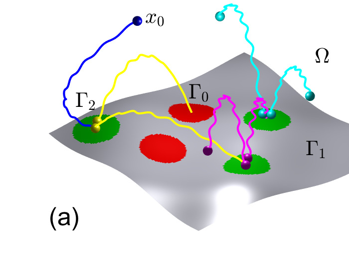

**Main problem.** The paper seeks to understand the population dynamics of autocatalytic processes where particles move through a bulk medium but undergo replication or absorption exclusively at surface interfaces.

**Main result.** The author establishes a general theoretical framework that identifies three universal asymptotic regimes (subcritical, critical, and supercritical) and derives a nonlinear Fokker-Planck equation with Robin-type boundary conditions to describe these dynamics.

**Method.** The study employs a generating function approach combined with renewal-type probabilistic arguments and spectral analysis of the backward Fokker-Planck operator.

**Summary.** This paper provides a unified mathematical framework for systems where particles diffuse in a volume but react only upon hitting a boundary, such as enzymes at membranes or catalysts on solid substrates. By analyzing the competition between particle loss and replication at the surface, the work identifies universal scaling laws and distinct dynamical phases ranging from population extinction to explosive growth. The results allow for the calculation of full probability distributions and statistical moments of the population size. This framework is broadly applicable to biological, chemical, and ecological systems involving spatially heterogeneous environments.

Abstract

Autocatalytic processes underlie diverse systems in which replication is triggered at interfaces, including heterogeneous catalysis on solid substrates, enzyme activity at membranes, viral infections, biofilm growth, and spatially structured ecosystems. In a typical scenario, particles move in a bulk medium and interact with surface regions, where they may either disappear or reproduce through branching, splitting or fission. Here, we develop a general theoretical framework to understand such surface-mediated autocatalytic processes. We show that the interplay between loss and replication at surfaces gives rise to rich population dynamics. For this purpose, we derive a renewal-type nonlinear integral equation for the generating function of the population size, providing access to its full probability distribution and statistical moments. We further establish an equivalent description in terms of a Fokker-Planck equation with nonlinear Robin-type boundary conditions that encode surface reactions. Our results identify distinct dynamical regimes and universal scaling laws, and provide a unified framework to predict when surface activity promotes extinction or explosive growth. These findings offer quantitative insight into catalytic efficiency, metabolic regulation, and population persistence in spatially heterogeneous environments.

### [The CriticalSet problem: Identifying Critical Contributors in Bipartite Dependency Networks](http://arxiv.org/abs/2604.21537v1)

**Authors:** Sebastiano A. Piccolo, Andrea Tagarelli  
**Type:** theory · **PDF:** <https://arxiv.org/pdf/2604.21537v1>  
**Analysis basis:** full PDF text, analyzed in chunks

**Main problem.** The paper addresses the 'CriticalSet' problem: identifying a subset of $k$ contributors in a bipartite dependency network whose removal isolates (fully covers) the largest number of items.

**Main result.** The authors prove the problem is NP-hard and inherits the inapproximability of the Densest $k$-Subgraph problem, but propose a new centrality measure (ShapleyCov) and a linear-time algorithm (MinCov) that achieve near-optimal performance.

**Method.** The authors model the problem as a coalitional game to derive a closed-form Shapley-based centrality and propose a reverse-greedy 'iterative peeling' algorithm called MinCov.

**Summary.** This paper investigates how to identify critical nodes in bipartite networks where dependencies follow an 'all-or-nothing' logic, such as developers supporting software libraries. Unlike standard submodular problems like influence maximization, this problem is supermodular and much harder to approximate. The authors introduce a new centrality measure, ShapleyCov, and an efficient peeling algorithm, MinCov, which outperforms traditional metrics like PageRank. Their approach is highly scalable, even working on massive datasets like Wikipedia, and provides a robust way to estimate the 'bus factor' in complex systems.

Abstract

Identifying critical nodes in complex networks is a fundamental task in graph mining. Yet, methods addressing an all-or-nothing coverage mechanics in a bipartite dependency network, a graph with two types of nodes where edges represent dependency relationships across the two groups only, remain largely unexplored. We formalize the CriticalSet problem: given an arbitrary bipartite graph modeling dependencies of items on contributors, identify the set of k contributors whose removal isolates the largest number of items. We prove that this problem is NP-hard and requires maximizing a supermodular set function, for which standard forward greedy algorithms provide no approximation guarantees. Consequently, we model CriticalSet as a coalitional game, deriving a closed-form centrality, ShapleyCov, based on the Shapley value. This measure can be interpreted as the expected number of items isolated by a contributor's departure. Leveraging these insights, we propose MinCov, a linear-time iterative peeling algorithm that explicitly accounts for connection redundancy, prioritizing contributors who uniquely support many items. Extensive experiments on synthetic and large-scale real datasets, including a Wikipedia graph with over 250 million edges, reveal that MinCov and ShapleyCov significantly outperform traditional baselines. Notably, MinCov achieves near-optimal performance, within 0.02 AUC of a Stochastic Hill Climbing metaheuristic, while remaining several orders of magnitude faster.

### ⭐ [Quantum jump correlations in long-range dissipative spin systems](http://arxiv.org/abs/2604.21513v1)

**Highlighted author(s):** Rosario Fazio  
**Authors:** Giulia Salatino, Anna Delmonte, Zejian Li, Rosario Fazio, Alberto Biella  
**Type:** theory · **PDF:** <https://arxiv.org/pdf/2604.21513v1>  
**Analysis basis:** full PDF text, analyzed in chunks

**Main problem.** The paper investigates how quantum jump statistics, such as spatial/temporal correlations and waiting-time distributions, can characterize nonequilibrium phase transitions in long-range dissipative spin systems.

**Main result.** The authors show that quantum jump correlations provide clear signatures of paramagnetic and ferromagnetic phases, specifically revealing anti-correlated jumps in the ferromagnetic phase and diverging waiting times in the paramagnetic phase.

**Method.** The study employs a tilted Lindbladian approach for full counting statistics, combined with cluster mean-field theory for short-range structures and a second-order cumulant expansion for long-range correlations.

**Summary.** This paper explores the dynamics of open quantum many-body systems subject to continuous monitoring. By analyzing the statistics of 'quantum jumps' (detection events), the authors demonstrate that trajectory-resolved observables can identify dissipative phase transitions more effectively than standard steady-state order parameters. They specifically examine how long-range power-law interactions influence the spatial and temporal patterns of these jumps. The findings highlight the potential of using jump-based signatures to probe collective behavior in experimental platforms like trapped ions or Rydberg atom arrays.

Abstract

We characterize nonequilibrium phases in long-range dissipative spin systems through the statistical properties of quantum jump trajectories. While the average dynamics governed by the Lindblad master equation provides access to steady-state expectation values of order parameters, the quantum trajectory framework reveals features encoded in the spatial and temporal correlations of detection events. Focusing on a model exhibiting a paramagnetic-to-ferromagnetic phase transition, we investigate the full counting statistics of quantum jumps using a tilted Lindbladian approach. We combine this with cluster mean-field and cumulant expansion techniques, which allow us to capture, respectively, the short- and long-range structure of jump correlations. In addition, we study the waiting-time distributions of detection events. We show that quantum jump correlations display clear signatures of the underlying phases and reveal distinct dynamical features across the transition. Our results highlight the potential of trajectory-resolved observables as probes of collective behavior in open quantum many-body systems and provide new insights into the role of long-range interactions in shaping nonequilibrium dynamics.

## strongly correlated electrons (5)

### [Cryogenic shock exfoliation for ultrahigh mobility rhombohedral graphite nanoelectronics](http://arxiv.org/abs/2604.21912v1)

**Authors:** Ludwig Holleis, Youngjoon Choi, Canxun Zhang, Jack H. Farrell, Gabriel Bargas, Audrey Hsu, Zexing Chen, Ian Sackin, Wenjie Zhou, Yi Guo, Thibault Charpentier, Yifan Jiang, Benjamin A. Foutty, Aidan Keough, Martin E. Huber, Takashi Taniguchi, Kenji Watanabe, Andrew Lucas, Andrea F. Young  
**Type:** both · **PDF:** <https://arxiv.org/pdf/2604.21912v1>  
**Analysis basis:** full PDF text, analyzed in chunks

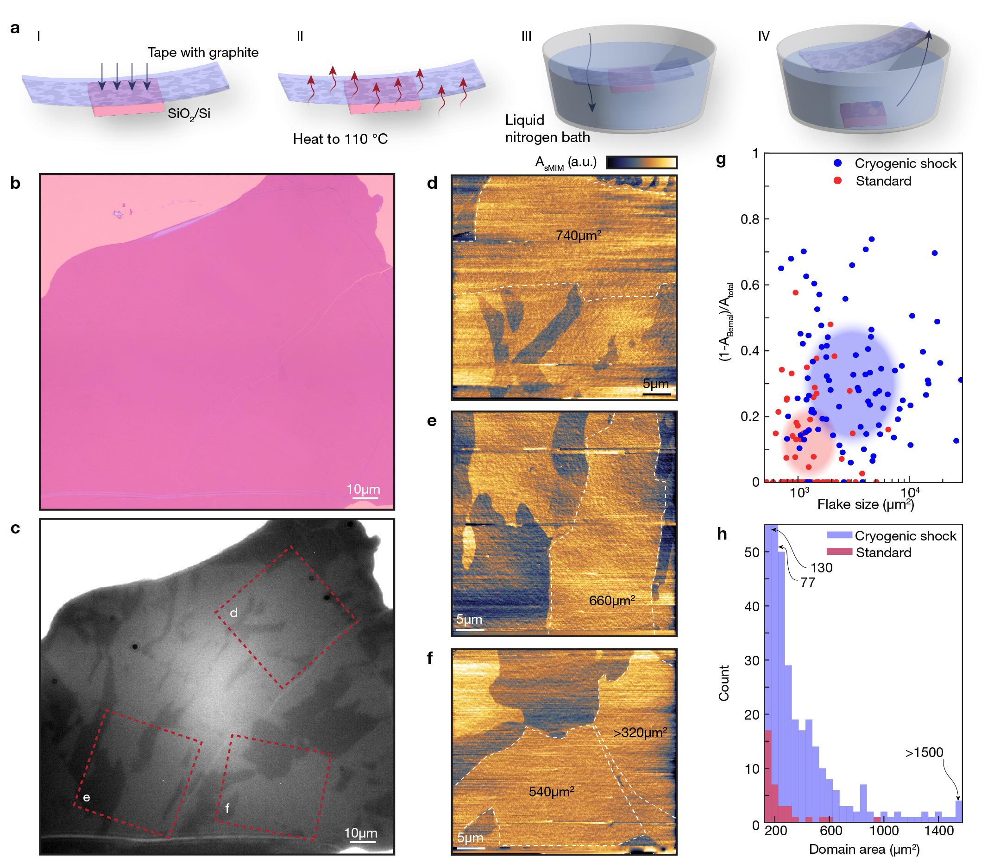

**Main problem.** The scarcity and small domain size of rhombohedral multilayer graphene (RMG) in natural graphite limit its use for studying correlated electron phases, while standard assembly techniques often destroy its metastable stacking order.

**Main result.** The authors developed 'cryogenic shock exfoliation' and a low-pressure van der Waals assembly technique to produce large-area (up to 1300 µm²), high-yield (90%) RMG devices with ultrahigh mobility and observable electron hydrodynamic regimes.

**Method.** The study combines a thermal-stress-based exfoliation process with low-pressure transfer, using scanning nanoSQUID-on-tip imaging, transverse magnetic focusing, and Boltzmann equation simulations to characterize transport.

**Summary.** This paper introduces a new fabrication method called 'cryogenic shock exfoliation' to overcome the scarcity of rhombohedral stacking in graphite. By using rapid thermal contraction, the researchers significantly increased the yield and size of rhombohedral graphene flakes. These high-quality devices allow for the observation of advanced electronic phenomena, such as the crossover between Poiseuille and porous electron hydrodynamic flow. This breakthrough provides a scalable platform for exploring strongly correlated phases like magnetism and superconductivity in two-dimensional nanoelectronics.

Abstract

Rhombohedral multilayer graphene (RMG) offers a highly tunable platform for correlated electron physics, featuring field-effect control of magnetic, superconducting, and topological phases[1-24]. The promise of these materials has been held back by the limited abundance of rhombohedral stacking in natural graphite, which constrains both sample yield and useful area. Here we introduce 'cryogenic shock exfoliation' to produce large area rhombohedral graphene flakes which, combined with a low-pressure van der Waals assembly technique that preserves stacking order, enable highly uniform devices exceeding 1300 $μm^2$ with fabrication yields of 90%. Using scanning nanoSQUID-on-tip imaging, we demonstrate uniform spin magnetism over the full central 10 times 10 $μm^2$ area of our devices. Transverse magnetic focusing reveals a disorder mean free path exceeding 200 $μm$ at low temperatures. Within the flat surface bands of RMG[20], we observe a size-driven crossover from Poiseuille to porous electron flow in the intermediate-temperature regime of strong electron-electron hydrodynamics[16, 25], providing a further signature of ultrahigh device quality. Our approach overcomes a key materials bottleneck in the fabrication of mesoscopic rhombohedral graphene devices, paving the way for incorporating strongly correlated phases into two-dimensional nanoelectronics.

### [$3d_{z^2}$ orbital delocalization and magnetic collapse in superconducting (La,Pr)$_3$Ni$_2$O$_{7-δ}$ films](http://arxiv.org/abs/2604.21899v1)

**Authors:** Xiaoyang Chen, Wenliang Zhang, Fei Peng, Ting Cui, Guangdi Zhou, Zezhong Li, Jaewon Choi, Lizhi Xu, Yiu-Fung Chiu, Stefano Agrestini, Sahil Tippireddy, Haoliang Huang, Heng Wang, Xianfeng Wu, Peng Li, Jin-Feng Jia, Mirian Garcia-Fernandez, Yi Lu, Er-Jia Guo, Qi-Kun Xue, Zhuoyu Chen, Donglai Feng, Ke-Jin Zhou  
**Type:** experiment · **PDF:** <https://arxiv.org/pdf/2604.21899v1>  
**Analysis basis:** full PDF text, analyzed in chunks

**Main problem.** The study aims to understand the microscopic electronic and magnetic evolution of Ruddlesden-Popper nickelate thin films as they transition from a parent insulating phase to a superconducting phase via strain and oxygen tuning.

**Main result.** The researchers identified a two-step process where the delocalization of the Ni 3d_{z^2} and O 2p_z orbitals occurs alongside the suppression of long-range spin-density-wave order, establishing orbital-selective delocalization and persistent short-range magnons as prerequisites for superconductivity.

**Method.** The study utilizes X-ray absorption spectroscopy (XAS) and resonant inelastic X-ray scattering (RIXS) on (La,Pr)3Ni2O7-δ thin films grown via pulsed laser deposition and atomic-layer-by-layer epitaxy.

**Summary.** This paper investigates the emergence of superconductivity in bilayer nickelate thin films by tuning epitaxial strain and oxygen content. Using advanced X-ray spectroscopy, the authors show that superconductivity is driven by the delocalization of specific orbitals (Ni 3d_{z^2} and O 2p_z) and the simultaneous collapse of long-range magnetic order. The findings reveal that while long-range spin-density-wave order is suppressed, short-range magnetic excitations (magnons) persist. This work provides a critical roadmap for designing new superconductors by highlighting the importance of orbital-selective itinerancy.

Abstract

The recent discovery of Ruddlesden-Popper (RP) nickelate thin-film superconductors has opened a new frontier in unconventional superconductivity. Its realization requires both compressive epitaxial strain and highly oxidative growth conditions, yet the microscopic pathway from the parent phase to the superconducting phase remains elusive. Here, X-ray absorption spectroscopy and resonant inelastic X-ray scattering are employed to track this evolution by independently tuning strain and oxygen content in (La,Pr)$_3$Ni$_2$O$_{7-δ}$ thin films. We uncover a remarkable two-step evolution. First, signatures of delocalization emerge in the same way upon two independent tunings: spectral weight transfers from an upper Hubbard-like peak to the hole-like peak associated with the O $2p_z$ state, and in parallel, the initially localized Ni $3d_{z^2}$ orbital becomes more itinerant, accompanied by the broadening and weakening of $dd$ orbital excitations. Second, as itinerancy increases, long-range spin-density-wave (SDW) order is suppressed in both intensity and correlation length, indicating direct competition with superconductivity. Yet, short-range magnons persist: they become damped, but their bandwidth remains unchanged. Our results paint a coherent picture in which both strain and oxygenation drive the RP bilayer nickelates towards superconducting instability, where the O $2p_z$ and Ni $3d_{z^2}$ orbitals become delocalized. Concomitantly, the long-range magnetic order loses coherence and is suppressed. These findings establish an orbital-selective route to RP nickelate superconductivity, in which the delocalization of the interlayer $3d_{z^2}$-$2p_z$-$3d_{z^2}$ molecular orbital and the robust short-range magnons upon the melting of SDW order are prerequisites, providing strong constraints for theory and a roadmap for designing nickelate superconductors.

### [Effect of Mn Substitution on Superconductivity in PrFeAs(O,F): Role of Magnetic Impurities](http://arxiv.org/abs/2604.21684v1)

**Authors:** Priya Singh, Konrad Kwatek, Tatiana Zajarniuk, Taras Palasyuk, Cezariusz Jastrzębski, A. Szewczyk, Michał Wierzbicki, Shiv J. Singh  
**Type:** both · **PDF:** <https://arxiv.org/pdf/2604.21684v1>  
**Analysis basis:** full PDF text, analyzed in chunks

**Main problem.** The study investigates how Mn substitution at the Fe site affects superconductivity, transport properties, and vortex dynamics in the iron-based superconductor PrFe1-xMnxAsO0.7F0.3.

**Main result.** Mn acts as an efficient magnetic pair-breaker that suppresses the superconducting transition temperature and critical current density, while also driving a transition from metallic to insulating-like resistivity behavior.

**Method.** The researchers used a combination of experimental techniques (XRD, Raman spectroscopy, transport, and magnetization measurements) and computational methods (DFT via the WIEN2k program) to analyze the structural and electronic changes.

**Summary.** This paper examines the impact of manganese (Mn) impurities on the Pr-based iron-based superconductor PrFeAs(O,F). By substituting Mn into the iron planes, the authors demonstrate a rapid suppression of superconductivity due to the magnetic moments of Mn acting as pair-breakers. The study also tracks structural expansions and a transition toward insulating-like electronic behavior at higher Mn concentrations. Notably, the Pr-based system shows a higher degree of robustness against these impurities compared to other 1111-family superconductors, providing insight into the role of electronic correlations in these materials.

Abstract

We investigate Mn substitution at the Fe site in PrFe1-xMnxAsO0.7F0.3 (0 to 0.1) using structural, Raman, density functional theory (DFT), transport, and magnetic measurements. X-ray diffraction and Raman analyses confirm preferential Mn incorporation into the FeAs planes, accompanied by lattice expansion and suppression of Fe-related vibrational modes. Electrical transport reveals a systematic decrease of the superconducting transition temperature from 48 K (x = 0) to complete suppression at x = 0.1, together with low-temperature resistivity upturns evolving toward insulating-like behavior. Magnetization and magnetotransport measurements show degradation of superconducting coherence, critical current density, upper critical field, and vortex activation energy with increasing Mn content. The results demonstrate that Mn acts as an efficient magnetic impurity, strongly perturbing the electronic and magnetic environment of the FeAs layers. Comparative analysis indicates relatively enhanced robustness of superconductivity in the Pr-based system, highlighting the role of rare-earth-dependent electronic correlations in impurity effects.

### [Stable Wave-Function Zeros Indicate Exciton Topology](http://arxiv.org/abs/2604.21643v1)

**Authors:** Yoonseok Hwang, Henry Davenport, Frank Schindler  
**Type:** theory · **PDF:** <https://arxiv.org/pdf/2604.21643v1>  
**Analysis basis:** full PDF text, analyzed in chunks

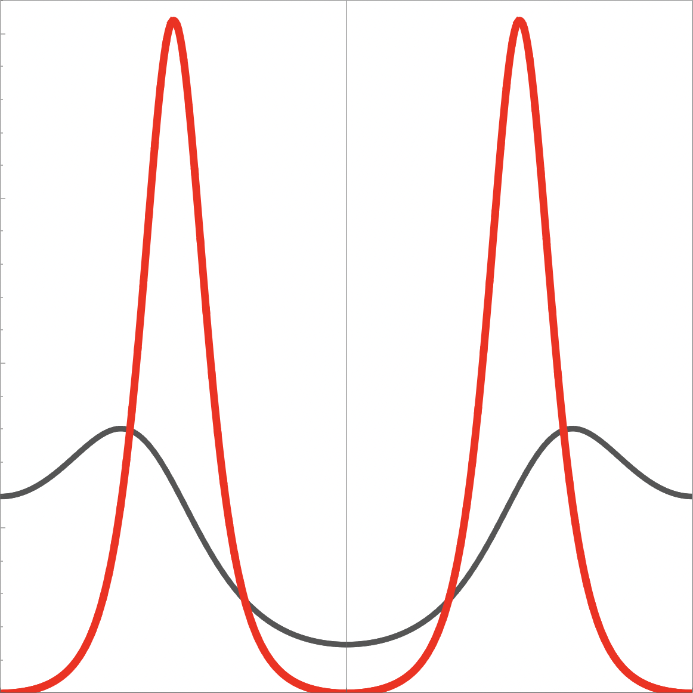

**Main problem.** The paper addresses the lack of a general, symmetry-based framework to relate the topological properties of excitons (composite excitations) to the topology of their underlying electronic bands.

**Main result.** The authors demonstrate that crystalline symmetries enforce 'stable zeros' in the exciton envelope wave function, which act as model-independent diagnostic tools to identify relative band topology and exciton Chern numbers.

**Method.** The study employs a symmetry-based analysis using sewing matrices, Wilson loops, and a projected Hamiltonian formalism to relate wave-function nodes to topological invariants in 1D and 2D systems.

**Summary.** This paper establishes a new way to identify the topology of excitons by looking at specific 'zeros' in their wave functions. By analyzing how crystalline symmetries (like rotation or inversion) protect these zeros, the authors show that these nodes can reveal hidden information about the underlying electronic bands. This is significant because these zeros are often accessible via optical spectroscopy, providing an experimental proxy to probe complex topological properties without needing a detailed model of the material's interactions.

Abstract

Excitons are bound states of electrons and holes whose band topology arises from an interplay between the topology of the underlying electronic bands and the structure of the electron-hole interaction. In crystalline solids, symmetry representations and topological invariants of the conduction and valence bands constrain the structure of the exciton envelope wave function. In particular, we show that crystalline symmetry can enforce stable zeros in the exciton wave function. These occur at high-symmetry momenta, including the optically accessible total momentum p=0. We work out how the stable zeros constrain both the relative exciton-band topology (the difference of exciton and non-interacting topological invariants) and the relative band topology (the difference of valence and conduction band invariants), all without requiring detailed knowledge of the band structure or interactions. We establish these results for two-band excitons in inversion- and rotation-symmetric systems in one and two dimensions, where the relevant topological invariants are the Berry phase in one dimension and the Chern number (modulo the rotation order) in two dimensions. In two dimensions, the exciton Chern number itself can also be constrained by zero patterns.

### [Symplectic symmetry of quadratic-band-touching Hamiltonians in two dimensions](http://arxiv.org/abs/2604.21524v1)

**Authors:** Igor F. Herbut, Samson C. H. Ling  
**Type:** theory · **PDF:** <https://arxiv.org/pdf/2604.21524v1>  
**Analysis basis:** full PDF text, analyzed in chunks

**Main problem.** The paper aims to identify and classify the internal low-energy symmetry group of quadratic-band-touching (QBT) Hamiltonians in two dimensions and determine how interactions affect this symmetry.

**Main result.** The authors identify the emergent internal symmetry as the unitary symplectic group, $USp(2N)$, and show that interactions can lead to spontaneous symmetry breaking into $USp(N) 	imes USp(N)$.

**Method.** The study employs group theoretic analysis, Majorana fermion representation, and Renormalization Group (RG) frameworks to analyze the stability of the symmetry under interactions.

**Summary.** This paper investigates the fundamental symmetries of 2D systems where energy bands touch quadratically, such as Bernal-stacked bilayer graphene. The authors discover that these systems possess a unitary symplectic symmetry, $USp(2N)$, which is distinct from the orthogonal symmetry found in standard Dirac systems like monolayer graphene. They classify the possible mass terms and interactions within this framework and describe how the symmetry can break under the influence of relevant interactions. This work provides a theoretical foundation for understanding the phase transitions and low-energy physics of quadratic-band-touching materials.

Abstract

The internal low-energy symmetry of the massless Lorentz-invariant Dirac Hamiltonian in $2+1$ dimensions is known to be $O(2N)$, where $N$ is the number of two-component Dirac fermions. Here we point out that there exists an analogous internal symmetry of the single-particle quadratic-band-touching Hamiltonian in two spatial dimensions, and it is the unitary symplectic group, $USp(2N)$. All fermionic bilinears belong to one of the three small irreducible representations of this group. The interacting theory that respects the $USp(2N)$ symmetry and the spatial rotations is constructed and found to allow two independent interaction terms. When these interactions are infrared-relevant the symplectic symmetry either remains preserved or becomes spontaneously broken to $USp(N) \times USp(N)$. The symmetry in the lattices such as honeycomb to infinite order in the dispersion's expansion in powers of local momentum is given by the overlap of the symplectic and the orthogonal groups. We show that this overlap is $O(2N) \bigcap USp(2N) = U(N)$.

## disordered systems and neural networks (1)

### [Disorder-induced crossover from phase-averaging to mode-mixing regimes in magnetic domain walls of a second-order topological insulator](http://arxiv.org/abs/2604.21702v1)

**Authors:** Dong Zhou, Zhe Hou  
**Type:** theory · **PDF:** <https://arxiv.org/pdf/2604.21702v1>  
**Analysis basis:** full PDF text, analyzed in chunks

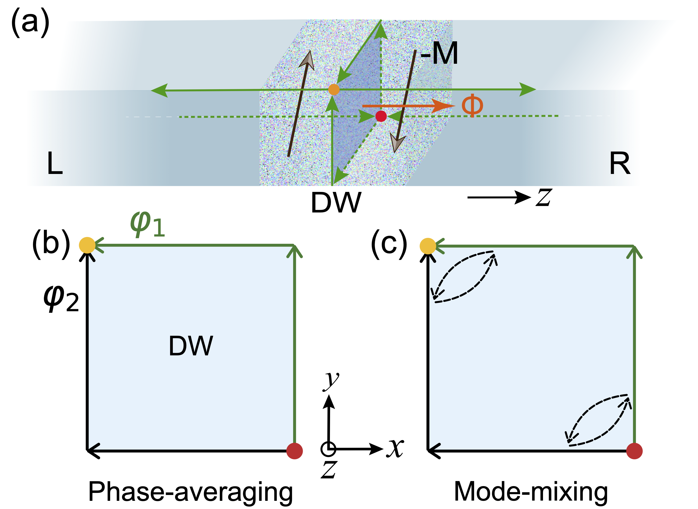

**Main problem.** The study investigates how Anderson disorder induces a crossover between two distinct transport regimes—the phase-averaging regime (PAR) and the mode-mixing regime (MMR)—in the magnetic domain walls of a 3D second-order topological insulator.

**Main result.** The authors identify a two-step plateau structure in conductance fluctuations and the Fano factor, alongside a transition in the conductance probability distribution from a U-shaped beta distribution to a uniform distribution.

**Method.** The researchers used large-scale numerical simulations with a four-band tight-binding Hamiltonian and the Non-Equilibrium Green's Function (NEGF) method, supplemented by analytical frameworks based on Random Matrix Theory and phase-randomization models.

**Summary.** This paper explores how disorder affects electronic transport in the magnetic domain walls of second-order topological insulators. It demonstrates that increasing disorder strength drives the system from a phase-averaging regime, where interference is randomized, to a mode-mixing regime, where inter-mode scattering causes current to spread into the bulk. The study provides specific experimental signatures, such as distinct plateaus in conductance fluctuations and shot noise, which can be used to identify these regimes. These findings suggest that disorder engineering could be a useful tool for controlling electronic transport in topological devices.

Abstract

We investigate electronic transport across a magnetic domain wall (DW) in a three-dimensional (3D) second-order topological insulator subject to Anderson disorder. In the clean limit, the DW hosts two co-propagating one-dimensional (1D) topological edge states that act as the two arms of an effective Aharonov-Bohm (AB) interferometer, inducing a sinusoidal conductance oscillation. Upon the introduction of disorder, the AB oscillations are suppressed, while a half-quantized plateau of $0.5 e^2/h$ for the ensemble-averaged conductance emerges. Notably, within this plateau, the conductance fluctuation exhibits a distinctive two-step plateau structure, with values of $\sim 0.35 e^2/h$ at moderate disorder, followed by a second plateau at $\sim0.29 e^2/h$ under strong disorder. By developing theoretical frameworks that account for the random-phase interference and inter-mode mixing of the two arms, we identify the first fluctuation plateau as a signature of the phase-averaging regime (PAR) and the second as a signature of the mode-mixing regime (MMR). Furthermore, we show that, in the PAR the conductance follows a U-shaped beta distribution, while it evolves into a uniform distribution in the MMR. The Fano factor associated with shot noise is also computed, which exhibits a similar two-step plateau structure at $1/4$ and $1/3$, corresponding to the PAR and MMR, respectively. Our work provides a clear demonstration of the disorder-induced crossover from PAR to MMR, and highlights the crucial role of second-order conductance cumulants in identifying these transport regimes. The results suggest disorder-engineering as a powerful route for controlling electronic transport across DW-based devices.

## other (8)

### [Subsystem-Resolved Spectral Theory for Quantum Many-Body Hamiltonians](http://arxiv.org/abs/2604.21929v1)

**Authors:** MD Nahidul Hasan Sabit  
**Type:** theory · **PDF:** <https://arxiv.org/pdf/2604.21929v1>  
**Analysis basis:** full PDF text, analyzed in chunks

**Main problem.** Standard spectral theory for many-body Hamiltonians focuses on the global spectrum, which fails to capture how the underlying interaction geometry and locality influence spectral properties.

**Main result.** The paper introduces a subsystem-resolved spectral framework, proving that subsystem spectra are stable under local truncation and approximately additive for spatially separated regions.

**Method.** The author uses operator algebra, interaction norms, and spectral perturbation theory to bound the Hausdorff distance between spectra of truncated and original subsystem Hamiltonians.

**Summary.** This paper develops a mathematical framework to study the spectra of quantum many-body Hamiltonians at the subsystem level. It demonstrates that the spectral properties of a subset of a system are stable under local approximations and that the spectra of distant, disjoint subsystems can be treated as approximately additive. These results show that the locality of interactions is reflected not just in the operators themselves, but also in their spectral structure. This provides a 'static' analogue to Lieb-Robinson bounds, linking interaction geometry directly to spectral behavior.

Abstract

We study spectral properties of quantum many-body Hamiltonians through a subsystem-based framework. Given a Hamiltonian of the form $H = \sum_{X \subseteq Λ} Φ(X)$ acting on a tensor product Hilbert space, we associate to each subset $S \subseteq Λ$ a subsystem Hamiltonian $H_S$ and its spectrum $\mathcal{S}(S) = σ(H_S)$. This produces a family of spectra indexed by subsystems, allowing spectral data to be organized according to interaction structure. We show that subsystem Hamiltonians admit local approximations: $H_S$ can be approximated by operators supported on finite neighborhoods with an error bounded by $\|H_S - H_{S,r}\| \le |S| e^{-μr} \|Φ\|_μ$. As a consequence, subsystem spectra are stable under truncation in the sense that $d_H(\mathcal{S}(S), σ(H_{S,r})) \le |S| e^{-μr} \|Φ\|_μ.$ We then prove that for disjoint subsets $S_1, S_2 \subseteq Λ$, the subsystem spectrum is approximately additive: $d_H\big(\mathcal{S}(S_1 \cup S_2), \mathcal{S}(S_1) + \mathcal{S}(S_2)\big) \le (|S_1| + |S_2|) e^{-μD} \|Φ\|_μ,$ where $D = d(S_1, S_2)$. In the finite-range case, this relation becomes exact. The results show that spectral properties reflect the locality of interactions not only at the level of operators, but also at the level of spectra. The framework provides a way to study many-body systems in which interaction geometry directly shapes spectral behavior.

### [Odd Physics Off the Diagonal: Constraining CP-violating SMEFT with Quantum Tomography](http://arxiv.org/abs/2604.21857v1)

**Authors:** Avalon Roberts, Patrick Dougan, Alexander Oh, Savanna Shaw  
**Type:** theory · **PDF:** <https://arxiv.org/pdf/2604.21857v1>  
**Analysis basis:** full PDF text, analyzed in chunks

**Main problem.** The difficulty in distinguishing CP-even from CP-odd operators in the Standard Model Effective Field Theory (SMEFT) due to degeneracies in traditional angular and kinematic observables.

**Main result.** The use of Quantum Tomography to reconstruct the Spin Density Matrix (SDM) of a diboson system provides superior sensitivity and breaks operator degeneracies by exploiting the full spin structure and off-diagonal elements.

**Method.** The authors employ Quantum Tomography and the Inverted Wigner-Weyl formalism to reconstruct the SDM of $W+Z$ production, comparing its performance against traditional observables using Monte Carlo simulations.

**Summary.** This paper proposes a new method for searching for physics beyond the Standard Model using techniques from quantum information science. By applying quantum tomography to reconstruct the spin density matrix of $W+Z$ boson production, the authors demonstrate that one can distinguish between CP-even and CP-odd effects that otherwise appear identical in standard measurements. This approach allows for a more complete exploitation of the particle spin structure, specifically capturing quadratic New Physics terms. The study shows that this method provides more robust constraints on SMEFT operators compared to traditional one-dimensional angular or kinematic observables.

Abstract

New sources of charge-parity (CP) violation beyond those described in the Standard Model (SM) are required to explain the observed matter--antimatter asymmetry of the Universe. The Standard Model Effective Field Theory (SMEFT) provides a framework to introduce additional electroweak sources of CP-odd physics in a model-independent manner. However, these CP-violating signatures are mostly degenerate to CP-even SMEFT operators in polarisation-blind observables, distinguishable only in the SM-New Physics (NP) interference using the azimuthal decay angle. Using Quantum Tomography techniques, we present a new approach to constraining these NP effects. Reconstructing the spin density matrix (SDM) of a diboson system, we go beyond `interference resurrection' to exploit the full signature of the Beyond-SM physics, including the pure quadratic NP terms. We show that this approach provides superior simultaneous sensitivity to characteristic features of CP-even and CP-odd contributions, including effects not fully captured by traditional angular observables.

### [Unitary Time Evolution and Vacuum for a Quantum Stable Ghost](http://arxiv.org/abs/2604.21823v1)

**Authors:** Cédric Deffayet, Atabak Fathe Jalali, Aaron Held, Shinji Mukohyama, Alexander Vikman  
**Type:** theory · **PDF:** <https://arxiv.org/pdf/2604.21823v1>  
**Analysis basis:** full PDF text, analyzed in chunks

**Main problem.** The paper investigates whether a quantum system containing a 'ghost' (a degree of freedom with negative kinetic energy) can maintain unitary time evolution and a stable, well-defined vacuum despite a Hamiltonian that is unbounded from both above and below.

**Main result.** The authors prove that a specific interacting system of a standard oscillator coupled to a ghost possesses a pure point spectrum, a unique stable vacuum, and manifest unitarity due to a positive-definite, discrete integral of motion.

**Method.** The study employs canonical quantization, spectral analysis of self-adjoint operators, and numerical solutions of the Schrödinger equation using pseudo-spectral and split-operator methods.

**Summary.** This paper addresses the fundamental instability typically associated with 'ghost' particles, which are problematic in many modified gravity and cosmological models. By studying a specific class of interacting oscillators, the authors demonstrate that a positive-definite integral of motion can prevent the system from decaying into infinite energy states. They show that such a system can have a stable vacuum and discrete energy levels, making the evolution unitary and physically well-defined. This provides a theoretical framework for considering ghost-like degrees of freedom in high-energy physics without the usual catastrophic instabilities.

Abstract

We quantize a classically stable system of a harmonic oscillator polynomially coupled to a ghost with negative kinetic energy. We prove that due to an integral of motion with a positive discrete spectrum: i) the Hamiltonian has a pure point spectrum unbounded in both directions, ii) the evolution is manifestly unitary, iii) the vacuum is well-defined, iv) expectation values for squares of canonical variables are bounded. Numerical solutions of the Schrödinger equation confirm these results. We argue that the discrete spectrum of the integral of motion enforces stability for extended interactions.

### [Robust continuous symmetry breaking and multiversality in the chiral Dicke model](http://arxiv.org/abs/2604.21820v1)

**Authors:** Nikolay Yegovtsev, Sayan Choudhury, W. Vincent Liu  
**Type:** theory · **PDF:** <https://arxiv.org/pdf/2604.21820v1>  
**Analysis basis:** full PDF text, analyzed in chunks

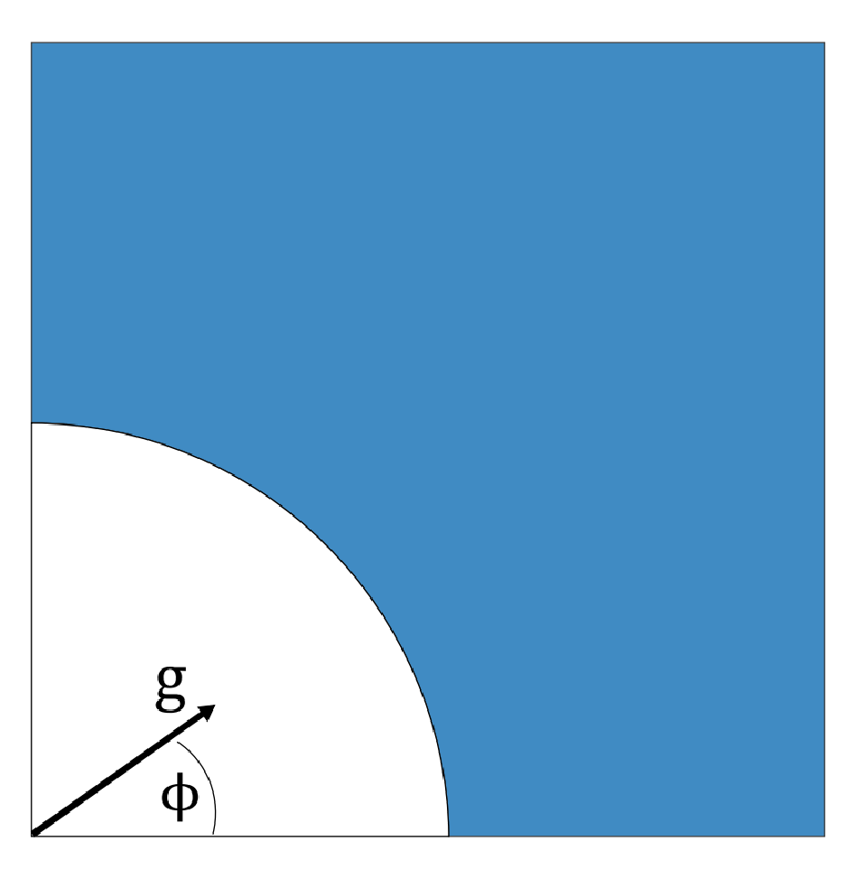

**Main problem.** The study investigates the phase transitions and critical behavior of the chiral Dicke model, specifically focusing on the stability of continuous $U(1)$ symmetry breaking and the emergence of multiversality in light-matter interactions.

**Main result.** The authors discover 'multiversality,' where the dynamical critical exponent $z
u$ changes from 1 to 1/2 depending on the parameter path, and demonstrate that the $U(1)$ superradiant phase is robust and features a Goldstone mode.

**Method.** The research employs mean-field theory, the Holstein-Primakoff transformation, and Bogoliubov theory to analyze the ground-state phase diagram and the spectrum of Gaussian fluctuations.

**Summary.** This paper introduces the chiral Dicke model, a generalization of the standard Dicke model where atoms couple to two cavity modes via chiral interactions. The authors show that this model possesses a robust $U(1)$ symmetry that leads to a stable superradiant phase. A key finding is 'multiversality,' where the system's critical behavior (the universality class) changes depending on how parameters are tuned. This work provides a new theoretical framework for exploring novel quantum phases in platforms like cavity QED, circuit QED, and trapped ions.

Abstract

The Dicke model (DM) serves as a paradigm for understanding collective light-matter interactions. We introduce the chiral Dicke model, a generalization where an atomic ensemble couples to a two-mode cavity via chiral interactions. Unlike the standard DM, the chiral DM is endowed with an inherent continuous $U(1)$ symmetry associated with angular momentum conservation. The ground-state phase diagram and the associated quantum phase transitions are charted out, revealing a $U(1)$-broken superradiant phase that spans a broad parameter space. We demonstrate that the spectrum of quantum fluctuations is highly tunable in both the symmetric and broken phases. Strikingly, our calculations reveal that the system exhibits `multiversality', where distinct universality classes govern the transition between the same two phases. In particular, along a special line in parameter space, the dynamical critical exponent for the normal-superradiant phase transition changes from $zν=1$ to $zν=1/2$. Our work establishes the chiral Dicke model as a powerful platform to realize novel quantum phases and multiversal critical phenomena in light-matter coupled systems.

### [The clock ambiguity is back with a vengeance](http://arxiv.org/abs/2604.21805v1)

**Authors:** Ovidiu Cristinel Stoica  
**Type:** theory · **PDF:** <https://arxiv.org/pdf/2604.21805v1>  
**Analysis basis:** full PDF text, analyzed in chunks

**Main problem.** The paper investigates the 'clock ambiguity' in the Page-Wootters formalism, specifically whether the choice of a clock subsystem can be uniquely determined or if it leads to physically inconsistent descriptions of reality.

**Main result.** The author proves that the clock ambiguity is not resolved by a non-interaction condition and extends it to a 'maximal' version where both histories and Hamiltonians are unitarily equivalent. The ambiguity can only be resolved by explicitly assigning physical meanings to operators.

**Method.** The study utilizes the Page-Wootters formalism, operator theory (including Stone's Theorem and spectral analysis), and unitary transformation analysis to compare different tensor product decompositions of the Hilbert space.

**Summary.** This paper addresses a fundamental problem in relational quantum mechanics: the difficulty of uniquely identifying a clock and its associated dynamics within a stationary, entangled universe. The author demonstrates that even if we assume the clock and the rest of the world do not interact, the ambiguity persists and is actually much stronger than previously thought, affecting both the evolution of states and the underlying laws (Hamiltonians). This 'maximal ambiguity' implies that without pre-defining the physical meaning of operators, one cannot distinguish between different physical realities, such as different spatial dimensions or particle numbers. Ultimately, the paper argues that physical structures like locality and gravity cannot emerge purely from relational dynamics without an external specification of operator associations.

Abstract

Page and Wootters (1983) showed how time and dynamics can emerge in a stationary system containing a clock. Albrecht (1995) later showed, for discrete time, that within this framework any dynamical evolution can be obtained simply by choosing a different clock.   Marletto and Vedral (2017) claimed that this ambiguity disappears assuming that the clock and the rest of the world do not interact. I show that their proof relies on an incorrect mathematical assumption. Also, eliminating the ambiguity completely would obstruct spacetime symmetries.   Whereas the original clock ambiguity concerns all possible histories of a discrete-time system evolving under arbitrary Hamiltonians, but not the Hamiltonians themselves, I prove a stronger version for continuous and discrete unbounded time: the ambiguity extends to both histories and Hamiltonians, including noninteracting ones. Only the dimension of the Hilbert space remains.   One might hope to dismiss the ambiguity as merely perspectival, but I show that this would predict incorrect correlations between outcomes and their records, making even knowledge impossible. Purely relational approaches therefore face both the stronger and the original clock ambiguity problems. The ambiguity is removed by taking into account the physical meaning of the operators.

### [Quantum-information diagnostics of cosmological perturbations with nontrivial sound speed in inflation](http://arxiv.org/abs/2604.21755v1)

**Authors:** Shi-Cheng Liu, Lei-Hua Liu, Bichu Li, Hai-Qing Zhang, Peng-Zhang He  
**Type:** theory · **PDF:** <https://arxiv.org/pdf/2604.21755v1>  
**Analysis basis:** full PDF text, analyzed in chunks

**Main problem.** The paper investigates how a non-trivial sound speed during inflation affects the quantum-information diagnostics, such as entanglement and entropy, of cosmological perturbations.

**Main result.** A non-trivial sound speed significantly suppresses purity and enhances entropy production, while also modulating the decoherence process and postponing the onset of classicality.

**Method.** The authors utilize a normalized open two-mode squeezed-state (OTMSS) framework and a sound-speed-resonance parametrization, employing a numerical regularization technique ($x = 	anh r_k$) to handle the stiffness of the evolution equations.

**Summary.** This paper explores the impact of a non-standard sound speed on the quantum properties of the early universe. By analyzing how modified sound speed dynamics reshape the evolution of squeezing parameters, the authors show that such features leave identifiable signatures in entanglement and entropy. Specifically, they find that a non-trivial sound speed increases the mixedness of the system and alters the transition from quantum fluctuations to classical density perturbations. This work provides a way to use quantum-information-theoretic tools to probe the physics of non-canonical inflationary models.

Abstract

In this work, we systematically investigate the quantum-information diagnostics of cosmological perturbations with a nontrivial sound speed, utilizing a normalized open two-mode squeezed-state framework. Rather than introducing new observables, our analysis focuses on how a modified sound speed dynamically reshapes the Schrödinger evolution of the squeezing parameters ($r_k$ and $φ_k$). We demonstrate how these dynamical changes are inherited by the reduced density matrix of the observable sector. By employing a sound-speed-resonance parametrization, we derive and evaluate the purity, von Neumann entropy, Rényi entropies, and logarithmic negativity. To overcome the intrinsic multiscale stiffness of the post-inflationary equations, we introduce a bounded variable $x = \tanh r_k$ as a partial regularization, which enables reliable numerical simulations exclusively within the inflationary regime. Our numerical results reveal that a nontrivial sound speed significantly suppresses the purity of the reduced state, indicating enhanced effective mixedness. Simultaneously, it strongly amplifies and modulates both the entropic and entanglement diagnostics. More precisely, a nontrivial sound speed postpones the onset of classicality by modulating the decoherence process. Ultimately, we show that a nontrivial sound speed leaves distinct and identifiable quantum-information signatures within the entanglement structure of the early universe.

### [Testing Spontaneous Collapse Models with Coulomb Mediated Squeezing](http://arxiv.org/abs/2604.21705v1)

**Authors:** Suroj Dey, Peter Barker, Animesh Datta  
**Type:** theory · **PDF:** <https://arxiv.org/pdf/2604.21705v1>  
**Analysis basis:** full PDF text, analyzed in chunks

**Main problem.** The paper aims to find experimental methods to test and constrain the parameters of spontaneous wave-function collapse models, such as CSL and Diosi-Penrose, which are proposed to solve the quantum measurement problem.

**Main result.** The authors demonstrate that detecting Coulomb-mediated squeezing and entanglement in two trapped nanospheres can provide bounds on the CSL collapse rate that are more robust against colored noise and potentially more stringent than current X-ray emission experiments.

**Method.** The study uses a master equation approach and covariance matrix analysis to model the dynamics of two charged, harmonically trapped nanospheres subject to thermal noise and stochastic collapse-induced diffusion.

**Summary.** This paper proposes a new method for testing fundamental theories of spontaneous wave-function collapse using levitated nanospheres in a Paul trap. By analyzing the reduction in thermal variance (squeezing) and the emergence of entanglement between two charged spheres due to Coulomb interaction, the authors derive new bounds for the CSL model. A key advantage of this mechanical approach is its robustness against 'colored-noise' extensions of collapse models, which typically weaken the bounds set by X-ray-based experiments. The results suggest that with advanced micro-Kelvin cooling and high-precision sensing, these mechanical tests could surpass current limits on the physics of the quantum-to-classical transition.

Abstract

We show that detecting steady-state Coulomb-mediated reduction in the thermal variance of the differential motional mode of two nanospheres can bound the Continuous Spontaneous Localization (CSL) parameter ($λ_{\text{CSL}}$). For realistic experimental parameters, the resulting bounds are comparable to those obtained from X-ray emission experiments and surpass those set by bulk-heating ones. Unlike these latter experiments, our bounds are robust against plausible coloured-noise extensions of collapse models. In the short-time regime, we find that a weak Coulomb-induced entanglement-based test between two charged nanospheres initialized in ground state can provide constraints on $λ_{\text{CSL}}$ comparable to limits set by early X-ray experiments.

### [Quantum plasmonics with N emitters: bright hybrid continuum selection](http://arxiv.org/abs/2604.21560v1)

**Authors:** Georgii Semin, Hans-Rudolf Jauslin, Gérard Colas des Francs, Stéphane Guérin  
**Type:** theory · **PDF:** <https://arxiv.org/pdf/2604.21560v1>  
**Analysis basis:** full PDF text, analyzed in chunks

**Main problem.** The paper addresses the difficulty of modeling the interaction between multiple quantum emitters and a complex, finite electromagnetic environment (quantum plasmon-polaritons) due to the complex double-continuum structure of the field.

**Main result.** The authors derive an effective Hamiltonian that simplifies the interaction into a single hybrid continuum spectrum, reducing the complex double-continuum to $N$ non-degenerate one-dimensional continua for $N$ emitters.

**Method.** The study uses canonical quantization, the Lippmann-Schwinger equation, and Green tensor formalism, employing DBM (Dissipative Brownian Motion) decomposition and Löwdin orthogonalization to isolate bright modes.

**Summary.** This paper provides a theoretical framework for simplifying the complex light-matter interactions found in quantum plasmonics. By decomposing the electromagnetic field into 'bright' modes that interact with emitters and 'dark' modes that do not, the authors show that a complex double-continuum can be mathematically reduced to a much simpler single hybrid continuum. This reduction is particularly useful for systems with multiple emitters, as it significantly decreases the number of modes needed for numerical simulations. The result proves that this simplified approach is mathematically equivalent to standard macroscopic Langevin models, providing a robust tool for studying nanophotonic and plasmonic cavity QED.

Abstract

We construct mode-selective effective models describing the interaction of the quantum plasmon-polariton field supported by a finite dielectric medium and one or several quantum emitters. The construction of the effective model is based on the decomposition of the field into bright modes relevant to the interaction with the emitters and dark modes, which do not interact with the emitters. We show that the quantum plasmon-polariton field can be represented equivalently by a double-continuum spectrum or by a single hybrid continuum spectrum for each emitter. The system of the electromagnetic field coupled to a finite medium is composed of two families of continuum modes, each of them with an infinite degeneracy. The two families are deformations of the free electromagnetic field and the free medium, induced by the interaction between them, as described by the Lippmann-Schwinger equations. We show that if there are $N$ emitters interacting with this plasmon-polariton field, the effective interaction involves a much smaller set of bosonic continuum modes: the interacting part of the continuum can be described by $N$ non-degenerate one-dimensional continua, one for each emitter. The representation of the interaction in terms of a single hybrid continuum spectrum coincides with the one within the macroscopic Langevin model with bulk medium. This coincidence is explained by an exact compensation of two terms, one in the coupling term of the Hamiltonian and the other one in a Green tensor identity.

