# arxiv digest (quant-ph + cond-mat) — 2026-04-24

*85 papers · 5 highlighted*

## ⭐ Highlighted (5)

*Papers by authors on your watch list. Full entries appear only once in their normal category below.*

- ⭐ [Algorithmic Locality via Provable Convergence in Quantum Tensor Networks](http://arxiv.org/abs/2604.21919v1) — Sarang Gopalakrishnan
- ⭐ [Symplectic split-operator method for the time-dependent unitary Tavis-Cummings model](http://arxiv.org/abs/2604.21778v1) — Andrii G. Sotnikov, Denys I. Bondar
- ⭐ [Generalized stochastic spin-wave theory for open quantum spin systems](http://arxiv.org/abs/2604.21574v1) — Rosario Fazio
- ⭐ [Quantum jump correlations in long-range dissipative spin systems](http://arxiv.org/abs/2604.21513v1) — Rosario Fazio
- ⭐ [Light-induced Self-Organization in Cooperative Free Space Atomic Arrays](http://arxiv.org/abs/2604.21012v1) — Susanne F. Yelin

## quantum information and computing (33)

### [Dual-use quantum hardware for quantum resource generation and energy storage](http://arxiv.org/abs/2604.21913v1)

**Authors:** Vaibhav Sharma, Yiming Wang, Shouvik Sur  
**Type:** theory · **PDF:** <https://arxiv.org/pdf/2604.21913v1>  
**Analysis basis:** full PDF text, analyzed in chunks

Figures

 <small>FIG. 1. The same quantum hardware can serve either as a quantum battery or a quantum sensor because the process of charging a quantum battery generates quantum resources. Here, we demonstrate a concrete protocol where the quantum hardware remains agnostic of its intended use until a time t = t∗where a suitable metrological resource peaks. One can then choose to either time-evolve into a fully charged quantum battery or perform quantum sensing. As a bonus, after sensing, there exists a finite probability to obtain a fully charged battery.</small>

 <small>FIG. 2. Time-evolution of the variance of the numerically optimized squeezed two-mode operator Xmin. Here, we have fixed (n, ω0, gn) = (4, 1, 1/ √</small>

 <small>FIG. 3. (a) Protocol combining charging (for time 2t1 with λ(t) = 1) and sensing (for time ts with λ(t) = 0) using the two coupled superconducting LC resonator based quantum battery model in Eq. 6. (b) Bloch sphere representation of the evolution of quantum state during this protocol, starting from a discharged state |ψi⟩to a partially charged state |ψm⟩ while sensing an unknown parameter ϕ for time ts.</small>

 <small>FIG. 4. A schematic portrayal of potential inter-connectivity among standard quantum technologies. Here, X →Y implies Y enabled by X. This work enumerates such relationships between a quantum battery and a quantum sensor. Solid (dashed) arrows indicate established (hypothesized) proto- cols. The hypothetical protocols can be devised by combining the protocols developed here and in Refs. [59, 60].</small>

 <small>FIG. 5. Time evolution of the optimal angles for which the variance of the two-mode quadrature ˆ Xθ,η,ϕ is minimized.</small>

 <small>FIG. 6. Time evolution of the variance of the optimal quadrature ˆ Xθ,η,ϕ for (a) n = 3 and (b) n = 6. The best squeezing is obtained at a finite short time in both cases.</small>

 <small>FIG. 7. Time evolution of the optimal angles for which the variance of the two-mode quadrature ˆ Xθ,η,ϕ is minimized for (a)–(c) n = 3 and (d)–(f) n = 6.</small>

**Main problem.** The paper investigates whether the hardware used for generating quantum resources (like entanglement for sensing) can be the same hardware used for quantum energy storage (quantum batteries), aiming to reduce hardware overhead.

**Main result.** The authors demonstrate a 'dual-use' connection where protocols for fast quantum battery charging simultaneously generate metrologically useful states, such as spin-squeezed and NOON-like states.

**Method.** The study uses a theoretical framework mapping state preparation to battery charging, applying the Mandelstam-Tamm quantum speed limit and short-time expansions to a model of coupled superconducting LC resonators.

**Summary.** This paper proposes a way to make quantum hardware more efficient by allowing it to switch between two different functions: storing energy and performing high-precision sensing. By showing that the processes used to charge a quantum battery also create highly entangled states, the authors suggest a modular architecture where a single device can serve multiple purposes. Specifically, they demonstrate this using superconducting circuits, where the same physical interaction can either charge a battery or generate states for enhanced quantum metrology. This approach could lead to more sustainable and multifunctional quantum technologies without the need for extra hardware.

Abstract

Quantum resources such as entanglement form the backbone of quantum technologies and their efficient generation is a central objective of modern quantum platforms. Independently, quantum batteries have emerged as nanoscale devices that utilize collective quantum effects to store energy with a charging advantage over classical strategies. Here, we show that these two pursuits can co-exist: protocols for fast generation of resourceful quantum states can simultaneously charge a quantum battery with a collective advantage, and conversely, a quantum battery protocol with a charging advantage can produce resource-rich states. Using this connection, we propose an integrated hardware protocol on superconducting circuits in which each experimental run can interchangeably accomplish either quantum battery charging, or quantum sensing through generation of metrologically useful states. Our results establish that quantum resources and stored energy are distinct yet co-producable quantities, opening the door to modular quantum architectures that dynamically switch between sensing and energy-storage functions, thereby producing additional functionalities without extra hardware cost.

### [A Universal Quantum Information Preserving Photonic Switch for Scalable Quantum Networks](http://arxiv.org/abs/2604.21902v1)

**Authors:** Jiapeng Zhao, Stéphane Vinet, Amir Minoofar, Michael Kilzer, Lucas Wang, Galan Moody, Vijoy Pandey, Ramana Kompella, Reza Nejabati  
**Type:** both · **PDF:** <https://arxiv.org/pdf/2604.21902v1>  
**Analysis basis:** full PDF text, analyzed in chunks

Figures

 <small>FIG. 1: Switched Quantum Network. Conceptual quantum network centered around the quantum switch. The system ensures quantum state integrity and entanglement preservation while providing encoding-agnostic operation across diverse modalities. The switch supports time- and space-multiplexed utilization of shared critical resources whilst providing a scalable framework for the interconnection of quantum computers and quantum sensor.</small>

 <small>FIG. 2: Architecture of the Universal Quantum Switch. The input quantum state converters (QSCs) enable conversion to path-encoding to ensure quantum information is routed through two identical photonic switches. The output QSCs convert the quantum information back to the desired output encoding modality. Both QSCs can be implemented in either an integrated or pluggable manner with an arbitrary combination of encoding modality.</small>

 <small>FIG. 3: Schematic of the quantum switch. (a) Simplified sketch of the device for polarization encoding. (b) TFLN photonic integrated circuit combining both QSCs and the switch matrix, respectively highlighted in green and purple. (c) Normalized optical power when varying the driving voltage of TO phase shifters to characterize the half-wave power and ER of MZI. (d) Fast switching between two output ports when driving the EO modulator with a sinusoidal waveform at 1 GHz rate to determine half-wave voltage.</small>

 <small>FIG. 4: Quantum state tomography (a) Simplified sketch of the experimental setup for quantum characterization. An entangled photon source produces polarization-entangled photons at 1551.72 nm (signal) and 1564.68 nm (idler). The signal photon is routed through the UQS. After the PIC, both photons are sent to the polarization tomography system. Reconstructed density matrices for the input ρin (b) and output ρout (c) for connection 1 →1 (input →output ports). A fidelity F(ρin, ρout) = 0.98 is obtained with purity Tr(ρ2 out) = 1.</small>

 <small>FIG. 5: Dynamic switching. (a) Dynamic switching of the device when driving the EO modulator with a rectangular pulse at 1 MHz. The gated section used for quantum state tomography is shown in the shaded region. Reconstructed density matrices for the input ρin (b) and output ρout (c) for connection 2 →1 (input → output ports). A fidelity F(ρin, ρout) = 0.90 is obtained with purity Tr(ρ2 out) = 1.</small>

 <small>FIG. 6: Scaling potential of the UQS. (a) UQS fidelity as a function of PDL per PRS. b UQS fidelity as a function of PER of PRS and ER of MZI. c UQS fidelity and IL as a function of dimension N. Note that the IL floor comes from the high coupling loss in the current chip. A low loss (≤1 dB) design can be implemented to reduce the IL floor to 2 dB.</small>

 <small>FIG. 7: Polarization entangled photon source. Polarization entangled photons are generated in a fiber-based Sagnac interferometer via spontaneous four-wave mixing (SFWM) in a AlGaAs chip. The interferometer is actively locked using a probe laser with a servo controller.</small>

**Main problem.** Existing quantum networks are limited to static, point-to-point links because current optical switching technologies introduce decoherence and lack the ability to dynamically route and convert different quantum encoding modalities.

**Main result.** The authors demonstrated a Universal Quantum Switch (UQS) using thin-film lithium niobate that achieves high-speed (up to 1 GHz) routing with low decoherence (≤4%) and high fidelity (>94%) for arbitrary entangled states.

**Method.** The researchers developed a 2×2 photonic integrated circuit prototype using a dual-actuation strategy (thermo-optic and electro-optic modulation) and a three-stage architecture involving quantum state converters to enable encoding-agnostic routing.

**Summary.** This paper presents a new architecture for a 'Universal Quantum Switch' designed to enable scalable, dynamic routing in a quantum internet. Using a thin-film lithium niobate platform, the device can switch quantum information between different paths and even convert between different types of encoding (like polarization and path) without destroying quantum coherence. The experimental prototype demonstrates very high-speed switching and minimal loss of entanglement, providing a foundational building block for connecting diverse quantum platforms like superconducting qubits and trapped ions into a unified, large-scale network.

Abstract

Quantum networks are a keystone of the quantum internet. However, existing implementations remain largely confined to static point-to-point links due to the absence of a switching paradigm capable of dynamically routing fragile quantum entanglement without introducing decoherence. Here, we propose the Universal Quantum Switch, a foundational building block allowing on-demand, non-blocking, and encoding-agnostic routing of quantum information, as well as seamless modality conversion between disparate quantum platforms. We develop a prototype in thin-film lithium niobate and experimentally demonstrate robust switching with $\le 4\%$ decoherence via thermo-optic modulation and high-speed electro-optic switching of arbitrary entangled states at 1 MHz. Moreover, we show that our platform can support reconfiguration speeds up to 1 GHz. To our knowledge, this work represents the first demonstration of multi-node dynamic entanglement distribution at these speeds. Complementing these experimental results, we project the architecture's scalability, showing dimension-independent decoherence, and provide a scalable, interoperable building block for heterogeneous quantum network fabrics.

### [Loss-biased fault-tolerant quantum error correction](http://arxiv.org/abs/2604.21876v1)

**Authors:** Laura Pecorari, Gavin K. Brennen, Stanimir S. Kondov, Guido Pupillo  
**Type:** theory · **PDF:** <https://arxiv.org/pdf/2604.21876v1>  
**Analysis basis:** full PDF text, analyzed in chunks

Figures

 <small>FIG. 1. (a) Rotated surface code, stabilizers and logical oper- ators. (b) Stabilizer readout circuit simulated with different success probability of not finding an atom in the Rydberg state before a CZ gate. (c) Surface code logical error proba- bility versus Rydberg decay rate, γ/Ωmax with time-optimal laser pulses. Data are for 100, 90, 75, 50, 0% success proba- bility that an atom is not in the Rydberg state immediately before a the next gate (from dark to light color shading).</small>

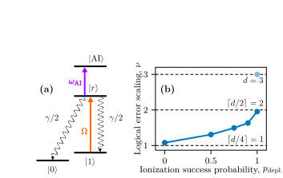 <small>FIG. 2. (a) Schematic level structure. (b) Logical error scal- ing ν such that pL ∝γν versus success probability, pdepl., of inter-gate ionization for distance-3 surface codes. Back- to-back gate schedules produce a non-fault-tolerant scaling ⌈d/4⌉, while perfect inter-gate ionization restores the fault- tolerant Pauli scaling of ⌈d/2⌉for Pauli errors. If losses are properly handled in software with a loss-aware decoder, the optimal erasure-like scaling of d can be achieved (light blue). Error bars fall within the marker size.</small>

 <small>FIG. 3. Occurrences of hook error strings caused by single decay events that degrade fault tolerance. Number hook er- rors for (a) ionization enforced after each gate with success probabilities ranging from 0% to 100% and (b) perfect ion- ization only enforced at selected circuit locations (see main text). (c) Probability of each hook error string at fixed decay rate γ = 5×10−5Ωmax (far below the surface code threshold).</small>

**Main problem.** High-speed quantum error correction (QEC) cycles in neutral-atom processors introduce non-Markovian, spatially correlated errors caused by Rydberg excitation hopping and residual Rydberg populations.

**Main result.** The authors propose 'loss-biasing,' a technique that uses mid-circuit ionization to convert spurious Rydberg excitations into erasure-like noise, thereby restoring fault-tolerant logical error scaling.

**Method.** The study uses the Stim Clifford simulator to model distance-$d$ rotated surface codes and employs Lindblad master equation dynamics to simulate Rydberg-specific error mechanisms.

**Summary.** In neutral-atom quantum computing, faster gate cycles can inadvertently lead to complex, correlated errors that degrade the performance of error-correcting codes. This paper introduces a strategy called 'loss-biasing,' where researchers intentionally trigger the loss of atoms via ionization to transform difficult-to-correct correlated errors into simpler erasure errors. This approach is particularly effective for alkaline-earth-like atom platforms and can significantly improve the threshold for fault-tolerant computing. By enabling shorter QEC cycles with reduced hardware overhead, this method provides a practical pathway toward scalable, high-speed quantum processors.

Abstract

We investigate the limits of quantum error correction (QEC) in neutral-atom processors approaching high-fidelity gates and fast cycle times. We show that shorter QEC cycles amplify platform-specific errors, notably Rydberg excitation hopping, and hinder decay of residual Rydberg population, leading to non-Markovian correlated errors that degrade logical performance. To address this, we introduce loss biasing, where spurious Rydberg excitations are rapidly converted into atom loss via mid-circuit ionization, transforming errors into erasure-like noise and suppressing their propagation. Loss biasing restores the fault-tolerant logical error scaling for intra-cycle Pauli errors; furthermore, we argue that when supported with loss-aware decoding, it can achieve the optimal scaling of erasures while enabling shorter QEC cycles with reduced hardware overhead. We outline an implementation using fast autoionization in alkaline-earth(-like) atoms, establishing loss biasing as a practical route toward fault-tolerant quantum computing with sub-millisecond QEC cycles.

### [Enhancing Coherence of Spin Centers in p-n Diodes via Optimization Algorithms](http://arxiv.org/abs/2604.21874v1)

**Authors:** Jonatan A. Posligua, David E. Stewart, Denis R. Candido  
**Type:** theory · **PDF:** <https://arxiv.org/pdf/2604.21874v1>  
**Analysis basis:** full PDF text, analyzed in chunks

Figures

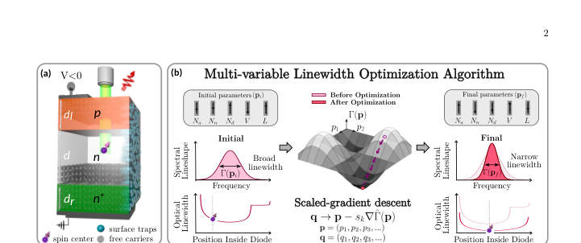 <small>FIG. 1: (a) Schematic of a 4H-SiC pnn+ diode operated in the reverse bias regime with embedded spin centers, non- depleted charges, and surface traps responsible for the leakage current. (b) Schematic of the multi-variable linewidth optimization algorithm via the scale-gradient descent method. The linewidth is first calculated for an initial set of diode design parameters p, and then autonomously minimized using a scaled gradient descent method. Iterations are performed until convergence of the linewidth is achieved, resulting in a final set of design parameter.</small>

 <small>FIG. 2: Electrostatic properties of a 4H-SiC pnn+ diode: (a) Electric potential along the diode’s z-direction calculated for reverse bias voltages ranging from −50 to −800 V. (b) Same for the electric field. (c) Total charge carrier density as a function of position within the diode’s z-direction calculated using the solution to Poisson’s equation to evaluate ρc in Eq. (2) for reverse voltages ranging from −50 to −400 V. The depletion boundaries ˜dn are shown for each reverse bias value. (d) Same for the optical linewidth as a function of the spin center’s position within the diode’s n-region (i.e., zdef). The doping densities used to generate all the sub-figures are Na = 7×1018cm−3, Nn =...</small>

 <small>FIG. 3: Single-parameter linewidth optimization with respect to the bias voltage. The initial design parameters are Na = 7 × 1018 cm−3, Nn = 4 × 1015 cm−3, Nd = 1.01 × 1019 cm−3, T = 300 K, V = −5 V, dl = dr = 0.4 µm and d = 10 µm. (a) Electric field and carrier density profiles for the initial parameters. (b) Optical linewidth, reverse bias voltage, and optimal spin center position as a function of iteration number. (c) Final electric field and carrier density profiles for the optimal design parameters.</small>

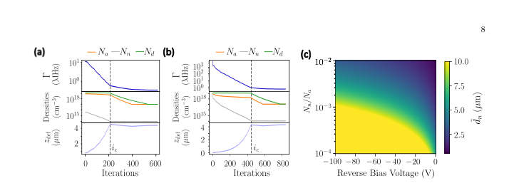 <small>FIG. 4: (a) Single-type parameter linewidth optimization with respect to doping densities for small bias voltage of V = −5 V, Nn ≪Na ≈Nd, with Nn = 4 × 1015 cm−3, Na = 7 × 1018 cm−3, and Nd = 1.01 × 1019 cm−3, T = 300 K, dl = dr = 0.4 µm, d = 10 µm. The upper panel shows the reduction in linewidth Γ vs. iteration number, the lower panels show the corresponding doping densities and spin center position. (b) Same as (a), but for Na = Nn = Nd = 1019 cm−3 as initial conditions. (c) Density plot of depletion length within the intrinsic region (dn) as a function of Nn/Na and V .</small>

 <small>FIG. 5: Optimization with respect to the lengths of the diode’s doping layers. The initial parameters for this simulation are Na = 7×1018 cm−3, Nn = 4×1015 cm−3, Nd = 1.01 × 1019 cm−3, T = 300 K, V = −15 V, and dl = dr = d = 1 µm. Upper panel: Linewidth reduction and inset showing spin center’s position as a function of iteration number. Lower panel: Evolution of d, dl, and dr that allows for minimal optical linewidth Γ. The size of the lightly-doped n-region is considerably bigger than that of the bulk p and n+-regions. This is a consequence of both charge conservation and the application of our electric noise model.</small>

 <small>FIG. 6: Optimization process for 3 different sets of initial design parameters with displayed iteration-by-iteration behavior of the linewidth Γ, optimal spin center position and the diode’s design parameters Na, Nn, Nd, and V for dl = dr = 0.4 µm and d = 10 µm. The voltages used for “Initial Set 1”, “Initial Set 2”, and “Initial Set 3” are −5 V, −6 V, and −7 V, respectively. (b) Same for dl = dr = 0.04 µm and d = 1 µm. (c) Same for dl = dr = 0.004 µm and d = 0.1 µm.</small>

 <small>Fig. 6. The left panels show the behavior of Γ and the spin center position as a function of iteration number, whereas the plots on the right side show the correspond- ing variations of all doping densities and bias voltage. Our optimization with respect to these diode parame- ters shows an overall two-order-of-magnitude decrease in the linewidth. Here, smaller linewidths are achieved by decreasing doping densities, increasing the magnitude of the bias voltage, and placing the spin defect at the center of the diode. Similarly to the results found with respect to a single type of parameters in Secs . V A and V B, optimization was obtained via the decreases in the den- sity of fluctuators and...</small>

 <small>FIG. 7: (a) Optimization process for 3 different sets of initial design parameters with displayed iteration-by-iteration behavior of the linewidth Γ, optimal spin center position and the diode’s design parameters Na, Nn, Nd, and V for dl = dr = 0.04 µm and d = 1 µm. The voltages used for “Initial Set 1”, “Initial Set 2”, and “Initial Set 3” are −5 V, −6 V, and −7 V, respectively. (b) Same as (a) but for d = 0.1 µm.</small>

 <small>FIG. 8: Maximum electric field [Emax z ] inside the diode as a function of the iteration. Horizontal lines represent the electric field breakdown value EBD, and a fraction of ΩEBD (Ω&lt; 1) set as the numerical threshold of the elec- tric field. Inset shows ΩEBD −Emax z demonstrating that the maximum value of the electric field never surpasses ΩEBD.</small>

 <small>FIG. 9: Cause and effect of leakage current present in a 4H-SiC pnn+ diode. (a) Effective density neff pro- duced by leakage current at thermal equilibrium as a function of depth from the diode’s surface for reverse bias voltages ranging from −500 to −1100 V. The depth- dependence of the densities is modeled as a half-Gaussian profile, where its maximum value occurs at the surface of the diode, and it decays as a function of depth in- side the diode. This is pictorially evidenced in Fig. 1(a). (b) Optical linewidth calculated from electric and mag- netic SND as a function of the spin center’s separation from the volume containing fluctuators. The linewidths are calculated for the same...</small>

**Main problem.** How to optimize the design parameters of p-n diodes (such as doping profiles, bias voltage, and layer thickness) to maximize the spin coherence of embedded spin centers by minimizing their optical linewidth.

**Main result.** The study demonstrates that a twenty-fold suppression of optical linewidth is achievable by increasing reverse bias and reducing doping densities, and that placing spin centers deeper than 100 nm from the surface mitigates leakage current-induced noise.

**Method.** The authors developed a scaled gradient descent optimization algorithm that combines the numerical solution of the Poisson equation with a new formalism for modeling leakage current-induced noise and charge noise from non-depleted regions.

**Summary.** This paper addresses the challenge of decoherence in solid-state spin centers, specifically divacancies in 4H-SiC, when embedded in p-n diodes. By using a constrained optimization algorithm, the researchers identified the ideal diode architectures—such as maximizing the intrinsic region and optimizing doping levels—to minimize spectral broadening. The work provides a practical guide for experimentalists to design semiconductor devices that host long-lived spin qubits for quantum technologies. It specifically accounts for realistic physical constraints like dielectric breakdown and leakage current.

Abstract

Solid-state spin defects hold great promise as building blocks for various quantum technologies. Embedding spin centers in $p$-$n$ diodes under reverse bias has proved to be a powerful strategy to narrow the optical linewidth and increase spin coherence, while also enabling control of the photoluminescence wavelength via Stark shift. Given the multitude of parameters influencing spin centers in diodes (e.g., doping densities and profiles, temperature, bias voltage, spin center position), a question that has not yet been answered is: which set of these design parameters maximizes spin center coherence? In this work, we address this question by developing a scaled gradient descent optimization algorithm that minimizes the optical linewidth of spin centers by combining the numerical solution of a diode's Poisson equation with calculated charge noise from the non-depleted regions. Our optimization is performed for both single- and multiple-parameter cases for divacancies in SiC $p$-$i$-$n$ diodes, including reverse-bias voltage, doping density and profile, and diode total length. Importantly, the optimization is subject to realistic physical constraints, such as small operating bias voltages, avoidance of the dielectric breakdown regime and physical thresholds for doping density. Additionally, due to the leakage current at reverse bias voltages, we develop a new formalism to investigate its influence on coherence. We show that the corresponding noise can be mitigated by implanting spin defects away from the diode's surfaces. Our work provides guidance on experimentally relevant diodes for hosting spin centers with the narrowest optical linewidths and longest coherence times.

### [High-performance cellular automaton decoders for quantum repetition and toric code](http://arxiv.org/abs/2604.21866v1)

**Authors:** Don Winter, Thiago L. M. Guedes, Markus Müller  
**Type:** theory · **PDF:** <https://arxiv.org/pdf/2604.21866v1>  
**Analysis basis:** full PDF text, analyzed in chunks

Figures

 <small>Fig. 1 shows the logical error rate pL for various sys- tem sizes. In the sub-threshold regime (p &lt; 0.5), in- creasing the system size provides better protection, as errors are suppressed more effectively with additional physical qubits. This value pc ≡p = 0.5 is called the QEC threshold. In this regime, pL scales with pλ(d), with λ(d) = (d + 1)/2 and d = n, corresponding to the min- imum number of physical errors for which the matching decoder gives a logical error. Another code which, however, is capable to protect against both Z- and X-errors is the toric code [57], shown in Fig. 2. The toric code is defined on a n × n regular square lattice with periodic boundary conditions, i.e., a...</small>

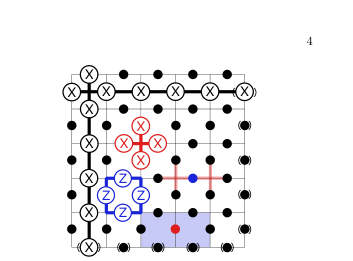 <small>FIG. 2. Illustration of a distance d = 5 toric code with qubits (black circles) on edges of a regular d × d lattice under pe- riodic boundaries. Qubits in parenthesis wrap around the torus. The minimum-weight logical operators X1 L and X2 L are vertical and horizontal strings of single-qubit Pauli-X oper- ators. Logical Z-operators are omitted. The stabilizers of the toric code are either of pure X- (red stars) or Z-type (blue plaquettes). A X-error (red dot) anti-commutes with two Z-stabilizers, causing two defects (blue shades). A Z- error (blue dot) causes the star syndrome (red shades). Any X error configuration which forms a (product of) stabilizer generator(s) commutes with the...</small>

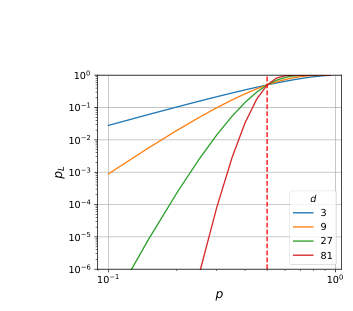 <small>FIG. 1. Analytical logical error rate pL as function of bit- flip error rate p for the ML decoder (Eq. 1) of the repetition code. Different colors correspond to different code distances d (equivalent to number of qubits n making up the repetition code), the dashed red line marks the QEC threshold pc = 0.5.</small>

 <small>FIG. 3. Sketch of Harrington’s hierarchical CA decoder. On the left, we show a distance-27 toric code from the perspective of the three hierarchy levels Harrington’s decoder imposes. Error correction is accomplished by moving defects (black circles) which are close towards each other thereby correcting the errors (red lines) which separate them. At the lowest level (0), one- and some two-qubit errors are corrected within at most two CA steps. Defects which have no other defect in their local neighborhood move towards the center of their colony (group of Q × Q cells) marked in thick black lines at the next hierarchy level (1). At level-1, defects located at colony centers communicate by...</small>

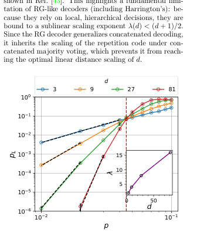 <small>FIG. 4. Logical error rate pL as function of bit-flip error rate p for Harrington’s toric code decoder under code capacity noise for different code distances d (color code). The dashed red line marks the QEC threshold pc ≈4.5%. The black dashed line corresponds to fits of the function f(p, d) = A(d)pλ(d). In the inset we show the effective code distance λ(d) as function of code distance d. The purple line in the inset corresponds to the function λ(d) = 2log3(d) ≈d0.631, as discussed in the main text. Numerical data was obtained for 104 to 106 Monte Carlo shots until statistical uncertainty is small relative to the measured values. Standard sampling errors are represented by black error bars.</small>

 <small>FIG. 5. Average logical lifetime ⟨TF ⟩as function of phenomenological bit-flip error rate p on data qubits (left panel) and rate q on measurements (right panel) for toric codes of distance d (color code) under corrections by Harrington’s decoder. In the left panel we set q = 0 and in the right p = 0. Dashed black lines correspond to fits of the function g(d, p) = B(d)p−λ(d) with λ(d) shown in the insets. The purple line in the inset corresponds to λ(d) = d0.631 in both panels. Although a non-zero threshold is mathematically guaranteed [1], a precise asymptotic value is not deducible from this data as the crossing points continue to drift toward lower error rates for the simulated distances....</small>

 <small>FIG. 6. Average logical lifetimes ⟨TF ⟩as function of data, measurement, and signal noise with respective rates p, q, and psig for Harrington’s decoder on toric codes of distance d (color coded). The lines of less opacity in the background correspond to performance curves under sole data noise, cf., left panel of Fig. 5. The dashed colored lines correspond to data, measurement and CountSignal noise, while the solid lines correspond to data, measurement and CountSignal and FlipSignal noise. The devastating effect of FlipSignal noise becomes apparent when p, q &lt; 10−2. In this regime, larger lattice sizes show worse performance than small ones. Sole CountSignal noise (dashed lines) is less...</small>

 <small>FIG. 7. Sketch of Harrington’s decoder confined to one dimension. On the left, we show a distance-27 repetition code from the perspective of the three hierarchy levels Harrington’s decoder imposes. Error correction is accomplished by moving close-by defects (black circles) towards each other, thereby correcting the errors (red and orange lines) which separate them. At the lowest level (0), one- and some two-qubit errors are corrected within at most two time steps, while defects that have no other defect in their neighborhood are moved towards their colony center (marked in black thick lines at the next level). At the next level (1), CountSignals (colored in blue; shade corresponds to amount...</small>

 <small>FIG. 8. All possible error configurations of qubits within a block. Data-qubit errors (red bars) generate a syndrome (black circles) between two colony centers C1 and C2. The green arrows indicate the local update prescribed by the cor- rection rule. Configurations with zero or one error (left) are corrected to the trivial configurations with no errors between the centers, whereas configurations with two or three errors (right) are completed to the nontrivial configuration with three errors between the centers.</small>

 <small>FIG. 9. Logical error rate pL as function of data qubit error rate p for Harrington’s decoder confined to one dimension under code capacity noise on distance-d repetition codes. The red dashed line marks the QEC threshold at pc = 1/2. The dashed black lines correspond to the (analytical) performance of a global concatenated majority voting (pL = (pmaj)m(p), as explained in the main text). Each data point was obtained from 104 to 106 Monte Carlo shots until statistical uncertainty is small relative to the measured values. Standard errors are represented by black error bars.</small>

**Main problem.** The need for scalable, low-latency decoding architectures for large-scale quantum error correction that can handle noise in both data qubits and the decoder's internal signaling processes.

**Main result.** The introduction of SCALA, a non-hierarchical cellular automaton decoder that achieves a higher code-capacity threshold (p_c ≈ 7.5%) and superior sub-threshold scaling compared to existing hierarchical models.

**Method.** The authors use Monte Carlo simulations and absorbing Markov chain modeling to evaluate the performance, scalability, and robustness of the SCALA decoder against various noise models in 1D repetition and 2D toric codes.

**Summary.** This paper presents a new class of local decoders called SCALA (Signaling CA with Local Attraction) for quantum error correction. Unlike previous hierarchical cellular automaton decoders that are vulnerable to noise and have complex scaling, SCALA uses a non-hierarchical design where local computational resources remain constant regardless of system size. The study demonstrates that SCALA provides a higher error threshold and better scaling of logical error rates for both the repetition and toric codes. This makes it a highly promising candidate for real-time, hardware-efficient decoding in large-scale quantum computers.

Abstract

Execution of quantum algorithms on large-scale quantum computers will require extremely low logical error rates, which necessitates the development of scalable decoding architectures. Local decoders are promising candidates for this task, as they avoid the communication and data processing bottlenecks inherent in global decoding strategies. Cellular automaton (CA) decoders represent a distinct class of local decoders, offering a path toward the low-latency, real-time decoding required for practical applications. In this work, we present SCALA (Signaling CA with Local Attraction), a novel non-hierarchical cellular automaton decoder for quantum repetition and toric codes. By evaluating SCALA alongside the hierarchical CA decoder proposed by Harrington, we provide a direct comparison between non-hierarchical and renormalization-group-style local decoding strategies. We characterize SCALA across three key metrics: Performance, scalability, and robustness. Our results show that SCALA achieves a code-capacity threshold of approximately $p_c\approx 7.5\%$ and provides strong sub-threshold scaling of about $p_L\propto p^{d/4}$ on the toric code. In terms of scalability, our non-hierarchical design ensures that the local computational resources remain independent of system size, yielding a modular local architecture suitable for hardware implementation. Finally, SCALA demonstrates strong robustness to qubit measurement errors and noise within the decoder itself, a critical advantage for real-time decoding on noisy hardware. Our results establish SCALA as a high-performance, scalable, and robust local decoder for scalable quantum error correction.

### [Replay-buffer engineering for noise-robust quantum circuit optimization](http://arxiv.org/abs/2604.21863v1)

**Authors:** Akash Kundu, Sebastian Feld  
**Type:** theory · **PDF:** <https://arxiv.org/pdf/2604.21863v1>  
**Analysis basis:** full PDF text, analyzed in chunks

Figures

 <small>Figure 2: 1-qubit compiling of Haar-random target unitaries with RX, RY, RZ(±π/128) gates. (Left) Suc- cess probability and mean fidelity at tolerances 0.99, 0.999, and 0.9999, where ReaPER+ performs best over- all. (Right) mean circuit length with std. dev. error bars versus tolerance; although all methods require deeper circuits at higher accuracy and exhibit a similar growth rate with tightening tolerance, ReaPER+ maintains a consistently lower circuit-length offset, giving the best accuracy-length tradeoff across all tolerance levels.</small>

 <small>Figure 3 compares replay strategies on the smaller-scale systems. ReaPER+ achieves the low- est energy error among prioritized methods with competitive circuit compactness; fixed ReaPER (ω=0.4 for BEH2, ω=0.6 for H2O) produces the most compact circuits, reflecting the longer-horizon credit assignment at larger scale (full ω sensitivity in Appendix I). Uniform replay yields superfi- cially shorter circuits but at substantially higher energy error, indicating early trapping in local min- ima. As shown in Table 2, OptCRLQAS with ReaPER+ (denoted as “OptCRLQAS + ReaPER+”) achieves the lowest energy error across 5-, 6-, and 8-qubit QAS problems, outperforming non-RL baselines such as DQAS [36],...</small>

 <small>Figure 3: Replay-buffer design controls circuit compactness in QAS. For 6-BEH2 and 8-H2O, ReaPER+ variants yield the lowest total, CNOT, and rotation gate counts compared to PER and uniform replay (mean ± std over seeds). ω=0 recovers PER; ω=1 gives fully reliability-adjusted replay.</small>

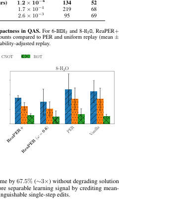 <small>Figure 4: Efficiency and performance on 12-qubit H2O. (Left) OptCRLQAS reduces wall-clock time per episode by 67.5% over CRLQAS [19]. (Right) ReaPER achieves the lowest minimum energy error and fastest convergence across all replay baselines.</small>

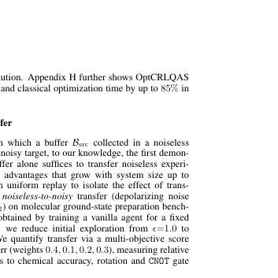 <small>Figure 5: Weighted transfer matrix for BEH2 under noiseless and noisy transfer. Buffer transfer reduces steps to chemical accuracy by 47-58% and improves final energy by up to 90.2% across all noise settings, yield- ing composite scores of 19.2-35.8%. The strongest score (35.8%) is driven by the largest energy improvement at p2=0.001.</small>

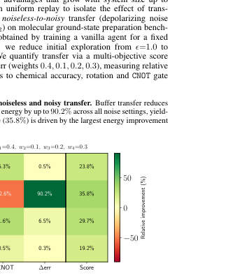 <small>Figure 6: Weighted transfer matrix for H2O under noiseless and noisy transfer. Step reductions range from 49.8% to 84.8%, and energy improvements reach 46.7% under combined noise (p1=0.001, p2=0.005), yielding the highest score of 28.7%.</small>

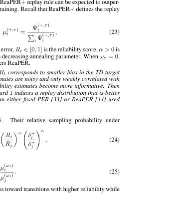 <small>Figure 8: ReaPER+ progressively concentrates buffer mass toward higher-fidelity transitions (fidelity ≥0.95) while retaining broader early-training coverage, consistent with its annealed transition from PER-like exploration to ReaPER-like reliability-aware sampling. PER maintains broader low-fidelity coverage through- out training, while ReaPER shows intermediate concentration behavior.</small>

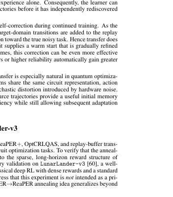 <small>Figure 9: LunarLander-v3 validation of ReaPER+. (Left) rolling success rate (300-episode window). (Middle) ReaPER+ (blue) reaches a higher success rate faster and maintains a higher asymptotic level than fixed ReaPER (red) and PER (green). (Right) normalized cumulative-return AUC. ReaPER+ accumulates +9% more return over the full training run, confirming improved sample efficiency on a dense-reward classical benchmark. All methods use identical DQN agents, only the replay mechanism differs.</small>

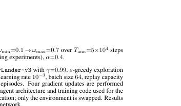 <small>Figure 9 summarizes two complementary metrics. Left: the 300-episode rolling success rate (frac- tion of episodes exceeding the +200 solved threshold). ReaPER+ reaches a higher success rate earlier in training and sustains a higher asymptotic level (≈60% at episode 4500) compared with fixed ReaPER (≈50%) and PER (≈55%). Right: the normalized area under the reward curve (AUC), computed as the per-episode running mean of the cumulative return, shifted and normalized to [0, 1]. ReaPER+ achieves a +9% AUC advantage over both baselines by episode 5000, indicating better sample efficiency throughout training.</small>

**Main problem.** Deep reinforcement learning for quantum circuit optimization suffers from inefficient sample usage, high computational costs during architecture search, and the loss of useful training data when transitioning from noiseless to noisy hardware environments.

**Main result.** The authors introduce ReaPER+, which achieves 4–32× gains in sample efficiency, and OptCRLQAS, which reduces wall-clock time by up to 67.5%, while a new buffer transfer scheme reduces steps to chemical accuracy by up to 90%.

**Method.** The paper proposes an annealed replay rule (ReaPER+) that transitions from TD-error prioritization to reliability-aware sampling, an amortized evaluation method (OptCRLQAS) for curriculum learning, and a weight-free replay-buffer transfer scheme.

**Summary.** This paper addresses the bottlenecks in using reinforcement learning to optimize quantum circuits and architectures. By engineering the replay buffer, the authors developed a method called ReaPER+ that improves how the agent learns from past experiences, making it much more efficient at finding compact, high-fidelity circuits. They also introduced a way to speed up the expensive quantum-classical evaluation loop and a technique to reuse training data from ideal simulators to jump-start learning on noisy real-world hardware. These advancements make the automated design of quantum algorithms significantly faster and more robust to noise.

Abstract

Deep reinforcement learning (RL) for quantum circuit optimization faces three fundamental bottlenecks: replay buffers that ignore the reliability of temporal-difference (TD) targets, curriculum-based architecture search that triggers a full quantum-classical evaluation at every environment step, and the routine discard of noiseless trajectories when retraining under hardware noise. We address all three by treating the replay buffer as a primary algorithmic lever for quantum optimization. We introduce ReaPER$+$, an annealed replay rule that transitions from TD error-driven prioritization early in training to reliability-aware sampling as value estimates mature, achieving $4-32\times$ gains in sample efficiency over fixed PER, ReaPER, and uniform replay while consistently discovering more compact circuits across quantum compilation and QAS benchmarks; validation on LunarLander-v3 confirms the principle is domain-agnostic. Furthermore we eliminate the quantum-classical evaluation bottleneck in curriculum RL by introducing OptCRLQAS which amortizes expensive evaluations over multiple architectural edits, cutting wall-clock time per episode by up to $67.5\%$ on a 12-qubit optimization problem without degrading solution quality. Finally we introduce a lightweight replay-buffer transfer scheme that warm-starts noisy-setting learning by reusing noiseless trajectories, without network-weight transfer or $ε$-greedy pretraining. This reduces steps to chemical accuracy by up to $85-90\%$ and final energy error by up to $90\%$ over from-scratch baselines on 6-, 8-, and 12-qubit molecular tasks. Together, these results establish that experience storage, sampling, and transfer are decisive levers for scalable, noise-robust quantum circuit optimization.

### [Deterministic generation of grid states with programmable nonlinear bosonic circuits](http://arxiv.org/abs/2604.21824v1)

**Authors:** Yanis Le Fur, Javier Lalueza-Puértolas, Carlos Sánchez Muñoz, Alberto Muñoz de las Heras, Alejandro González-Tudela  
**Type:** theory · **PDF:** <https://arxiv.org/pdf/2604.21824v1>  
**Analysis basis:** full PDF text, analyzed in chunks

Figures

 <small>FIG. 1. Symmetry-enforced state preparation for the 0-logical state. (a) Wigner representations of the initial squeezed vacuum state with r = 6 dB (i), displacement (ii), Kerr evolution (iii), and a final correction displacement ˆUD(iβcorr) (iv). Panel (v) represents the Wigner after applying three cycles of the protocol described in Algorithm 1 with initial squeezing r = 6 dB. (b) Expectation value ⟨ˆQ1⟩[dB] versus correction amplitude βcorr for a single-cycle generated state and for different values of initial squeezing r in different red shades. (c) ⟨ˆQ0⟩[dB] saturation for an increasing number of cycles of the symmetry-enforced states across different squeezing regimes (in red shades)....</small>

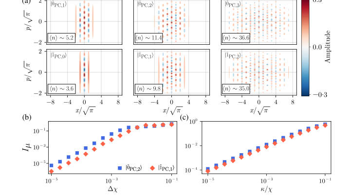 <small>FIG. 2. Wigner distributions and logical state infidelities for phased-comb states. (a) Wigner distributions of the phased-comb logical states |˜0PC,j⟩(ncycles = 1, 2, and 3 cycles, left to right) and |˜1PC,j⟩(ncycles = 0, 1, and 2 cycles, left to right) using a squeezing parameter of r = 10 dB and the protocol described in Algorithm 1, but without the correction step. (b,c) Logical state infidelity Iµ (µ ∈{0, 1}) as a function of the Kerr uncertainty ∆χmax (b) and the boson loss rate normalized to the Kerr strength κ/χ (c). The infidelity is evaluated for a 3-cycle state (µ = 0, blue squares) and a 2-cycle state (µ = 1, red rhombus) at a squeezing of r = 7.8 dB. Data points represent an...</small>

 <small>FIG. 3. Performance of QEC codes. (a) Near-optimal channel infidelity ˜Ie = 1−˜Fe as a function of the photon loss probability γ. (b) Channel infidelity versus the number of state legs at a fixed loss probability γ = 10−2. Performance is compared across four encodings: phased-comb (red rhombus), comb (blue rhombus), Gaussian-truncated GKP (red circles), and the trivial encoding {|0⟩, |1⟩} (dashed line). All codes are evaluated with the same number of legs. Parameters: (a) µ = 0 logical states generated with 3 cycles and µ = 1 logical states with 2 cycles. (b) Truncation level of the cavity NR = 500 except for the 5 cycle case where NR = 1200 to ensure convergence. (a,b) Squeezing is fixed...</small>

**Main problem.** The difficulty of deterministically generating bosonic grid states, such as GKP states, for quantum error correction without relying on probabilistic protocols or complex auxiliary systems.

**Main result.** The discovery of 'phased-comb states'—a new class of states generated by programmable nonlinear bosonic circuits that provide near-optimal error correction against boson loss and a scalable universal gate set.

**Method.** The authors use a circuit model based on squeezing, displacement, and Kerr operations to iteratively generate states and analyze their error-correction performance using near-optimal channel fidelity.

**Summary.** This paper proposes a way to deterministically create quantum error-correcting states using simple nonlinear bosonic operations like squeezing and Kerr nonlinearity. While attempting to force these circuits to create standard GKP states leads to performance saturation, the authors find that the circuits naturally produce a new class of 'phased-comb states.' These states possess an intrinsic phase structure but are just as effective at protecting quantum information from photon loss as standard GKP codes. Furthermore, the authors demonstrate that a universal set of quantum gates can be implemented for these states, providing a scalable path for bosonic quantum computing.

Abstract

Bosonic quantum error correction enables hardware-efficient protection of quantum information by encoding logical qubits in harmonic oscillators. Bosonic grid states, such as Gottesman-Kitaev-Preskill (GKP) states, are particularly promising due to their potential to correct small displacements and boson loss. However, their generation remains challenging, typically relying on probabilistic protocols or auxiliary qubit systems. Here, we propose deterministic protocols for generating bosonic grid states using programmable nonlinear bosonic circuits composed solely of squeezing, displacement, and Kerr operations. We show that aiming to enforce GKP symmetries in the output of these circuits yields states with competitive performance with respect to current realizations, but whose quality saturates with increasing circuit depth due to imperfect symmetry restoration. Instead, we find that these bosonic circuits naturally give rise to a distinct class of states, that we label as phased-comb states, which are unitarily related to standard grid states but feature an intrinsic phase structure. We demonstrate that these states define a scalable bosonic quantum error-correcting code with near-optimal performance under boson loss comparable to that of approximate GKP states. We further analyze their logical operations and show how to implement a universal gate set for them. Our results establish programmable nonlinear bosonic circuits as a viable route towards the generation of scalable bosonic quantum error-correcting states beyond standard GKP encodings.

### [Rigorous Security Proofs for Practical Quantum Key Distribution](http://arxiv.org/abs/2604.21791v1)

**Authors:** Devashish Tupkary  
**Type:** theory · **PDF:** <https://arxiv.org/pdf/2604.21791v1>  
**Analysis basis:** full PDF text, analyzed in chunks

Figures

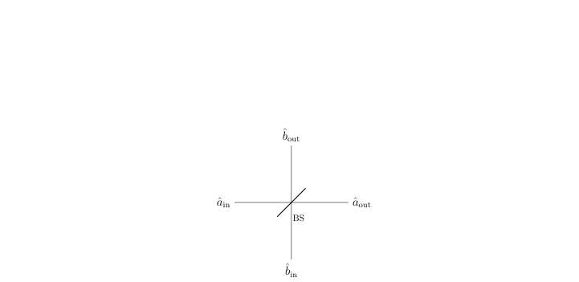 <small>Figure 2.1: Schematic of a beam splitter with two input ports (left and bottom) and two output ports (right and top).</small>

 <small>Figure 2.2: Idealized polarizing beam splitter (PBS) that routes the horizontal and vertical polarization components of the input mode into separate spatial output modes.</small>

 <small>Figure 2.3: Schematic of a threshold (on/off) detector. In the imperfect model, η denotes the overall detection efficiency and pdc the dark-count probability per detection window.</small>

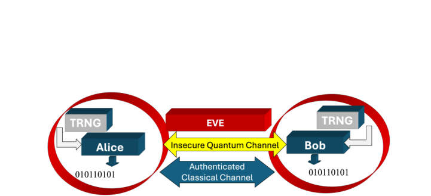 <small>Figure 3.1: Schematic of a quantum key distribution (QKD) protocol. The task is to establish a shared secret key between two distant parties, Alice and Bob. The protocol relies on trusted quantum devices operated within secure perimeters, access to local true random number generators (TRNGs), an authenticated classical channel, and an insecure quantum channel that may be fully controlled by an adversary. Figure from [52].</small>

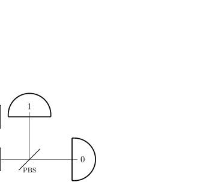 <small>Figure 3.2: Schematic of an active detection setup using threshold detectors.</small>

 <small>Figure 3.3: Schematic of the passive detection setup using theshold detectors.</small>

 <small>Figure 3.4: Schematic illustrating the use of a source map. A virtual source prepares (ξk)A′′, which is mapped to the real emitted state (σk)A′ by a source map Ψ. Then, one can “give” Eve control over the source map (meaning that she is allowed to perform any operation she wants in place of the source map). The security of the latter implies security of the former, as argued rigorously in Lemma 7.4.1.</small>

 <small>Figure 3.5: An infinite-dimensional POVM can be modelled as a squashing map Λ followed by a finite-dimensional POVM. Giving the squashing map Λ to Eve allows us to restrict our analysis to the finite-dimensional POVM.</small>

 <small>Figure 4.1: Expected key rate for fixed-length protocols eRfixed(t) for various values of t, key rate upon acceptance for fixed-length protocols Rfixed(t) plotted for various values of t, and the expected key rate for variable-length protocol plotted eRvariable, plotted for a fixed honest behaviour of the channel.</small>

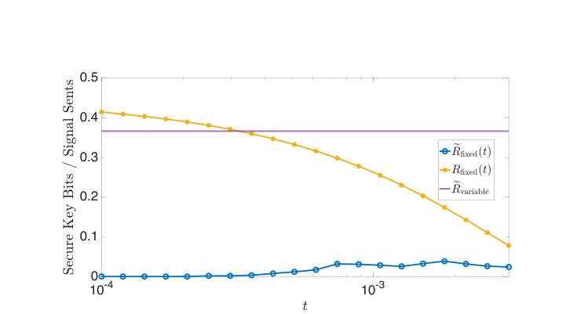 <small>Figure 4.2: Expected key rate for fixed-length protocols eRfixed(t) for various values of t, key rate upon acceptance for fixed-length protocols Rfixed(t) plotted for various values of t, and the expected key rate for variable-length protocol plotted eRvariable, for an unpredictable honest behaviour.</small>

**Main problem.** The lack of rigorous security proofs for practical Quantum Key Distribution (QKD) protocols that account for real-world imperfections like variable-length inputs, imperfect detectors, and realistic authentication models.

**Main result.** The thesis establishes robust security proofs for variable-length decoy-state BB84, resolves flaws in the postselection technique for coherent attacks, and provides a framework for security under realistic authentication and detector mismatch.

**Method.** The work utilizes modern information-theoretic tools including the Entropy Accumulation Theorem (EAT), Entropic Uncertainty Relations (EUR), and the postselection technique, alongside mathematical bounds like the Serfling and Hoeffman inequalities.

**Summary.** This thesis provides a comprehensive mathematical framework for proving the security of practical Quantum Key Distribution (QKD) systems. It addresses critical gaps between idealized theory and real-world hardware, such as imperfect detectors and the need for variable-length key processing. By refining techniques like the Entropy Accumulation Theorem and the postselection method, the author demonstrates that security can be maintained even under realistic adversarial conditions and hardware mismatches. The work serves as both a collection of new technical proofs and a unified reference for the QKD community.

Abstract

This thesis is concerned with rigorous security analyses of practical Quantum Key Distribution (QKD) protocols, using a variety of modern proof techniques. The main results are as follows. First, we establish a security proof for variable-length QKD protocols against IID collective attacks, and extend this result to coherent attacks using the postselection technique. In doing so, we resolve a long-standing flaw in the application of the postselection technique to QKD, thereby placing it on a rigorous mathematical footing. Second, we develop a method to bound phase error rates in entropic uncertainty relation-based and phase error rate-based proofs, using only the observed statistics of the protocol, even when detectors are imperfect and only approximately characterized. This removes a key assumption of identical detector behaviour and enables these techniques to be applied in realistic settings. Third, we present a very general security analysis based on the marginal-constrained entropy accumulation theorem. The resulting framework can be readily adapted to practical imperfections and side channels, and is suitable for certification efforts. Finally, we show that the security of QKD protocols under realistic authentication assumptions can be reduced to the standard idealized setting, where authentication is assumed to behave honestly, with only minor protocol modifications. A distinctive feature of this thesis is its unified presentation of several major QKD security proof frameworks using consistent protocol descriptions and notation. Consequently, this thesis is intended not only as a collection of new technical results, but also as a useful reference for understanding rigorous security analysis in quantum key distribution.

### [Partial oracles quantum algorithm framework -- Part I: Analysis of in-place operations](http://arxiv.org/abs/2604.21788v1)

**Authors:** Fintan M. Bolton  
**Type:** theory · **PDF:** <https://arxiv.org/pdf/2604.21788v1>  
**Analysis basis:** full PDF text, analyzed in chunks

Figures

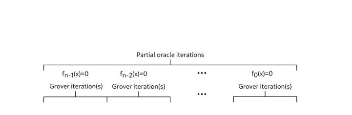 <small>FIG. 1. Overview of partial oracle iterations. At each iteration stage j, a search is executed to</small>

 <small>FIG. 2. First partial oracle iteration showing: (a) the initial equal superposition state; (b) index</small>

 <small>Figure 2 shows a visualization of the Grover-Long algorithm, implementing the first</small>

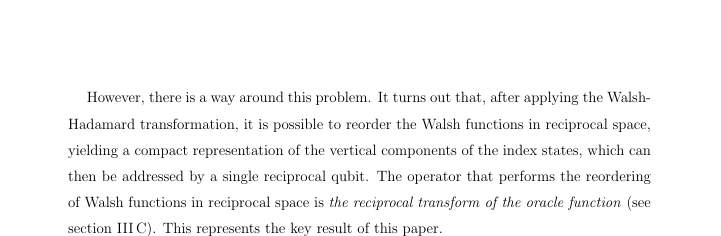 <small>Figure 3 shows a visualization of the modified Grover-Long algorithm, implementing</small>

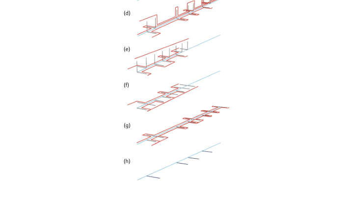 <small>FIG. 3. Second (and subsequent) partial oracle iteration: (a) index states remaining after the</small>

 <small>Figure 4 shows the corresponding circuit for the majority oracle function, which requires</small>

 <small>FIG. 6. Reciprocal majority gate</small>

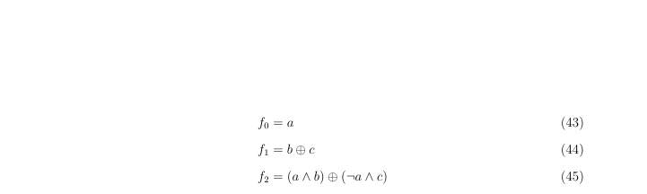 <small>Figure 7 shows the corresponding circuit for the choose function, which requires just two</small>

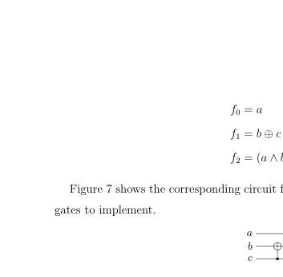 <small>FIG. 7. Circuit for the choose function Ch(a, b, c)</small>

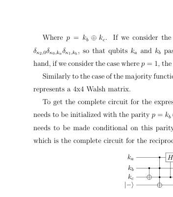 <small>FIG. 8. Reciprocal choose gate</small>

**Main problem.** The paper addresses the lack of an explicit construction for the search iteration operator within the 'partial oracles' quantum algorithm framework, which aims to potentially exceed Grover's quadratic speedup.

**Main result.** The author provides a construction for the search iteration operator for in-place operations, introduces the 'reciprocal transform' and its chain rule, and develops the QFrame Python library for automated circuit construction.

**Method.** The framework uses a multi-bit oracle approach and a reciprocal transform in Walsh-Hadamard space to progressively reduce the search space, validated through simulations of SHA-256-inspired toy models.

**Summary.** This paper introduces a new method for quantum searching using a 'partial oracles' framework that can theoretically achieve up to an exponential speedup over Grover's algorithm. By defining a 'reciprocal transform,' the author provides a way to construct quantum circuits that satisfy multiple oracle conditions sequentially or in parallel. The work demonstrates that complex cryptographic operations, such as those in SHA-256, can be decomposed into simpler steps using a new chain rule. While the current scope is limited to in-place operations (meaning no quantum advantage is yet demonstrated), the paper provides the foundational mathematical tools and a Python library (QFrame) for future implementation.

Abstract

The partial oracles framework is a quantum search algorithm that has the potential to exceed the quadratic speedup of Grover's algorithm, up to a theoretical maximum of an exponential speedup. Until now, however, the framework has lacked an explicit method for constructing the operator that represents the search iteration. In this paper, we provide the missing construction, for the special case of an oracle function definable using only in-place operations (that is, where the calculated result of the oracle function can be read just from the qubits in the search index). The restriction to in-place operations means that the current work does not yet exhibit quantum advantage: oracle functions constructed using only in-place operations are always classically reversible. To demonstrate quantum advantage, it will be necessary to extend this construction method to include out-of-place operations (part II). As part of the construction of the search iteration operator, we define a new type of transform, the reciprocal transform, which is applied to the oracle function. We show that the reciprocal transform obeys a chain rule, which makes it possible to break down complex transforms into simple steps. To illustrate the practical application of this search method, we apply the reciprocal transform to elementary operations from the SHA-256 hash algorithm: addition modulo $2^n$, the $Maj(a, b, c)$ function, the $Ch(a, b, c)$ function, and the bit shift functions. We also introduce the QFrame python library, which is used to automate the construction of quantum circuits that represent reciprocal transforms.

### [Photon Sorting with a Quantum Emitter](http://arxiv.org/abs/2604.21758v1)

**Authors:** Kasper H. Nielsen, Etienne Corminboeuf, Benedikt Tissot, Love A. Pettersson, Sven Scholz, Arne Ludwig, Leonardo Midolo, Anders S. Sørensen, Peter Lodahl, Ying Wang, Stefano Paesani  
**Type:** both · **PDF:** <https://arxiv.org/pdf/2604.21758v1>  
**Analysis basis:** full PDF text, analyzed in chunks

Figures

 <small>FIG. 1. Photon sorter building blocks. a. Sketch of the photon sorter implementation using a nonlinear photonic in- teraction between two balanced beam splitters (a nonlinear Mach-Zehnder interferometer). Ideally, individual photons will exit through the upper port, whereas the two-photon component will exit through the lower. b. Illustration of an ideal single-mode Kerr nonlinearity where a one-photon state acquires no phase shift, whereas a two-photon state re- ceives a phase shift of π. c. Illustration of the nonlinear response of a two-level system. The photon states receive ap- proximately the same phase as in the ideal Kerr case, but the interaction distorts the two-photon wavepacket...</small>

 <small>FIG. 2. Photon sorter performance characterisation. a. Probabilities of detecting the one-photon state in the upper (green) or lower (orange) output port of the photon sorter as a function of the detuning ∆between the input field and the QD, normalised to the QD linewidth Γ/2. The dashed lines correspond to a linear optical beam splitter with a reflectivity matching the one-photon statistics at ∆= 0. b. Probabilities of detecting two photons in the upper mode (orange), two photons in the lower mode (green) or one photon each in both modes (blue) as a function of the detuning ∆. An ideal photon sorter would transfer the two photons into the lower mode completely. The dashed lines correspond...</small>

 <small>FIG. 3. Photon sorter for BSMs. a. Illustration of a nonlinear BSMs using photon sorters. The first block (in orange) corresponds to a linear optical |ψ⟩-fusion. Photons from the ψ± states are incident individually on the photon sorter, so a direct measurement follows (yellow). Photons from ϕ± bunch after the first fusion block and are split away by the photon sorters. Consecutively, a reversed-|ψ⟩-fusion (pink) and a |ϕ⟩-basis fusion (green) are performed. We evaluate the performance of photon-sorter-boosted BSMs by analysing their b. success, c. error, and d. failure probabilities. Here, failures denote detected measurement patterns unassociated with any valid state, while errors...</small>

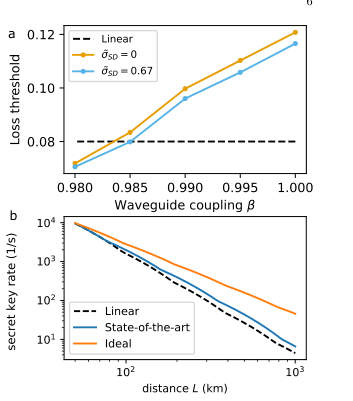 <small>FIG. 4. Advances towards applications. a. Loss thresh- old of the FBQC architecture introduced in Ref. [16], when using photon sorting to boost fusion performance, as a func- tion of β. The two curves assume no pure dephasing, with and without spectral diffusion. The black dashed line de- notes the threshold using linear optical BSMs. b. Perfor- mance of a repeater network for QKD using the DLCZ pro- tocol [4], comparing linear optical BSMs (black dashed line), and photon-sorter-boosted nonlinear BSMs. The latter in- cludes a state-of-the-art scenario achieved solely by improv- ing the β = 0.98 [39] (blue), and an ideal noiseless photon sorter [18] (orange). During initial entanglement...</small>

**Main problem.** Linear-optical Bell state measurements (BSMs) are fundamentally limited to a 50% success probability, which imposes high hardware overhead and low noise tolerance in photonic quantum computing and communication architectures.

**Main result.** The authors demonstrated a passive photon-sorting circuit using a quantum dot that achieves a 62% sorting success probability and enables BSMs with a 57% success rate, exceeding the 50% linear-optical limit.

**Method.** The researchers integrated a semiconductor quantum dot into a nanobeam waveguide within an unbalanced Mach-Zehnder interferometer to induce nonlinear photon-photon interactions via scattering. They used time-bin encoding and input-output theory to model and verify the sorting of one- and two-photon components.

**Summary.** This paper presents an experimental demonstration of a photon sorter that uses the nonlinearity of a single quantum dot to distinguish between different photon-number states. By routing one- and two-photon components into different spatial modes, the device overcomes the fundamental 50% success rate limit of standard linear-optical Bell state measurements. This advancement is significant for scaling up photonic quantum computing architectures, such as fusion-based quantum computing, and improving the efficiency of quantum repeater networks. The results show that while current performance is limited by waveguide coupling and dephasing, the system is scalable and can be optimized for higher success probabilities.

Abstract

High-quality photonic Bell state measurements (BSMs) enable scalable universal quantum computing and long distance quantum communication. However, when implemented with linear optics, BSMs are fundamentally probabilistic, introducing substantial hardware overheads and limiting noise tolerance in photonic quantum computing architectures. Nonlinear interactions at the single-photon level can overcome these limitations by enabling near-deterministic photon-photon gates. Here, we demonstrate a passive photon-sorting circuit based on the induced nonlinearity arising from photon scattering in a solid-state quantum emitter. The scattering is implemented in a directional waveguide-emitter coupling interface and embedded on-chip into a linear optical circuit, through which we demonstrate sorting of one- and two-photon components with a success probability of 62%. We find that the current system can enable BSMs with a 57% post-selected success probability without ancillary photons, exceeding the linear-optical limit of 50%, and can be readily improved to >65% with design optimisations.

### [Entanglement of two optical emitters mediated by a terahertz channel](http://arxiv.org/abs/2604.21723v1)

**Authors:** Yanis Le Fur, Diego Martín-Cano, Carlos Sánchez Muñoz  
**Type:** theory · **PDF:** <https://arxiv.org/pdf/2604.21723v1>  
**Analysis basis:** full PDF text, analyzed in chunks

Figures

 <small>FIG. 1. Physical system and energy-level landscape. (a) Schematic of the entanglement generation setup, consisting of two quantum emitters driven by carrier (blue) and sideband (green) optical fields, which are coupled to a shared THz channel (here represented by a ring waveguide or cavity). (b) Energy levels of an atom coupled to a carrier-laser. (Left) Bare system basis showing optical transitions in the laboratory frame; (Right) Dressed-state basis highlighting the emerging THz transitions within a Rabi doublet (red). (c) Energy levels of a dressed-atom coupled to a sideband laser: Dressed states split by THz frequencies couple to laser photons (left) developing a secondary dressed...</small>

 <small>FIG. 2. Optimizing entanglement via optical measurements (a) Emission spectrum in the visible regime for each individual emitter, centered at the laser frequency ωL for the case of both optimal and sub-optimal spectral alignments. (Top) Spectra in the absence of sideband drives (Ωsb = 0) obtained in Step 1, resulting in Mollow triplets with THz sideband splittings. (Middle) Zoom of the higher-energy Mollow sideband peaks, aligned symmetrically about ωsb at the end of Step 2. (Bottom) Formation of secondary Mollow spectra upon activation of the sideband drive Ωsb, which should be spectrally overlapping at the end of Step 3. (b) Concurrence C (blue, solid) and Liouvillian gap λ—computed...</small>

 <small>FIG. 3. Maximal stationary concurrence C versus cavity loss rate κ and emitter-cavity coupling χ, found by optimizing the doubly dressed angle ˜θ and the doubly dressed frequency ˜ΩR at every (κ, χ) pair (the rest of parameters are fixed by Conditions 0-2). Calculations were performed using the GRWA framework Eq. (4) and (5) and subsequently veri- fied against the full model from (1). The dash-dotted lines represent the different condition we have imposed for our analytical findings: the adiabatic elimination of the cavity κ ≥2c1s1χ (blue) and the RWA on the dissipation of the cavity ωTHz ≥10κ (red). Panels correspond to cavity fre- quencies of (a) ωTHz/2π = 0.5 THz, (b) ωTHz/2π = 1.0 THz...</small>

 <small>FIG. 4. Quantum State tomography (QST) and re- construction Fidelity. (a) Schematic of the QST acquisi- tion protocol for two emitters radiating in the visible regime, based on joint photodetection (b) Reconstructed matrix for the maximally-entangled Bell state |Φ−⟩= |ge⟩−|eg⟩ √</small>

**Main problem.** The lack of efficient coherent interfaces and the difficulty of direct control/detection in the terahertz (THz) spectrum hinder the development of THz-based quantum networks.

**Main result.** The authors propose a hybrid visible-THz quantum interface that generates steady-state entanglement (concurrence $C > 0.9$) between two polar emitters using only optical control and detection.

**Method.** The study uses a driven-dissipative strategy within a Generalized Rotating Wave Approximation (GRWA) framework, employing a sideband optical drive to stabilize a THz-mediated 'dark state'.

**Summary.** This paper presents a theoretical framework for a hybrid quantum interface where a terahertz channel mediates entanglement between two optical emitters. By using strong visible-light driving, the researchers create energy levels that can be tuned into the THz regime, allowing for the generation of highly entangled steady states. Crucially, the protocol enables all manipulation and quantum state tomography to be performed via optical means, bypassing the need for direct THz control. This approach provides a scalable pathway for developing THz-based quantum technologies and networks.

Abstract

Quantum technologies in the terahertz (THz) require a coherent interface between addressable qubits and THz quantum channels -- a capacity that so far, remains largely underdeveloped. Here, we propose and demonstrate the generation of steady-state entanglement between polar quantum emitters, mediated by THz photons. We exploit strong visible-light driving of the emitters to create Rabi-split dressed eigenstates whose energy separation can be optically tuned into the THz regime. The polar nature of the emitters activates THz transitions within these eigenstates, allowing them to couple to a THz photonic mode that induces collective dissipative dynamics. A coherent driving and control of these effective THz emitters is achieved by using a sideband optical drive with detuning close to the THz transition frequency. The resulting interplay of collective dissipation and driving activates a mechanism to generate steady-state entanglement with high values of the concurrence ($C>0.9$), attainable under experimentally feasible parameters. Crucially, both coherent manipulation and quantum state tomography are implemented entirely through optical means, avoiding direct THz control and detection. This establishes a hybrid visible-THz quantum interface in which a THz channel mediates qubit-qubit entanglement (a key operational requirement for THz quantum technologies) while remaining optically accessible.

### [Near-Term Reduction in Nonlocal Gate Count from Distributed Logical Qubits](http://arxiv.org/abs/2604.21722v1)

**Authors:** Bruno Avritzer, Nathan Sankary  
**Type:** theory · **PDF:** <https://arxiv.org/pdf/2604.21722v1>  
**Analysis basis:** full PDF text, analyzed in chunks

Figures

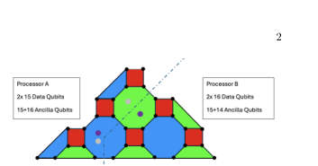 <small>Figure 2: The cut which allows an equal partition of the d = 7 4.8.8 color code. In this case, there are two 4.8.8 blocks, each with its own set of stabilizer ancillas, and each split 50-50 across two processors. As indicated by the grey and purple dots, in one of the two logical qubits, one ancilla for one of the green octagon checks is allocated to processor B. Since this stabilizer is split 4 to 4, this does not increase the amount of PNL gates, but allows strict adherence to the qubit requirements. The total number of PNL gates is thus 4*7=28, less than the 31 required if the codes are PL.</small>

 <small>Figure 1: Distributed logical qubits require PNL stabilizer measurements as opposed to PNL transversal gate implementations (top). In this work, these PNL gates are mainly implemented by gate teleportation (bottom, |ψ⟩as the control and |ϕ⟩as the target).</small>

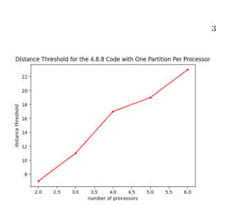 <small>Figure 4: With distribution of a logical qubit block over multiple processors, larger distances (and therefore reductions in PNL CNOTs) may be required to realize advantage if error correction is performed after each logical CNOT. Assuming the logical qubit is cut once per processor resulting in one partition per processor (2 processors require 1 cut resulting in 2 partitions), so that all two-qubit gates are processor-local, the minimum distance threshold required for an overall PNL reduction scales roughly linearly in the number of processors.</small>

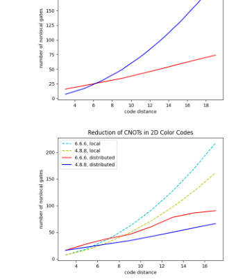 <small>Figure 3: In the two processor (two logical qubit) case (top), in the 4.8.8 family distributed codes see advantage at and above d = 7, and the overall trend is in agreement with the scaling behavior previously cited. By contrast, the 6.6.6 family of codes sees advantage only at d = 9 due to the structure of the stabilizers making near-equal bipartitions costly in terms of cut stabilizer weight (bottom).</small>

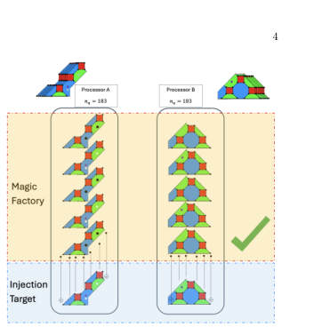 <small>Figure 6: In the fully distributed case, split distillation qubits are allocated on the same processors as split computational qubits. This reduces the per-processor qubit requirements for magic factories while keeping distillation and injection operations PL no matter which qubit is postselected. The total number of PNL gates is O(d), resulting from the syndrome extractions within the individual codes.</small>

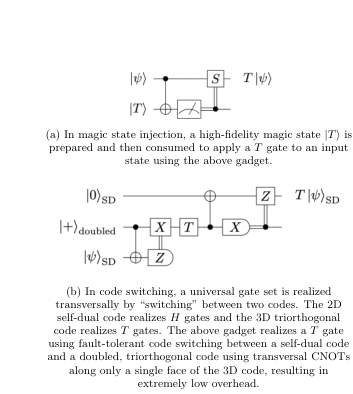 <small>Figure 5: Two methods of realizing universality in fault-tolerant systems: magic state injection (a) and code switching (b, adapted from[17]). Although these methods differ in their circuit realizations, in both cases there are regimes where they benefit and suffer from distributed execution across processors.</small>

 <small>Figure 7: Comparison of overhead between (a) fully distributed, (b) fully local, and (c) partially local magic factories. The fully distributed factory performs best for small circuits, whereas for large circuits, it has a slightly higher total qubit overhead, but the size of each individual processor can be smaller than that of the magic factory in (b) and a lower number of PNL gates is required compared to (b), although this is network topology-dependent. Approach (c) performs worse in terms of PNL gates, but may have some advantages in meeting network topology constraints.</small>

 <small>Figure 8: When 3D and 2D codes are both split across processors, code switching may be performed processor-locally. With sufficient connectivity, this can reduce qubit overhead compared to single processors with both codes by allowing multiple logical qubits to interact with the tetrahedral code processor-locally.</small>

 <small>Figure 9: Comparison of local vs distributed code switching costs for two different forms of stabilizer measurement.</small>

 <small>Figure 10: By swapping (data to data) or teleporting (data to ancilla) the qubits from the split code into local structures, non-Clifford resources can be acquired with significantly fewer PNL gates, assuming there is a long chain of switching or distillation required due to circuit gate structure. This can then be undone or partially undone to execute chains of CNOTs, which can then become local as well.</small>

**Main problem.** How to minimize the number of costly processor-nonlocal (PNL) operations in distributed quantum computing architectures where logical qubits are partitioned across multiple modules.

**Main result.** The authors demonstrate a ~10% reduction in PNL gates using distributed color codes and show that this advantage scales with code distance, potentially reaching much higher reductions in multi-qubit/multi-processor settings.

**Method.** The study utilizes a constraint programming (CP-SAT) approach for qubit allocation, evaluates various universality methods like magic state injection and code switching, and applies graph partitioning algorithms for circuit optimization.

**Summary.** This paper addresses the challenge of scaling quantum computers using modular architectures, where connecting different processors is much harder than performing operations within a single processor. The authors propose techniques to distribute logical qubits across these modules in a way that minimizes the number of gates that must cross the inter-processor boundaries. By using specific families of color codes and optimized allocation strategies, they show that the overhead of non-local operations can be significantly reduced. This work is important for designing the architecture of future large-scale, fault-tolerant quantum computers.

Abstract

Modular quantum computing architectures require error correction schemes that remain effective in the presence of noisy inter-processor operations. As such, minimizing the number of such operations on logical circuits partitioned across quantum processors is a primary objective of distributed quantum computing. In this work, we develop basic techniques for qubit allocation using an exemplar color code family and explore generalizations to other color codes. In particular, we show that a 10% reduction in processor-nonlocal gates is achievable in a setting where syndrome extraction occurs after every logical gate, as in today's devices, and that this scales to significantly greater advantages in the multi-qubit case. We also explore methods of achieving universal gate sets efficiently in this distributed logical setting and evaluate the trade-offs of multiple approaches such as magic state distillation, code switching, and a new method based on logical swaps. Finally, we discuss some considerations for an allocation algorithm for these architectures to perform scalably and connect it to existing work on quantum circuit partitions.

### [Lagrange: Operating Italy's First Publicly-Accessible Quantum Computer for Research and Education](http://arxiv.org/abs/2604.21695v1)

**Authors:** Paolo Viviani, Fabrizio Bertone, Giacomo Vitali, Emanuele Dri, Federico Stirano, Giuseppe Caragnano, Francesco Lubrano, Antonino Nespola, Olivier Terzo, Matteo Cocuzza, Bartolomeo Montrucchio, Giovanna Turvani, Gianluca Bertaina, Marco Coisson, Davide Calonico, Fabrizio Pirri, Pietro Asinari  
**Type:** experiment · **PDF:** <https://arxiv.org/pdf/2604.21695v1>  
**Analysis basis:** full PDF text, analyzed in chunks

Figures

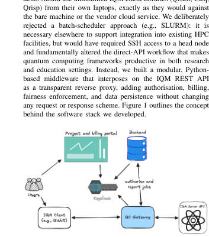 <small>Fig. 1. Conceptual architecture of the Lagrange software stack. The QC Gate- way transparently authorises job submissions based on budget, reservations, and fair access rate limits. A web portal gives the user visibility to these criteria.</small>

 <small>Fig. 2. Sequence diagram of the job submission and completion flow.</small>

**Main problem.** The challenge of managing a shared, on-premises superconducting quantum computer across multiple institutions with diverse needs for billing, authentication, and resource fairness.

**Main result.** The successful implementation and nine-month operation of 'Lagrange,' a modular middleware stack that enables secure, multi-tenant, and publicly accessible access to the IQM Spark quantum computer.

**Method.** The authors developed a Python-based transparent reverse proxy using a plugin architecture to intercept API calls, enforcing project-based budgets and user fairness without requiring changes to standard quantum software like Qiskit or Cirq.

**Summary.** This paper describes the deployment of the 'Lagrange' software management stack for Italy's first publicly accessible quantum computer. The system allows multiple institutions to share an on-premises IQM Spark superconducting processor by managing user authentication, project budgets, and hardware reservations. It successfully processed over 240,000 jobs with 98% uptime, even supporting unique use cases like quantum computing during university examinations. The work provides a reusable blueprint for managing quantum hardware as a shared, multi-tenant infrastructure.

Abstract

We describe the design, implementation, and nine-month operational experience of the software management stack for Lagrange, an IQM Spark five-qubit superconducting quantum computer jointly acquired by LINKS Foundation, Politecnico di Torino and the Italian National Institute of Metrological Research (INRiM), and managed by LINKS. Lagrange is, to our knowledge, the first quantum computer in Italy that is fully operational and accessible to students and researchers from multiple institutions under formal service agreements, and to the general public under commercial agreements. When installed in mid-2025, the IQM Spark hardware was delivered by the vendor with authentication only: no billing, project management or fair usage enforcement were provided. We developed a modular middleware layer that filled that gap without modifying any vendor client software, by intercepting API calls through a proxy that enforces project-based budgets, reservation-aware authorisation, and per-user fairness policies. The middleware adopts a plugin architecture that cleanly separates vendor-specific logic from site-specific policies, enabling reuse across different quantum hardware backends and deployment contexts. Since entering production in September 2025, the system has processed over 240,000 quantum jobs totalling more than 1 week of QPU execution time, with greater than 98% uptime. Notably, students at Politecnico di Torino regularly use the machine during both lectures and formal examinations -- a practice we believe to be unique in Europe. We report on the system architecture, the operational lessons learned, and the infrastructure choices that made this deployment possible.

### [Bipartite entanglement under frequency comb pumping in parametric Josephson circuits](http://arxiv.org/abs/2604.21692v1)

**Authors:** Mikael Vartiainen, Ilari Lilja, Ekaterina Mukhanova, Kirill Petrovnin, Gheorghe Sorin Paraoanu, Pertti Hakonen  
**Type:** both · **PDF:** <https://arxiv.org/pdf/2604.21692v1>  
**Analysis basis:** full PDF text, analyzed in chunks

Figures

 <small>FIG. 1. Schematic of the experimental microwave setup working around 5.8 GHz frequency. The experiment is controlled by a GHz frequency lock-in signal analyzer, which also generates the required parametric pumps. The employed components are denoted in the frame on the right. The detection is performed using digital heterodyning [51]. For details of the operation, see text.</small>

 <small>FIG. 2. Illustration of the mode-coupling sequence beyond the two-mode squeezed modes in the case of two parametric pumps. The dotted lines represent two-mode squeezing. We call these the first-order correlations between modes. However, because A and B are squeezed by P1, and B and C are squeezed by P2, there will be a beam-splitter correlation between A and C. Since these correlations grow proportionally to the product of two pump amplitudes, they are called second-order correlations between modes. These correlations are contained within the model and can be seen by expanding the unitary evolution operator generated by the Hamiltonian. In this figure, only first- order correlations are...</small>

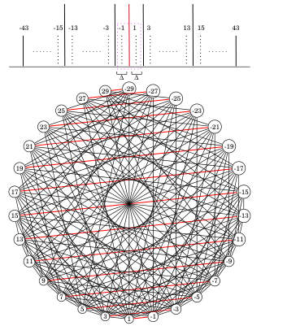 <small>FIG. 3. Mode frequencies marked by ±(2m +1), for m = 0,...,21 and a 30-mode subgraph (contains modes denoted by dashed lines) constructed for a system with 15 symmetrically placed pumps. We are investigating the bipartite entanglement of the pair (-1, 1), inside the dashed square. Each edge represents a TMS term in the Hamiltonian. The weight for each edge is specified by the corresponding classical pump amplitude. Edges generated by P0 are indicated by red. We can see that the center pair (-1, 1) has 15 neighbors while the furthest pairs ±27,±29 have only 8 neighbors. This shows that as we traverse the graph further away from the center pair (-1, 1), each new added mode will not entangle...</small>

 <small>FIG. 5. Logarithmic negativity (a) and purity (b) of a 1, ..., 15 pump systems. We compare the theoretical predictions for symmetric (solid line, red, green, magenta) and asymmetric (dashed line, blue, yellow, cyan) systems with different parameter values. First, we have put all phases of the pumps equal to 0 and added no noise. Second, we have chosen all phases of the pumps randomly (random φk in the inset pump amplitude) and added no noise. Third, we have chosen all phases randomly and put a constant amount of noise θ = π</small>

 <small>FIG. 4. Building up the asymmetric pump configuration: The basic TMS entanglement sequence is produced by pumps P0 and P2, with their half frequencies denoted by red (P0) and blue (P2) lines. The third pump is placed so that the distance ∆2 to P0 is different from ∆1 between P0 and P2. The dashed lines illustrate the sequence of P-2 added frequencies "Mi" with M referring to the mode frequencies established by pumps P0 and P2: extra mode frequency Mi is entangled with mode M. Below is the graphical description of a system with asymmetric pumps. Red edges represent TMS by P0, blue edges represent TMS by pump P2 and black edges represent TMS by subsequent asymmetric pumps.</small>

 <small>FIG. 9. Purity (scale given by the color bar) obtained from a) theory and b) experiment of symmetrically pumped system with first pump fixed at α1 = 0.44κ (αE = 0.15κ). In all configurations, all pumps 2,...,11 have the same pump amplitude that is grows from 0 to 0.44κ (αE = 0...0.15κ). Phases of the pumps were chosen at random. Due to low purity in the experiment, we apply the quantum limited ( ¯n = 1) attenuator channel with θ = 2π/7. The overlaid black curve in (a) is the purity of a system where each pump configuration has the same total power.</small>

 <small>FIG. 7. Logarithmic negativity (a) and purity (b) of a 2 pump system where the first pump is fixed at α1 = 1.15κ (αE = 0.28κ) and the second pump grows from 0 to 1.81κ (αE = 0...0.44κ). Phases of the pumps were chosen at random. One can notice that in the case with no noise, even when the second pump is at 0, experimental results show very low purity. To account for this, the quantum limited ( ¯n = 1) attenuator channel with θ = 2π/7 was applied.</small>

**Main problem.** The study investigates how increasing the number of parametric pump tones in a frequency comb affects bipartite entanglement and purity in a Josephson parametric amplifier.

**Main result.** The researchers found that adding more pumps redistributes entanglement across a larger network of modes, which significantly reduces the bipartite entanglement between specific mode pairs and decreases state purity.

**Method.** The authors combined experimental measurements using a SNAIL-based Josephson parametric amplifier (JPA) with a theoretical Gaussian conditional-dynamics model using the Riccati equation and covariance matrix formalism.

**Summary.** This paper explores the dynamics of entanglement in superconducting circuits when driven by multiple pump frequencies (frequency combs). While such multi-mode networks are essential for creating large-scale continuous-variable cluster states for quantum computing, the study shows that adding more pumps leads to a redistribution of correlations that diminishes the entanglement between individual mode pairs. The authors demonstrate this both experimentally in a JPA and theoretically, highlighting the trade-offs involved in scaling up quantum networks in the microwave domain.

Abstract

The creation of high-quality cluster states in superconducting microwave circuits is a relevant ingredient in continuous-variable quantum computing. Although large-scale cluster states have been established in optical systems, dissipation prevents their direct applicability to the microwave realm. Recent improvements in superconducting parametric circuits, in particular Josephson parametric amplifiers (JPA) and traveling wave parametric amplifiers (TWPA), have permitted substantial progress in producing entangled states using microwave photons. In this paper, we examine experimentally and theoretically the effects of numerous parametric pump tones on the degree of two-mode squeezing in a quantum circuit and apply it to the JPA. We find that additional pumps diminish the initial two-mode correlations achieved with a single pump by redistributing it among a larger network of modes and by introducing entanglement with additional idler frequencies. Taking into account the actual heterodyne measurement conditions, the experimental results are consistent with theoretical expectations.

### [Speed-oriented quantum circuit backend](http://arxiv.org/abs/2604.21656v1)

**Authors:** Sören Wilkening  
**Type:** theory · **PDF:** <https://arxiv.org/pdf/2604.21656v1>  
**Analysis basis:** full PDF text, analyzed in chunks

Figures

 <small>Figure 2: Visualization of the gates array within the circuit_t data structure for a 5-qubit QFT without swaps. The gate indices represent their target/control qubits.</small>

 <small>Figure 3: Visualization of gate_index (left) and last_layer_of_qubit (top and bottom right) within the circuit_t data structure for a 5-qubit QFT without swaps. The table on the bottom right shows how the data structure is adjusted after applying an additional Hadamard gate to qubit 4, eliminating the previously applied gate. The thick boxes indicate the current head of the list for the respective qubit. Whenever a gate is to be applied to specific qubits, its potential layer position is read from this array.</small>

 <small>Figure 4: Comparison of running times for building the QFT circuit across state-of-the-art software packages. For all instance sizes, our quantum circuit backend generates the QFT circuit faster than any other available package. Furthermore, the improved variant approaches the theoretical limit of generating and storing quantum circuits, suggesting that no significantly faster single- threaded implementation can be achieved.</small>

 <small>Figure 5: Comparison of memory requirements for building the QFT circuit across state-of-the-art software packages. Compared to all packages except Ket, our new circuit backend requires less memory. For large instances, Ket achieves a slight advantage; however, we expect this advantage to diminish for larger circuits, as our algorithm approaches the theoretical minimum of the data required for storage. Both variants of our implementation require the same memory, as they use the same underlying data structure.</small>

**Main problem.** Classical preprocessing, specifically quantum circuit generation (QCG), has become a computational bottleneck that can diminish the potential quantum advantage in large-scale algorithms.

**Main result.** The authors developed a C-based software package (QCB) that generates large-scale circuits (up to 2000 qubits) significantly faster and with much lower memory usage than established frameworks like Qiskit, Q#, and TKET.

**Method.** The backend uses a lightweight C implementation with a layered 2D array data structure, $O(1)$ lookup tables for gate insertion, and optimized instruction lists for high-level primitives.

**Summary.** This paper introduces a new, high-performance software backend designed for rapid quantum circuit generation. By using a low-level C implementation and optimized data structures, the tool can generate complex circuits like the Quantum Fourier Transform (QFT) orders of magnitude faster than current industry standards. This speed is crucial for hybrid quantum-classical algorithms, such as combinatorial optimization, where minimizing classical overhead is essential to maintaining a quantum advantage. The backend also provides efficient primitives for bit- and integer-level quantum operations.

Abstract

We present a new software package for efficient quantum circuit generation, designed to achieve optimal runtime performance. Despite being in an early stage of development, our implementation demonstrates significant advantages over existing tools. Using the quantum Fourier transform (QFT) as a benchmark, we show that our backend can generate circuits for systems with up to 2000 qubits faster than widely used frameworks such as Qiskit and Q#. This improvement is particularly relevant for applications where classical preprocessing time, including circuit generation, must be minimized to not diminish any potential quantum advantage - for example, in combinatorial optimization tasks. Additionally, our software provides high-level primitives for bit- and integer-level manipulations, offering a simplified interface for integration with high-level quantum programming languages.

### [Composite quantum gates simultaneously compensated for multiple errors](http://arxiv.org/abs/2604.21594v1)

**Authors:** Hristo Tochev, Nikolay Vitanov  
**Type:** theory · **PDF:** <https://arxiv.org/pdf/2604.21594v1>  
**Analysis basis:** full PDF text, analyzed in chunks

Figures

 <small>FIG. 1. (Color online) Infidelity of X gate versus the detuning error δ and the Rabi frequency error ϵ for (a) single π pulse, (b) CORPSE, (c) B3r pulse, (d) B3d pulse. The contours depict infidelity of 10−4 (innermost) to 10−1 (outermost).</small>

 <small>FIG. 2. (Color online) Infidelity of X gate versus the detuning error δ and the Rabi frequency error ϵ for (a) B5 pulse, (b) BB1 pulse, (c) U5a pulse, (d) U5b pulse. The contours depict infidelity of 10−4 (innermost) to 10−1 (outermost).</small>

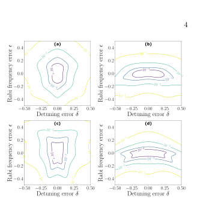 <small>FIG. 3. (Color online) Infidelity of X gate versus the detuning error δ and the Rabi frequency error ϵ for seven pulses: (a) U7a, (b) U7b, (c) X7a, (d) X7b sequences. The contours depict infidelity of 10−4 (innermost) to 10−1 (outermost).</small>

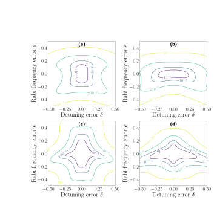 <small>FIG. 4. (Color online) Infidelity of X gate versus the detuning error δ and the Rabi frequency error ϵ for nine pulses: (a) U9a, (b) U9b, (c) X9a, (d) X9b sequences. The contours depict infidelity of 10−4 (innermost) to 10−1 (outermost).</small>

 <small>FIG. 5. (Color online) Infidelity of X gate versus the detuning error δ and the Rabi frequency error ϵ for eleven pulses: (a) U11a, (b) U11b, (c) X11a, (d) X11b sequences. The contours depict infidelity of 10−4 (innermost) to 10−1 (outermost).</small>

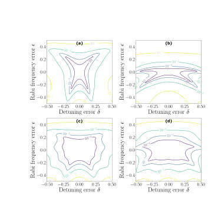 <small>FIG. 6. (Color online) Infidelity of X gate versus the detuning error δ and the Rabi frequency error ϵ for thirteen pulses: (a) U13a, (b) U13b, (c) X13a, (d) X13b sequences. The contours depict infidelity of 10−4 (innermost) to 10−1 (outermost).</small>

 <small>FIG. 7. Infidelity of X gate versus the detuning error δ and the Rabi frequency error ϵ for non-symmetric CP optimized through Eq. (8). (a) X5c, (b) X7c, (c) X9c, (d) X11c. The pa- rameters of the pulses can be found in Table I. The contours depict infidelity of 10−4 (innermost) to 10−1 (outermost).</small>

 <small>FIG. 8. (Color online) Infidelity of Hadamard gate versus the detuning error δ and the Rabi frequency error ϵ for CP op- timized through Eq. (8). (a) H3 with length 3, (b) H4 with length 4, (c) H5 with length 5, (d) H6 with length 6. The pa- rameters of the pulses can be found in Table II. The contours depict infidelity of 10−4 (innermost) to 10−1 (outermost).</small>

 <small>FIG. 9. (Color online) Infidelity of Hadamard gate versus the detuning error δ and the Rabi frequency error ϵ for CP op- timized through Eq. (8). (a) H7, (b) H8, (c) H10, (d) H15. The parameters of the pulses can be found in Table II. The contours depict infidelity of 10−4 (innermost) to 10−1 (outer- most).</small>

**Main problem.** Single-qubit gates are highly susceptible to systematic control errors, specifically simultaneous fluctuations in Rabi frequency (amplitude), detuning (frequency), and pulse duration.

**Main result.** The authors derived new composite pulse sequences for X and Hadamard gates that provide 'triple compensation' for amplitude, detuning, and duration errors, including closed-form five-pulse solutions and optimized longer sequences.

**Method.** The study employs two strategies: a derivative-based cancellation method using Cayley-Klein parametrization to nullify first-order error terms in the full SU(2) propagator, and direct numerical minimization of average gate infidelity over error ranges.

**Summary.** This paper addresses the challenge of maintaining high-fidelity quantum gates in the presence of multiple simultaneous experimental errors. The researchers developed new composite pulse sequences that protect the entire quantum propagator, rather than just the transition probability, against amplitude and frequency fluctuations. They provide both analytical solutions for short sequences and numerically optimized longer sequences that broaden the robustness window. This work is significant for improving the reliability of single-qubit operations in quantum computing architectures subject to systematic control noise.

Abstract

Systematic control errors remain a primary obstacle to realizing high-fidelity single-qubit gates. We introduce composite pulse sequences that implement X and Hadamard gates while simultaneously compensating amplitude (Rabi-frequency), detuning (frequency), and duration errors. Our construction uses two complementary strategies: (i) derivative-based cancellation of error terms in the full unitary (not just the transition probability), formulated via the Cayley-Klein parametrization, and (ii) direct minimization of the average gate infidelity over prescribed error ranges. We derive symmetric five-pulse solutions with closed-form phases that cancel all first-order terms (including the mixed derivative), and numerically optimize longer sequences -- up to 15 pulses -- to achieve higher-order suppression. We also show that standard ``universal'' five-pulse sequences (U5a/U5b) emerge as simple phase-shifted instances of our symmetric solutions, yielding broad robustness to both detuning and amplitude errors. Finally, we construct variable-area sequences for $R_x(π/2)$, which, up to virtual Z rotations, benchmark the Hadamard gate. Across all families we observe the expected trade-off between sequence length and robustness window, with substantial boosts in fidelity over large error domains.

### [Pulse Shaping for Superconducting Qubits](http://arxiv.org/abs/2604.21565v1)

**Authors:** Animesh Patra, Ankur Raina  
**Type:** both · **PDF:** <https://arxiv.org/pdf/2604.21565v1>  
**Analysis basis:** full PDF text, analyzed in chunks

Figures

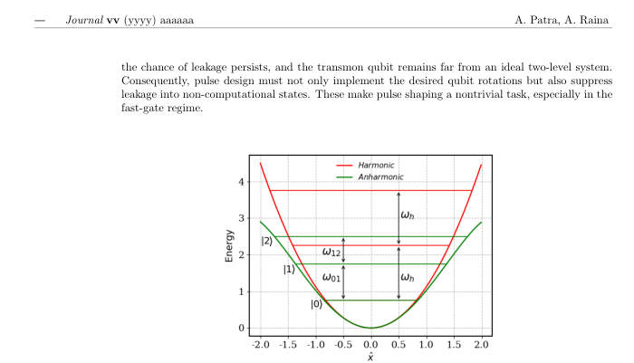 <small>Figure 1: The potential energy profile and eigenenergies for the harmonic oscillator (solid red) and the anharmonic oscillator (solid green) in ℏ= 1 units. The energy separation (equivalently, the transition frequency ωh) between the eigenstates of the harmonic oscillator is equal. For the aim of building a transmon qubit, an anharmonic oscillator is considered. Each energy separation (equivalently, the transition frequencies ω01, ω12 and so on) is different. Differing energy separation allows to form a computational subspace from |0⟩and |1⟩. While the rest of the states, like the |2⟩state, form the leakage subspace.</small>

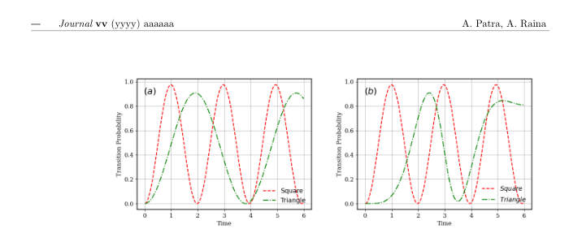 <small>Figure 2: (a)The transition probability of the square and the triangular pulse from Magnus expansion truncated at second order for δ = 0.5, A0 = π. (b) Numerical simulation of exact dynamics shown by RWA Hamiltonian of Eq.5 for square and triangular pulse at δ = 0.5, A0 = π. The simulation is carried out using QuTiP in Python.</small>

 <small>Figure 3: (a) The square pulse (green line) and the Gaussian pulse (red line). The square pulse is analytically easier to study however, (b) it’s baseband frequency spectrum has wider sidelobes than the Gaussian pulse.</small>

 <small>Figure 4: (a) The solid-green, dashed-red, and dash-dotted blue lines are all Gaussian pulses with decreasing pulse duration. (b) Shorter pulses have a wider frequency spread. Broader frequency support increases the chances of overlap with the unwanted transition frequency.</small>

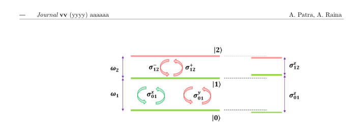 <small>Figure 5: A schematic of the three-level model. The first two levels form the computational subspace with a transition frequency of ω1. The σx 01 and σy 01 promote transition inside the computational subspace. However, the σy 01 contribution is the unwanted term arising in the first-order Magnus expansion. The DRAG protocol helps eliminate this and the coupling to the leakage state (arrows shown in red). AC Stark effect contributions emerge at the second order in the expansion (σz 01 and σz 12 terms).</small>

 <small>Figure 6: (a)A schematic illustrating the in-phase I(t) and the quadrature Q(t) component for a standard gaussion DRAG pulse. (b) Numerical simulation of exact dynamics shown by RWA Hamiltonian of Eq.21 for Gaussian and Gaussian DRAG pulse for anharmonicity ∆= −450 MHz, peak pulse amplitude A0 = 200 MHz/2π, pulse width (standard deviation) σ = 6.5 and coupling between |0⟩−|1⟩states as λ = √</small>

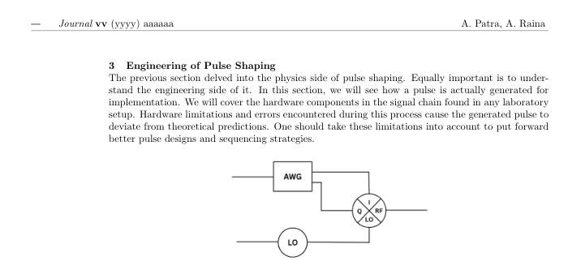 <small>Figure 7: Schematic of the hardware essential for pulse generation. The in-phase (I) and quadrature signals (Q) from the arbitrary waveform generator (AWG) combine with the sinusoid from the local oscillator (LO) in the IQ mixer.</small>

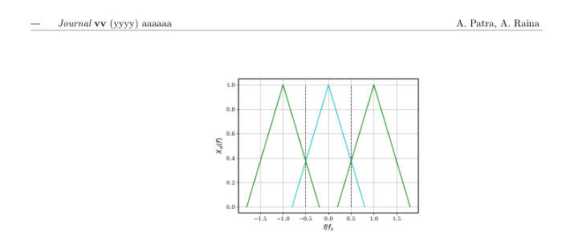 <small>Figure 8: Overlap of the discrete Fourier transform Xd(f) images due to improper sampling (fs ≤ 2f).</small>

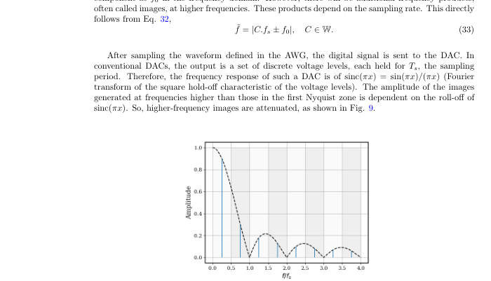 <small>Figure 9: Even though aliasing can be used to generate RF signals, the amplitude shows a sinc(πx) roll-off. The alternating shades of grey denote the different higher Nyquist zones.</small>

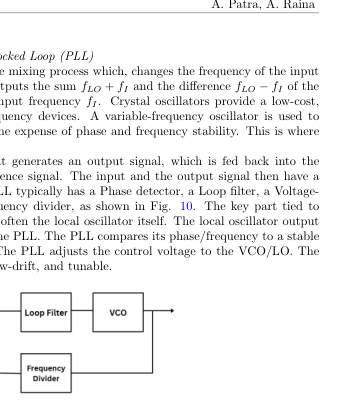 <small>Figure 10: Schematic of a basic phase-locked loop configuration.</small>

**Main problem.** Achieving high-fidelity control of superconducting transmon qubits by mitigating errors such as leakage to higher energy states, hardware-induced pulse distortion, and unwanted two-qubit interactions.

**Main result.** The paper provides a unified framework for pulse-shaping techniques, demonstrating that DRAG protocols and active cancellation can suppress leakage and error terms in both single-qubit and two-qubit (Cross-Resonance) gates.

**Method.** The authors use the Magnus expansion and Rotating Wave Approximation (RWA) to analytically derive error terms, supplemented by QuTiP numerical simulations and a discussion of hardware-level signal chain components.

**Summary.** This paper serves as a pedagogical guide for researchers working with superconducting qubits, specifically focusing on the transmon architecture. It explains how pulse-shaping techniques like DRAG can be used to prevent transitions to non-computational states caused by the finite bandwidth of control pulses. The work also bridges the gap between abstract gate theory and physical hardware, addressing real-world issues like IQ mixer imbalances and signal distortion. Finally, it extends these control principles to two-qubit Cross-Resonance gates, offering strategies to mitigate crosstalk and unwanted interactions.

Abstract

High-fidelity control of superconducting qubits requires carefully shaped microwave pulses that account for multiple error channels. In this work, we present a pedagogical introduction to pulse-shaping techniques for transmon qubits, aiming to provide a unified, accessible framework that integrates physical intuition for pulse design, analytical understanding of gate-level descriptions, and practical considerations of hardware. This article further aims to serve as a guide for students and early researchers entering superconducting quantum computing. We begin by examining simple pulse envelopes and their spectral properties, highlighting how finite bandwidth leads to leakage outside the computational subspace. These observations motivate the introduction of the derivative removal by adiabatic gate (DRAG) technique, which uses a quadrature component proportional to the pulse's time derivative to suppress off-resonant excitations. We analyze the single-qubit case using the Magnus expansion, which provides a clear understanding of the order-by-order introduction of error channels. We discuss the practical hardware realities of control pulse generation, focusing on arbitrary waveform generators (AWG), local oscillators (LO), and IQ mixing. Common imperfections are discussed in terms of their impact on the effective pulse shape and qubit Hamiltonian. Finally, we extend the discussion to two-qubit operations, focusing on the cross-resonance gate and the emergence of effective interactions.

### [Suppressing the Erasure Error of Fusion Operation in Photonic Quantum Computing](http://arxiv.org/abs/2604.21475v1)

**Authors:** Xiangyu Ren, Yuexun Huang, Zhemin Zhang, Yuchen Zhu, Tsung-Yi Ho, Antonio Barbalace, Zhiding Liang  
**Type:** both · **PDF:** <https://arxiv.org/pdf/2604.21475v1>  
**Analysis basis:** full PDF text, analyzed in chunks

Figures

 <small>Fig. 3. Optimizing a Max-Cut problem using 6-qubit QAOA program on PQC simulator [24]. We use the RUS boosted fusion method (m = 6), and simulate the fusion erasure at 0, 5% and 10% respectively, while fixing the fusion failure at 25%. Left: Optimization of QAOA expectation value. Right: Quantum circuit execution time per tuning iteration.</small>

 <small>Fig. 2. The comparison among different PQC architecture and their corre- sponding graph state generation schemes. The excitation pulses for generating a caterpillar state are demonstrated in the red box of (c). Specifically, longitudinal-acoustic excitation LA( π</small>

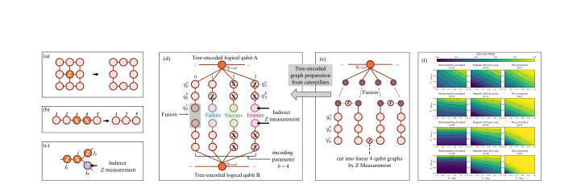 <small>Fig. 4. (a)-(c) Graph state measurement patterns that establish loss-tolerance. (d) Tree-encoded fusion scheme. (e) Preparing tree-encoded logical qubit from caterpillar states. (f) Simulation of the fusion schemes. We compare these schemes with varying encoding parameters (m, b = 1, 2, 4, 8), by performing 103 fusion trials per data point to measure success rates.</small>

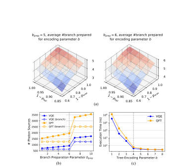 <small>Fig. 5. (a) Average number of tree branches that successfully prepared for logical qubit encoding parameter b, when the preparation parameter bprep = 5 and bprep = 6 (by simulation). (b) Photon resource breakdown analysis for parameter bprep, when given the maximum length of caterpillar is 30-qubit. Dashed lines represent the #photon sources used for branch preparation. (c) Execution time analysis for the tree-encoding parameter b, under a noise model that pfail = 2% and peras = 25%.</small>

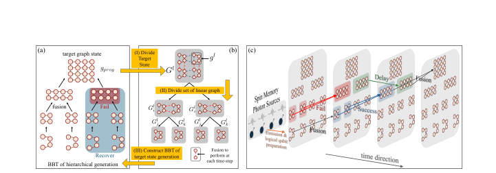 <small>Fig. 6. Details of our MemTree compiler. (a) The hierarchical generation of target state based on BBT. (b) Our compiler framework for building BBT. (c) The overall pipeline for target state generation, from a time direction prospective. Each slice corresponds to a time step in the cycles.</small>

 <small>Fig. 8. Execution time comparison between tree-encoded scheme and baselines.</small>

 <small>Fig. 8 and Fig. 9 present the comparison of our tree- encoded fusion scheme with the redundantly-encoded and RUS fusion schemes under the hardware configurations of the quantum spin memory architecture. In this comparison, all fusion schemes are integrated in MemTree with the same compilation algorithm. While fixing the fusion failure rate pfail = 0.25 (thus 1 −pfail = 0.75), we compare the program execution time and the number of required photon sources. The program size (#qubit) varies from 2-qubit to 20- qubit, and the erasure rate during fusion (peras) varies from 0% to 10%. Due to the extremely large simulation overhead when the program size scales up, we truncate the execution time to...</small>

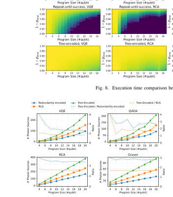 <small>Fig. 9. Number of required photon sources comparison between tree-encoded scheme and baselines.</small>

 <small>Fig. 10. Comparison of MemTree with OneAdapt [74] and OneAdapt-ET. (a) The average execution time of quantum programs, when peras = 0, the results are evaluated on OneAdapt without erasure-tolerance strategy. The error bars represent the value range with a statistical 95% CI (confidence interval), over 1000 times of experiment and each with 2 × 104 shots. (b) Number of required photon sources. (c) Total compilation runtime of compilers.</small>

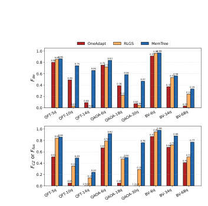 <small>Fig. 11. Comparison on decoherence errors and CZ errors between OneAdapt [74], RLGS [38] and MemTree.</small>

**Main problem.** Photonic quantum computing (PQC) suffers from fusion erasure errors caused by photon loss, which existing compilers like OneAdapt fail to explicitly model or mitigate, leading to unreliable graph states.

**Main result.** The authors developed the MemTree compiler and a tree-encoded fusion scheme that suppresses erasure errors, achieving exponential improvements in execution time and significant fidelity gains over state-of-the-art methods.

**Method.** The work introduces a tree-encoded fusion strategy for error suppression and a MemTree compilation framework using mixed-integer programming (MIP) to partition graph states into caterpillar states within a spin-memory architecture.

**Summary.** This paper addresses the critical issue of photon loss (fusion erasure) in photonic quantum computing. By introducing a new 'tree-encoded fusion' strategy and the 'MemTree' compiler, the researchers demonstrate a way to make graph-state generation much more robust against errors. The framework is specifically optimized for quantum spin-memory architectures and has been validated through both large-scale simulations and a proof-of-concept experiment on real Quandela hardware. This advancement is significant because it provides a more efficient and reliable path toward scaling up photonic quantum computers.

Abstract

Photonic quantum computing provides a promising route toward quantum computation by naturally supporting the measurement-based quantum computation (MBQC) model. In MBQC, programs are executed through measurements on a pre-generated graph state, whose construction largely depends on probabilistic fusion operations. However, fusion operations in PQC are vulnerable to two major error sources: fusion failure and fusion erasure. As a result, MBQC compilation must account for both error mechanisms to generate reliable and efficient photonic executions. Prior state-of-the-art MBQC compilation, represented by OneAdapt, is designed for all-photonic architectures and mainly focuses on handling fusion failures. Nevertheless, it does not explicitly model fusion erasures induced by photon loss, which can be substantially more damaging than fusion failures.   To mitigate fusion erasure errors, we introduce a new MBQC compilation scheme built upon the spin qubit quantum memory. We propose tree-encoded fusion, an encoding strategy that suppresses erasure errors during graph-state generation. We further incorporate this scheme into a compiler framework with algorithms that reduce the execution overhead of quantum programs. We evaluate the proposed framework using a realistic PQC simulator on six representative quantum algorithm benchmarks across multiple program scales. The results show that tree-encoded fusion achieves better robustness than alternative fusion-encoding strategies, and that our compiler provides exponential improvement over OneAdapt. In addition, we validate the feasibility of our approach through a proof-of-concept demonstration on real PQC hardware.

### [LightStim: A Framework for QEC Protocol Evaluation and Prototyping with Automated DEM Construction](http://arxiv.org/abs/2604.21472v1)

**Authors:** Xiang Fang, Ming Wang, Yue Wu, Sharanya Prabhu, Dean Tullsen, Narasinga Rao Miniskar, Frank Mueller, Travis Humble, Yufei Ding  
**Type:** theory · **PDF:** <https://arxiv.org/pdf/2604.21472v1>  
**Analysis basis:** full PDF text, analyzed in chunks

Figures

 <small>Figure 1. (a) Dual burden on QEC protocol Compilation: Physical Circuit &amp; DEM. (b) Sample Stim circuit. Physical operations specified by the protocol and the rest are all automated in LightStim.</small>

 <small>Figure 3. Physical Circuit and DEM construction for surface code Z memory experiment.</small>

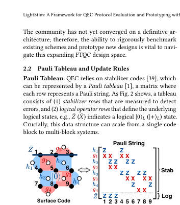 <small>Figure 2. Pauli tableau representation of QEC systems. Stab: stabilizers; Log: logical operators.</small>

 <small>Figure 4. Overview of LightStim’s Pauli Tracker workflow. The physical circuit drives a forward update of the record- augmented Pauli tableau, triggering DEM construction upon encountering measurements.</small>

 <small>Figure 5. Three realizations of Bell state teleportation cir- cuits: (a) transversal gates, (b,c) 𝑍𝑍/𝑋𝑋lattice surgery.</small>

 <small>Figure 6. Cross-code Lattice surgery between surface code and punctured quantum Reed-Muller (PQRM) code.</small>

 <small>Figure 7. Evaluation of memory experiments. (a) Surface code family. (b) BB code family. (c) QEC efficiency: LER per physical qubit. (d) Effect of SE circuit design on LER.</small>

 <small>Fig. 7 summarizes memory experiments across four axes. 1. Surface code family (Fig. 7a). We evaluate Z-basis mem- ory for the rotated, unrotated, and toric surface codes at 𝑑∈{3, 5, 7} under circuit-level noise. All three variants ex- hibit increasing LER suppression as 𝑑scales, aligned with theoretical results [29, 75]. Notably, at fixed 𝑑, LERrotated &gt; LERunrotated &gt; LERtoric under the threshold (0.8%), reflecting the benefit of increasing qubit redundancy (𝑑2, 2𝑑2−2𝑑+1, and 2𝑑2). The intuition is: when operating below the er- ror threshold, more physical qubits provide more syndrome information that enables more accurate decoding, so the additional redundancy yields lower LER despite the...</small>

 <small>Figure 8. Comprehensive evaluation of logical operations. (a) Transversal gates and lattice surgery operations of unrotated surface code against the memory baseline; (b) State injection of rotated surface code; (b1)-(b3) Two SE round, full post-selection; (b4) Different post-selection schemes.</small>

 <small>Figure 9. LER of Bell-state teleportation circuit implemented in (a) transversal gates and (b,c) lattice surgery.</small>

**Main problem.** The manual construction of Detector Error Models (DEMs) for complex quantum error correction (QEC) protocols is a tedious, error-prone, and non-scalable process that limits the evaluation of advanced operations like lattice surgery.

**Main result.** The authors present LightStim, a framework that automates the construction of DEMs by tracking Pauli tableau evolution during circuit compilation, enabling the efficient prototyping of complex, heterogeneous QEC protocols.

**Method.** The framework uses a Pauli tracker to maintain an augmented tableau with measurement records, employing Clifford conjugation and back-propagation to automatically identify detectors and logical observables.

**Summary.** LightStim is a new software framework designed to automate the creation of error models used in simulating quantum error correction. Instead of requiring researchers to manually annotate every detector and logical operator in a circuit, LightStim automatically derives them by tracking how Pauli operators evolve through the circuit. This allows for the rapid prototyping and evaluation of complex quantum operations, such as lattice surgery and cross-code protocols, which were previously too difficult to model manually. The framework's efficiency and accuracy were demonstrated through large-scale simulations of surface and qLDPC codes.

Abstract

Fault-tolerant quantum computing increasingly demands rigorous, circuit-level evaluation of diverse quantum error correction (QEC) protocols and efficient prototyping of new ones. Such evaluation requires both the physical circuit and its Detector Error Model (DEM) to simulate end-to-end logical error rates. However, DEM construction today is performed by manual annotation, a tedious and error-prone process that effectively limits evaluation to simple memory experiments. We present LightStim, a framework that automates DEM construction concurrently with circuit compilation by maintaining a Pauli tableau augmented with measurement records, with no protocol-specific input required. We benchmark LightStim across protocols from memory experiments to end-to-end distillation circuits; cross-validation against public implementations confirms exact detector and observable counts and consistent logical error rates. LightStim additionally accelerates the exploration of new protocols, which we demonstrate through a novel heterogeneous cross-code lattice surgery design between surface and punctured quantum Reed-Muller codes. These capabilities together make LightStim a unified infrastructure for systematic QEC protocol evaluation and exploration.

### [Dynamical Regimes of Two Qubits Coupled through a Transmission Line](http://arxiv.org/abs/2604.21463v1)

**Authors:** Fabio Borrelli, Giovanni Miano, Carlo Forestiere  
**Type:** theory · **PDF:** <https://arxiv.org/pdf/2604.21463v1>  
**Analysis basis:** full PDF text, analyzed in chunks

Figures

 <small>FIG. 1. Two identical superconducting qubits capacitively coupled through a transmission line of length d. The qubits, with shunt capacitance C and Josephson energy EJ, are connected symmetrically at the two ends x = 0 and x = d through coupling capacitances Cg.</small>

 <small>FIG. 2. Normalized squared coupling strengths g2 n/G2 of the odd (red line) and even (blue line) sectors versus the normalized mode frequency ωn/ωg for three values of the TL mode spacing: (a) ωTL = 10 ωg, (b) ωTL = ωg, and (c) ωTL = 0.1ωg. The insets display a zoom of the interval ωn/ωg ∈[0, 3], highlighting the low frequency modes. The vertical markers denote three representative qubit frequencies: ωq = 0.1 ωTL (square), ωq = ωTL (triangle), and ωq = 10 ωTL (diamond).</small>

 <small>FIG. 3. Schematic classification of the operating regions in the plane spanned by the ratios ωg/ωTL and ωq/ωTL.</small>

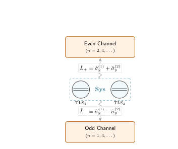 <small>FIG. 4. Schematic representation of the long-line (contin- uum) mapping: the transmission line decomposes into two independent reservoir channels (even/odd parity), each char- acterized by a Drude–Lorentz spectral density and coupled to the two-qubit system through the collective operators L± = ˆσ(1) y ± ˆσ(2) y .</small>

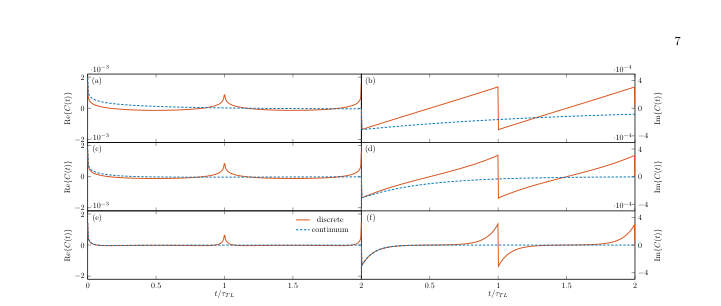 <small>FIG. 5. Real and imaginary parts of the correlation function C(t) at T = 0 for the discrete [Eq. (23)] and continuum [Eq. (28)] models. The left column, panels (a), (c), and (e), shows Re{C(t)}; the right column, panels (b), (d), and (f), shows Im{C(t)}. The three rows correspond to ωTL/ωg = 10, 1, and 0.1, from top to bottom.</small>

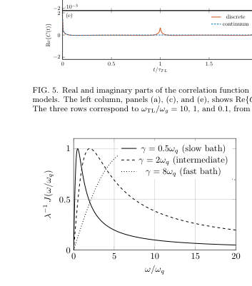 <small>FIG. 6. Drude–Lorentz spectral density J(ω) normalized to the reorganization rate λ plotted as a function of frequency for different normalized bath relaxation rates γ/ωq, illustrating the broadening of the spectrum and the shift of the maximum at ω = γ.</small>

 <small>FIG. 7. BLP non-Markovianity measure N(Φ) for a single qubit capacitively coupled to a finite TL of length d, termi- nated by a short circuit in the long line region ωTL ≪ωg. The measure is shown as a function of the normalized bath temperature kBT/ℏωq (vertical axis) and the normalized bath relaxation rate γ1q/ωq (horizontal axis), over the range 0 ≤ kBT/ℏωq, γ1q/ωq ≤10. The reorganization rate is fixed to λ1q = 0.1 ωq. The white curve marks the condition defined by Eq. (34). The green curves are contour lines of constant N(Φ), highlighting different levels of non-Markovianity.</small>

 <small>FIG. 8. BLP non-Markovianity measure N(Φ) for the re- duced dynamics of two qubits coupled through a finite TL in the long-line region ωTL ≪ωg, shown as a function of the normalized bath temperature kBT/ℏωq (vertical axis) and normalized bath relaxation rate γ/ωq (horizontal axis), in the range 0.2 ≤kBT/ℏωq, γ/ωq ≤10. The reorganization rate is fixed at λ = 0.1 ωq. The contour lines indicate constant values of N(Φ) and thus highlight different regions of non- Markovian behavior.</small>

 <small>FIG. 9. Comparison between HEOM (solid-line), GKLS (dashed-line) and TCL2 (dash dot line) simulations for the populations of two qubits, shown for kBT/ℏωq = 7 and different values of γ/ωq. The BLP measures are (a) NΦ(γ/ωq = 0.2, kBT/ℏωq = 7) = 1.61, (b) NΦ(3, 7) = 5.6 · 10−4, (c) NΦ(7, 7) = 1.11 · 10−5. The initial state is one of the orthogonal states in the pair that maximizes the BLP measure.</small>

 <small>FIG. 10. Comparison between HEOM (solid-line), GKLS (dashed-line) and TCL2 (dash dot line) simulations for the populations of two qubits, shown for γ/ωq = 7 and different values of T, i.e. (a) kBT/ℏωq = 0.2 and (b) kBT/ℏωq = 3. The BLP measures are NΦ(γ/ωq = 7, kBT/ℏωq = 0.2) = 7.8 · 10−2 and NΦ(γ/ωq = 7, kBT/ℏωq = 3) = 4.25 · 10−5. The initial state is one of the orthogonal states in the pair that maximizes the BLP measure.</small>

**Main problem.** The study seeks to establish a unified framework for determining the dynamical regimes of two superconducting qubits coupled via a finite-length transmission line, specifically identifying when the line acts as a reservoir, a multi-mode coupler, or a single-mode cavity.

**Main result.** The authors identify three distinct dynamical regimes based on the hierarchy of qubit frequency, mode spacing, and coupling scale, and demonstrate how collective coupling reshapes the non-Markovianity landscape compared to single-qubit systems.

**Method.** The researchers use circuit quantization to derive a Hamiltonian and employ the Hierarchical Equations of Motion (HEOM) to numerically solve the reduced dynamics, using the BLP measure to quantify non-Markovianity.

**Summary.** This paper provides a comprehensive classification of the dynamical regimes for two superconducting qubits coupled through a finite-length transmission line. By analyzing the relationship between qubit frequency, transmission line mode spacing, and coupling strength, the authors map out transitions between continuum-like reservoir dynamics, multi-mode discrete coupling, and single-mode cavity-like exchange. The study also investigates how these regimes influence non-Markovian effects and information backflow. This work is significant for designing scalable circuit QED architectures where the nature of the interconnect (the transmission line) directly impacts quantum coherence and gate fidelity.

Abstract

We investigate the reduced dynamics of two identical superconducting qubits capacitively coupled through a finite-length transmission line. Starting from circuit quantization, we derive a circuit Hamiltonian that naturally separates the line modes into even- and odd-parity sectors coupled to collective qubit operators. Depending on the hierarchy between the qubit frequency $ω_q$, the mode spacing $ω_{TL}$, and the coupling scale $ω_g$, the line acts either as a structured reservoir or as a discrete few-mode coupler. In the long-line continuum limit, each sector is described by a Drude--Lorentz spectral density and the dynamics is solved with the hierarchical equations of motion. Using the Breuer--Laine--Piilo measure, we identify the parameter region in which the reduced dynamics exhibits non-Markovian relaxation. In the short-line limit, the continuum description breaks down and the dynamics becomes respectively multimode or single-mode. This establishes a unified cQED picture of the dynamical regimes of finite-length transmission lines in superconducting-circuit architectures.

### [HEOM-in-Calibration-Loop: Exposing Non-Markovian Bath Signatures That Markovian Calibration Elides in Superconducting-Qubit Tune-Up](http://arxiv.org/abs/2604.21458v1)

**Authors:** Jun Ye  
**Type:** theory · **PDF:** <https://arxiv.org/pdf/2604.21458v1>  
**Analysis basis:** full PDF text, analyzed in chunks

Figures

 <small>Fig. 1. DAG Gantt of the RABI→{RAMSEY ∥T1} chain. Parallel execution saves 36.9 s (43 %) over serial; average scheduling latency is 9.62 µs.</small>

 <small>Figure 1 shows that scheduler overhead is negligible relative to the HEOM simulation cost. Serial execution takes 84.89 s; with RABI on the critical path and {RAMSEY, T1} in parallel, runtime drops to 48.04 s (saving 36.9 s, 43 %), with overhead fraction 2.4 × 10−5 from the theoretical minimum4 and aver- age scheduling latency 9.62 µs (maximum 10.78 µs). Protocol durations are RABI 6.56 s, RAMSEY 36.85 s, and T1 41.48 s, placing T1 on the critical path.5 With scheduler overhead bounded at the µs level, the discriminative evidence shifts to channel-level dynamics in Sections III-B–III-D.</small>

 <small>Fig. 2. Ramsey coherent-channel gap. (a) Three-backend 30-point com- parison: HEOM recovers a revival envelope distinct from the mesolve Markovian tail, whose T ∗ 2 fit saturates at the exponential-model ceiling. (b) HEOM 50-point dense scan (30-point L-convergence audit in §III.B) with physical revival guard cleared: a2/a1 = 3.11 is 31.1× above the lower threshold of 0.1, and t2/t1 = 0.38 is 5.3× below the upper threshold of 2.</small>

 <small>Fig. 3. Rabi and T1 composite. (a) Rabi amplitude scan: HEOM pmax drops 2.17 % below mesolve while the π-amplitude shift is sub-resolution. (b) T1 decay: HEOM extrapolates to A = 0.879 at t = 0+, mesolve to A = 1.000; the β = 1 decay shape is identical to machine precision.</small>

**Main problem.** Standard superconducting-qubit calibration frameworks use Markovian master equations that treat environmental noise as a hidden confound, effectively masking non-Markovian bath signatures like 1/f noise.

**Main result.** Integrating an HEOM solver into the calibration loop successfully exposes non-Markovian features, such as a physical revival envelope in Ramsey fringes and bath-induced initial-state contamination in T1 decay, which are otherwise invisible to Markovian models.

**Method.** The study uses a pulse-level simulator to compare a QuTiP 5.x HEOM solver against Markovian (mesolve) and closed-system (sesolve) backends within a multi-protocol calibration Directed Acyclic Graph (DAG).

**Summary.** This paper proposes a new approach to superconducting qubit 'tune-up' by replacing standard Markovian models with a non-Markovian Hierarchical Equations of Motion (HEOM) solver. By integrating this solver directly into the calibration pipeline, the authors demonstrate that one can identify specific noise signatures, such as 1/f noise-induced signal revivals and initial-state contamination, rather than simply absorbing them into error residuals. While the study is performed on a simulator rather than physical hardware, it shows that the HEOM approach provides a much more accurate diagnostic of the qubit's environment. This method transforms calibration from a simple fidelity measurement into a detailed structural analysis of the quantum system's bath.

Abstract

Closed-loop superconducting-qubit calibration has matured into DAG-orchestrated protocol chains, yet published frameworks treat the bath via a Markovian master equation or a phenomenological likelihood, absorbing bath structure into fit residuals instead of reporting it as a diagnostic. We integrate a QuTiP 5.x hierarchical-equations-of-motion (HEOM) solver driven by a Tier-1 1/f Burkard bath into a multi-protocol calibration DAG (Rabi -> {Ramsey || T1}) and benchmark it against sesolve and mesolve on a frozen platform in a pulse-level simulator (no hardware validation). The Ramsey channel carries the headline: the Markovian fit is censored by its exponential-family numerical ceiling, while HEOM recovers a physical revival envelope whose primary T2* separates from the Markovian reference by at least 13x at 95% independent-bootstrap confidence within the HEOM-feasible budget; the point-estimate ratio reaches >=28x on the 50-point primary-t1 grid and ~72x on the 30-point biexp-family tau_aw pivot at L=5. Rabi contrast falls 2.17% below mesolve on a noise-limited 30-point grid; the paired-bootstrap CI crosses zero, so this channel corroborates rather than independently establishes the non-Markovian signature. T1 decay shape matches across backends (beta=1.000), yet HEOM's initial occupation drops from 1.000 to 0.879 -- a bath-dressed contamination stable under a 16-point densification. The DAG adds 9.62 us average per-protocol scheduling overhead, no meaningful latency penalty at protocol granularity. HEOM-in-loop thereby changes what calibration reports: bath structure appears as a quantifiable residual rather than a hidden confound.

### [Bayesian Phase Stabilization at the Shot-Noise Limit for Scalable Quantum Networks](http://arxiv.org/abs/2604.21388v1)

**Authors:** Guang-Cheng Liu, Chao-Hui Xue, Fa-Xi Chen, Ming-Yang Zheng, Yi Yang, Li-Bo Li, Bin Wang, Bo-Wen Yang, Hai-Feng Jiang, Yong Wan, Ye Wang, Jiu-Peng Chen, Qiang Zhang, Jian-Wei Pan  
**Type:** both · **PDF:** <https://arxiv.org/pdf/2604.21388v1>  
**Analysis basis:** full PDF text, analyzed in chunks

Figures

 <small>FIG. 1. Phase stabilization performance comparison. Three-dimensional representation of the residual phase vari- ance as a function of measurement duration τ and photon flux µ for conventional MLE (pink surface) and prior-assisted Bayesian estimation (blue surface). The orange dotted curve represents the phase-diffusion noise floor (∝Dτ), and the pink dotted curve indicates the photon shot-noise limit (∝ (Γτ)−1), which sets the SNL for a static measurement. The black dashed curve shows the SNL for tracking a diffusing phase. The red solid line traces the minimum variance of con- ventional MLE, which scales as µ−1 and diverges as τ →0. In contrast, the blue solid line traces the Bayesian...</small>

 <small>FIG. 2. Experimental setup. (a) Blade ion trap with asymmetric electrode spacing designed for high-numerical-aperture fluorescence collection (NA=0.635). Photons are coupled into single-mode fibers (SM300) with nearly 50% coupling efficiency. At each node, the ion is first cooled and initialized in the state |S1/2, mJ = +1/2⟩. A two-step excitation protocol then proceeds as follows: a resonant π-pulse at 729 nm to prepare the metastable state |D5/2, mJ = +5/2⟩; a subsequent nanosecond 854 nm pulse then excites the ion to |P3/2, mJ = +3/2⟩with probability α, after which spontaneous decay emits a 393 nm photon. (b) Timing sequences for the two-step excitation protocol. For 10-km fiber links,...</small>

 <small>FIG. 3. Experimental results. (a) Interferometric visibility (blue circles) and parity fringe (pink triangles) as a function of fiber distance (10 km and 100 km). The horizontal blue dashed line indicates the maximum achievable interferometric visibility (98.26%) of the system. Error bars represent ±1 standard deviation from multiple experimental realizations. (b) Residual phase variance (pink circles) and interferometric visibility (blue circles) versus detected photon flux for the 10 km link. The residual variance follows the theoretical SNL prediction (pink line), scaling as µ−1/2, confirming quantum-optimal tracking. (c) Interferometric visibility versus TDM duty cycle for the 10 km...</small>

 <small>FIG. 1. Numerical simulation of the phase stabilization algorithm performance. (a) Time series of phase evolution at 10 us integration time. The yellow curve (Phase diffusion) represents uncontrolled free phase diffusion. The red curve (Sta- bilization with conventional MLE) and blue curve (Stabilization with Bayesian estimation) demonstrate the phase stabilization effects of the conventional method and the prior-assisted recursive estimator, respectively. (b) Phase stabilization performance comparison. Scatter points and solid lines show the simulation performance of the conventional MLE (red solid, red circles) and the Bayesian estimation (blue solid, blue inverted triangles). The yellow...</small>

 <small>FIG. 2. Performance comparison of phase tracking protocols. We set the measurement window duration to 100 us and residual phase variance (rad2, color scale) as a function of photon flux µ and diffusion rate √</small>

 <small>Fig. 2 presents a systematic comparison of conventional maximum-likelihood estimation versus our prior-assisted method incorporating outlier rejection. The simulations reveal several critical advantages of the prior-assisted ap- proach: Conventional estimation exhibits significant performance degradation at low photon flux , where shot noise gener- ates measurement outliers that destabilize the feedback loop. In contrast, our Bayesian approach maintains robust performance across all flux and diffusion regimes. The nonlinear innovation filter provides adaptive suppression of statistical outliers while preserving responsiveness to genuine phase variations. This advantage is most pronounced in...</small>

 <small>FIG. 3. Determining the optimal range for the threshold parameter κ. We set the residual phase variance (rad2, color scale) as a function of the threshold parameter κ and the measurement window duration τ for two constrained scenarios: (a) with a fixed diffusion coefficient D and (b) with a fixed photon flux µ. The optimal κ value for each condition is traced by the solid black line. The simulations determine the suitable range for κ to be [1, 1.5] in FI advantage region.</small>

 <small>FIG. 4. Phase evolution and noise power spectral density (PSD). The measured phase evolution over time (left) and its corresponding PSD (right) are shown for transmission distances of 0 km, 10 km, 50 km, and 100 km. The solid and dashed lines distinguish the results obtained with the wavelength-division stabilization system disabled (w/o WDM) and enabled (w/ WDM), respectively.</small>

 <small>FIG. 5. Phase evolution at 0 km (baseline, no additional fiber link). The data presented on a log-log scale exhibits a linear fit with a slope of 0.71, indicating a power-law exponent of σ ∝τ 0.71. The intercept of this fit yields a phase diffusion coefficient of D = (0.15◦/us0.71)2, which used directly to determine the prior parameters for the filter.</small>

 <small>FIG. 6. Schematic of the dual-band inter-node phase stabilization system architecture. Schematic of the hierar- chical dual-stabilization scheme for inter-node phase coherence, featuring two independent channels. The left channel (WDM Stabilization) suppresses fast fiber link noise using a Polarization Beam Splitter (PBS), Electrically Polarized Controller (EPC), and superconducting nanowire single-photon detector (SNSPD). The right channel (TDM Stabilization) compensates residual phase offset with an ´etalon, EPCs, and an AOM4/AOM5 cascade for switching between high-efficiency and high-count-rate SNSPDs. Polarization components (PBS/EPC) enable purification. System coordination is...</small>

**Main problem.** Achieving high-precision optical phase stability in long-distance quantum networks is difficult due to the trade-off between measurement precision and phase diffusion, especially under the strict photon-flux constraints required to avoid decohering fragile quantum states.

**Main result.** The development of a Bayesian phase estimation framework that achieves the shot-noise limit and enables high-visibility (>97%) entanglement generation over 10 km and 100 km fiber links.

**Method.** The researchers implemented a dual-band stabilization architecture (WDM and TDM) using a recursive Bayesian estimator and a nonlinear innovation filter to track phase noise and suppress statistical outliers in real-time.

**Summary.** This paper presents a new way to keep the phase of light stable across long-distance fiber optic cables for quantum networks. By using a Bayesian estimation technique, the system can accurately track phase fluctuations even when using very few photons, which is essential for protecting sensitive quantum bits like trapped ions. The researchers demonstrated this by successfully generating entanglement between separate ion nodes over distances of 10 km and 100 km. This work provides a scalable foundation for building practical, long-distance quantum repeaters and networks.

Abstract

High-precision optical phase stabilization in quantum networks is fundamentally constrained by the strict photon-flux and duty-cycle limits required to avoid disturbing fragile quantum states. This challenge becomes especially critical when coordinating multiple independent light sources for multi-step quantum protocols. Here, we develop an integrated phase-stabilization framework that incorporates a Bayesian phase estimator to optimally extract information from sparse single-photon detection events. This approach outperforms conventional maximum-likelihood estimation and achieves the shot-noise limit under minimal photon flux. The framework enables real-time correction of combined phase noise from both nodal lasers and transmission fibers, facilitating a two-step excitation protocol for heralded entanglement generation between separate trapped-ion nodes via single-photon interference. Operating with a detected photon rate of approximately 1 MHz and a duty cycle less than or equal to 6.5%, the system maintains interferometric visibility greater than 97% over fiber links of 10 km and 100 km. This phase control yields deterministic ion-ion entanglement with parity contrast exceeding 85% at both distances, enabling device-independent quantum key distribution. Moreover, the resulting memory-memory entanglement at 10 km survives beyond the average time required to establish it -- a fundamental requirement for quantum repeaters. This work establishes a robust and scalable foundation for practical long-distance quantum networks.

### [pygridsynth: A fast numerical tool for ancilla-free Clifford+T synthesis](http://arxiv.org/abs/2604.21333v1)

**Authors:** Shuntaro Yamamoto, Nobuyuki Yoshioka  
**Type:** theory · **PDF:** <https://arxiv.org/pdf/2604.21333v1>  
**Analysis basis:** full PDF text, analyzed in chunks

Figures

 <small>Figure 1: Two-qubit decomposition and absorption of residuals. (1) Three-CNOT template (top): Rz(−ψ) on the target; (C, D) between CNOTs 1–2; Rx(θ) and Rz(ϕ) between CNOTs 2–3; (A, B) after CNOT 3. (2) After magnitude approximation, residual Rz (control) and Rx (target) appear around the Clifford+T core. (3) Residuals commute with CNOTs and merge into C′, D′, A′, B′ and a simpler core.</small>

 <small>Figure 2: Partial decomposition of a two-qubit block. Top: the absorbed form from Fig. 1 (bottom), with an additional leading CNOT01; primed blocks C′, D′, A′, B′, three CNOTs in the core, and Clifford+T cores (CT). Middle: C′ and D′ expanded via (20) into Rz and CT layers on each wire; the leading CNOT01 and the rest of the CNOT pattern are unchanged. Bottom: ∆phase (22) absorbs the leading CNOT01, the Rz rotations, and a trailing CNOT01; the Clifford+T suffix (CT pairs, remaining CNOTs, A′, B′) is unchanged.</small>

 <small>Figure 3: Example of multiplexed Rz gate decomposition for a 4-qubit unitary: the control qubits (top) determine which Rz rotation is applied to the target qubit (bottom).</small>

 <small>Figure 4: Step-by-step decomposition of a 3-qubit unitary.</small>

 <small>Figure 5: Recursive absorption of residual diagonal phase matrix for n = 3: (0) recursive circuit; (1) VA partially decomposed to CT and ∆VA; (2) ∆VA commutes left past the right multiplexed Rz; (3) absorbed into V ˜ B, then V ′ ˜ B partially decomposed to CT and ∆V ′ ˜ B; (4) ∆V ′ ˜ B commutes left, absorbed into W ˜ B →W ′ ˜ B; (5) W ′ ˜ B partially decomposed, ∆W ′ ˜ B commutes left; (6) WC fully decomposed (absorbs all accumulated ∆; no residual). CT denotes a two-qubit block approximated by Clifford+T gates.</small>

 <small>Figure 6: Unitary synthesis benchmarks: each point corresponds to one synthesis run at a chosen tolerance ϵ. Vertical axis: T-count of the output Clifford+T circuit; horizontal axis: diamond-norm error between the target unitary channel and the implemented channel. (a) All n superposed. (b)– (e) Same quantities for n = 1, 2, 3, 4 only.</small>

 <small>Figure 7: Mixed synthesis benchmarks (error vs. T-count). Each panel fixes the number of qubits n; the horizontal axis is the total T-count after mixing and the vertical axis is the diamond-norm distance between the target channel and the optimized mixture. (a) n = 1. (b) n = 2. (c) n = 3. (d) n = 4. Panel (d) omits the smallest-ϵ regime: at n = 4 those mixed-synthesis runs exceeded practical wall- clock limits.</small>

 <small>Figure 7 summarizes these tradeoffs. Across the panels (n = 1–4), we find that mixed synthesis in the small error limit halves the T-count of unitary synthesis at comparable diamond-norm error, consistent with Lemma 1: if the candidates form an ϵ-net in diamond norm error, the optimized mixture can achieve O(ϵ2) residual error, so the leading log2(1/ϵ) cost per decade of target error is halved. Mixed synthesis also incurs a larger additive T- cost: the candidates must be synthesized with accuracy well below the perturbation scale ϵ used to generate them, which adds T gates whose contribution is only weakly reduced when ϵ is large. At small ϵ the halved leading term dominates and mixed...</small>

 <small>Figure 8(a) places post-mix well below pre-mix for comparable horizontal values, and on log–log axes the trend is consistent with post-mix error scaling approximately as</small>

 <small>Figure 8: Mixed synthesis (Section 5): each marker is one run at some ϵ and n. Pre-mix is the diamond-norm distance from the target to a typical synthesized perturbed unitary before LP mixing; post-mix is the diamond-norm distance from the target to the optimized mixture channel after mixing. (a) Horizontal axis: pre-mix; vertical axis: post-mix. (b) Horizontal axis: pre-mix; vertical axis: post- mix divided by (pre-mix)2.</small>

**Main problem.** The challenge of efficiently approximating arbitrary multi-qubit unitary operators using the discrete Clifford+T gate set with minimal T-count and high precision.

**Main result.** The introduction of pygridsynth, an open-source Python library that achieves efficient, ancilla-free Clifford+T synthesis with T-count scaling logarithmic in precision and demonstrates quadratic error suppression via mixed synthesis.

**Method.** The library utilizes a recursive block ZXZ decomposition, magnitude approximation for X-axis rotations, and a mixed-synthesis workflow optimized via Linear Programming in the Pauli Transfer Matrix representation.

**Summary.** This paper introduces pygridsynth, a new Python-native tool designed for high-precision synthesis of quantum circuits using the Clifford+T gate set. It provides an efficient way to decompose multi-qubit unitaries into gate sequences that minimize the T-count, which is the most expensive resource in fault-tolerant quantum computing. A key feature is the implementation of 'mixed synthesis,' which approximates target quantum channels using a probabilistic mixture of circuits to significantly reduce approximation error. The tool is particularly useful for benchmarking synthesis strategies and compiling logical operations for large-scale quantum hardware.

Abstract

We present pygridsynth, an open-source Python library for ancilla-free approximate Clifford+$T$ synthesis that runs in $O(\log(1/ε))$ for precision $ε$. For $n=1, 2$ qubits, the library builds upon established efficient and high-precision synthesis routines, such as nearly optimal $Z$-rotation synthesis and magnitude approximation. For $n\ge 3$ qubits, we introduce a partial-decomposition technique that generalizes the magnitude approximation, reducing constant factors in the $T$-count as $(\frac{21}{8}\cdot 4^n - \frac{9}{2}\cdot 2^n + 9)\log_2(1/ε) + o(\log(1/ε))$. The package also exposes a mixed-synthesis workflow that approximates target unitary channels by probabilistic mixtures of Clifford+$T$ circuits, for which we empirically find that the synthesis error is reduced from $ε$ to $ε^2/(2n)$. Taken together, these features make pygridsynth a Python-native platform for high-precision Clifford$+T$ synthesis and for benchmarking unitary and mixed synthesis strategies on multi-qubit instances.

### [Sufficient support size of measurements for quantum estimation](http://arxiv.org/abs/2604.21323v1)

**Authors:** Koichi Yamagata  
**Type:** theory · **PDF:** <https://arxiv.org/pdf/2604.21323v1>  
**Analysis basis:** full PDF text, analyzed in chunks

Figures

 <small>Low-resolution page preview, page 2</small>

 <small>Low-resolution page preview, page 3</small>

 <small>Low-resolution page preview, page 4</small>

 <small>Low-resolution page preview, page 5</small>

 <small>Low-resolution page preview, page 6</small>

 <small>Low-resolution page preview, page 7</small>

 <small>Low-resolution page preview, page 8</small>

 <small>Low-resolution page preview, page 9</small>

**Main problem.** The optimization of quantum measurements (POVMs) for parameter estimation is difficult because the space of possible measurements is theoretically infinite-dimensional due to an unbounded number of outcomes.

**Main result.** The paper proves that for both locally unbiased and Bayesian estimation, the search space can be reduced to a finite number of outcomes, and that an optimal measurement can always be chosen to be rank-one.

**Method.** The author employs a convex-analytic framework and the theory of sufficient subspaces/subalgebras to iteratively reduce the number of POVM elements.

**Summary.** This paper addresses the computational complexity of finding optimal quantum measurements for estimating parameters of a density operator. It provides rigorous upper bounds on the number of measurement outcomes needed to achieve optimal precision in both local and Bayesian estimation settings. By proving that optimal measurements can be restricted to rank-one POVMs with a finite number of outcomes, the work justifies the use of much smaller, manageable search spaces in numerical optimization. This is highly relevant for practical applications like quantum sensing, tomography, and the calibration of quantum hardware.

Abstract

In quantum estimation for a $d$-parameter family of density operators on a finite-dimensional Hilbert space $\mathcal{H}$, an estimator is specified by a pair $\left(M,\hatθ\right)$, where $M$ is a POVM with a finite outcome set $Ω$ and $\hatθ:Ω\to\mathbb{R}^{d}$ is a classical estimator map. Since the number of outcomes $\left|Ω\right|$ is a priori unbounded, the space of admissible POVMs is vast, which makes the search for optimal estimators difficult. In this paper, for the minimization of the weighted trace of the mean squared error among locally unbiased estimators, we prove that it suffices to consider POVMs with at most $\left({\rm dim}\,\mathcal{H}\right)^{2}+d(d+1)/2-1$ outcomes, and that an optimal measurement can be chosen to be rank-one. For the minimization of the average weighted trace of the mean squared error in Bayesian estimation, we show that it suffices to consider POVMs with at most $\left( {\rm dim}\, \mathcal{H}\right)^{2}$outcomes, and again an optimal POVM can be taken to be rank-one. Furthermore, when the model admits a real sufficient subalgebra, we show that the $\left( {\rm dim}\, \mathcal{H} \right)^{2}$ term in the above support-size bounds can be reduced in both the locally unbiased and Bayesian settings. These bounds substantially reduce the search space for optimal measurements and justify restricting numerical optimization to rank-one POVMs with finitely many outcomes.

### [StabilizerBench: A Benchmark for AI-Assisted Quantum Error Correction Circuit Synthesis](http://arxiv.org/abs/2604.21287v1)

**Authors:** Andres Paz, Christian Tarta, Cordelia Yuqiao Li, Mayee Sun, Sarju Patel, Sylvie Lausier  
**Type:** theory · **PDF:** <https://arxiv.org/pdf/2604.21287v1>  
**Analysis basis:** full PDF text, analyzed in chunks

Figures

 <small>Fig. 2: The pair of CNOT gates from q0 to f, which form this flag gadget act as a bit-parity check for q0. (a) An X fault that occurs on the q0 wire in between this pair of CNOT gates propagates as an X error on f as shown in (b), which can be measured in the Z basis, outputting a 1, which means that q0 has an odd bit-parity with itself across the flag gadget where even parity is expected, indicating the presence of an X fault.</small>

 <small>Fig. 3: Agent workflow</small>

 <small>Fig. 4: Difficulty curves for all three tasks: cumulative capability score S(b) cap vs. stabilizer count under the best configuration for b ∈{1, 2, 3}. All models degrade monotonically with circuit complexity; the gray dashed line shows the total benchmark ceiling.</small>

**Main problem.** The rapid scaling of quantum hardware toward fault tolerance has created a demand for quantum error correction (QEC) circuit design that exceeds manual human capacity, yet there is no specialized benchmark to evaluate the progress of AI agents in automating this task.

**Main result.** The authors introduce StabilizerBench, a scalable benchmark suite of 192 stabilizer codes across three tasks (state preparation, optimization, and fault-tolerant synthesis) that effectively discriminates between frontier AI models.

**Method.** The benchmark utilizes the Gottesman-Knill theorem and the Stim library for efficient, polynomial-time verification of stabilizer circuits, allowing for large-scale testing of AI agents using a unified scoring system.

**Summary.** As quantum computing moves toward fault tolerance, automating the design of error correction circuits is essential. This paper presents StabilizerBench, a new evaluation framework designed to test how well AI agents can generate, optimize, and make stabilizer circuits fault-tolerant. By using stabilizer codes, the benchmark remains computationally efficient to verify even for large numbers of qubits. The study shows that while current AI models are good at basic circuit generation, they still struggle significantly with complex optimization and fault-tolerant design, highlighting a major area for future development in AI-assisted quantum software engineering.

Abstract

As quantum hardware scales toward fault tolerant operation, the demand for correct quantum error correction (QEC) circuits far outpaces manual design capacity. AI agents offer a promising path to automating this synthesis, yet no benchmark exists to measure their progress on the specialized task of generating QEC circuits. We introduce StabilizerBench, a benchmark suite of 192 stabilizer codes spanning 12 families, 4-196 qubits, and distances 2-21, organized into three tasks of increasing difficulty: state preparation circuit generation, circuit optimization under semantic constraints, and fault tolerant circuit synthesis. Although motivated by QEC, stabilizer circuits exercise core competencies required for general quantum programming, including gate decomposition, qubit routing, and semantic preserving transformations, while admitting efficient verification via the Gottesman Knill theorem, enabling the benchmark to scale to large codes without the exponential cost of full unitary comparison. We define a unified generator weighted scoring system with two tiers: a capability score measuring breadth of success and a quality score capturing circuit merit. We also introduce continuous fault tolerance and optimization metrics that grade error resilience and circuit improvements beyond binary pass or fail. Following the design of classical benchmarks such as SWE-bench, StabilizerBench specifies inputs, verification oracles, and scoring but leaves prompts and agent strategies open. We evaluate three frontier AI agents and find the benchmark discriminates across models and tasks with substantial headroom for improvement.

### [Random Access Codes: Explicit Constructions, Optimality, and Classical-Quantum Gaps](http://arxiv.org/abs/2604.21274v1)

**Authors:** Ruho Kondo, Yuki Sato, Hiroshi Yano, Yota Maeda, Kosuke Ito, Naoki Yamamoto  
**Type:** theory · **PDF:** <https://arxiv.org/pdf/2604.21274v1>  
**Analysis basis:** full PDF text, analyzed in chunks

Figures

 <small>Fig. 1. Decoding success probability of RACs and QRACs for L ≤7 and k = 3. Conjectural upper bound of QRAC (Eq. (4)) is included.</small>

 <small>Fig. 2. Achievable (conjecturally maximum) success probability of (L, L −1)-RACs and (L, L −1)-QRACs. Note that the maximum average success probability and the maximum worst case success probability are the same for (L, L −1)-QRAC. For clarity, markers are shown only for L ≤10.</small>

**Main problem.** The paper seeks to find explicit constructions for optimal classical and quantum random access codes (RACs and QRACs) and to quantify the performance gap between classical and quantum protocols in the non-asymptotic regime.

**Main result.** The authors developed a constructive framework for RACs, provided closed-form optimal solutions for the (L, L-1) case, and identified a significant gap between classical and quantum performance in the worst-case decoding regime.

**Method.** The study uses distance-based optimization (minimizing directed Chamfer and Hausdorff distances), Mixed-Integer Linear Programming (MILP), and numerical optimization via gradient-based methods.

**Summary.** This paper addresses the challenge of constructing optimal random access codes, which compress $L$ bits into $k$ bits (or qubits) for retrieval. The authors provide a new framework that reduces the search for optimal classical codes to a geometric optimization problem. They demonstrate that while the performance difference between classical and quantum codes is small on average, a substantial 'classical-quantum gap' exists when considering the worst-case decoding success probability. This work provides explicit, closed-form constructions for specific code sizes and advances the understanding of information retrieval in quantum systems.

Abstract

A random access code (RAC) encodes an $L$-bit string into a $k$-bit $(L>k)$ message from which any designated source bit can be recovered with high probability. Its quantum counterpart, a quantum random access code (QRAC), replaces the $k$-bit message with $k$ qubits. While upper bounds on the decoding success probability have long been studied in both classical and quantum settings, explicit constructions of optimal codes are known only in special cases, even for classical RACs. In this paper, we develop a constructive framework for classical $(L,k)$-RACs under both average- and worst-case criteria. We show that optimal code design reduces to selecting $2^k$ points in $\{0,1\}^L$ and $[0,1]^L$ for the average- and worst-case criteria, respectively, so as to minimize a distance-like objective. This characterization yields explicit constructions for general $(L,k)$. For $k=L-1$, we further obtain closed-form optimal encoders and decoders for both criteria, and show that the resulting classical $(L,L-1)$-RACs attain the corresponding proved upper bounds. We also show that these optimal classical codes induce $(L,L-1)$-QRACs that attain a conjectured upper bound on the decoding success probability. Numerical optimization suggests little difference between RACs and QRACs in the average-case setting, but a potentially large classical-quantum gap in the worst-case nonasymptotic regime.

### [Structured Quantum State Reconstruction via Physically Motivated Operator Selection](http://arxiv.org/abs/2604.21272v1)

**Authors:** Ayush Chambyal, Brijesh, Rakesh Sharma  
**Type:** theory · **PDF:** <https://arxiv.org/pdf/2604.21272v1>  
**Analysis basis:** full PDF text, analyzed in chunks

Figures

 <small>FIG. 1. (a) Fidelity with respect to the ideal three-qubit GHZ state, (b) agreement with the MLE reconstruction, and (c) observable reconstruction error, shown as a function of mea- surement shots. The results demonstrate weak dependence on shot count and a clear hierarchy across models, with the G3 model achieving high accuracy using a reduced set of phys- ically motivated observables.</small>

 <small>FIG. 2. (a) Fidelity with respect to the ideal four-qubit GHZ state, (b) agreement with the MLE reconstruction, and (c) observable reconstruction error as a function of measurement shots.</small>

 <small>FIG. 3. (a) Fidelity with respect to the ideal five-qubit GHZ state, (b) agreement with the MLE reconstruction, and (c) observable reconstruction error as a function of measurement shots.</small>

 <small>FIG. 4. (a) Fidelity with respect to the ideal GHZ state, (b) agreement with the MLE reconstruction, (c) observable recon- struction error, and (d) fidelity as a function of the number of model parameters, shown for three-, four-, and five-qubit systems.</small>

 <small>Figure 4(b) shows the agreement with the MLE recon- struction. The PSD method exhibits the highest agree- ment, as it is derived from the same full set of mea- sured observables. The structured models show increas- ing agreement with model complexity, but decreasing agreement with system size, reflecting the increasing dif- ficulty of reproducing the full reconstructed state within a restricted observable set. Agreement with MLE should be interpreted alongside fidelity to the target state, as it reflects consistency with the reconstructed experimental density matrix rather than direct proximity to the ideal GHZ state.</small>

**Main problem.** Quantum State Tomography (QST) suffers from exponential scaling in both measurement and computational costs as the number of qubits increases, making full reconstruction impractical for large systems.

**Main result.** The authors developed a Structured Gibbs Quantum State Tomography (SG-QST) framework that achieves high-fidelity reconstruction using significantly fewer parameters by targeting physically motivated correlations.

**Method.** The framework uses a Gibbs representation of the density matrix, reconstructing it through a hierarchical set of restricted Pauli operators ranging from local to global correlations.

**Summary.** This paper introduces a new method for quantum state reconstruction called SG-QST, which avoids the exponential complexity of standard tomography. Instead of measuring every possible observable, the method focuses on a subset of physically relevant operators, such as local and global correlations. When tested on GHZ states, the approach achieved performance comparable to full Maximum Likelihood Estimation while using an order-of-magnitude fewer parameters. This makes the reconstruction of multi-qubit systems much more efficient and scalable.

Abstract

Quantum state tomography (QST) scales exponentially in both measurement and computational cost, making full reconstruction impractical for multi-qubit systems. Existing approaches attempt to reduce this complexity, but do not explicitly restrict the operator space based on physically relevant correlations. We develop a structured QST framework in which the density matrix is reconstructed using a restricted set of observables in a Gibbs representation. The Structured Gibbs Quantum State Tomography (SG-QST) is built by progressively including local, nearest-neighbor, and global correlations. Benchmarking on three, four, and five-qubit. GHZ states shows that comparable fidelity can be achieved with significantly fewer parameters by restricting the operator space to physically relevant observables. These results demonstrate that physically motivated operator-space restriction enables efficient and interpretable quantum state reconstruction.

### [On the importance of hyperparameters in initializing parameterized quantum circuits](http://arxiv.org/abs/2604.21266v1)

**Authors:** Ankit Kulshrestha, Sarvagya Upadhyay  
**Type:** theory · **PDF:** <https://arxiv.org/pdf/2604.21266v1>  
**Analysis basis:** full PDF text, analyzed in chunks

Figures

 <small>Fig. 1: Normalized histogram of gradient magnitude distribution of initial parameters across different layers in a 5 layer, 4 qubit Hardware Efficient Ansatz (HEA). The hyperparameters for the distribution are perturbed by δ = 0.05. The figures show that even a small change in hyperparameters of initializing distribution can lead to drastically different gradient distribution across layers of a quantum circuit.</small>

 <small>Fig. 2: VQE Training results for H2 molecule with bondlength ∈[0.5, 1.1]˚ A for Beta and Gaussian Distributions. The results show that searched hyperparameters with the given score functions produce a faster convergence in general.</small>

 <small>Fig. 3: Training loss on different QML datasets with different score functions and manually selected hyperparameters for initializing distributions. Inset: convergence dynamics at the end of training. In all the cases, method based on score function leads to faster convergence than manual selection of hyperparameters even if the ansatz converges to the same (local) minima.</small>

 <small>Fig. 4: Gradient variance scaling for a two-design exhibiting ansatz for Beta and Gaussian distributions with different score functions.</small>

**Main problem.** Finding optimal hyperparameters (such as mean and variance) for the distributions used to initialize parameters in Parameterized Quantum Circuits (PQCs) to improve training performance.

**Main result.** The introduction of the ES-HyperOpt algorithm, which identifies hyperparameters that significantly accelerate convergence and improve accuracy in VQE and QML tasks without worsening the barren plateau phenomenon.

**Method.** A two-stage evolutionary search algorithm (ES-HyperOpt) that uses score functions derived from the Quantum Fisher Information Matrix (QFIM) and gradient statistics to optimize hyperparameter selection.

**Summary.** This paper addresses the challenge of initializing Parameterized Quantum Circuits (PQCs) by focusing on optimizing the hyperparameters of the initial parameter distributions. The authors propose an evolutionary search algorithm, ES-HyperOpt, which tunes these hyperparameters specifically for a given circuit architecture and quantum task. Testing on VQE for the H2 molecule and various QML datasets shows that this method leads to faster convergence and higher accuracy. Crucially, the method does not introduce or exacerbate the barren plateau problem, making it a robust approach for improving the utility of variational quantum algorithms.

Abstract

There has been intensive research on increasing the utility and performance of Parameterized Quantum Circuits (PQCs) in the past couple of years. Owing to this research, there are now several inductive biases available to a quantum algorithms researchers to design a good circuit for their chosen task.   In this paper, we focus on the problem of finding performant initial parameters for a given PQC. Different from previous research that focuses on finding the right \emph{distribution}, we focus on finding the \emph{hyperparameters} for any given distribution. To that end we introduce an evolutionary-search based algorithm that finds optimal hyperparameter given a PQC and quantum task. Our empirical results indicate that our algorithm consistently leads to selection of performant initial parameters tuned specifically to the ansatz and the quantum task leading to faster convergence and performance. More importantly, our algorithm does not \emph{negatively} affect the barren plateau phenomenon. In other words, the initial parameters suggested by algorithm do not worsen the gradient variance scaling for a given initializing distribution.

### [Time-optimal Qubit Reset via Environmental Spectral Structure](http://arxiv.org/abs/2604.21230v1)

**Authors:** Hong-Bo Huang, Hui Dong  
**Type:** theory · **PDF:** <https://arxiv.org/pdf/2604.21230v1>  
**Analysis basis:** full PDF text, analyzed in chunks

Figures

 <small>FIG. 1. Illustration of the switch–restore–switch scheme for qubit reset using the environmental spectral structure. The qubit exhibits a frequency-dependent decoherence rate, Γ (ω). Initially, to perform a computational task, the qubit operates in the computational configuration (red) at the computation frequency ωcp with low decoherence, Γ (ωcp). After the com- putational task, it is switched over the switching duration τsw to the restoring configuration (green) at the restoring fre- quency ωst with rapid decoherence, Γ (ωst). In this configura- tion, the qubit undergoes strong decoherence and relaxes over the restoring duration, τst. Finally, it is switched back to the computational...</small>

 <small>FIG. 2. (a) Optimal control from Eq. (3). (b) Line shapes of four representative decoherence-rate spectra, Γ (ω), for SC- qubits. The blue solid, orange dashed, yellow dotted, and purple dash-dotted lines represent the Lz, prot, mix, and JQF spectra, respectively. The gray arrows indicate that the opti- mal control, ω∗, in (a) aligns with the peak of the spectrum in (b) for the Lz and prot spectra. For the mix and JQF spec- tra, the restoring frequency initially lies at the lower bound before gradually increasing.</small>

 <small>FIG. 3. (a) Restoring process as a function of normalized time, t/T1. The blue solid, orange dashed, yellow dotted, and purple dash-dotted lines represent the Lz, prot, mix, and JQF spectra, respectively. The end of each restor- ing process is marked by a circle, hexagon, square, or dia- mond, indicating the order of magnitude of the normalized restoring time, τst/T1. The restoring time is shorter than the coherence time except for the non-engineered mix spec- trum. The precision is set to ϵ = 10−5. (b) Normalized extra work, Wex/ (kBT ln 2), with respect to normalized reset time, Treset/T1, for our switch–restore–switch scheme, com- pared with the lower bound for a constant...</small>

 <small>FIG. 4. The fidelity, F, of our restoring process under three types of deviations: (a) population deviations, (b) coherence deviations, and (c) control-time deviations. The blue solid, orange dashed, yellow dotted, and purple dash-dotted lines represent the Lz, prot, mix, and JQF spectra, respectively. In all cases, F &gt; 99.999% over substantial deviation ranges. The reset precision is set to ϵ = 10−5.</small>

**Main problem.** How to achieve the fastest possible qubit reset (information erasure) without sacrificing reset precision or violating hardware constraints on frequency tuning and decoherence.

**Main result.** The identification of an optimal 'switch–restore–switch' strategy that reduces reset time from >100 ns to ~20 ns for superconducting qubits while maintaining high precision (10⁻⁵).

**Method.** The authors applied Pontryagin’s minimum principle to a Lindblad master equation framework to derive optimal control trajectories under realistic spectral and hardware constraints.

**Summary.** Fast qubit reset is crucial for reusing qubits in NISQ-era processors to increase circuit depth, but rapid reset usually requires high decoherence, which is detrimental to computation. This paper proposes a specific control sequence—moving the qubit frequency from a low-decoherence state to a high-decoherence state and back—to minimize reset time. By leveraging the specific spectral structure of the environment, the authors demonstrate that reset times can be slashed to about 40% of a typical two-qubit gate time. This provides a practical design principle for engineers to optimize qubit reuse on hardware-limited quantum processors.

Abstract

Fast qubit reset is essential for qubit reuse in the noisy intermediate-scale quantum computing era, yet it conflicts with the weak decoherence required for high-fidelity computation. We solve the time-optimal reset problem for a frequency-tunable qubit coupled to a structural environment under realistic spectral and control constraints. The optimal strategy consists of a switch--restore--switch sequence, where the qubit is moved from a low-decoherence computational configuration to a high-decoherence restoring configuration and then returned for reuse. For superconducting qubits in four representative environments, this strategy reduces the reset time from typically $\gtrsim\SI{100}{\nano\second}$ to $\SI{20}{\nano\second}$, about $40\%$ of a typical two-qubit gate time, while achieving a reset precision of $10^{-5}$. Our results identify environmental spectral structure as a practical resource for rapid, high-fidelity qubit reset and provide a design principle for qubit reuse on qubit-limited processors.

### [The Feedback Hamiltonian is the Score Function: A Diffusion-Model Framework for Quantum Trajectory Reversal](http://arxiv.org/abs/2604.21210v1)

**Authors:** Sagar Dubey, Alan John  
**Type:** theory · **PDF:** <https://arxiv.org/pdf/2604.21210v1>  
**Analysis basis:** full PDF text, analyzed in chunks

Figures

 <small>Low-resolution page preview, page 2</small>

 <small>Low-resolution page preview, page 3</small>

 <small>Low-resolution page preview, page 4</small>

 <small>Low-resolution page preview, page 5</small>

 <small>Low-resolution page preview, page 6</small>

 <small>Low-resolution page preview, page 7</small>

 <small>Low-resolution page preview, page 8</small>

 <small>Low-resolution page preview, page 9</small>

 <small>Low-resolution page preview, page 10</small>

 <small>Low-resolution page preview, page 11</small>

**Main problem.** The paper seeks to explain the underlying mechanism of the García-Pintos feedback protocol for reversing the arrow of time in continuously monitored quantum systems and to connect it to the framework of score-based diffusion models.

**Main result.** The authors analytically prove that the feedback Hamiltonian required for trajectory reversal is exactly the 'score function' (the functional derivative of the log path probability) of the quantum trajectory distribution.

**Method.** The study employs a rigorous mathematical framework involving Girsanov's theorem, Fréchet differentiation on trace-class operators, and Kähler geometry on the pure-state projective manifold.

**Summary.** This paper establishes a formal link between quantum trajectory reversal and the generative diffusion models used in machine learning. By identifying the feedback Hamiltonian as the 'score function' of the quantum process, the authors show how a specific feedback gain can interpolate between forward and backward time evolution. This connection provides a theoretical foundation for using machine learning techniques, such as denoising score matching, to implement quantum control in real-world scenarios where measurement efficiency is imperfect or delays are present.

Abstract

In continuously monitored quantum systems, the feedback protocol of García-Pintos, Liu, and Gorshkov reshapes the arrow of time: a Hamiltonian $H_{\mathrm{meas}} = r A / τ$ applied with gain $X$ tilts the distribution of measurement trajectories, with $X < -2$ producing statistically time-reversed outcomes. Why this specific Hamiltonian achieves reversal, and how the mechanism relates to score-based diffusion models in machine learning, has remained unexplained.   We compute the functional derivative of the log path probability of the quantum trajectory distribution directly in density-matrix space. Combining Girsanov's theorem applied to the measurement record, Fréchet differentiation on the Banach space of trace-class operators, and Kähler geometry on the pure-state projective manifold, we prove that $δ\log P_F / δρ= r A / τ= H_{\mathrm{meas}}$. The García-Pintos feedback Hamiltonian is the score function of the quantum trajectory distribution -- exactly the object Anderson's reverse-time diffusion theorem requires for trajectory reversal. The identification extends to multi-qubit systems with independent measurement channels, where the score is a sum of local operators.   Two consequences follow. First, the feedback gain $X$ generates a continuous one-parameter family of path measures (for feedback-active Hamiltonians with $[H, A] \neq 0$), with $X = -2$ recovering the backward process in leading-order linearization -- a structure absent from classical diffusion, where reversal is binary. Second, the score identification enables machine learning (ML) score estimation methods -- denoising score matching, sliced score matching -- to replace the analytic formula when its idealizations (unit efficiency, zero delay, Gaussian noise) fail in real experiments.

### [Monitoring photon entanglement in coupled cavities](http://arxiv.org/abs/2604.21208v1)

**Authors:** Moises Acero, Jeremiah Harrington, Oleg L. Berman, K. Ziegler  
**Type:** theory · **PDF:** <https://arxiv.org/pdf/2604.21208v1>  
**Analysis basis:** full PDF text, analyzed in chunks

Figures

 <small>FIG. 1. Two optical cavities coupled by an optical fiber are subject to repeated projective measurements in the left cavity.</small>

 <small>FIG. 2. Unitary evolution: pe = 2|c0||cN| (left column) and the difference ∆= 2|c0||cN| cos ϕ of the probabilities of N00N states (right column) for N = 2, 10, 20. The time is given in units of ¯h/J.</small>

 <small>FIG. 3. Monitored evolution: Probabilities of the return to the initial state |N, 0⟩(left) and the transition to the state |0, N⟩(right) for N = 100.</small>

 <small>FIG. 4. Probabilities of the monitored transition to a N00N state for N = 10 photons: fidelity |(⟨0, N| + ⟨N, 0|)|Ψt⟩|2/2 (left column) and the difference ∆of the N00N states (right column) for different time steps τ = 0.5, 1, 5.</small>

 <small>FIG. 5. Time-periodic entanglement entropy for a unitary evolution in two coupled cavities with N = 20 photons. The time is given in units of ¯h/J.</small>

 <small>FIG. 6. Entanglement entropy for N = 20 photons in two coupled cavities with Jτ/¯h = π/10.</small>

 <small>FIG. 7. Entanglement entropy under a unitary evolution of photons, coupled to a single qubit with coupling strength Ω/ω = 0.1. The initial state is the superposition ρ0 = P15 n=1 | ↓, n⟩⟨↓, n|/15. The time is given in units of the inverse cavity frequency 1/ω.</small>

 <small>FIG. 8. Entanglement entropy under a monitored evolution of photons, coupled to a single qubit with coupling strength Ω/ω = 0.1 for different time steps τ/ω between measurements. The initial state is the superposition ρ0 = P15 n=1 | ↓, n⟩⟨↓, n|/15.</small>

**Main problem.** The study investigates how repeated projective measurements (monitoring) can be used to control and enhance photon entanglement, specifically focusing on the formation of N00N states in coupled cavities and the dynamics of entanglement in the Jaynes-Cummings model.

**Main result.** The researchers found that entanglement is highly sensitive to the measurement protocol, and that monitoring can drive the entanglement entropy to a stationary behavior or smooth out fluctuations compared to purely unitary evolution.

**Method.** The authors use a mathematical framework of monitored quantum evolution, applying repeated projective measurements at fixed time steps to both coupled cavity models and the Jaynes-Cummings model, quantifying results via Rényi entanglement entropy, fidelity, and phase sensitivity.

**Summary.** This paper explores how periodic measurements can act as a control mechanism for photon entanglement in optical systems. By studying two coupled cavities and a cavity-qubit system, the authors demonstrate that the specific timing of measurements can manipulate the formation of N00N states and the stability of entanglement entropy. The findings suggest that 'monitored evolution' can be leveraged to engineer specific quantum states for applications in quantum information processing. The study also highlights the sensitivity of these dynamics to the measurement interval and the potential for quantum Zeno-like behavior.

Abstract

We study the dynamics of $N$ photons in a Fock state, initially located inside one cavity, and coupled by an optical fiber to a second cavity. The entanglement of the photons is monitored by projective measurements, repeated with a fixed time step. This approach is applied to the formation of a photonic N00N state. We calculate the probability of the transition of $N$ photons from the left to the right cavity and the probability of the return of $N$ photons to the left cavity under repeated projective measurements. The entanglement is analyzed for the N00N state by its fidelity and its phase sensitivity, while for the entanglement between the states in the two cavities the entanglement entropy is calculated. In addition, we study the monitored evolution of photons in a single cavity, which are coupled to a single qubit, using the Jaynes-Cummings model. Photon entanglement is analyzed in terms of the entanglement entropy. In all these cases we find that entanglement is sensitive to the details of monitoring protocol, which can be used to control photon entanglement for specific applications.

### [Ansätz Expressivity and Optimization in Variational Quantum Simulations of Transverse-field Ising Model Across System Sizes](http://arxiv.org/abs/2604.20961v1)

**Authors:** Ashutosh P. Tripathi, Nilmani Mathur, Vikram Tripathi  
**Type:** theory · **PDF:** <https://arxiv.org/pdf/2604.20961v1>  
**Analysis basis:** full PDF text, analyzed in chunks

Figures

 <small>Figure 1: Schematic of the VQE circuits for HEA (hardware efficient ans¨atz), HVA (Hamiltonian variational ans¨atz) and HVA-SB (symmetry-breaking) used in this work.</small>

 <small>Figure 2: Distribution of 1-degree norm for HEA, HVA and HVA-SB ans¨atze for pairs of states generated respectively from two random parameter sets. The frame potential F1 – the average of the 1-degree norm over random parameter sets – is a measure of expressivity. The Hamiltonian is 1D TFIM.</small>

 <small>Figure 3: Average energy and the von Neumann entanglement entropy for the ground state of the one dimensional TFIM at different lattice sizes.</small>

 <small>Figure 4: Average energy and the von Neumann entanglement entropy for the ground state of the two dimensional TFIM at different lattice sizes.</small>

 <small>Figure 5: Average energy and the von Neumann entanglement entropy for the ground state of the three dimensional TFIM at different lattice sizes.</small>

 <small>Figure 6: A comparison between ED, DMRG and VQE methods for energy and entanglement entropy</small>

 <small>Figure 7: Energy variance vs hx : TFIM 1-D with 10 sites</small>

 <small>Figure 8: Spin correlation, and Magnetization for 10 site 1D system</small>

 <small>Figure 9: Spin correlation and Entanglement per site calculation for 2D system of 4x4 dimensions</small>

 <small>Figure 10: VQE flowchart</small>

**Main problem.** The study investigates the trade-off between ansatz expressivity and optimization stability in the Variational Quantum Eigensolver (VQE) when simulating the Transverse-field Ising Model (TFIM) across 1D, 2D, and 3D dimensions.

**Main result.** The authors identified a fundamental trade-off where Hardware-Efficient Ansätze (HEA) offer smoother optimization landscapes but lower fidelity, whereas physics-inspired Hamiltonian Variational Ansätze (HVA) capture correlations more accurately but present more challenging, rugged optimization landscapes.

**Method.** The researchers used the CUDA-Q framework for GPU-accelerated state-vector simulations, benchmarking various ansätze (HEA, HVA, and HVA-SB) against Exact Diagonalization using metrics like energy variance, entanglement entropy, and spin correlations.

**Summary.** This paper evaluates how different quantum circuit designs (ansätze) affect the success of VQE in simulating many-body physics. By testing the Transverse-field Ising Model in 1D, 2D, and 3D, the study shows that while hardware-efficient circuits are easier to optimize, they struggle to represent highly entangled states. Conversely, physics-inspired circuits are more accurate but harder to optimize due to more complex cost landscapes. These findings are crucial for developing more efficient quantum algorithms for simulating phase transitions and critical phenomena on near-term quantum hardware.

Abstract

We explore the application of the Variational Quantum Eigensolver (VQE) to investigate the ground state properties, particularly the entanglement entropy, of the Transverse Field Ising Model (TFIM) in one, two, and three dimensions, considering systems of up to 27 spins. By benchmarking VQE results against exact diagonalization and analyzing the entanglement properties across different system sizes and geometries, we assess the algorithm's effectiveness in capturing critical phenomena. Using results of TFIM, we also investigate how VQE's expressivity and optimization influence the simulation of highly entangled quantum states. We employ different ansätze: the hardware-efficient EfficientSU2 from Qiskit, the physics-inspired Hamiltonian Variational ansätz (HVA) and HVA with symmetry breaking, and benchmark their performance using energy variance, entanglement entropy, spin correlations, and magnetization. We further discuss the implications for scaling these methods to larger quantum systems.

### [Adiabatic Error Cancellation in Berry Phase Estimation](http://arxiv.org/abs/2604.20952v1)

**Authors:** Chusei Kiumi  
**Type:** theory · **PDF:** <https://arxiv.org/pdf/2604.20952v1>  
**Analysis basis:** full PDF text, analyzed in chunks

Figures

 <small>FIG. 1. Quantum circuit for Step 1 of the Berry phase estimation algorithm. Two independent QPE procedures are run on the forward propagator UT (1) and the reverse propagator ˆUT (1), each with input |ψ(0)⟩. The upper circuit yields an estimate of the eigenphase θB + θD + φ1/T + O(T −2), while the lower circuit yields θB −θD −φ1/T + O(T −2). Adding the two outcomes cancels both the dynamical phase θD and the leading O(T −1) phase error, leaving 2θB + O(T −2).</small>

 <small>FIG. 2. Randomized Hadamard-test subroutine used in the Berry phase estimation algorithm. For each trial j, a runtime Tj is sampled at random from a prescribed distribution, and Hadamard tests are performed for the forward propagator UTj(1) and the reverse propagator ˆUTj(1), both with input state |ψ(0)⟩. The outputs b+,j and b−,j are random variables whose distributions depend on the sampled runtime Tj. Repeating the protocol for many sampled runtimes and classically post-processing the data yields estimates of the relevant forward–reverse interference signals, from which the corresponding phase estimates are reconstructed. Combining these estimates cancels the dynamical phase and the...</small>

**Main problem.** The systematic error in Berry phase estimation caused by finite-speed adiabatic evolution (non-adiabaticity), specifically the presence of dynamical phase errors and oscillatory phase terms.

**Main result.** The discovery of a universal error-cancellation mechanism using forward-reverse evolution, which, when combined with Richardson extrapolation and runtime randomization, significantly improves the scaling of the required runtime and suppresses residual errors.

**Method.** The paper utilizes Adiabatic Perturbation Theory (APT) within a wave-operator framework and employs techniques such as Richardson extrapolation and randomized Hadamard tests.

**Summary.** This paper addresses the challenge of accurately estimating the Berry phase in quantum computing without requiring full fault tolerance. The author proposes a 'forward-reverse' protocol that cancels the leading-order dynamical phase error by evolving the system under both $H$ and $-H$. By further applying Richardson extrapolation and randomizing the evolution runtime, the systematic oscillatory errors can be suppressed to high orders. This approach improves the algorithmic complexity of Berry phase estimation, making it a more practical tool for characterizing topological properties in early-stage quantum hardware.

Abstract

In this work, we show that Berry phase estimation admits a natural and universal adiabatic error-cancellation mechanism, making it a promising candidate for practical quantum computing before full fault tolerance. Combining finite-runtime evolutions under $\pm H$ along the loop cancels the leading $O(T^{-1})$ phase error exactly, and Richardson extrapolation further reduces the residual error to an oscillatory term with endpoint-controlled coefficient $O(\|\dot H(0)\|^2Δ(0)^{-4}T^{-2})$. Beyond this deterministic cancellation, we establish that, for suitable smooth runtime distributions, runtime randomization suppresses the remaining oscillatory contribution to $O(T^{-M})$ for any fixed $M$, leading to a randomized Hadamard-test algorithm for Berry phase estimation over the full range $[0,2π)$ with improved runtime scaling under standard sample complexity.

## numerical methods (3)

### ⭐ [Algorithmic Locality via Provable Convergence in Quantum Tensor Networks](http://arxiv.org/abs/2604.21919v1)

**Highlighted author(s):** Sarang Gopalakrishnan  
**Authors:** Siddhant Midha, Yifan F. Zhang, Daniel Malz, Dmitry A. Abanin, Sarang Gopalakrishnan  
**Type:** theory · **PDF:** <https://arxiv.org/pdf/2604.21919v1>  
**Analysis basis:** full PDF text, analyzed in chunks

Figures

 <small>FIG. 1. (a) Algorithmic locality in tensor networks: The ef- fect of a perturbation at the center of the network on the fixed-point messages living on edges of the graph decays ex- ponentially with distance from perturbation. Loops (see Eq. (6)) and clusters (see Eq. (7)) built out of the fixed-point mes- sages inherit the locality subsequently. (b) Phase diagram of injective PEPS: Theorem 1 shows existence (for all 0 ≤ε &lt; 1) and uniqueness (for ε &lt; ε∗= O(1/∆)) of fixed points, where ∆is the degree of the graph. Theorem 2 shows convergence of cluster expansion for ε &lt; ε∗∗= O  min{1/D, (D/∆)∆/2} </small>

**Main problem.** The paper seeks to establish rigorous theoretical foundations for Tensor Network Belief Propagation (TN-BP), specifically addressing the lack of guaranteed convergence and the absence of proofs for the 'decay of loops' property in higher-dimensional PEPS.

**Main result.** The authors prove that for strongly injective PEPS, BP fixed points exist, are unique, and exhibit 'algorithmic locality,' where local perturbations only affect the fixed point and local observables with exponentially decaying influence.

**Method.** The work utilizes a combination of Banach contraction mapping for message-passing dynamics, cluster expansion techniques from statistical mechanics, and perturbative analysis of the PEPS superoperator.

**Summary.** This paper provides the first end-to-end theoretical guarantee for the effectiveness of Tensor Network Belief Propagation on a wide class of many-body states (PEPS). It proves that when the state is sufficiently 'injective,' the algorithm converges efficiently and local changes to the system can be updated using only local recomputations. This discovery of 'algorithmic locality' bridges the gap between the empirical success of TN-BP in numerical physics and rigorous mathematical proof. These results are also directly applicable to the efficient decoding of quantum LDPC codes.

Abstract

Belief propagation has recently emerged as a powerful framework for evaluating tensor networks in higher dimensions, combining computational efficiency with provable analytical guarantees. In this work, we develop the first end-to-end theory of tensor network belief propagation for a class of projected entangled pair states satisfying \emph{strong injectivity}. We show that when the injectivity parameter exceeds a constant threshold, BP fixed points can be found efficiently, and a cluster-corrected BP algorithm computes physical quantities to $1/\mathrm{poly}(N)$ error in $\mathrm{poly}(N)$ time for an $N$ qubit system. We identify a striking phenomenon we term \emph{algorithmic locality}: local perturbations of the tensor network affect the BP fixed point with an influence decaying rapidly with distance. As a result, updates to the fixed point after a local perturbation can be carried out using only local recomputation. Moreover, through the cluster expansion, this locality extends to observables, implying that local expectation values can be approximated from local data with controlled accuracy. Our results provide the first rigorous guarantee for the effectiveness of tensor-network belief propagation on a wide class of many-body states, bridging a gap between widely used numerical practice and provable algorithmic performance.

### [Efficient Classical Simulation of Heuristic Peaked Quantum Circuits](http://arxiv.org/abs/2604.21908v1)

**Authors:** David Kremer, Nicolas Dupuis  
**Type:** theory · **PDF:** <https://arxiv.org/pdf/2604.21908v1>  
**Analysis basis:** full PDF text, analyzed in chunks

Figures

 <small>FIG. 1: The three stages of the iterative contraction method. (a) The transpiled circuit is split at the temporal midpoint into a left circuit CL and a right circuit CR, with an identity MPO inserted between them. (b) The greedy unswapping procedure: qubit pairs in the MPO are ranked by bond dimension, and swaps are applied from the left, right, or both sides. Swaps that reduce the bond dimension are accepted, yielding the decomposition M = PL ˜ MPR. (c) Rewiring: the extracted permutations PL and PR are absorbed into the remaining circuits by removing existing transpilation SWAPs, reindexing qubits, and re-transpiling to linear connectivity.</small>

 <small>FIG. 2: Overview of the iterative contraction procedure. Starting from a small MPO between the left and right circuits, the method cycles through three stages: (1) absorption of circuit layers into the MPO, which causes it to grow; (2) unswapping, which extracts permutations PL and PR and reduces the MPO to a smaller ˜ M; and (3) rewiring, which propagates the extracted permutations into the remaining circuits and re-transpiles to linear connectivity.</small>

 <small>FIG. 3: Total number of tensor elements in the MPO during contraction. Blue points correspond to the absorption stage and red points to the unswapping stage. (a) MPO size as a function of two-qubit unitaries consumed from the circuit. Three regimes are visible: an initial phase (0–300 unitaries) with rapid absorption–unswapping cycling; a transition phase (300–700) where unswapping becomes progressively more effective; and a final phase (700+) where unswapping reduces the MPO almost completely, allowing long absorption runs. (b) The same quantity plotted against wall-clock time. The full contraction completes in 4,059 seconds on a single Nvidia A100 GPU. The dense cluster of iterations in...</small>

 <small>FIG. 4: Frequency of the top 20 most-sampled bitstrings from 1,000 samples drawn from the contracted MPS. The peak bitstring (ID 0) appears approximately 110 times (∼11%), consistent with the designed peak weight of ∼10%. The sharp separation from the remaining bitstrings confirms successful recovery of the peak.</small>

**Main problem.** Evaluating the classical hardness of 'peaked' quantum circuits, specifically addressing claims that certain 56-qubit circuits are classically intractable due to swap-based obfuscation.

**Main result.** The authors demonstrate that these circuits can be efficiently simulated classically, extracting the peak bitstring of a 56-qubit circuit in approximately one hour on a single GPU.

**Method.** An iterative tensor network contraction method using 'unswapping' (a greedy heuristic to undo permutations) and 'rewiring' to reduce the Matrix Product Operator (MPO) bond dimension.

**Summary.** This paper challenges recent claims of quantum advantage using 'peaked' quantum circuits, which are designed to concentrate output on a single bitstring. The authors show that the structural features used to create these peaks—specifically mirrored circuit architectures and swap-based obfuscation—can be bypassed by a specialized tensor network algorithm. By using a technique called 'unswapping' to identify and undo hidden permutations, they can efficiently simulate 56-qubit circuits on a single GPU. This result suggests that the specific construction used to claim quantum advantage is actually vulnerable to efficient classical simulation.

Abstract

Peaked quantum circuits, whose output distribution is sharply concentrated on a single bitstring, have emerged as a promising candidate for verifiable quantum advantage, as the correctness of the quantum output can be checked by simply comparing against the known peak. Recent work by Gharibyan et al. arXiv:2510.25838 claimed heuristic quantum advantage using peaked circuits executed on Quantinuum's 56-qubit H2 processor. These peaked circuits concentrate their output on a single hidden bitstring by training a shallow simulable circuit variationally and inserting an obfuscated permutation to increase the depth to a level that makes classical simulation intractable, with estimated runtimes of years for the largest instances. We show that these circuits can be efficiently simulated classically. We describe a method that efficiently performs a full tensor network contraction, allowing near-exact sampling and extraction of the peaked bitstring. The method exploits the mirrored structure of the circuit and iteratively cancels both halves into a Matrix Product Operator (MPO), and avoids the obfuscated permutation by greedily reducing the MPO bond dimension through a process we call unswapping. The method can fully contract and extract the peak of the largest circuit in approximately one hour on a single GPU, around half the time it took to run on the quantum hardware.

### ⭐ [Symplectic split-operator method for the time-dependent unitary Tavis-Cummings model](http://arxiv.org/abs/2604.21778v1)

**Highlighted author(s):** Andrii G. Sotnikov, Denys I. Bondar  
**Authors:** Roman Ovsiannikov, Kurt Jacobs, Andrii G. Sotnikov, Denys I. Bondar  
**Type:** theory · **PDF:** <https://arxiv.org/pdf/2604.21778v1>  
**Analysis basis:** full PDF text, analyzed in chunks

Figures

 <small>FIG. 1. Evolution of the eigenvalues of the covariance matrix (2) for Holstein–Primakoff approach (orange and blue solid lines), QuTip solver (red and green dashed lines), and our algorithm 1 with method=Linear (light green and brown dotted lines) with parame- ters ωc = 2π × 2.4 GHz, ωs = 2π × 3.6 GHz, g = 2π × 10 MHz, Λ = 2π × 1 GHz and ω = 2π × 6 GHz.</small>

 <small>FIG. 2. Time of the one step evolution for Qutip solver (green line), our algorithm 1 with method=Exp (blue line), and with method=Linear (orange line).</small>

**Main problem.** Simulating the time-dependent Tavis-Cummings model is computationally expensive as Hilbert-space dimensions grow, especially when using general-purpose solvers that do not exploit the Hamiltonian's sparse structure.

**Main result.** The authors developed a fast, memory-efficient, and unitarity-preserving symplectic split-operator method that achieves linear computational complexity, $O(D)$, in both time and memory.

**Method.** The method uses a second-order Strang Trotter-Suzuki splitting and a 're-indexing' technique to switch between tridiagonal bases, utilizing the Cayley/Crank-Nicolson approximation to solve tridiagonal systems via the Thomas algorithm.

**Summary.** This paper introduces a new numerical algorithm for simulating the dynamics of the Tavis-Cummings model, which describes an ensemble of spins interacting with a cavity mode. Unlike standard solvers, this method exploits the specific tridiagonal structure of the Hamiltonian to achieve much higher efficiency. It works beyond the rotating-wave approximation and scales linearly with the system size, making it much faster for large-scale simulations. This is particularly useful for studying hybrid cavity-spin systems, such as NV centers in diamond, and other closed quantum systems where the Hamiltonian can be brought into tridiagonal form.

Abstract

We present a fast, memory-efficient, unitarity-preserving numerical method beyond the rotating-wave approximation for the closed Tavis-Cummings model in which a multilevel spin system interacts with a cavity mode. This model can describe the interaction of an ensemble of spins with a cavity mode in which the spin frequency and other parameters are time-dependent. The method exploits the fact that, while the Tavis-Cummings model is not tri-diagonal, it can be brought into tri-diagonal form by a change of basis that can be implemented purely by re-indexing (permuting basis elements), which is a fast operation. By truncating the Fock basis of the cavity mode, the computational complexity of the method is linear in the total dimension of the coupled system, both in time and memory. The method can be employed to simulate any closed quantum system whose Hamiltonian terms can be brought into tri-diagonal form.

## quantum gases (2)

### [Collective Excitations and Stability of Nonequilibrium Polariton Supersolids](http://arxiv.org/abs/2604.21353v1)

**Authors:** A. Grudinina, J. Cao, A. Kavokin, N. Voronova, A. Nalitov  
**Type:** theory · **PDF:** <https://arxiv.org/pdf/2604.21353v1>  
**Analysis basis:** full PDF text, analyzed in chunks

Figures

 <small>FIG. 1. Schematic illustration of the system. (a) The nanostructured waveguide with the grating period a. Layers of different colors show embedded QWs; the wavy lines illus- trate fundamental photonic modes of the structure propagat- ing in the x direction, TE±0 (purple) and TE±1 (blue). (b) The real parts of the dispersion laws ε(p) of the 0 branch and E±1(p) of the ±1 branches are shown with the solid purple and blue lines, respectively. The dashed lines correspond to the photonic modes sketched in (a). The thick orange line in- dicates the exciton resonance. (c) Sketch of the condensation at k = 0 of the BiC branch (the dashed purple line) reached after the first threshold. (d) Sketch of...</small>

 <small>FIG. 2. (a) Density of the order parameter components n0 (purple) and n1 (blue) vs. the pump power W. The dot- ted gray line indicates the value of W at which the effec- tive interaction changes sign, geff(W) &lt; 0, and the inter- action of negative-mass polaritons effectively becomes repul- sive; the yellow and lilac dashed lines mark the first and sec- ond thresholds. The inset shows phase boundaries for the condensed phase (NESF, yellow) and the supersolid phase (NESS, purple). The black dashed line indicates the value of the 0-mode Hopfield coefficient at which the calculations presented in the paper are performed. The PL intensity in reciprocal space for the NESF (b) and the NESS (c)...</small>

 <small>FIG. 3. The excitation spectra Ek as a function of kx. Real (a) and imaginary (b) parts of Ek in the first band for the NESS (the purple, magenta, and lavender lines) and NESF (the yellow lines) phases. The solid lines in panels (a, b) correspond to the NG modes (see text), the dashed lines indi- cate the gapped modes. Parameters above the 2nd threshold: W = 1.05 Wth2, µ = 1 meV, n0 = 520 µm2, n1/n0 = 2×10−4; below the 2nd threshold: W = 2.5 Wth1 = 0.64 Wth2, n0 = 420 µm−2, µ = 0.9 meV. The insets in panels (a) and (b) show the smaller momentum range enlarged. The color-framed insets in (b) show the simulated PL distribu- tions in real space before (yellow) and after (purple) the sec- ond...</small>

**Main problem.** The study investigates the collective excitation spectra and dynamical stability of nonequilibrium polariton supersolids, specifically addressing how these phases remain stable despite having a negative effective mass.

**Main result.** The authors demonstrate that the interaction between the polariton condensate and an incoherent exciton reservoir is essential for stability, as it renormalizes the effective interaction to a repulsive regime and enables the emergence of two gapless Nambu-Goldstone modes.

**Method.** The researchers employ a mean-field approach using a modified Gross-Pitaevskii equation (GPE) framework that incorporates an adiabatically eliminated exciton reservoir and a three-mode model for the polariton dispersion.

**Summary.** This paper explores the physics of nonequilibrium polariton supersolids, which are states of matter exhibiting both superfluidity and crystalline order. The authors show that while the system possesses a negative effective mass that could lead to collapse, the coupling with an incoherent exciton reservoir provides the necessary stability. They identify a 'smoking gun' signature of the supersolid phase: the appearance of a second gapless Nambu-Goldstone mode upon crossing a specific pump power threshold. This work provides a theoretical foundation for understanding recently observed light-matter phases in semiconductor metasurfaces.

Abstract

Formation of nonequilibrium counterparts of supersolids, simultaneously characterized with spontaneous superfluid and crystalline order, was recently reported in incoherently pumped polariton condensates. We investigate collective excitation spectra of this phase and explicitly demonstrate the emergence of gapless Nambu-Goldstone modes due to spontaneously broken continuous phase and translation symmetries. For the recent implementation of the polariton nonequilibrium supersolidity in semiconductor metasurfaces [D. Trypogeorgos et al., Nature 639, 337 (2025)], we demonstrate the key role of attractive polariton interactions, mediated by the excitonic reservoir, for stability of the supersolid phase. Performing a thorough numerical investigation, we identify the conditions for existence of the diagonal and off-diagonal long-range order in negative-mass nonequilibrium supersolids.

### [Third Quantization for Order Parameter (I): BCS-BEC crossover with macroscopically coherent state](http://arxiv.org/abs/2604.21288v1)

**Authors:** Guo-Jian Qiao, Miao-Miao Yi, Xin Yue, C. P. Sun  
**Type:** theory · **PDF:** <https://arxiv.org/pdf/2604.21288v1>  
**Analysis basis:** full PDF text, analyzed in chunks

Figures

 <small>Figure 1. Illustration of bound states in two limiting regimes. In the strong-interaction regime, tightly bound diatomic molecules form (left), and the system is in a bosonic coherent state. In the weak-interaction regime, Cooper pairs are spatially extended (right), forming the BCS ground state.</small>

 <small>Figure 4. When the Coulomb blockade of Cooper-pair tunneling dominates (2Ec &gt; EJ), each superconducting segment possesses a unified phase order parameter, while the phases differ between segments (upper panel). When Cooper-pair tunneling domain (EJ &gt; 2Ec), the phases bewteen segments become locked, and the order parameters of all segments share a common phase, ϕ1 = ϕ2 = . . . = ϕN ≡ϕ.</small>

 <small>Figure 5. (a) The energy gap ∆0 with varying interaction strength U. (b)The chemical potential µ with varying interaction strength U. The parameters are set as N = k3 F /(3π2) = 2 × 10−2k3 0, Uc = (4π)/mk0, and</small>

 <small>Figure 6. (a) Phase diagram in the (µ, Ec, G) plane, where µ = 0 marks the boundary between the BCS and BEC regimes for each segment, and EJ = 2Ec determines the boundary between global and local phase coherence (see the color-gradient surface). (b) shows a cross section of (a) at Ec = 50µeV, where the solid line denotes the boundary between the global phase coherence and local phase coherence, and the dashed vertical line at µ = 0 marks the boundary bewteen BCS–BEC state crossover. Parameters used here are the same as in Fig. 5.</small>

**Main problem.** The paper investigates whether the 'third quantization' commutation relation between the order parameter phase and particle number is a new fundamental postulate or an emergent property of second quantization, while seeking a unified macroscopic description of the BCS-BEC crossover.

**Main result.** The authors demonstrate that the phase-number commutation relation emerges naturally from second quantization in the thermodynamic limit and propose that the BCS-BEC crossover can be understood as a macroscopic quantum process of phase locking across superconducting segments.

**Method.** The study employs a second quantization framework, variational approaches to minimize free energy, and a model of $N$ coupled superconducting segments using effective Hamiltonians and the Pegg–Barnett formalism.

**Summary.** This paper provides a unified theoretical framework for understanding Bose-Einstein Condensates (BEC) and BCS superconductivity through the lens of 'third quantization.' The authors show that the fundamental commutation relation between phase and particle number is not an independent postulate but an emergent feature of many-body systems in the thermodynamic limit. By modeling a superconductor as an assembly of coupled segments, they interpret the BCS-BEC crossover as a transition from local phase fluctuations to global phase coherence. This perspective treats both BECs and BCS states as macroscopic quantum states described by bosonic coherent states.

Abstract

We revisit the quantization of the order parameter, which we refer to as third quantization, from the perspective of the commutation relation between the phase operator of the order parameter and the particle-number operator. We show that this macroscopic commutation relation does not constitute an independent fundamental postulate added to quantum mechanics, but instead emerges naturally from second quantization in the thermodynamic limit for both bosonic and fermionic many-body systems. In this sense, both Bose-Einstein condensates (BECs) and Bardeen-Cooper-Schrieffer (BCS) states can be understood as macroscopic quantum states described by bosonic coherent states: in BEC, bosons condense into a single coherent mode with a well-defined phase, while in BCS systems, collective excitations of Cooper pairs can also acquire an effectively bosonic coherent description. On this basis, we propose a new macroscopic interpretation of the BCS-BEC crossover. To characterize this crossover, we model a conventional superconductor as an assembly of macroscopically separated superconducting segments. As the intra-segment coupling increases, the system evolves from a BCS-like regime toward a BEC-like regime, in which the segments collectively behave as macroscopic coherent states. Inter-segment tunneling then locks their phases, establishes global phase coherence, and gives rise to a bulk Bose-Einstein condensate. The phase diagram of the BCS-BEC crossover can thus be understood as a manifestation of a macroscopic quantum process governed by the coherent-state dynamics of the order parameter. Our results provide a unified perspective on BEC, BCS superconductivity, and the BCS-BEC crossover within the framework of third quantization.

## statistical mechanics (11)

### [Novel dynamics for an inertial polar tracer in an active bath](http://arxiv.org/abs/2604.21762v1)

**Authors:** Jing-Bo Zeng, Ji-Hui Pei  
**Type:** theory · **PDF:** <https://arxiv.org/pdf/2604.21762v1>  
**Analysis basis:** full PDF text, analyzed in chunks

Figures

 <small>FIG. 1. A chevron-shaped rigid tracer (shown in red) , composed of a collection of beads and immersed in an active bath, is characterized by its opening angle ϕ, length a, and width b. Each bead is coupled to ABPs via the WCA force.</small>

 <small>FIG. 2. Typical trajectories of CM from the reduced dynamics in different dynamical regimes: (a) ABP regime; (b) CABP regime; (c)(d) chaotic regime; (e) zigzag ABP. In each column, the figure in the bottom displays trajectories in the presence of noise, while the figure in the top depicts trajectories in the zero-noise limit. As the column changes, r varies, while σ = 10.6 and b = 2.95 are fixed.</small>

 <small>FIG. 3. The dependence of the diffusion coefficient on r, with fixed σ = 4.5 and b = 1. For a given r, a larger number of bath particles N corresponds to a lower noise strength, depicted in different colors.</small>

 <small>FIG. 4. Comparison of the velocity autocorrelation func- tions between linear approximation of the reduced dynam- ics (shown in orange) and simulations of composite system (shown in blue). (a)-(c) shows for the ABP regime, (d)-(f) are for the CABP-regime.</small>

**Main problem.** The study investigates the complex, underdamped dynamics of a heavy, inertial, polar tracer immersed in a dilute bath of active Brownian particles.

**Main result.** The researchers show that the tracer's reduced dynamics can be mapped to a stochastic Lorenz equation, revealing four distinct dynamical regimes: Active Brownian Motion, Chiral Active Brownian Motion, chaotic motion, and zigzag motion.

**Method.** The authors use the projection-operator formalism and a quasi-static expansion to integrate out the bath degrees of freedom, then map the resulting equations to the Lorenz system and validate findings with numerical simulations.

**Summary.** This paper explores how inertia affects the motion of a large particle (tracer) moving through an active medium. By applying mathematical tools from chaos theory, the authors demonstrate that the tracer can exhibit much richer behavior than previously thought, including spontaneous chiral motion and complex chaos. The study provides analytical expressions for key transport properties like propulsion speed and diffusion coefficients. This work is significant for understanding how microscopic interactions and inertia drive macroscopic non-equilibrium phenomena in active matter.

Abstract

A polar tracer immersed in an active bath is known to be propelled forward and therefore activated. Here we report that the induced dynamics of an inertial tracer can be much richer than expected. We investigate a heavy polar tracer immersed in a bath of independent active Brownian particles. Using the projection-operator formalism to integrate out the bath, we show that the tracer's reduced dynamics can be mapped to a stochastic Lorenz equation. According to the attractors in the Lorenz equation, the tracer motion is classified into several different dynamical regimes, including active Brownian motion, chiral active Brownian motion, complex chaotic motion, and zigzag active Brownian motion. For certain regimes, we derive analytical expressions for the propulsion speed, the velocity covariance, and the effective diffusion coefficient. Numerical simulations corroborate these theoretical predictions.

### [Birth, Death, and Replication at Surfaces: Universal Laws of Autocatalytic Dynamics](http://arxiv.org/abs/2604.21586v1)

**Authors:** Denis S. Grebenkov  
**Type:** theory · **PDF:** <https://arxiv.org/pdf/2604.21586v1>  
**Analysis basis:** full PDF text, analyzed in chunks

Figures

 <small>FIG. 1. A schematic view of autocatalytic reactions on a sur- face partitioned into three subsets (here, M = 2): an absorb- ing region Γ0 (in red) that destroys particles via A+Γ0 →Γ0; an inert region Γ1 (in gray) that reflects particles back into the bulk; and a catalytic region Γ2 (in green) that replicates particles via a binary splitting A + Γ2 →2A + Γ2. Each of three subsets can be composed of multiple pieces. In the shown random realization, a single particle started from x0 diffuses towards the surface and then branches into two copies on Γ2; one of them reaches an absorbing region Γ0 and dis- appears, whereas the other produces two more offsprings on another piece of the catalytic...</small>

 <small>FIG. 2. Time evolution of the population size N(t) for a diffusion-reaction system with diffusivity D = 1 in a hol- low cylinder of radii R = 0.2 and L = 1, with the outer perfectly absorbing surface (κ0 = ∞) and the inner au- tocatalytic surface with reactivity κ2. The starting point x0 is on the inner surface. Three regimes are shown for κ2 = 0.9 κc 2 (subcritical, dash-dotted line), κ2 = κc 2 (criti- cal, dashed line), and κ2 = 1.1 κc 2 (supercritical, solid line), with κc 2 = D/(R ln(L/R)) ≈3.11. Arbitrary units are used. (a) Probability 1 −Q0(t|x0) of having at least one particle at time t; (b) Distribution Qk(t|x0) at two times: t = 0.1 (thin lines) and t = 5 (thick lines); (c) Mean...</small>

**Main problem.** The paper seeks to understand the population dynamics of autocatalytic processes where particles move through a bulk medium but undergo replication or absorption only upon interacting with specific surface boundaries.

**Main result.** The author derives a nonlinear integral equation and an equivalent backward Fokker-Planck equation with nonlinear Robin-type boundary conditions to identify three universal asymptotic regimes: subcritical (extinction), critical (steady state), and supercritical (explosive growth).

**Method.** The study employs a generating function approach combined with renewal-type probabilistic arguments and spectral analysis of the diffusion operator.

**Summary.** This paper provides a unified mathematical framework for studying systems where biological or chemical replication occurs at interfaces, such as biofilm growth, viral infections, or heterogeneous catalysis. By modeling particles that diffuse in a bulk and react only at the surface, the author establishes universal scaling laws that predict whether a population will die out or grow exponentially. The framework allows for the calculation of the full probability distribution and statistical moments of the population size. These findings are broadly applicable to ecology, drug delivery, and various diffusion-reaction systems in porous media.

Abstract

Autocatalytic processes underlie diverse systems in which replication is triggered at interfaces, including heterogeneous catalysis on solid substrates, enzyme activity at membranes, viral infections, biofilm growth, and spatially structured ecosystems. In a typical scenario, particles move in a bulk medium and interact with surface regions, where they may either disappear or reproduce through branching, splitting or fission. Here, we develop a general theoretical framework to understand such surface-mediated autocatalytic processes. We show that the interplay between loss and replication at surfaces gives rise to rich population dynamics. For this purpose, we derive a renewal-type nonlinear integral equation for the generating function of the population size, providing access to its full probability distribution and statistical moments. We further establish an equivalent description in terms of a Fokker-Planck equation with nonlinear Robin-type boundary conditions that encode surface reactions. Our results identify distinct dynamical regimes and universal scaling laws, and provide a unified framework to predict when surface activity promotes extinction or explosive growth. These findings offer quantitative insight into catalytic efficiency, metabolic regulation, and population persistence in spatially heterogeneous environments.

### ⭐ [Generalized stochastic spin-wave theory for open quantum spin systems](http://arxiv.org/abs/2604.21574v1)

**Highlighted author(s):** Rosario Fazio  
**Authors:** Zejian Li, Anna Delmonte, Rosario Fazio  
**Type:** theory · **PDF:** <https://arxiv.org/pdf/2604.21574v1>  
**Analysis basis:** full PDF text, analyzed in chunks

Figures

 <small>Figure 1. Semiclassical representation of driven-dissipative spin dynamics with the generalized framework of spin-wave quantum trajectories (SWQT). (a) Sketch of a variable-range interacting spin model on a two-dimensional (2D) lattice. The spins are driven with an external field h and interact via a variable-range coupling J(α) ij , whose strength decays as a power law of the distance with exponent α. The spins are subjected to local decay (at rate γ), and the dissipative dynamics is unraveled into quantum trajectories via continuous monitoring. (b) In our semiclassical treatment, each spin is bosonized around its classical polarization. Here, Oxyz depicts the lab frame and O˜xi˜yi˜zi is...</small>

 <small>Figure 3. Benchmark of the spin-wave quantum trajectories (SWQT) with heterodyne (het.) unraveling for a 2 × 2 spin system with h = 2γ, J = 0.5γ, and nearest-neighbor interactions (α = ∞) for the following physical quantities: (a) single- trajectory expectation values on the first site ⟨ˆσx,y,z 1 ⟩; (b) single-trajectory two-point correlation function X2 [cf. Eq. (33)]; (c) trajectory-averaged and site-averaged spin observables ⟨ˆσx,y,z⟩; (d) trajectory-averaged two-point correlation function X2. They are plotted as a function of time and shown together with the numerically exact solutions (see legend). The simulations are performed with a fixed time step γδt = 10−4 and trajectory averages...</small>

 <small>Figure 5. Steady-state results for a system with N = 6 × 6, α = 1 in the steady state, obtained with spin-wave quan- tum trajectories. (a) Magnetization order parameter X2 as a function of the external drive h and the dissipation γ. (b) Trajectory-averaged spin-wave density ϵ. In both panels, the mean-field (MF) phase boundary is marked with a dashed line (see legend).</small>

 <small>Figure 4. (a) SWQT heterodyne dynamics for a single trajec- tory with N = 6 × 6, h = J, γ = 0.6J and α = 1 showing the symmetry-breaking behavior. (b) Distribution of mx along trajectories for different values of γ (see legend) showing the bimodality of the trajectory ensemble.</small>

 <small>Figure 7. Steady-state magnetization X2 as a function of γ in a 10 × 10 lattice, for different interaction ranges represented by α, shown together with the mean-field result (see legend).</small>

 <small>Figure 6. Steady-state results for the same quantities as in Fig. 5 with α = 1 and h = J, as a function of the dissi- pation γ and system size N = L × L (legend shared across both panels). (a) Magnetization order parameter X2 shown together with the mean-field (MF) result. Inset: finite-size scaling of the results with γc/J = 1.02±0.07, β = 0.46±0.10, ν = 1.00 ± 0.05 extracted from a collapsing analysis, with the vertical dotted line marking the extracted critical point. (b) Trajectory-averaged spin-wave density ϵ.</small>

 <small>Figure 8. Finite-size scaling parameters as a function of inter- action range represented by 1/α showing the crossover of uni- versality class, where the vertical dotted line marks α = d = 2. (a) Critical point γc, with the mean-field (MF) value γc/J = 1 marked with a horizontal dotted line. (b) Magnetization crit- ical exponent β, with the mean-field value β = 1/2 marked with a horizontal dotted line and the value for 2D Ising uni- versality class β = 1/8 marked with a dash-dotted line. (c) Correlation length critical exponent ν with the horizontal dot- ted line marking the value ν = 1 for both the mean-field and the 2D Ising universality class.</small>

 <small>Figure 9. SWQT quantum jump (QJ) benchmark results for a N = 4 × 4 spin lattice with J = 2γ and α = ∞: steady-state average magnetization mx,y,z obtained using SWQT with the QJ unraveling, together with the exact solution (see legend), as a function of the external field h.</small>

 <small>Figure 10. SWQT quantum jump (QJ) results for a 2D spin lattice with J = 7γ and α = ∞: steady-state average magne- tization mz as a function of the external field h for different system sizes, shown together with the mean-field solution (see legend).</small>

**Main problem.** The difficulty of efficiently simulating the non-equilibrium dynamics and many-body phase transitions of large-scale open quantum spin systems, especially in regimes with short-range interactions or local quantum jumps where conventional spin-wave theories fail.

**Main result.** The development of a Generalized Stochastic Spin-Wave Theory (GSWT) that uses a quaternion-based formalism to avoid coordinate singularities and can capture both continuous and first-order dissipative phase transitions, including the crossover between mean-field and 2D Ising universality classes.

**Method.** A semiclassical framework using a Gaussian ansatz and Holstein-Primakoff expansion, implemented via quantum trajectory unraveling (heterodyne and quantum-jump) and a non-singular quaternion parametrization for local comoving frames.

**Summary.** This paper introduces a new semiclassical method called Generalized Stochastic Spin-Wave Theory (GSWT) to simulate large-scale driven-dissipative spin systems. By using quaternions to represent spin orientations, the authors overcome the mathematical singularities that plague traditional spin-wave theories. The method is efficient enough to study large lattices and successfully captures complex phenomena like the crossover between different universality classes in power-law interacting models. It provides a powerful toolbox for studying non-equilibrium steady states and phase transitions in many-body quantum systems.

Abstract

We propose a semiclassical framework for solving open quantum dynamics in driven-dissipative spin systems. Our method consists of generalized spin-wave approximations tailored to describing quantum trajectories unravelled from the master equation, and generically applies to regimes beyond the reach of conventional spin-wave theories, including short-range interactions and local quantum jumps, enabling the efficient simulation of large-scale interacting spins. We illustrate the versatility of our framework by studying a variable-range driven-dissipative Ising model on a 2D lattice. When the dissipation acts along the drive axis, we find a continuous phase transition breaking the $\mathbb{Z}_2$ symmetry, and demonstrate that the interaction range, when tuned from fully-connected to nearest-neighbour, profoundly alters the universality class of the criticality. With the dissipation along the interaction axis, we show the emergence of a first-order transition. Demonstrated with both state-diffusion and quantum-jump types of trajectory dynamics, our framework provides a powerful toolbox for the efficient semiclassical description of non-equilibrium dynamics and many-body phases in spin systems.

### [Dynamical mean-field theory for dense spin systems at finite temperature](http://arxiv.org/abs/2604.21563v1)

**Authors:** Przemysław Bieniek, Timo Gräßer, Götz S. Uhrig  
**Type:** theory · **PDF:** <https://arxiv.org/pdf/2604.21563v1>  
**Analysis basis:** full PDF text, analyzed in chunks

Figures

 <small>Figure 1: Three types of systems used for benchmarking: nearest-neighbor ferro- magnet (a) and antiferromagnet (b) on a 2D square lattice with periodic boundary conditions and (c) infinite-range system with random couplings (number of sites not representative of the system used in numerics). Black dots represent lattice sites and the blue (red) lines negative (positive) couplings which are ferromagnetic (antifer- romagnetic) in character.</small>

 <small>Figure 2: Comparison of correlations obtained in spinDMFT (green) and in a ferro- magnet (blue) and antiferromagnet (red) at different temperatures, which are de- picted by different symbols. The considered finite-size systems are a 2D square 4×5 lattice with nearest-neighbor negative/positive couplings, see Fig. 1. Note that there is an incidental overlap of the spinDMFT curve at βJQ = 2.5 and the AFM curve at βJQ = 2. The error bars for spinDMFT and finite-size data are smaller than the width of the curves.</small>

 <small>Figure 3: Comparison of correlations obtained in spinDMFT (green) and in an infinite-range system with random couplings (purple) at different temperatures (de- picted by different symbols). The considered finite-size system is 12 spins coupled in a random fashion, the curve is obtained by averaging over 1000 coupling configura- tions. The error bars resulting from the averaging and the spinDMFT error bars are smaller than the width of the curves.</small>

 <small>Figure 4: Comparison of correlations obtained in spinDMFT (green) and in a ferro- magnetic system (blue) at different temperatures (signified by the symbols) in the presence of an external magnetic field (Bz/JQ = 0.5). We depict the x x correlation in (a), x y correlation in (b) and zz correlation in (c). Note the very different y-axis scales used for (a) and (c). The considered finite-size system is a 2D square 4 × 5 lattice with nearest-neighbor negative couplings. In (c), note the incidental overlap of the spinDMFT curves at βJQ = 1.5, 2 and the FM curve at βJQ = 2.5. The error bars resulting from time discretization and averaging over the distribution of mean fields for spinDMFT are...</small>

 <small>Figure 5: Comparison of correlations obtained in spinDMFT (green) and in an an- tiferromagnetic system (red) at different temperatures (signified by the symbols) in the presence of an external magnetic field (Bz/JQ = 0.5). We depict the x x correla- tion in (a), x y correlation in (b) and zz correlation in (c). The considered finite-size system is a 2D square 4 × 5 lattice with nearest-neighbor positive couplings. The errorbars for spinDMFT and the finite-size data are smaller than the width of the curves.</small>

 <small>Figure 6: Comparison of correlations obtained in spinDMFT (green) and in an infinite-range system with random couplings (purple) at different temperatures (sig- nified by the symbols) in the presence of an external magnetic field (Bz/JQ = 0.5). We depict the x x correlation in (a), x y correlation in (b) and zz correlation in (c). The considered finite-size system is 12 spins coupled in a random fashion, the curve was obtained by averaging over 250 coupling configurations. The spinDMFT error bars are smaller than the width of the curves. The finite-size data has noticeable errors due to the averaging over the Gaussian distributed couplings.</small>

 <small>Figure 7: Dependence of the spin expectation value on the magnetic field in ferro- magnetic spinDMFT at a range of temperatures.</small>

 <small>Figure 8: Dependence of the spin expectation value without an external magnetic field on temperature (blue points) and a numerically obtained spline function fitted to the points(red line).</small>

 <small>Figure 9: Comparison of correlations obtained in spinDMFT (green line) and in a spin glass mean-field theory developed in Ref. [30] (gray crosses) at different tem- peratures (specified above the curves). In the spin glass data, there are errors due to the graphical extraction of the published data; they are roughly of the size of the crosses. The error bars of spinDMFT are smaller than the line widths.</small>

**Main problem.** Extending the spinDMFT (Dynamical Mean-Field Theory) method from infinite temperature to finite temperatures to compute spin dynamics and thermodynamic quantities in dense spin systems.

**Main result.** The development of a self-consistent spinDMFT framework for finite temperatures that accurately captures correlations in random-coupling and ferromagnetic systems, though it struggles with antiferromagnetic order.

**Method.** A single-site approximation using a time-dependent, Gaussian-distributed mean field, implemented via numerical iteration, Trotterization, and Chebyshev expansion.

**Summary.** This paper introduces an extension of the spinDMFT method to study dense spin systems at finite temperatures. By replacing a complex many-body environment with a classical, time-dependent Gaussian mean field, the authors can compute imaginary-time correlations and thermodynamic quantities. The method is particularly effective for high-temperature regimes and random-coupling systems, showing a connection to spin glass physics. While it successfully captures ferromagnetic phase transitions, the current single-site approach faces challenges with antiferromagnetic ordering and low-temperature convergence in magnetic fields.

Abstract

In recent years, a method for computing spin dynamics at infinite temperature (spinDMFT) was developed. It utilizes the ideas of dynamical mean-field theory for fermions: single-site approximation and a self-consistency condition to approximate time-dependent spin correlations. In this work, we develop a crucial extension of the method to systems at finite temperature, able to compute imaginary-time correlations and thermodynamical quantities. We benchmark the method by comparison to results in finite-size systems, obtaining very good agreement with correlations in a random-coupling system, good agreement for a ferromagnetic system and large discrepancies in the case of an antiferromagnet. We note the appearance of ferromagnetic order in the method. We discuss possible extensions and potential applications of the approach.

### [The CriticalSet problem: Identifying Critical Contributors in Bipartite Dependency Networks](http://arxiv.org/abs/2604.21537v1)

**Authors:** Sebastiano A. Piccolo, Andrea Tagarelli  
**Type:** theory · **PDF:** <https://arxiv.org/pdf/2604.21537v1>  
**Analysis basis:** full PDF text, analyzed in chunks

Figures

 <small>Fig. 1. An example of bipartite dependency graph of contributors (𝑐𝑖) and items (𝑖𝑗). The shaded subgraph denotes to the Critical Set of size 3, which corresponds to the set {𝑐1, 𝑐2, 𝑐3}, as their removal causes the isolation of items 𝑖1–𝑖5.</small>

 <small>Fig. 2. Coverage curves on real datasets (selection).</small>

 <small>Fig. 3. Zoomed-in comparison between MinCov, ShapleyCov, Forward Greedy and SHC. The letter indicates the synthetic graph configuration (refer to Table 3).</small>

 <small>Fig. 4. Running time comparison between MinCov, ShapleyCov, FG, and SHC.</small>

**Main problem.** Identifying the 'CriticalSet' in bipartite dependency networks, which involves finding a subset of contributors whose removal maximizes the number of isolated items under an 'all-or-nothing' dependency rule.

**Main result.** The authors prove the problem is NP-hard and supermodular, then introduce the ShapleyCov centrality and the MinCov peeling algorithm, which achieve near-optimal performance with linear-time complexity.

**Method.** The paper utilizes coalitional game theory to derive a closed-form Shapley value (ShapleyCov) and develops a reverse-greedy iterative peeling algorithm (MinCov) inspired by k-core decomposition.

**Summary.** This paper addresses the challenge of finding critical nodes in bipartite networks where items depend entirely on a set of contributors. Unlike common submodular problems, this 'all-or-nothing' dependency creates a supermodular objective that is computationally difficult to optimize. The authors propose two new methods, ShapleyCov and MinCov, which are highly scalable and outperform traditional centrality measures like PageRank. Their approach is particularly useful for assessing risks like the 'Bus Factor' in software development or supply chain vulnerabilities.

Abstract

Identifying critical nodes in complex networks is a fundamental task in graph mining. Yet, methods addressing an all-or-nothing coverage mechanics in a bipartite dependency network, a graph with two types of nodes where edges represent dependency relationships across the two groups only, remain largely unexplored. We formalize the CriticalSet problem: given an arbitrary bipartite graph modeling dependencies of items on contributors, identify the set of k contributors whose removal isolates the largest number of items. We prove that this problem is NP-hard and requires maximizing a supermodular set function, for which standard forward greedy algorithms provide no approximation guarantees. Consequently, we model CriticalSet as a coalitional game, deriving a closed-form centrality, ShapleyCov, based on the Shapley value. This measure can be interpreted as the expected number of items isolated by a contributor's departure. Leveraging these insights, we propose MinCov, a linear-time iterative peeling algorithm that explicitly accounts for connection redundancy, prioritizing contributors who uniquely support many items. Extensive experiments on synthetic and large-scale real datasets, including a Wikipedia graph with over 250 million edges, reveal that MinCov and ShapleyCov significantly outperform traditional baselines. Notably, MinCov achieves near-optimal performance, within 0.02 AUC of a Stochastic Hill Climbing metaheuristic, while remaining several orders of magnitude faster.

### ⭐ [Quantum jump correlations in long-range dissipative spin systems](http://arxiv.org/abs/2604.21513v1)

**Highlighted author(s):** Rosario Fazio  
**Authors:** Giulia Salatino, Anna Delmonte, Zejian Li, Rosario Fazio, Alberto Biella  
**Type:** theory · **PDF:** <https://arxiv.org/pdf/2604.21513v1>  
**Analysis basis:** full PDF text, analyzed in chunks

Figures

 <small>FIG. 1. (a) Sketch of the dissipative phase diagram in the long-range limit: the yellow region corresponds to the mean- field ferromagnetic phase (FM), while the violet region corre- sponds to the mean-field paramagnetic phase (PM), featuring strongly and weakly correlated quantum jumps, respectively. The dashed line represents the shrinking of the FM phase due to an increased α, reflecting the buildup of correlations between spins. Correlations between quantum jumps are cap- tured through (b) a cluster mean-field (cMF) approximation, which fully accounts for short-range correlations, or (c) a cu- mulant expansion approximation, which captures lower-order long-range correlations.</small>

 <small>FIG. 3. Probability distribution P(n1, n2) for γtf = 20, Nc = 2, γ/J = 0.5, α = 1.1. (a) Ferromagnetic phase. (b) Paramagnetic phase.</small>

 <small>FIG. 2. Evolution of P(n1) in the tilted mean-field approx- imation with Nc = 1 in ferromagnetic (a) and paramagnetic (b) phases. α = 1.1.</small>

 <small>FIG. 4. Connected joint distribution P(n1, n2) −P(n1)P(n2) with Nc = 2, γ/J = 0.5, γtf = 20, and (a) h = 1.0 (b) h = 2.5. α = 1.1.</small>

 <small>FIG. 5. Growth rate of the covariance of the number of jumps in time from the cluster mean field approximation with Nc = 2, 4, 6, h = 1.0, γtf = 10, α = 1.1.</small>

 <small>FIG. 6. Steady-state rate of change of the covariance between the numbers of jumps on sites 1 and 1 + d as a function of the dissipation γ on the periodic spin chain with h = J, obtained with the cumulant expansion approach to the tilted Lindblad equation. (a) Results for α = 0 and different system sizes N (see legend). Due to the infinite-range interaction, the two-site jump correlation is independent of the distance d. (b) Results for α = 1.1 and nearest-neighbor sites (d = 1), for different system sizes N [legend shared with panel (a)]. (c) Results for α = 1.1 and different distances d (see legend), for a fixed system size of N = 30.</small>

 <small>FIG. 7. Inverse of (a) average (b) variance of waiting time distribution at α = 1.1 &lt; αC. The dotted line represents mean-field, the vertical dashed lines represent the separation between the two regions predicted by cluster mean-field. Clus- ter mean-field converges and confirms the presence of two dis- tinct regions.</small>

 <small>FIG. 8. Inverse of (a) average (b) variance of waiting time distribution at α = 2.0 ≃αC. The dotted line represents the mean-field, the vertical dashed lines represent the separation between the two regions predicted by cluster mean-field. Clus- ter mean-field shrinks more and more the area corresponding to finite variance.</small>

 <small>FIG. 9. Cluster mean field results for the steady-state magnetization |⟨ˆσx⟩| as a function of the dissipation rate γ at h = J for different cluster size Nc and interaction range α (see legend).</small>

**Main problem.** The paper investigates how the statistical properties of quantum jump trajectories, such as correlations and waiting times, can be used to characterize nonequilibrium phase transitions in long-range dissipative spin systems.

**Main result.** The authors show that quantum jump correlations provide clear signatures of paramagnetic and ferromagnetic phases, specifically revealing spatial anti-correlations in the ferromagnetic phase and diverging waiting-time distributions in the paramagnetic phase.

**Method.** The study employs a tilted Lindbladian approach for full counting statistics, combined with cluster mean-field theory and a second-order cumulant expansion to capture short- and long-range correlations.

**Summary.** This paper explores how monitoring spontaneous emission (quantum jumps) can reveal the underlying phase structure of dissipative many-body systems with power-law interactions. By analyzing the spatial and temporal correlations of these jumps, the authors demonstrate that trajectory-resolved observables can distinguish between ferromagnetic and paramagnetic phases. They specifically find that the ferromagnetic phase is characterized by anti-correlated jumps, while the paramagnetic phase shows diverging waiting times due to the approach to a dark state. This work highlights the potential of using detection-event statistics as a powerful probe for collective behavior in open quantum systems, such as Rydberg atom lattices or trapped-ion chains.

Abstract

We characterize nonequilibrium phases in long-range dissipative spin systems through the statistical properties of quantum jump trajectories. While the average dynamics governed by the Lindblad master equation provides access to steady-state expectation values of order parameters, the quantum trajectory framework reveals features encoded in the spatial and temporal correlations of detection events. Focusing on a model exhibiting a paramagnetic-to-ferromagnetic phase transition, we investigate the full counting statistics of quantum jumps using a tilted Lindbladian approach. We combine this with cluster mean-field and cumulant expansion techniques, which allow us to capture, respectively, the short- and long-range structure of jump correlations. In addition, we study the waiting-time distributions of detection events. We show that quantum jump correlations display clear signatures of the underlying phases and reveal distinct dynamical features across the transition. Our results highlight the potential of trajectory-resolved observables as probes of collective behavior in open quantum many-body systems and provide new insights into the role of long-range interactions in shaping nonequilibrium dynamics.

### [How to quantify long-time rotational motion in molecular systems](http://arxiv.org/abs/2604.21512v1)

**Authors:** Romain Simon, Hadrien Bobas, François Villemot, Jean-Louis Barrat, Ludovic Berthier  
**Type:** theory · **PDF:** <https://arxiv.org/pdf/2604.21512v1>  
**Analysis basis:** full PDF text, analyzed in chunks

Figures

 <small>FIG. 3. Test of Euler vector method on (a) a confined and (b) a free angular random walk. In (b) no Fickian regime is reached at large times because the angular displacement is bounded, preventing the definition of Drot using Eq. (1) for the diffusive model.</small>

 <small>FIG. 4. Test of integral method on (a) a confined and (b) a free angular random walk. In (a) an erroneous Fickian regime appears due to an accumulation of small errors.</small>

 <small>FIG. 5. (a) The time evolution of the amplitude of the to- tal Euler vector |Ω(t, 0)| representing the rotation matrix be- tween times 0 and t leads to a bounded angular displacement 0 ≤θ(t) ≤π. (b) When an angular threshold θT = 1 is in- troduced (horizontal dashed line), the amplitude of the Euler vectors |Ω(Ti−1, Ti)| is now computed in the time intervals between threshold crossings (vertical dashed lines). (c) The accumulated angular displacement |ϕ(t)| defined in Eq. (28) leads to an unbounded angular displacement that no longer saturates to π (dashed line).</small>

 <small>FIG. 6. Test of threshold method on (a) a confined and (b) a free angular random walk. The threshold method properly captures both the plateau regime of confined angular motion and the Fickian regime of freely diffusive one.</small>

 <small>Fig. 3(a). The conclusion is that the threshold method is in prin- ciple able to capture the correct physical behaviour in both limits of a confined and a free angular random walk, unlike the conventional methods that failed in either one of these two cases. We now demonstrate numerically that this is the case. In the following (Sec. V), a series of mod- els of increasing complexity is considered to test further the applicability of the threshold method in Eq. (28). We use Eq. (28) to measure the mean-squared angular displacement ∆ϕ2(t) in both confined and free angular random walks, see Fig. 6. For the confined random walk in Fig. 6(a) with θc = 0.2, ϵ = 0.05 and τ = 1, we set θT = 2.0....</small>

 <small>FIG. 7. (a) Time dependence of the mean-squared angu- lar displacement for various average escape times τj from τj = 102 to 5 × 106 using the threshold method. (b) The extracted rotational diffusion constant Drot scales inversely with τj (dashed line). The integral method provides correct results for small τj but leads to erroneous estimates of Drot at large τj, reminiscent of literature results.</small>

 <small>FIG. 8. (a) Mean-squared angular displacement for the model described in Sec. V B, with intermittent cage escapes de- scribed by the Pareto distribution (29) with α = 1.2. The Fickian regime is reached near t ≈106. The rotational diffu- sion constant is incorrectly estimated by the integral method, and it is not accessible when using the bounded amplitude of the Euler vector. (b, c) Van Hove distributions of angular displacements at two different times. For t = 104 in (b) it is described by the superposition of caged dynamics (vertical dotted lines are ±θc) with exponential tails (dashed lines). For t = 106 in (c) the distribution has nearly converged to its Gaussian limit (dashed line).</small>

 <small>FIG. 9. (a) Mean-squared angular displacement for the model described in Sec. V C, with intermittent cage escapes de- scribed by the Pareto distribution (29) with α = 0.7. A sub- diffusive regime is reached at large times with ∆ϕ2 ∼tα. The integral method predicts an incorrect Fickian regime, while a determination of the sub-diffusive exponent is impossible using the Euler vector. (b, c) Van Hove distributions of an- gular displacements at two different times. For t = 104 in (b) it is described by the superposition of caged dynamics (vertical dotted lines are ±θc) with exponential tails (dashed lines). For t = 106 the distribution has nearly converged to its non-Gaussian asymptotic limit...</small>

**Main problem.** Existing methods for quantifying long-time rotational motion in molecular systems fail in complex dynamics (slow, heterogeneous, or intermittent) because they either suffer from mathematical error accumulation or are inherently bounded.

**Main result.** The authors introduce a new 'threshold method' that accurately captures both bounded caged motion and unbounded Fickian diffusion, resolving inconsistencies in the study of supercooled liquids.

**Method.** The method uses an angular threshold $\theta_T$ to partition trajectories and accumulate angular displacements, effectively interpolating between the flawed integral and Euler vector methods.

**Summary.** This paper addresses the failure of standard metrics to quantify rotational dynamics in complex molecular fluids, such as those near the glass transition. The authors demonstrate that current approaches lead to incorrect physical conclusions regarding the decoupling of rotation and translation. By introducing a novel threshold-based method, they provide a framework that correctly captures both the 'caged' motion of arrested solids and the 'free' diffusion of liquids. The method is validated using continuous time random walk models and successfully recovers the rotational diffusion constant in intermittent systems.

Abstract

We show that all existing methods quantifying rotational motion in molecular fluids eventually fail in systems undergoing complex rotational motion characterised by slow, heterogeneous, or intermittent dynamics. This impacts in particular the study of rotational dynamics in molecular supercooled liquids near their glass transition, as well as discussions of the decoupling between rotational and translational motion and violations of the Debye-Stokes-Einstein relation. We present a brief overview of existing methods and explain why none of them can accurately capture the evolution of rotational dynamics from a diffusive fluid to an arrested solid, thus resolving inconsistent literature results. We then introduce an empirical method that efficiently solves all issues. We benchmark our method devising a family of continuous time random walk models for rotational dynamics. Our method correctly quantifies the statistics of free and caged rotational motion, as well as non-Gaussian and non-Fickian rotational dynamics, and should allow a better characterisation of dynamic heterogeneity in the rotational motion of supercooled molecular fluids.

### [Catalytic quantum thermodynamics beyond additivity and reduced-state monotones](http://arxiv.org/abs/2604.21509v1)

**Authors:** Ali Can Günhan, Onur Pusuluk, Thomas Oikonomou, G. Baris Bagci  
**Type:** theory · **PDF:** <https://arxiv.org/pdf/2604.21509v1>  
**Analysis basis:** full PDF text, analyzed in chunks

Figures

 <small>FIG. 1. Thermo-majorization curves for the common initial product state ρuc SM = ρ β2 S ⊗ρ β1 M (black), the allowed classically correlated final state ρcc SM with χ = 5 × 10−2 (blue), the forbidden classically correlated final state ρcc SM with χ = 6.5 × 10−2 (red), the forbidden discordant final state ρ qc SM with λ = 9.47 × 10−2 (purple dashed), and the common thermal reference state (gray dashed), for Eg = 0, Ee = 2, β1 = 0.1, β2 = 0.2, β3 = 1, and βb = 2. In all three final-state examples, the initial state, the thermal reference state, and the final marginals are identical; only the correlation structure of the final joint state is changed. In particular, ρ qc SM(λ = 9.47 × 10−2) has...</small>

**Main problem.** The paper addresses the lack of explicit catalyst accounting in standard Rényi-based quantum thermodynamics and the inability of reduced-state information to fully characterize thermodynamic accessibility in correlated catalytic processes.

**Main result.** The authors develop a non-additive divergence framework that makes the catalyst's thermodynamic contribution explicit in uncorrelated catalysis and demonstrate that in correlated catalysis, joint-state structure (beyond marginals and mutual information) is required to determine state accessibility.

**Method.** The study employs quantum resource theory, non-additive (pseudo-additive) divergences, and thermo-majorization analysis, using finite-dimensional examples of classical and discordant correlations to test the limits of reduced-state descriptions.

**Summary.** This paper investigates the fundamental limits of quantum thermodynamics when using a catalyst to facilitate state transformations. In the case of uncorrelated catalysis, the authors introduce a new mathematical framework using non-additive divergences that explicitly quantifies the catalyst's impact on the second law of thermodynamics. For correlated catalysis, they prove that simply knowing the system and catalyst marginals (or even their mutual information) is insufficient to predict if a transformation is possible, as the specific nature of the correlations matters. These results provide a more detailed 'bookkeeping' of thermodynamic resources and highlight the complexity of finite-size effects in quantum thermal machines.

Abstract

The generalized second laws of quantum thermodynamics are usually formulated in terms of Rényi divergences and the associated family of generalized free energies. In catalytic thermal transformations, this framework typically certifies the existence of a suitable catalyst but does not make the catalytic contribution explicit in the resulting system-level inequalities. Here we develop a complementary formulation based on non-additive divergences, whose pseudo-additive structure yields a family of generalized free energies with an explicit catalyst-dependent correction term. For uncorrelated catalytic thermal transformations, we show that this leads to non-additive second-law relations that make the catalytic contribution explicit and provide nontrivial constraints on admissible catalysts when the catalyst is returned only approximately. We also analyze correlated catalytic thermal transformations and show, through explicit finite-dimensional examples, that reduced-state data are generally insufficient to characterize thermodynamic accessibility: the thermo-majorization behavior of the joint transformation can change while the system and catalyst marginals remain fixed, and even states with identical marginals and the same mutual information can exhibit different thermo-majorization accessibility. Our results show that non-additivity can be thermodynamically informative in uncorrelated catalysis, whereas correlated catalysis generally requires a genuinely joint-state-sensitive description beyond reduced-state monotones.

### [Time-Uniform Error Bound for Temporal Coarse Graining in Markovian Open Quantum Systems](http://arxiv.org/abs/2604.21366v1)

**Authors:** Teruhiro Ikeuchi, Takashi Mori  
**Type:** theory · **PDF:** <https://arxiv.org/pdf/2604.21366v1>  
**Analysis basis:** full PDF text, analyzed in chunks

Figures

 <small>FIG. 1. Schematic picture of our result. Error bounds obtained previously increases with 𝑡linearly or exponentially. In contrast, our error bound stays small for an arbitrarily long time.</small>

**Main problem.** Existing error bounds for approximating Redfield dynamics with GKSL generators are either method-specific or diverge in the long-time limit, making them unreliable for long-duration simulations.

**Main result.** The authors derive a unified, time-uniform error bound for a general class of 'temporal coarse graining' approximations, ensuring the accuracy of the GKSL generator remains valid for arbitrarily long times.

**Method.** The study introduces a 'temporal coarse graining' framework that classifies frequency modes as 'slow' or 'fast' and uses mathematical techniques like Duhamel expansion and superoperator norm analysis to bound the error.

**Summary.** This paper addresses a fundamental problem in open quantum systems: how accurately a simplified master equation (GKSL) describes the true dynamics of a system. Previously, error estimates for common approximations like the Rotating-Wave Approximation (RWA) grew over time, meaning they only worked for short periods. The authors provide a new, unified mathematical framework that proves these approximations remain accurate even over very long timescales, provided there is a clear separation between the bath correlation time and the dissipation time. This result is crucial for the theoretical reliability of long-term simulations of quantum systems in contact with an environment.

Abstract

Several approximation procedures, such as the full or partial rotating-wave, time-averaging, and geometric-arithmetic approximations, have been proposed to derive Gorini-Kossakowski-Sudarshan-Lindblad (GKSL) generators from the Born-Markov quantum master equation (e.g., the Redfield equation). Establishing rigorous error bounds for these approximations is of fundamental and practical importance. However, existing bounds face two major limitations: they are highly specific to individual methods, and, more critically, they diverge in the long-time limit, ensuring the accuracy of the derived GKSL generator only in short-time regimes. In this Letter, we resolve both issues by deriving a unified, rigorous error bound for a general class of approximation methods -- termed temporal coarse graining -- that encompasses all aforementioned schemes. Crucially, our error bound is time-uniform. This guarantees that GKSL generators obtained via temporal coarse graining remain accurate for arbitrarily long times, provided the dissipation timescale is significantly longer than the bath correlation timescale.

### [Studying 3D O(N) Surface CFT on the Fuzzy Sphere](http://arxiv.org/abs/2604.21091v1)

**Authors:** Jiechao Feng, Taige Wang  
**Type:** theory · **PDF:** <https://arxiv.org/pdf/2604.21091v1>  
**Analysis basis:** full PDF text, analyzed in chunks

Figures

 <small>FIG. 1. (a) Schematic realization of an O(N) normal sur- face CFT on the fuzzy sphere. (b)-(f) CFT data for the O(2) normal surface CFT. Conformal multiplets are shown for the surface primaries (b) t, (c) D, and (d) Oo for 10 ≤Ns ≤18. Open symbols are raw dimensions calibrated by ∆D = 3. Solid symbols include the conformal-perturbation-theory cor- rection from the leading irrelevant boundary perturbation as- sociated with D. (e) Finite-size extrapolation of the universal amplitudes aσ and bt. (f) Finite-size scaling of the overlap between the bulk CFT ground state and the polarized state |Φ0⟩, from which cnor is extracted.</small>

 <small>FIG. 2. CFT data for the O(3) normal surface CFT. Confor- mal multiplets are shown for (a) t, (b) D, (c) OS=0, and (d) OS=1 for 10 ≤Ns ≤18. (e) Finite-size extrapolation of the universal amplitudes aσ and bt. (f) Finite-size scaling of the overlap between the bulk CFT ground state and the polarized state |Φ0⟩, yielding cnor.</small>

 <small>Fig. 1(f) shows the finite-size scaling of the wavefunc- tion overlap between the bulk ground state |I⟩and the polarized state |Φ0⟩that implements the normal bound-</small>

 <small>FIG. 3. CFT data for the O(2) and O(3) ordinary surface CFTs. Conformal multiplets are shown for (a) D and (b) ˆϕ in the O(2) ordinary surface CFT, and for (d) D and (e) ˆϕ in the O(3) ordinary surface CFT. Panels (c) and (f) show finite- size scaling of the overlap between the bulk CFT ground state and the polarized state |Φ0⟩, from which cord is obtained.</small>

 <small>FIG. 4. Finite-size extrapolation of bulk O(2) OPE coeffi- cients. (a) fϕϕs and fsss. (b) fϕϕT and fϕϕJ.</small>

 <small>Fig. 5(b) gives the lowest S = 2 primary in the O(3) normal surface CFT, denoted OS=2, with</small>

 <small>FIG. 5. Additional conformal multiplets for surface primaries discussed in the main text. Open symbols show raw di- mensions calibrated by the protected displacement operator, ∆D = 3. Solid symbols include the leading correction from the irrelevant boundary perturbation associated with D. Pan- els (a) and (b) supplement the normal surface spectra, with (a) the lowest Z2-even primary above D in the O(2) normal surface CFT and (b) the lowest S = 2 primary in the O(3) normal surface CFT. Panels (c) and (d) supplement the ordi- nary surface spectra, with (c) the lowest Z2-odd O(2)-singlet primary and (d) the lowest Z2-even O(3) traceless-tensor pri- mary.</small>

 <small>Fig. 5 shows four additional multiplets that are used in the summary tables but are not displayed in the main fig- ures. The purpose is to support the primary assignments by their descendant structure. A boundary primary O with dimension ∆O generates states</small>

 <small>FIG. 6. Conformal multiplets of (a) t and (b) D in the O(3) normal surface CFT obtained from the real-space boundary cut.</small>

 <small>Fig. 6 shows the multiplets of t and D for the O(3) normal surface CFT, with states included up to ∆= 5 and lz = 2. The accessible system sizes are smaller than those in the orbital-space calculation, and the raw spec- tra therefore show larger finite-size drifts than in Fig. 2(a) and Fig. 2(b). After the same leading correction from D is included, the integer spacing of the conformal multi- plets is recovered. This supports the conclusion that the real-space and orbital-space boundary cuts flow to the same surface universality class. The orbital-space cut is more efficient numerically because the m &lt; 0 orbitals can be integrated out, which gives access to larger Ns.</small>

**Main problem.** The study aims to determine the Boundary Conformal Field Theory (BCFT) data, including operator spectra and OPE coefficients, for the 3D O(N) Wilson-Fisher fixed points (specifically N=2 and N=3) under normal and ordinary boundary conditions.

**Main result.** The authors successfully extracted boundary operator spectra, identified new boundary primary operators, and provided microscopic evidence for the 'extraordinary-log' boundary criticality phase via a positive exponent α.

**Method.** The researchers used the fuzzy-sphere regularization and a bilayer Heisenberg model to study the 3D CFTs via the state-operator correspondence, employing numerical diagonalization and conformal perturbation theory to correct for finite-size effects.

**Summary.** This paper extends the use of the fuzzy-sphere numerical method from the Ising universality class to continuous O(N) symmetries. By studying the 2+1D O(2) and O(3) models, the authors characterize the boundary operator spectra and OPE data for different boundary conditions. The results provide important evidence for the existence of the extraordinary-log phase and show quantitative agreement with established Monte Carlo and conformal bootstrap benchmarks. This work demonstrates the power of the fuzzy-sphere approach for investigating complex boundary critical phenomena in 3D systems.

Abstract

Boundary conformal field theory (BCFT) provides a universal framework for critical phenomena in the presence of boundaries. We determine BCFT data for the normal and ordinary boundary universality classes of the $1+1$-dimensional boundaries of the $2+1$-dimensional $O(2)$ and $O(3)$ Wilson-Fisher fixed points, realized microscopically by a bilayer Heisenberg model on the fuzzy sphere. Using the fuzzy-sphere state-operator correspondence, we obtain boundary operator spectra, identify low-lying boundary primary operators, extract operator-product-expansion (OPE) data, and estimate the boundary central charges for both boundary conditions. For the normal boundary condition, the universal amplitudes $a_σ$ and $b_t$ extracted from one- and two-point functions agree quantitatively with Monte Carlo benchmarks where available. For both $N=2$ and $N=3$, we find a positive extraordinary-log exponent $α$, providing independent microscopic evidence for extraordinary-log boundary criticality. Our results extend fuzzy-sphere BCFT spectroscopy beyond the Ising universality class to continuous $O(N)$ symmetry.

### [Local Electroneutrality Violation as a Universal Constraint in Confined Electrolytes](http://arxiv.org/abs/2604.20976v1)

**Authors:** M. Lozada-Cassou  
**Type:** theory · **PDF:** <https://arxiv.org/pdf/2604.20976v1>  
**Analysis basis:** full PDF text, analyzed in chunks

Figures

 <small>FIG. 1. Electroneutrality deviation ratio η(R) = (σHi(R) + σ0)/σ0 for planar slits (Ωslit ≃R2 × [0, δ]), infinite cylindrical shells (Ω≃S1 × R × [0, δ]), and spherical shells (Ω≃S2 × [0, δ]), shown as a function of the reduced cavity size R/λD (logarithmic scale). Although η(R) →0 as R →∞, finite-size deviations follow a topology-controlled hierarchy, spherical &gt; cylindrical &gt; planar. The dotted line indicates η(R) = 0.</small>

**Main problem.** The paper seeks to determine whether the redistribution of charge and the violation of local electroneutrality in confined electrolytes are driven by local geometric curvature or by the global topological properties of the confining domain.

**Main result.** The study identifies that the violation of local electroneutrality is governed by the topology of the domain, establishing a universal hierarchy where deviations are strongest in spherical geometries, weaker in cylindrical ones, and weakest in planar slits.

**Method.** The author employs Poisson-Boltzmann theory (a mean-field approach) and analyzes the electrostatic potential of various cavity shells using analytical solutions of the linearized PB equation and product manifold representations.

**Summary.** This paper investigates how the shape of a container affects the balance of electric charges in electrolytes. It demonstrates that the 'topology' (the global structure) of a space, rather than just its local curvature, dictates how much charge deviates from neutrality. Specifically, it finds that spherical confinement causes the most significant charge imbalance, followed by cylinders, with flat surfaces causing the least. This finding provides a universal principle for understanding complex phenomena like overcharging and charge reversal in nanopores and biological cells.

Abstract

We show that finite-size violations of local electroneutrality in confined electrolytes are governed by the topology of the confining domain, yielding a universal hierarchy of deviations across spherical, cylindrical, and planar geometries. Within Poisson-Boltzmann theory, we introduce an electroneutrality deviation ratio that quantifies how global electrostatic constrains associated with compacness and boundary multiplicity modify charge balance inside confined domains. Although electroneutrality is asymptotically restored in all geometries, finite-size deviations are strongest in compact spherical cavities, weaker in cylindrical confinement, and weakest in planar slits. These results identify topology as the structural origin of confinement-induced charge redistribution and stablish the violation of local electroneutrality as global constraint underlying phenomena such as overcharging anf charge reversal, demostrating that confinement-not local-not local geometric details-controls the emergence of these effects.

## strongly correlated electrons (10)

### [Cryogenic shock exfoliation for ultrahigh mobility rhombohedral graphite nanoelectronics](http://arxiv.org/abs/2604.21912v1)

**Authors:** Ludwig Holleis, Youngjoon Choi, Canxun Zhang, Jack H. Farrell, Gabriel Bargas, Audrey Hsu, Zexing Chen, Ian Sackin, Wenjie Zhou, Yi Guo, Thibault Charpentier, Yifan Jiang, Benjamin A. Foutty, Aidan Keough, Martin E. Huber, Takashi Taniguchi, Kenji Watanabe, Andrew Lucas, Andrea F. Young  
**Type:** both · **PDF:** <https://arxiv.org/pdf/2604.21912v1>  
**Analysis basis:** full PDF text, analyzed in chunks

Figures

 <small>FIG. 1. Cryogenic shock exfoliation of rhombohedral graphene. (a) Step-by-step illustration of the cryogenic shock exfoliation process. (b) Optical micrograph taken in the visible and (c) infrared. Bright regions in the infrared image correspond to rhombohedral stacking order. (d-f) Scanning microwave impedance microscopy images in the regions marked in panel c. Area of select contiguous rhombohedral domains are indicated. (g) Total flake area versus non-Bernal stacking fraction for multilayer graphene flakes. Shaded ovals are centered on the geometric mean for x-axis and arithmetic mean for the y-axis, and spanning one standard deviation. (h) Distribution of single-stacking-order,...</small>

 <small>FIG. 2. Real-space characterization of device uniformity. (a) Atomic force micrograph of a 13-layer dual-gated RMG device. Inset: optical micrograph. (b) Penetration field capacitance CP measured across the accessible range of ne and D. (c) Real space magnetization M determined by local magnetometry. A fringe magnetic field image is acquired by modulating the back gate across a phase boundary separating a spin-polarized half-metal (point ‘X’ in panel b) and a non-magnetic phase. Standard Fourier-domain algorithms are then used to reconstruct M from the measured fringe fields (see Methods).</small>

 <small>Fig. 2a shows optical and atomic force micrographs of a dual-graphite gated 13-layer RMG device fabricated from a cryogenic shock exfoliated flake using the methods of the pre-</small>

 <small>FIG. 3. Transverse magnetic focusing. (a) Single-particle band structure of rhombohedral 13-layer graphene at D = 0. The inset shows the Fermi surface at the dashed line (EF = 160 meV), corresponding to ne ≈1013 cm−2. (b) Simulations of the current magnitude |J| for a fully ballistic Boltzmann model with applied magnetic field B = 135 mT, corresponding to the first TMF resonance. (c) TMF data at ne = 1013 cm−2 for four contact configurations along the different edges of the devices. (d) TMF data for the ‘South’ edge as a function of temperature. (e) First TMF peak for at T=2.0K, (f) 78.0K, (g) 138.0K, and (h) 198.0K. The blue shaded region is the peak area Apeak. (i) Temperature-dependence...</small>

 <small>FIG. 4. Ballistic, diffusive, and hydrodynamic electron transport regimes in RMG. (a) nSOT Biot–Savart imaging of 10 µA current flow at ne = 1013 cm−2, D = 0 V/nm. (b) Simulation of current flow in the ballistic regime (ℓee = 200 µm, ℓmr = 200 µm), obtained by solving the quantum kinetic equation (see Methods). (c) nSOT image at ne = 0.6 × 1012 cm−2, D = 0 V/nm, close to charge neutrality. (d) Simulation in the diffusive regime (ℓee = 50 nm, ℓmr = 10 µm). (e) nSOT image at ne = 6.5 × 1012 cm−2, D = 0.41 V/nm, in the spin- and valley-unpolarized single-surface regime. (f) Simulation in the hydrodynamic regime (ℓee = 50 nm, ℓmr = 200 µm). Scale bar: 1 µm for all images. (g)...</small>

**Main problem.** The use of rhombohedral multilayer graphene (RMG) for studying correlated electron physics is limited by the low abundance and small size of rhombohedral domains in natural graphite, as well as the structural instability of the stacking during device fabrication.

**Main result.** The authors developed 'cryogenic shock exfoliation' and a low-pressure assembly technique to produce large-area, high-yield RMG devices with ultrahigh mobility and uniform magnetism. They successfully demonstrated various electron transport regimes, including a crossover from Poiseuille to porous hydrodynamic flow.

**Method.** The study uses cryogenic shock exfoliation (rapid liquid nitrogen immersion) and low-pressure van der Waals assembly, combined with characterization tools like nanoSQUID-on-tip imaging, transverse magnetic focusing, and scanning microwave impedance microscopy.

**Summary.** This paper introduces a new fabrication method called 'cryogenic shock exfoliation' to overcome the scarcity of large-area rhombohedral graphene. By using thermal stress and low-pressure transfer, the researchers significantly increased the yield and size of rhombohedral flakes. The high-quality devices allow for the observation of advanced electronic phenomena, such as ultrahigh mobility and electron hydrodynamics. This breakthrough provides a scalable platform for exploring correlated electron phases like superconductivity and magnetism in two-dimensional nanoelectronics.

Abstract

Rhombohedral multilayer graphene (RMG) offers a highly tunable platform for correlated electron physics, featuring field-effect control of magnetic, superconducting, and topological phases[1-24]. The promise of these materials has been held back by the limited abundance of rhombohedral stacking in natural graphite, which constrains both sample yield and useful area. Here we introduce 'cryogenic shock exfoliation' to produce large area rhombohedral graphene flakes which, combined with a low-pressure van der Waals assembly technique that preserves stacking order, enable highly uniform devices exceeding 1300 $μm^2$ with fabrication yields of 90%. Using scanning nanoSQUID-on-tip imaging, we demonstrate uniform spin magnetism over the full central 10 times 10 $μm^2$ area of our devices. Transverse magnetic focusing reveals a disorder mean free path exceeding 200 $μm$ at low temperatures. Within the flat surface bands of RMG[20], we observe a size-driven crossover from Poiseuille to porous electron flow in the intermediate-temperature regime of strong electron-electron hydrodynamics[16, 25], providing a further signature of ultrahigh device quality. Our approach overcomes a key materials bottleneck in the fabrication of mesoscopic rhombohedral graphene devices, paving the way for incorporating strongly correlated phases into two-dimensional nanoelectronics.

### [Effect of Mn Substitution on Superconductivity in PrFeAs(O,F): Role of Magnetic Impurities](http://arxiv.org/abs/2604.21684v1)

**Authors:** Priya Singh, Konrad Kwatek, Tatiana Zajarniuk, Taras Palasyuk, Cezariusz Jastrzębski, A. Szewczyk, Michał Wierzbicki, Shiv J. Singh  
**Type:** both · **PDF:** <https://arxiv.org/pdf/2604.21684v1>  
**Analysis basis:** full PDF text, analyzed in chunks

Figures

 <small>Figure 5 presents the analysis of thermally activated flux flow (TAFF) behavior</small>

 <small>Figure 7(a) presents a comparative analysis of the suppression of the superconducting transition</small>

**Main problem.** The study investigates how Mn substitution at the Fe site affects superconductivity, vortex dynamics, and transport properties in the iron-based 1111-type superconductor PrFe1-xMnxAsO0.7F0.3.

**Main result.** Mn acts as an efficient magnetic pair-breaker that systematically suppresses the superconducting transition temperature (from 48 K to 0 K) and induces a transition toward insulating-like behavior, though the Pr-based system shows enhanced robustness compared to other 1111-type compounds.

**Method.** The researchers used a combination of experimental techniques (XRD, Raman spectroscopy, transport, and magnetization measurements) and computational modeling (DFT using the WIEN2k program) to analyze structural and electronic changes.

**Summary.** This paper explores the impact of Mn impurities on the iron-based superconductor PrFeAs(O,F). By substituting Mn into the FeAs planes, the authors demonstrate a significant suppression of superconductivity due to the magnetic nature of the Mn ions. The study tracks changes in the crystal lattice, vibrational modes, and electrical resistivity, noting a shift from metallic to insulating-like behavior at high doping levels. Importantly, the findings highlight that the Pr-based system is more resilient to these magnetic perturbations than its La- or Sm-based counterparts, providing insight into the role of electronic correlations in iron-based superconductors.

Abstract

We investigate Mn substitution at the Fe site in PrFe1-xMnxAsO0.7F0.3 (0 to 0.1) using structural, Raman, density functional theory (DFT), transport, and magnetic measurements. X-ray diffraction and Raman analyses confirm preferential Mn incorporation into the FeAs planes, accompanied by lattice expansion and suppression of Fe-related vibrational modes. Electrical transport reveals a systematic decrease of the superconducting transition temperature from 48 K (x = 0) to complete suppression at x = 0.1, together with low-temperature resistivity upturns evolving toward insulating-like behavior. Magnetization and magnetotransport measurements show degradation of superconducting coherence, critical current density, upper critical field, and vortex activation energy with increasing Mn content. The results demonstrate that Mn acts as an efficient magnetic impurity, strongly perturbing the electronic and magnetic environment of the FeAs layers. Comparative analysis indicates relatively enhanced robustness of superconductivity in the Pr-based system, highlighting the role of rare-earth-dependent electronic correlations in impurity effects.

### [Stable Wave-Function Zeros Indicate Exciton Topology](http://arxiv.org/abs/2604.21643v1)

**Authors:** Yoonseok Hwang, Henry Davenport, Frank Schindler  
**Type:** theory · **PDF:** <https://arxiv.org/pdf/2604.21643v1>  
**Analysis basis:** full PDF text, analyzed in chunks

Figures

 <small>FIG. 1. Excitons in a one-dimensional inversion-symmetric lattice model. (a) Exciton spectrum as a function of total momentum p (see SM [38] for model details). The lowest gapped exciton band is shown in black. In this model, the lowest exciton band has Wannier center xexc = 1/2, while the conduction and valence bands have xc/v = 0. (b) EWF intensity |ϕk(p)|2 of the lowest exciton in (a), shown for p = 0 (dark gray) and p = π (red). The stable zero pattern agrees with sc = sv = 1/2 (see Tab. I).</small>

**Main problem.** The paper seeks to establish a general, symmetry-based framework to determine how the topological properties of excitons (composite excitations) relate to the topology of their underlying electronic bands.

**Main result.** The authors demonstrate that crystalline symmetries enforce stable zeros in the exciton envelope wave function, and the pattern of these zeros can be used to diagnose relative exciton-band and relative band topology.

**Method.** The study employs a symmetry-based analysis using sewing matrices, Wilson loops, and a projected Hamiltonian formalism to relate symmetry eigenvalues at high-symmetry momenta to topological invariants.

**Summary.** This paper introduces a way to identify the topological nature of excitons by looking at 'stable zeros' in their wave functions. By analyzing how crystalline symmetries (like rotation or inversion) force the exciton wave function to vanish at certain points, the authors show that these zero patterns act as fingerprints for topological invariants like Chern numbers. This is significant because these zeros are often accessible via optical spectroscopy, providing an experimental tool to probe the underlying topology of electronic bands without needing a complete model of the material's interactions.

Abstract

Excitons are bound states of electrons and holes whose band topology arises from an interplay between the topology of the underlying electronic bands and the structure of the electron-hole interaction. In crystalline solids, symmetry representations and topological invariants of the conduction and valence bands constrain the structure of the exciton envelope wave function. In particular, we show that crystalline symmetry can enforce stable zeros in the exciton wave function. These occur at high-symmetry momenta, including the optically accessible total momentum p=0. We work out how the stable zeros constrain both the relative exciton-band topology (the difference of exciton and non-interacting topological invariants) and the relative band topology (the difference of valence and conduction band invariants), all without requiring detailed knowledge of the band structure or interactions. We establish these results for two-band excitons in inversion- and rotation-symmetric systems in one and two dimensions, where the relevant topological invariants are the Berry phase in one dimension and the Chern number (modulo the rotation order) in two dimensions. In two dimensions, the exciton Chern number itself can also be constrained by zero patterns.

### [Pairing mechanism and superconductivity in 1313 phase La$_3$Ni$_2$O$_7$](http://arxiv.org/abs/2604.21533v1)

**Authors:** Cui-Qun Chen, Ming Zhang, Fan Yang, Dao-Xin Yao  
**Type:** theory · **PDF:** <https://arxiv.org/pdf/2604.21533v1>  
**Analysis basis:** full PDF text, analyzed in chunks

Figures

 <small>FIG. 1. Crystal structures of high-pressure I4/mmm phase 2222 La3Ni2O7 and high-pressure P4/mmm phase 1313 La3Ni2O7. The blue, gray, and red balls represent La, Ni, and O atoms, respectively.</small>

 <small>FIG. 2. DFT+DMFT calculated momentum-resolved spectral functions A(k, ω) (a), imaginary parts of Matsubara self-energy functions Im P iωn (b) and orbital-resolved spectral functions A(k, ω) (c) at 230 K under 20 GPa. The inner and outer layers are indicated in Fig.1</small>

 <small>FIG. 4. (a) Distribution of the largest eigenvalue of the spin susceptibility matrix χs(q) in the BZ in the TL subsystem for U eff = 0.23 eV and JH = U eff/4. The susceptibility peaks at Q. (b) FS of the TL subsystem in the BZ at 20 GPa. As shown in (b), Q is nesting vector between the ε and γ pockets. (c) The largest pairing eigenvalue λ of the various pairing symmetries as function of the interaction strength U eff with fixed JH = U eff/4. (d) The distributions of the leading s- wave pairing gap function on the FS for U eff = 0.23 eV, exhibiting an s±-pattern.</small>

 <small>FIG. 3. Renormalized TL TB band structure (a) and FS (b). The blue-red color bar indicates the orbital weight of Ni- dx2−y2 and dz2 and the purple-yellow color bar represents the relative contributions from Ni atoms in the outer-layer and inner-layer.</small>

 <small>FIG. 5. (a) Band structures at different filling level nT L. The bands of the 1313 structure and bulk La4Ni3O10 are indicated by arrows for clarity in the energy window [-0.1,0.1] eV. (b) The critical interaction strength U eff c (red solid line) and the largest pairing eigenvalue λ (blue solid line) as function of doping δ. The orange dashed lines mark the values of U eff c and λ for the 1313 system, while the purple dashed lines indicate those for bulk La4Ni3O10. (c) Schematic of the intrinsic S-N- S Josephson Junction structure of 1313 La3Ni2O7, where the superconducting (S) and the normal (N) layers denote the TL and SL subsystems, respectively. (d) Tc/ρ0 as a function of the anisotropy...</small>

**Main problem.** The study aims to understand the electronic properties and the suppressed superconducting transition temperature ($T_c$) in the 1313 phase of $\text{La}_3\text{Ni}_2\text{O}_7$ compared to its bulk counterpart.

**Main result.** The researchers identified $s^{\pm}$-wave pairing symmetry in the trilayer subsystem and found that $T_c$ is suppressed by both hole-doping-induced weakened pairing and the single-layer subsystem acting as an S-N-S Josephson junction.

**Method.** The study employs Density Functional Theory combined with Dynamical Mean-Field Theory (DFT+DMFT) and the Random Phase Approximation (RPA) to analyze electronic correlations and pairing symmetry.

**Summary.** This paper investigates the superconductivity mechanism in the pressurized 1313 phase of $\text{La}_3\text{Ni}_2\text{O}_7$. By using advanced many-body techniques, the authors show that superconductivity primarily resides in the trilayer subsystem, while the single-layer subsystem acts as a resistive bridge that disrupts phase coherence. They conclude that the reduced $T_c$ in this phase is due to a combination of unfavorable hole doping and interlayer decoupling. These findings suggest that the 2222 phase is the more promising candidate for high-temperature superconductivity in this nickelate family.

Abstract

Recently, the observation of superconductivity (SC) with $T_c$ $\approx$ 3.6 K in the pressurized 1313 La$_3$Ni$_2$O$_7$ has attracted considerable interest. Here, we systematically investigate the electronic properties and superconducting mechanism of 1313 La$_3$Ni$_2$O$_7$ using density functional theory plus dynamical mean-field theory (DFT+DMFT) and random phase approximation (RPA). Our DFT+DMFT calculations reveal that the single-layer (SL) subsystem exhibits nearly insulating behavior, with the $d_{z^2}$ orbital showing Mott physics, while the trilayer (TL) subsystem remains metallic. This indicates that SC primarily resides in the TL subsystem, whose Ni-$e_g$ orbitals are found to be hole-doped relative to bulk La$_4$Ni$_3$O$_{10}$. Based on DFT+DMFT-derived low-energy Hamiltonian, RPA-based analysis yields an $s^{\pm}$-wave pairing symmetry within the TL subsystem. Importantly, we identify two key factors that contribute to the significant suppression of $T_c$ in 1313 La$_3$Ni$_2$O$_7$ compared to bulk La$_4$Ni$_3$O$_{10}$. First, the hole doping in the TL subsystem, as established by DMFT, leads to a decreased pairing strength, as confirmed by RPA calculations -- a trend resembling that in bulk La$_4$Ni$_3$O$_{10}$. Second, the SL subsystem acts as a bridge connecting adjacent superconducting TL subsystems, thereby forming an S-N-S Josephson junction. The resulting interlayer Josephson coupling governs the phase coherence between TL subsystems and further suppresses the global $T_c$. Combinedly, our findings suggest that the high-$T_c$ phase in the RP La$_3$Ni$_2$O$_7$ family should be attributed to the 2222 La$_3$Ni$_2$O$_7$ rather than the 1313 La$_3$Ni$_2$O$_7$.

### [Symplectic symmetry of quadratic-band-touching Hamiltonians in two dimensions](http://arxiv.org/abs/2604.21524v1)

**Authors:** Igor F. Herbut, Samson C. H. Ling  
**Type:** theory · **PDF:** <https://arxiv.org/pdf/2604.21524v1>  
**Analysis basis:** full PDF text, analyzed in chunks

Figures

 <small>Low-resolution page preview, page 2</small>

 <small>Low-resolution page preview, page 3</small>

 <small>Low-resolution page preview, page 4</small>

 <small>Low-resolution page preview, page 5</small>

 <small>Low-resolution page preview, page 6</small>

 <small>Low-resolution page preview, page 7</small>

**Main problem.** The paper aims to identify and classify the internal low-energy symmetry group of two-dimensional Hamiltonians characterized by quadratic-band-touching (QBT), such as Bernal-stacked bilayer graphene.

**Main result.** The authors identify the emergent internal symmetry as the unitary symplectic group $USp(2N)$ and demonstrate that interacting theories respecting this symmetry can undergo spontaneous symmetry breaking to $USp(N) 	imes USp(N)$.

**Method.** The study employs group theory, Majorana fermion representations, and Clifford algebra to analyze the symmetry generators and the classification of fermionic bilinears.

**Summary.** This paper investigates the fundamental symmetries of 2D materials where the energy dispersion is even under momentum reversal, a feature of quadratic-band-touching systems like bilayer graphene. The authors discover that these systems possess a unitary symplectic symmetry $USp(2N)$, which is distinct from the $O(2N)$ symmetry found in standard Dirac materials like monolayer graphene. They provide a complete classification of mass terms and 'nematics' under this group and analyze how interactions can lead to spontaneous symmetry breaking. This work is significant for understanding the phase transitions and the stability of electronic properties in advanced 2D materials.

Abstract

The internal low-energy symmetry of the massless Lorentz-invariant Dirac Hamiltonian in $2+1$ dimensions is known to be $O(2N)$, where $N$ is the number of two-component Dirac fermions. Here we point out that there exists an analogous internal symmetry of the single-particle quadratic-band-touching Hamiltonian in two spatial dimensions, and it is the unitary symplectic group, $USp(2N)$. All fermionic bilinears belong to one of the three small irreducible representations of this group. The interacting theory that respects the $USp(2N)$ symmetry and the spatial rotations is constructed and found to allow two independent interaction terms. When these interactions are infrared-relevant the symplectic symmetry either remains preserved or becomes spontaneously broken to $USp(N) \times USp(N)$. The symmetry in the lattices such as honeycomb to infinite order in the dispersion's expansion in powers of local momentum is given by the overlap of the symplectic and the orthogonal groups. We show that this overlap is $O(2N) \bigcap USp(2N) = U(N)$.

### [Decomposing Fractional Quantum Hall Wave Functions via Operator Contraction Multiplication](http://arxiv.org/abs/2604.21434v1)

**Authors:** Dong-Hao Guan, Licheng Wang, Yuan Zhou, Ai-Lei He, Yi-Fei Wang  
**Type:** theory · **PDF:** <https://arxiv.org/pdf/2604.21434v1>  
**Analysis basis:** full PDF text, analyzed in chunks

Figures

 <small>FIG. 1. Schematic Diagram of decomposing ν = 1/2 Laugh- lin state with three particles based on the contraction rule in F −F type. We enumerate all permutations of [2, 1, 0] as σ(210) and add them termwise to λ = [2, 1, 0]. We also cal- culate the corresponding permutation signs(˜ε) and bosonic multiple occupation coefficients(#). Summing over all these terms yields the decomposition of ν = 1/2 Laughlin state.</small>

 <small>FIG. 2. Root configurations of particle occupation and parts of squeezing operation in occupation language from the root configuration for Halperin (2, 2, 1) state with four particles filling in the “entangled” orbitals. “U” and “V” denote the degree of freedom (such as spin, layer, etc) colored with red and blue, respectively. Two root configurations are presented in (a) and (b). (c). “U” and “V” orbitals can be entangled each other and lead to “entangled orbtials”, which can be expressed as U ⊗V or V ⊗U. Particles squeezing occurs in (d) intra-color orbitals and (e),(f) inter-color orbitals. (e) U[41]V[30] can be obtained by squeezing particles of U[30]V[41]. Colors of the orbitals indicate...</small>

 <small>FIG. 3. (Color online) Orbital entanglement spectra for (a) ν = 1/2 Laughlin and (b) Halperin (2, 2, 1) states with 16 particles in disk geometry. Here, each system is partitioned into two subsystems A and B. The bipartition parameters for (a) ν = 1/2 Laughlin state are N A = 8 and LA = 16, and (b) ν = 1/3 Halperin state are N A u = 4, N A v = 4, LA u = 12 and LA v = 12. N A is the number of particles in A subsystem, and two subspaces are partitioned at angular momentum LA. “u” (“v”) indicates various orbital degree of freedom.</small>

**Main problem.** The mathematical difficulty of decomposing multi-component fractional quantum Hall (FQH) wave functions, such as Halperin states, due to the complexity of coupled Jastrow factors and the limitations of existing Jack polynomial frameworks.

**Main result.** The development of a universal algebraic scheme using operator contraction multiplication that achieves the first complete decomposition of Halperin states and reveals the underlying generalized Pauli principle.

**Method.** An exact algebraic framework based on operator contraction multiplication of fermionic and bosonic operators, utilizing resultants and symmetric polynomials to factorize coupled Jastrow factors.

**Summary.** This paper introduces a new algebraic method to decompose complex fractional quantum Hall wave functions into explicit basis expansions. By using a technique called 'operator contraction multiplication,' the authors successfully decompose multi-component Halperin states, which was previously difficult using Jack polynomials. The method allows for the calculation of orbital entanglement spectra that match chiral Luttinger liquid theory and provides physical insight into particle squeezing and the generalized Pauli principle. This framework provides a powerful new tool for exploring more complex topological states, including fractional Chern insulators.

Abstract

We develop a general algebraic scheme to decompose fractional quantum Hall (FQH) wave functions based on the operator contraction multiplication. By introducing fermionic and bosonic operators and establishing three fundamental contraction rules, we achieve an exact decomposition of Laughlin states. This approach naturally extends to multi-component systems by factorizing coupled Jastrow factors via resultants and elementary symmetric polynomials, enabling the first complete decomposition of Halperin states. For Halperin ($2,2,1$) state, we explicitly derive its basic expansion, identify root configurations, and reveal intra- and inter-color squeezing operators, thereby uncovering the underlying generalized Pauli principle. Using this method, we compute orbital entanglement spectra for up to $16$ particles with decomposition dimensions exceeding $10^{11}$, obtaining edge excitation sequences that precisely match chiral Luttinger liquid theory. Our framework breaks through the longstanding limitations of Jack polynomials, provides a unified decomposition for both single- and multi-component FQH states, and opens a new avenue for exploring wave functions for more complex FQH states.

### [$η$-pairing in a two-band model of spinless fermions](http://arxiv.org/abs/2604.21318v1)

**Authors:** Igor N. Karnaukhov  
**Type:** theory · **PDF:** <https://arxiv.org/pdf/2604.21318v1>  
**Analysis basis:** full PDF text, analyzed in chunks

Figures

 <small>Figure 1: The one-particle energies of spinless fermions in the 2D model are shown: low-energy</small>

 <small>Figure 2: Effective attractive interaction between two s-fermions, forming a complex,</small>

**Main problem.** The paper investigates whether two-particle hybridization between itinerant and localized spinless fermions can induce an effective attractive interaction to explain high-temperature superconductivity.

**Main result.** The study demonstrates that strong two-particle hybridization can reduce repulsive interactions to an effective attractive interaction, leading to η-pairing and the formation of p-type superconducting states.

**Method.** The author utilizes an exact solution of a 1D two-band model using the Bethe ansatz and analyzes the two-particle scattering matrix.

**Summary.** This paper explores a mechanism for superconductivity in a two-band model of spinless fermions where itinerant and localized fermions interact via two-particle hybridization. The author shows that under strong interaction conditions, this hybridization creates an effective attraction that leads to η-pairing and p-type superconducting states. This mechanism is proposed as a potential explanation for the high-temperature superconductivity observed in hydrogen-rich materials like $LaH_{10}$ and potentially in cuprates. The study provides specific mathematical conditions for the onset of η-pairing and Bose condensation.

Abstract

We study the two-band model of spinless fermions in which itinerant fermions interact with localized fermions through the two-particle hybridization. In 1D version, the model has exact solution using the Bethe ansatz. It has been shown that accounting for two-particle hybridization reduces the repulsive interaction between itinerant fermions. In the case of strong interaction, the effective interaction between itinerant fermions is attractive, and $η$-pairing of spinless fermions is realized. The proposed pairing mechanism via two-particle hybridization can lead to $p$-superconducting states with $η$-pairing. $η$-pairing of spinless fermions could explain the phenomenon of high-temperature superconductivity experimentally observed in hydrogen-rich materials at high pressures.

### [Condensate states in Fermi and Bose-Hubbard ladders](http://arxiv.org/abs/2604.21296v1)

**Authors:** F. X. Liu, E. S. Ma, Z. Song  
**Type:** theory · **PDF:** <https://arxiv.org/pdf/2604.21296v1>  
**Analysis basis:** full PDF text, analyzed in chunks

Figures

 <small>FIG. 1. Comparison of the statistics of fermions and hardcore bosons. (a) Neither hardcore bosons nor fermions can occupy the same single-site state. (b) They obey different statistics when two single particles exchange their positions. (c) How- ever, when only pair states are considered, a local hardcore Bose pair and a Fermi pair obey the same statistics. This suggests that the hardcore boson counterpart of a fermionic model may possess pair eigenstates of the same form.</small>

 <small>FIG. 2. Schematic of the lattice structures associated with the Fermi and hardcore Bose Hamiltonians studied in this work. The plaquette corresponding to the Hamiltonians Hl F and Hl B given in Eqs. (16) and (43), respectively. All param- eters, including hopping amplitudes, nearest-neighbor inter- action strengths, and on-site potentials, are indicated in the panel. The complex hopping amplitudes induce a magnetic flux threading the plaquette.</small>

 <small>FIG. 3. Schematic illustration of the decomposition of a lad- der structure associated with the Fermi and hardcore Bose Hamiltonians studied in this work. (a) The ladder Hamilto- nians HFL and H BL given in Eqs. (32) and (55 ), respectively, can be expressed as the sum of two types of plaquettes given in Eqs. (34, 35) and (57, 58), respectively. (b) Schematic illustration of the two types of plaquettes, the dotted circle encloses the two combined sites.</small>

 <small>FIG. 4. Fidelity dynamics of η-pairing states in the Fermi-Hubbard ladder under quench by next-nearest-neighbor hopping. The initial states are the exact eigenstates ψF n = (ηF)n|0⟩/(n! p</small>

**Main problem.** The study investigates the relationship between many-particle quantum states in Fermi and Bose-Hubbard ladders, specifically whether fermions and hardcore bosons can share identical pair-condensate eigenstates despite their different statistics.

**Main result.** The authors demonstrate that while fermions and hardcore bosons obey different statistics, they share the same form of pair-condensate eigenstates when considering only pair states, and they reveal that these bosonic states are more stable against next-nearest-neighbor hopping perturbations than their fermionic counterparts.

**Method.** The researchers use algebraic approaches, specifically Spectrum Generating Algebra (SGA) and Restricted Spectrum Generating Algebra (RSGA), alongside numerical quantum quench simulations and exact diagonalization.

**Summary.** This paper explores the unexpected resemblance between fermionic and hardcore bosonic many-body states in 1D ladder geometries. By using algebraic construction methods, the authors show that pair-condensate eigenstates can be identical for both types of particles under certain conditions. They further investigate the stability of these states by introducing next-nearest-neighbor hopping, finding that the bosonic pair states remain exact eigenstates while the fermionic states decay. This work provides insights into the stability of quantum correlations and suggests a potential mechanism for Hilbert-space fragmentation in these systems.

Abstract

Although neither hardcore bosons nor fermions can occupy the same single-site state, they still obey different statistics, resulting in distinct many-particle quantum states, such as condensate states versus Fermi-liquid states. However, when only pair states are considered, the two can take the same form, since a local hardcore Bose pair and a Fermi pair obey the same statistics. In this work we demonstrate this by studying both Fermi and Bose extended Hubbard ladders, which can be realized experimentally in synthetic atomic ladders. A set of exact condensate-pair eigenstates for the Fermi ladder is constructed under SU(2) symmetry and can then be obtained by the spectrum generating algebra. The corresponding hardcore boson counterpart can be simply obtained by replacing fermionic operators with hardcore bosonic ones. Nevertheless, the boson-pair eigenstates are associated not with symmetry but with the restricted spectrum generating algebra. We also investigate the effect of next-nearest-neighbor hopping on the condensate states through numerical simulations of the dynamic response. The conclusions can be extended to a two-layer system. Our result reveals not only the resemblance of fermions to hardcore bosons, but also a possible mechanism of Hilbert-space fragmentation.

### [BCS-BEC crossover of polaritonic condensates in mass-imbalanced semimetal/semiconductor microcavities](http://arxiv.org/abs/2604.21244v1)

**Authors:** Thi-Hau Nguyen, Minh-Tien Tran, Van-Nham Phan  
**Type:** theory · **PDF:** <https://arxiv.org/pdf/2604.21244v1>  
**Analysis basis:** full PDF text, analyzed in chunks

Figures

 <small>FIG. 1. Condensate order parameters as functions of the ex- citation density n for different hole hopping amplitudes th at detuning parameter d = −0.5. The top row shows the exci- tonic ∆eh (solid lines) and the photonic ∆ph (dashed lines), while the bottom row displays their relative weights in the condensates for Coulomb interaction (a) and (c) U = 1 and (b) and (d) U = 4.5. The horizontal dotted and dashed- dotted lines mark the fractions of 20% and 80%, respectively.</small>

 <small>FIG. 2. Momentum distributions of the electron-hole pair amplitude dk (red solid lines) and the photon density np k (blue dashed lines) in the first Brillouin zone along the k = (k, 0) direction for three different values of th with n = 0.1 at U = 1 (left column) and U = 4.5 (right column). The triangle symbols indicate the maximum position of dk.</small>

 <small>FIG. 3. Wave vector–resolved single-particle spectral func- tions of electrons Ae(k, ω) (red lines) and holes Ah(k, ω) (blue lines) along the k = (k, 0) direction (k &gt; 0) for the parameter set corresponding to the left column of Fig. 2. The spectra highlighted in purple mark the contributions at the Fermi mo- mentum.</small>

 <small>FIG. 4. Wave vector–resolved single-particle spectral func- tions of electrons Ae(k, ω) (red lines) and holes Ah(k, ω) (blue lines) along the k = (k, 0) direction (k &gt; 0) for the parameter set corresponding to the right column of Fig. 2. The spec- tra highlighted in purple mark the contributions at the Fermi momentum.</small>

 <small>FIG. 5. Intensity plot of the luminescence functions for exci- tonic polarization Aex(k, ω) (top) and for cavity photon mode Bph(k, ω) (bottom) along the k = (k, 0) direction for the pa- rameter set corresponding to the left column of Fig. 2.</small>

 <small>FIG. 6. Intensity plot of the luminescence functions for exci- tonic polarization Aex(k, ω) (top) and for cavity photon mode Bph(k, ω) (bottom) along the k = (k, 0) direction for the pa- rameter set corresponding to the right column of Fig. 2.</small>

 <small>FIG. 7. Condensate order parameters as functions of the ex- citation density n for different hole hopping amplitudes th at detuning parameter d = 1. The top row shows the excitonic ∆eh (solid lines) and the photonic ∆ph (dashed lines), while the bottom row displays their relative weights in the conden- sates for Coulomb interaction (a) and (c) U = 0.5 and (b) and (d) U = 4.5. The horizontal dotted and dashed-dotted lines mark the fractions of 20% and 80%, respectively.</small>

 <small>FIG. 9. Wave-vector-resolved single-particle spectral func- tions of electrons Ae(k, ω) (red lines) and holes Ah(k, ω) (blue lines) along the k = (k, 0) direction (k &gt; 0) for d = 1, n = 0.05 and U = 4.5. The spectra highlighted in purple mark the contributions at the Fermi momentum.</small>

 <small>FIG. 8. Wave-vector-resolved single-particle spectral func- tions of electrons Ae(k, ω) (red lines) and holes Ah(k, ω) (blue lines) along the k = (k, 0) direction (k &gt; 0) for d = 1, n = 0.05 and U = 0.5. The spectra highlighted in purple mark the contributions at the Fermi momentum.</small>

 <small>FIG. 10. Intensity plot of the luminescence functions for exci- tonic polarization Aex(k, ω) (top) and for cavity photon mode Bph(k, ω) (bottom) along the k = (k, 0) direction at d = 1.0, n = 0.05, and U = 0.5.</small>

**Main problem.** The study investigates how electron-hole mass imbalance and Coulomb interactions influence the phase structures and the BCS-BEC crossover of polaritonic condensates in semiconductor and semimetal microcavities.

**Main result.** In the semiconductor regime, increasing density or reducing mass imbalance drives a continuous crossover from BEC-type excitonic condensates to BCS-type pairing, whereas the semimetallic regime favors itinerant BCS-type pairing unless Coulomb interaction and mass imbalance are sufficiently strong.

**Method.** The authors employ the Unrestricted Hartree-Fock Approximation (UHFA) applied to a two-band electron-hole-photon model on a 2D square lattice, analyzing single-particle spectral functions and luminescence properties.

**Summary.** This paper explores the transition between tightly bound excitons (BEC) and extended Cooper-pair-like states (BCS) in microcavity systems. It specifically examines how the difference in mass between electrons and holes and the strength of Coulomb attraction dictate the type of polaritonic condensate formed. The study identifies distinct behaviors for semiconductor and semimetal regimes and provides spectroscopic signatures, such as luminescence spectra, that could be used to experimentally detect these crossovers. This work is significant for understanding and controlling light-matter hybridized states in advanced microcavity architectures.

Abstract

The impacts of the mass imbalance and Coulomb interaction on the complex phase structures of the polaritonic condensates and their Bardeen-Cooper-Schrieffer (BCS)--Bose-Einstein condensation (BEC) crossover in semiconductor and semimetal microcavities are investigated. In the framework of the unrestricted Hartree-Fock approximation, a two-band electron-hole model involving photon mode is analyzed by treating Coulomb attraction and light-matter coupling on equal footing. The single-particle spectral functions and the luminescence properties are then examined. In the semiconducting regime, a positive band gap stabilizes tightly bound excitons and yields predominantly BEC-type excitoniclike polaritonic condensates at low density, while increasing excitation density and reducing mass imbalance drives a continuous crossover toward BCS-type pairing with intermediate and photoniclike polaritonic character. In contrast, the semimetallic regime favors itinerant electron-hole pairing, with BCS-type condensates dominating and BEC excitoniclike coherence emerging only at sufficiently strong Coulomb interaction and large mass imbalance situations. The evolution of luminescence spectra provides clear spectroscopic signatures of these crossover phenomena, offering a unified framework for understanding and controlling polaritonic condensates in microcavity systems.

### [Giant spontaneous Kerr effect reveals the defect origin of macroscopic time-reversal symmetry breaking in altermagnetic MnTe](http://arxiv.org/abs/2604.21021v1)

**Authors:** Weitung Yang, Choongjae Won, Cory Cress, Marshall Zachary Franklin, Xiaochen Fang, Shelby Fields, Nicholas Combs, Shaofeng Han, Weihang Lu, I. I. Mazin, Steven P. Bennett, Sang-Wook Cheong, Jing Xia  
**Type:** both · **PDF:** <https://arxiv.org/pdf/2604.21021v1>  
**Analysis basis:** full PDF text, analyzed in chunks

Figures

 <small>Figure 1. Anomalous Hall effect (AHE) in MnTe. (a) Experimental setup for optical and transport measurements. Inset: photograph of the α-MnTe single crystal on 1 mm grid paper; arrows in the hexag- onal lattice indicate the alternating spin arrangement of the altermagnetic g-wave order. (b) Longitudinal resistivity ρxx versus temperature, showing a pronounced peak at the Néel temperature TN = 307 K. (c) Anomalous Hall resistivity ρAHE yx measured at 150 K (where the AHE signal is maximized), showing a hys- teretic ±5 µΩ·m loop with B along the c-axis.</small>

 <small>Figure 2. Spontaneous MOKE domains following zero-field cooling (ZFC) in a MnTe bulk crystal. (a)–(d) MOKE images acquired during zero-field warming (ZFW) at 2, 100, 200, and 300 K, respectively, revealing giant spontaneous signals of ±1500 µrad. (e)–(h) Representative MOKE images from a second ZFW sequence (without training) at 3, 100, 275, and 350 K; the full temperature evolution is provided in Supplementary Figs. 2 and 3. (i) Temperature dependence of the Kerr rotation θK at Points 1, 2, and 3 marked in panel (e), showing onset at TN = 307 K. One of the traces (Point 2) further exhibits a temperature-driven sign reversal of θK near 200 K, indicated by the vertical arrow, identifying a...</small>

 <small>Figure 3. Domain training via field cooling (FC) and temperature-driven chirality inversion. (a) MOKE image at T = 2 K and B = −0.3 T after cooling from 350 K in a −0.3 T field. (b) Remanent MOKE image at 2 K after field removal, displaying a spontaneous signal with uniformly trained chirality. (c) Persistence of the trained chirality after warming to 100 K. (d) Chirality inversion observed after further warming to 200 K, without any change in applied field.</small>

 <small>Figure 4. Absence of spontaneous MOKE in a capped 40 nm α-MnTe thin film grown by MBE on InP(111). (a) Spontaneous Kerr rotation θK measured during ZFW after 0.3 T FC; the signal remains below 0.05 µrad at the noise floor of our instrument across the entire 2–300 K range. Insets: cartoon and optical micrograph of the Hall-bar device. The capped film has an insulating resistivity ρ &gt; 2 Ω·m (resistance &gt; 0.5 GΩ) even at room temperature. (b)–(e) MOKE images taken at 2, 100, 200, and 300 K during ZFW after 0.3 T FC, showing no spontaneous MOKE signal on the ±50 µrad color scale. (f)–(i) Simultaneously measured reflected optical power P0. High-reflectivity regions (red) correspond to Au contact...</small>

**Main problem.** The study investigates whether the macroscopic time-reversal symmetry breaking (TRSB) and giant magneto-optical Kerr effect (MOKE) observed in altermagnetic $\alpha$-MnTe are intrinsic to the ideal altermagnetic order or are driven by defects and carrier self-doping.

**Main result.** The researchers discovered that the giant spontaneous Kerr rotation is not an intrinsic property of the ideal altermagnetic state but is activated by hole self-doping, which induces a small canting of Mn moments (the 'gossamer-ferromagnetism' mechanism).

**Method.** The study combines experimental Sagnac interferometry MOKE imaging at 1550 nm with transport measurements (resistivity and Hall effect) and first-principles DFT calculations.

**Summary.** This paper addresses a fundamental question in the emerging field of altermagnetism: whether observed magnetic signatures are intrinsic or defect-driven. By comparing high-conductivity crystals with stoichiometric, insulating thin films, the authors demonstrate that the giant Kerr effect scales with carrier concentration and disappears in the absence of self-doping. They propose a 'gossamer-ferromagnetism' model where itinerant holes induce a small spin canting that breaks effective time-reversal symmetry. This work establishes telecom-wavelength Kerr imaging as a powerful tool for reading out spin order in altermagnetic spintronic devices.

Abstract

Altermagnetism, a recently identified third class of collinear magnetism with spin-split bands and vanishing net magnetization, has emerged in hexagonal \alphaMnTe{} and is regarded as a promising platform for ultrafast, stray-field-free spintronics and for optical readout of spin order at telecommunication wavelengths. Whether the macroscopic symmetry-breaking signatures reported in MnTe, a spontaneous Hall effect and a tiny ``gossamer'' remanent moment, reflect the ideal altermagnetic order or are activated by defects remains an open question. Here we report giant spontaneous Kerr rotations of up to $\pm 1500\microrad$ in \alphaMnTe{} single crystals at the telecommunication wavelength of $1550\,\mathrm{nm}$, onsetting precisely at the Néel temperature $\TN = 307\,\mathrm{K}$. In contrast, a stoichiometric insulating \alphaMnTe{} thin film shows no detectable signal. The bulk--film contrast identifies carrier self-doping, rather than the ideal altermagnetic order, as the source of macroscopic magneto-optical response, establishing telecom-wavelength Kerr imaging as a practical readout for altermagnetic spintronics.

## disordered systems and neural networks (7)

### [Disorder-induced crossover from phase-averaging to mode-mixing regimes in magnetic domain walls of a second-order topological insulator](http://arxiv.org/abs/2604.21702v1)

**Authors:** Dong Zhou, Zhe Hou  
**Type:** theory · **PDF:** <https://arxiv.org/pdf/2604.21702v1>  
**Analysis basis:** full PDF text, analyzed in chunks

Figures

 <small>FIG. 1. (a) Cartoon illustration of the AB interferome- ter based on a 3D SOTI nanowire containing a magnetic do- main wall (DW) structure, where a magnetic flux Φ (indi- cated by the orange arrow) is threaded through the DW to tune the two-terminal conductance. Green arrows indicate the propagation of the THSs and TESs. On-site disorder is applied to the central scattering region encompassing the DW (shadowed area). (b) and (c): Schematic diagrams for the PAR at weak disorder and MMR at strong disorder in the magnetic DW. The black and green arrows denote the two co-propagating TESs. In (b), electrons traveling along the upper-right and lower-left arms acquire distinct dynam- ical phases...</small>

 <small>FIG. 2. Numerical results for quantum transport across the magnetic DW in a 3D SOTI. (a) Energy band struc- ture of a uniform SOTI nanowire with magnetization vector M = ( √</small>

 <small>FIG. 3. Statistics of conductance G and current density distribution at different disorder strengths: (a)–(c) Weak disorder (W = 0.1E0); (d)–(f) Moderate disorder (W = 2.2E0) at which the PAR occurs; (g)–(i) Strong disorder (W = 9.0E0) at which the MMR occurs. In (a, d, g) the numerically calculated probability distribution PG are present, which exhibit a Gaussian profile, a U-shaped profile, and a flat uniform profile, respectively. These results are in excellent agreement with theoretical predictions shown by red dashed curves. (b, e, h): The 3D visualization of the current density; (c, f, i): Cross-sectional current density plot at z = 0. For all panels, the magnetic flux is fixed at Φ =...</small>

 <small>FIG. 4. Global evolution of transport regimes driven by disorder. The colormap illustrates the integrated probability FG of the conductance as a function of the disorder strength W. The magnetic flux is fixed at Φ = 4π/9, the Fermi energy is EF = 0.02E0, and the statistics for each W are obtained from an ensemble of 3000 disorder configurations. The bin width is h = 0.01.</small>

 <small>Figure 3(g) displays the numerically calculated prob- ability distribution of the conductance G at strong dis- order (W = 9E0). In this regime, the transport resides in the MMR. The distribution is nearly uniform within [0, 1], in excellent agreement with the analytical predic- tion for PG (see red dashed line). In Fig. 3(h, i), we plot the spatial distribution of the current density Ji at the DW. Under strong disorder (W = 9E0), the 1D nature of the transport is destroyed as pronounced scattering occurs between the THSs, the TESs, and the 3D bulk states. The current is no longer confined to the hinges or the DW interface; instead, it spreads predominantly into the bulk, forming a...</small>

 <small>FIG. 5. Fano factor F as a function of the disorder strength W. The red and brown dashed curve at F = 1/4 and F = 1/3 denote the theoretical Fano factor values in the PAR and MMR, respectively. Here the magnetic flux is fixed at Φ = 4π/9, the Fermi energy is EF = 0.02E0, and the results are averaged over 3000 disorder configurations.</small>

 <small>FIG. 6. Effects of surface disorder and hinge disorder on the transport results. (a) Ensemble-averaged conductance ⟨G⟩ and (b) conductance fluctuation σG as functions of disorder strength W for surface disorder and hinge disorder. The red dashed curve denote the theoretical fitting for the hinge disor- der, yielding a fitting parameter χhinge ≈0.117. The magnetic flux is fixed at Φ = 4π/9, the Fermi energy is EF = 0.02E0, and the results for each W are averaged over 3000 disorder configurations.</small>

 <small>FIG. 7. Comparison of microscopic transport features under changing spatial locations of disorder at strong disorder (W = 9.0E0). (a)–(c) Surface-only disorder scenario: (a) Probability distribution PG; (b) 3D visualization of the “hollow” current density distribution; (c) Cross-sectional view of current at z = 0. (d)–(f) Hinge-only disorder scenario: (d) Probability distribution PG; (e) 3D visualization of the current density; (f) Cross-sectional view at z = 0. The red dashed curves in (a) and (d) show the analytical results of PG. The magnetic flux is fixed at Φ = 4π/9, the Fermi energy is EF = 0.02E0, and the statistical distributions of PG in (a) and (d) are each obtained from an...</small>

**Main problem.** The study investigates how Anderson disorder affects electronic transport across magnetic domain walls in a 3D second-order topological insulator, specifically looking for a crossover between different transport regimes.

**Main result.** The authors identify a disorder-induced crossover from a phase-averaging regime (PAR) to a mode-mixing regime (MMR), characterized by distinct plateaus in conductance fluctuations and the Fano factor.

**Method.** The researchers used a four-band tight-binding Hamiltonian, nonequilibrium Green’s function (NEGF) simulations, and Random Matrix Theory (RMT) to analyze transport statistics and current density.

**Summary.** This paper explores how randomness (disorder) changes the way electricity flows through the edges of a specialized topological insulator. In the clean limit, the system acts like a small interferometer, but as disorder increases, the system transitions through two distinct stages: one where phases are randomized (PAR) and another where different conduction paths mix together (MMR). The researchers used numerical simulations to show that these stages can be identified by specific 'plateaus' in conductance fluctuations and noise. This work is important because it suggests that engineers could potentially control electronic transport in future topological devices by precisely tuning the amount of disorder.

Abstract

We investigate electronic transport across a magnetic domain wall (DW) in a three-dimensional (3D) second-order topological insulator subject to Anderson disorder. In the clean limit, the DW hosts two co-propagating one-dimensional (1D) topological edge states that act as the two arms of an effective Aharonov-Bohm (AB) interferometer, inducing a sinusoidal conductance oscillation. Upon the introduction of disorder, the AB oscillations are suppressed, while a half-quantized plateau of $0.5 e^2/h$ for the ensemble-averaged conductance emerges. Notably, within this plateau, the conductance fluctuation exhibits a distinctive two-step plateau structure, with values of $\sim 0.35 e^2/h$ at moderate disorder, followed by a second plateau at $\sim0.29 e^2/h$ under strong disorder. By developing theoretical frameworks that account for the random-phase interference and inter-mode mixing of the two arms, we identify the first fluctuation plateau as a signature of the phase-averaging regime (PAR) and the second as a signature of the mode-mixing regime (MMR). Furthermore, we show that, in the PAR the conductance follows a U-shaped beta distribution, while it evolves into a uniform distribution in the MMR. The Fano factor associated with shot noise is also computed, which exhibits a similar two-step plateau structure at $1/4$ and $1/3$, corresponding to the PAR and MMR, respectively. Our work provides a clear demonstration of the disorder-induced crossover from PAR to MMR, and highlights the crucial role of second-order conductance cumulants in identifying these transport regimes. The results suggest disorder-engineering as a powerful route for controlling electronic transport across DW-based devices.

### [Universal Local Roughness from Disorder Crossover in Urban-Front Growth](http://arxiv.org/abs/2604.21437v1)

**Authors:** Martin Hendrick, Maximilian Trique, Gabriele Manoli  
**Type:** theory · **PDF:** <https://arxiv.org/pdf/2604.21437v1>  
**Analysis basis:** full PDF text, analyzed in chunks

Figures

 <small>FIG. 1. (a) Largest connected urbanized area of Bangalore (India) in 1985 (red). Yellow sites indicate areas that remain nonurbanized in 2015 and are identified with diluted sites, while blue sites indicate urbanized patches that are disconnected from the main cluster in 1985 but become absorbed into it by 2015; these are identified with accelera- tion sites. (b) Representative morphologies of the diluted–accelerated Eden model with quenched dilution and quenched acceleration. Black regions denote unoccupied sites, and colored lines show the cluster boundary at successive times.</small>

 <small>FIG. 2. Global-width and correlation-length scaling in the dilution-only case q = 0. Data are averaged over 500 realizations for a strip of width L = 5000. (a) Global width W(tmass) for representative p &lt; pc. The clean case p = 0 is consistent with KPZ growth, while increasing dilution extends the disorder-dominated transient. Inset: clock conversion tmass ∼t1/d ct , with fitted exponent d ≃1.108 ≈dmin. (b) Correlation length ξ(tmass) for the same values of p. (c) and (d) Collapses of the width data according to, respectively, Eq. (11) and Eq. (12) for p ≥0.3, p = 0 is shown for reference. a b</small>

 <small>FIG. 3. Local-sector dynamics of the projected front. (a) Time evolution of αloc in the mass clock. The clean case (p, q) = (0, 0) reaches the Brownian value only late in the evolution, close to saturation, whereas a quenched fields with e.g. ρa ≈0.3 drives αloc rapidly toward 1/2 for representative dilution strengths p &lt; pc. (b) Compensated local correlation in the dilution-only case q = 0 for several values of p &lt; pc, colored by p. The gray band marks the fitting window; the emphasized curve corresponds to the largest p. Solid and dashed black lines show the fitted and predicted local-growth laws, respectively. Inset: normalized W(t) and ξ(t) for the same largest-p dataset.</small>

 <small>FIG. 4. (a) Effective (βd, 1/zd) values measured in the disorder-dominated regime (pre-KPZ or saturation regime) of the diluted–accelerated Eden model (colored dots) for parameters (p, q) below the thresholds pc and qacc(p), compared with representative cities from Ref. [17] (black points). The bivariate colormap encodes the corresponding model parameters (p, q) for each simulated point. The model generates a broad cloud of apparent dynamical exponents while preserving a common local-roughness sector. The KPZ reference point is marked by the red cross. (b) Empirical proxy phase diagram in the (pemp, qemp) plane for the cities reported in Ref. [17]. Colors encode the pair (1/z, β) through a...</small>

**Main problem.** The paper seeks to explain why urban expansion fronts exhibit a stable, universal local roughness exponent alongside highly variable, nonuniversal growth and dynamic exponents.

**Main result.** The authors demonstrate that this coexistence is caused by a disorder-controlled crossover where the growth front moves from a 2D percolation-dominated regime to an asymptotic KPZ growth regime.

**Method.** The study uses a 'diluted–accelerated' Eden model on a square lattice, incorporating quenched dilution and acceleration to mimic geographic constraints and coalescence, and validates the mechanism using empirical urban settlement data.

**Summary.** This paper investigates the complex growth dynamics of urban expansion, which often shows inconsistent scaling exponents. By using a modified Eden model that includes both barriers (dilution) and preferential growth paths (acceleration), the authors show that the observed variability is not due to a new universality class, but rather a long-lived crossover regime. The local roughness remains stable because it is governed by short-range dynamics, while the large-scale growth fluctuates as the system transitions from percolation-like behavior to KPZ growth. This mechanism provides a general framework for understanding stochastic growth in various heterogeneous media, such as biological colonies and thin-film deposition.

Abstract

Urban expansion fronts display a robust local roughness exponent together with strongly dispersed growth and nonuniversal dynamic exponents. We show that this coexistence can arise from a disorder-controlled crossover in projected-front growth. Introducing a minimal Eden model, in which geographic constraints act as quenched dilution and coalescence as quenched local acceleration, we demonstrate that the resulting front evolves through a long preasymptotic regime controlled by ordinary two-dimensional percolation before crossing over to asymptotic KPZ growth. In this regime, the local roughness remains close to $1/2$, while the large-scale exponents vary broadly with disorder and acceleration. These results provide a minimal explanation of urban-front roughening and suggest a more general mechanism for stochastic growth in heterogeneous media.

### [Pressure-Tuned Competing Electronic States in Layered Tellurides](http://arxiv.org/abs/2604.21336v1)

**Authors:** Mahmoud Abdel-Hafiez, Govindaraj Lingannan, D. A. Chareev, A. N. Vasiliev, Anas Abutaha, Kadir Can Dogan, Mehmet Yagmurcukardes, Mehmet Egilmez, Hasan Sahin, Sami El-Khatib  
**Type:** both · **PDF:** <https://arxiv.org/pdf/2604.21336v1>  
**Analysis basis:** full PDF text, analyzed in chunks

Figures

 <small>Fig. 1(c)) reveals a crossing near 45 K. In bulk 2H-MoTe2, this crossover is consistent with the</small>

 <small>Fig. 1(d) shows a clear magnetoresistive response ρ(T) under 0 and 9 T applied parallel to the c-</small>

 <small>Fig. 2(b), revealing a discernible anisotropy, reaching a maximum near 45 K, and gradually</small>

 <small>FIG. 1. (a) X-ray diffraction along the c-axis showing the (00ℓ) reflections. (b) Raman spectrum (514 nm excitation) with characteristic phonon modes; inset: 2H crystal structure. (c) 𝜌𝑐(𝑇) at ambient pressure. Solid lines represent fits to FL, Arrhenius, and 3D Mott VRH regimes; dashed extrapolations intersect near 45 K. Inset: series combination of the FL and VRH. (d) 𝜌𝑐(𝑇) and 𝜌𝑎𝑏(𝑇) at 0 and 9 T (left axis), and corresponding MR(𝑇) for H//c and H//ab (right axis), showing a maximum near 45 K.</small>

 <small>FIG. 2. (a) MR(𝐻) measured at selected temperatures for H//c and H//ab up to 60 T. (b) MR(T) at 9 T for H//c and H//ab. The dashed vertical line marks the 45 K crossover. (c) MRc(𝐻) at selected temperatures; inset: ES fit (solid red line) to Eq. (2), and the extracted 𝜉. (d) Low-temperature MR(𝐻) with fits to Eq. (1) in solid red lines. (e-g) Temperature evolution of the 𝑃, 𝐴, and 𝐿loop; solid lines are guides to the eye.</small>

 <small>FIG. 3. (a) 𝜌𝑐(𝑇) under listed hydrostatic pressures. (b) 𝜌𝑐(𝑇) at 15.6 GPa, showing FL behavior at high temperatures (red line) and MWL at low temperatures (blue line); inset: low-temperature zoom with MWL fit. Vertical dashed lines mark the crossover near ~4 K. (c) 𝜌𝑐(𝑇) at 15.6 GPa measured under the listed applied magnetic fields; solid blue lines denote MWL fits. (d) MRc(𝐻) at 15.6 GPa in the range ± 5 T at selected temperatures; the 1.9 K curve is fitted to a 3D WAL model (solid red line). (e–j) First-principles electronic band structures including SOC under hydrostatic pressure from 0 to 15 GPa; the energy gap evolution between the conduction-band minimum and valence-band maximum is...</small>

 <small>FIG. 1.</small>

 <small>FIG. 2.</small>

 <small>FIG. 3.</small>

**Main problem.** The study aims to understand the evolution of electronic states and the interplay between disorder, electronic structure, and quantum transport in bulk 2H-MoTe2 under high hydrostatic pressure.

**Main result.** The researchers demonstrated that pressure suppresses the insulating state in 2H-MoTe2, driving a continuous bandgap collapse into a semimetallic regime characterized by a crossover from weak antilocalization to weak localization.

**Method.** The study combines high-pressure and high-field (up to 60 T) magnetotransport measurements with first-principles DFT calculations and phenomenological modeling of variable-range hopping and quantum interference.

**Summary.** This paper investigates how extreme pressure and magnetic fields tune the electronic landscape of the layered semiconductor 2H-MoTe2. At ambient pressure, the material exhibits strongly localized transport and large, non-saturating magnetoresistance driven by electronic inhomogeneity. Under high pressure (up to 15.6 GPa), the bandgap collapses, transitioning the system from an insulator to a semimetallic state. The work provides a unified transport picture that connects localized hopping regimes to quantum-coherent regimes like weak localization.

Abstract

Layered transition-metal dichalcogenides (TMDs) host competing electronic states that can be tuned by external perturbations, providing a platform to explore the interplay between disorder, electronic structure, and quantum transport. Here we investigate magnetotransport in bulk semiconducting 2H-MoTe2 under hydrostatic pressure. At ambient pressure, transport evolves from high-temperature metallic behavior into activated conduction and ultimately a strongly localized variable-range hopping regime, accompanied by a pronounced magnetotransport anomaly near 45 K and large, nonsaturating magnetoresistance extending up to an unprecedented field of 60 T in semiconducting 2H-MoTe2. Under compression to 15.6 GPa, the insulating state is rapidly suppressed and a low-resistivity regime emerges in which quantum interference dominates, exhibiting a crossover from weak antilocalization (WAL) to weak localization (WL) at low temperatures. A physically motivated phenomenological description captures the magnetoresistance across these regimes and yields a characteristic electronic length scale that remains comparable across the localized and quantum-interference regimes. First-principles calculations reveal a continuous pressure-driven collapse of the bandgap into a semimetallic electronic structure. These results establish a unified picture of pressure-tuned transport spanning hopping and quantum-coherent regimes.

### [Fate of the Unbound States in Near-infinitely Deep Potential Models](http://arxiv.org/abs/2604.21281v1)

**Authors:** Shujie Cheng, Tong Liu, Gao Xianlong  
**Type:** theory · **PDF:** <https://arxiv.org/pdf/2604.21281v1>  
**Analysis basis:** full PDF text, analyzed in chunks

Figures

 <small>Figure 1. (Color online) The sketch of the near-infinitely deep potential wells (a) V1(n)/V = 1 cos(2παn)2 . (b) V2(n)/V =</small>

 <small>Figure 2. (Color online) The energies E versus V of the deeper potential model. The colors denote the values of the IPR. The two blue solid lines denote the critical energies Ec1 = 2t −V and Ec2 = −2t −V , respectively. Within the energy domain [Ec2, Ec1], there are unbound states. Above Ec1, there are bound states. The system size is L = 1597.</small>

 <small>Figure 3. (Color online) Four wave funcitons of the deeper potential model. (a) The unbound state at E = −0.5593t; (b) The unbound state at E = −0.5568t; (c) The bound state at E = 3.1698t; (d) The bound state at E = 12.8646t. The system size is L = 1597.</small>

 <small>Figure 4. (Color online) The energies E versus V of the non- Hermitian Liu-Xia model. The colors denote the values of the IPR. The two blue solid lines denote the critical energies ENH1 c1 = 2t and ENH1 c2 = −2t, respectively. The energy domain [Ec2, Ec1] is a mixed region where unbound states and bound states coexist. Above Ec1 and below Ec2, there are bound states. The system size is L = 1597.</small>

 <small>Figure 5. (Color online) Four wave functions of the non- Hermitian Liu-Xia model. (a) The unbound state at E = −45.7662t; (b) The unbound state at E = −0.7628t; (c) The bound state at E = −0.7625t; (d) The bound state at E = 1.1534t. The involved parameters are h = 0.1,V = 0.5t, and L = 1597.</small>

 <small>Figure 6. (Color online) The real part energies E versus V of the non-Hermitian deeper potential model. The colors de- note the values of the IPR. The two blue solid lines denote the critical energies ENH2 c1 = 2t −V and ENH2 c2 = −2t −V , respectively. The energy domain [Ec2, Ec1] is a mixed region where unbound states and bound states coexist. Above Ec1 and below Ec2, there are bound states. The system size is L = 1597 and h = 0.1.</small>

 <small>Figure 7. (Color online) Four wave functions of the non- Hermitian deeper potential model. (a) The unbound state at E = −3.1524t; (b) The unbound state at E = −0.7393t; (c) The bound state at E = 0.1940t; (d) The bound state at E = 2.2617t. The involved parameters are h = 0.1, V = t, and L = 1597.</small>

**Main problem.** The paper investigates how increasing the depth of a quasi-periodic potential well and introducing non-Hermitian gain-loss effects affect the existence and stability of unbound (extended) states.

**Main result.** The study finds that while deepening the potential well compresses the energy range of bound states, unbound states persist in specific intervals; furthermore, non-Hermiticity induces a 'mixed phase' where bound and unbound states coexist within specific energy boundaries.

**Method.** The authors utilize Avila's global theory, Lyapunov exponent analysis via the transfer matrix method, and numerical calculations of the Inverse Participation Ratio (IPR).

**Summary.** This paper explores the behavior of electronic states in one-dimensional quasi-periodic models with extremely deep potential wells. The researchers examine how both the depth of the potential and non-Hermitian effects (gain and loss) influence the transition between localized (bound) and extended (unbound) states. They demonstrate that even in extreme potential fields, unbound states remain stable within certain energy windows and that non-Hermiticity creates a unique coexistence of localized and extended wave functions. These findings provide new insights into the mobility edges and spectral properties of complex, non-Hermitian disordered systems.

Abstract

Based on the one-dimensional model with quasi-periodicity and nearly infinite depth potential well, this paper studies how the depth of the potential well and non-Hermiticity affects the unbound states. By extending the Liu-Xia model to a deeper structure, we confirm through calculating IPR and based on Avila's global theory, that although the potential well is deeper, there are still unbound states within specific energy intervals. Extending the research to non-Hermitian systems with gain-loss effects, we find that the non-Hermiticity leads to the existence of unbound states in a mixed state form composed of bound states and unbounded states. However, there are clear energy boundaries between the mixed regions with unbound states and the pure bound state regions, which can be proved by Avila's global theory. Our research results provide new insights into the unbound states in extreme potential fields.

### [The two-level systems in cryogenic solids, or how to avoid stressful memories](http://arxiv.org/abs/2604.21109v1)

**Authors:** Vassiliy Lubchenko  
**Type:** theory · **PDF:** <https://arxiv.org/pdf/2604.21109v1>  
**Analysis basis:** full PDF text, analyzed in chunks

Figures

 <small>Figure 1. The equilibrium equation of state (EOS) of a substance in the enthalpy range pertinent to liquid- crystal coexistence. The thick blue line depicts the liquid entropy as a function of enthalpy, the thick black line the entropy of the crystal. The solid portion of the liquid EOS corresponds to the ergodic regime T &gt; Tcr, the dashed portion signifies ergodicity is broken on times less than the structural relaxation time τα. The states between HXtal and Hliq are bypassed during quasi-equilibrium crystallisation but are visited, if the liquid can be supercooled below the melting temperature. The glass transition ordinarily occurs at enthalpy values within the enthalpy gap [HXtal, Hliq]....</small>

 <small>Figure 2. Signatures of depletion in the number of two-level systems in (a) ultrastable glasses [21] and (b) model Lennard-Jones mixtures [22].</small>

 <small>Figure 3. Graphical explanation of ergodicity breaking. p(x) stands for the probability distribution of the variable x. Note that we have not included the additive contribution −Tsvib of the vibrational entropy to the free energies G1, G2, and G, for clarity. This contribution is the same for all three free energies.</small>

 <small>Figure 4. Main graph (left): Sketch of the enthalpy dependence of the entropy for a liquid that allows for two low-enthalpy phases that exhibit local ordering; these two phases are labelled “ordered” USG. “USG”=“ultrastable glass”. “EOS”=“equilibrium equation of state.” The corresponding down-scan (blue dashed) and up-scan for DSC are sketched in the auxiliary graph on the right. Note the respective slopes of the two double-tangent lines in the main graph should be much closer to each other, but were drawn this way to avoid cluttering.</small>

 <small>Figure 5. Temperature dependence of the degree cooperativity for (a) α-relaxations and (b) β-relaxation. From Ref. [22].</small>

 <small>Figure 6. Diagrams juxtaposing equilibrium and off-equilibrium behaviours of a liquid.</small>

**Main problem.** The paper seeks to resolve the conflict between the observed depletion of two-level systems (TLSs) in ultrastable glasses and their persistence in other enthalpically stable solids like geological amber.

**Main result.** The author proposes that TLS depletion is driven by a reduction in configurational entropy (as seen in vapor-deposited glasses), whereas the stability in amber arises from chemical bonding/compression rather than structural ageing.

**Method.** The study utilizes Random First-Order Transition (RFOT) theory, comparative analysis of experimental calorimetry and computational swap Monte Carlo data, and a thermodynamic model of ergodicity breaking.

**Summary.** This paper investigates the origin of two-level systems (TLSs), which are low-energy excitations found in almost all structural glasses. The author addresses why certain highly stable glasses (ultrastable films) show fewer TLSs while others (ancient amber) do not. By applying RFOT theory, the author argues that TLS depletion is specifically linked to a decrease in configurational entropy. The work provides a framework to distinguish between stability achieved through structural ageing versus stability achieved through chemical processes like polymerization.

Abstract

Structural glasses prepared by bulk quenching a liquid melt universally exhibit puzzling low-energy excitations commonly known as the ``two-level systems'' (TLSs). Recent studies indicate that ultrastable glassy films made by vapor deposition exhibit substantially fewer TLSs and, at the same time, are more stable enthalpically than conventional glasses made by quenching a melt. A similar phenomenon is observed in very stable glasses of model liquid mixtures prepared using swap Monte Carlo sampling. However, in a separate set of enthalpically stable solids, exemplified by amber matured over geological times, the two-level systems persist. In addressing this seeming conflict, we emphasize that a depletion of the TLSs, if any, means the configurational entropy of the material is lower than that of conventional glasses made by bulk-quenching a melt. Ageing does induce reduction in configurational entropy, but amber, we speculate, achieves enthalpic stabilization through increased bonding, not ageing. We separately comment on the discrepancy among existing predictions for the extent of cooperativity of the two-level systems. Several experiments are suggested to test the present picture.

### [Healing of topological defects while crystallizing nanocrystals](http://arxiv.org/abs/2604.21105v1)

**Authors:** M. I. Dolz, A. B. Kolton, Y. Fasano  
**Type:** theory · **PDF:** <https://arxiv.org/pdf/2604.21105v1>  
**Analysis basis:** full PDF text, analyzed in chunks

Figures

 <small>FIG. 1. Typical temperature-history protocol used in our sim- ulations emulating field-cooling experimental conditions fol- lowed in magnetic decoration experiments. The equilibration and ramp times, teq and trun, as well as the initial Ti, final Tf, and melting Tm temperatures are indicated.</small>

 <small>FIG. 3. Total density of defects in the vortex nanocrystal at the final temperature, ρTf , as a function of the temperature sweep-rate followed while cooling, vsweep. Data for a vortex density of 16 G and disk samples with diameters D = 30, 40 and 50 µm. Blue dotted lines are fits to the data with a constant for the slow vsweep regime whereas red dotted lines are algebraic growth fits for the fast sweep-rates.</small>

 <small>FIG. 2. (a) Example of a snapshot of a nanocrystal with ∼400 vortices crystallized at Tf after the field-cooling pro- tocol followed in our simulations. Results correspond to the smallest magnetic field studied of 16 G and for a disk with 30 µm diameter. Sixfold-coordinated vortices are shown in black while disclinations (vortices with 5 or 7 neighbors) are highlighted in red. The blue vortices at the edge of the nanocrystal are not considered for the calculation of the defect densities presented in this work. (b) Delaunay triangulation of the vortex nanocrystal with topological defects highlighted in gray. The Burgers vector of one isolated dislocation, b, is indicated.</small>

 <small>FIG. 4. Examples of Delaunay triangulations of the snapshots of vortex nanocrystals obtained at the lowest temperature, Tf, after following field-cooling protocols at the slowest sweep-rate of vsweep = 10−7. Columns present data at fixed vortex densities of 16, 32 and 50 G whereas rows show data at fixed sample sizes with diameters D = 30, 40, 50 µm. Sixfold-coordinated vortices are shown in blue while disclinations (vortices with 5 or 7 neighbors) are highlighted in grey with vortices in red. Vortices at the edge of the nanocrystal are not considered for the calculation of the Delaunay triangulation and defect density.</small>

 <small>FIG. 5. Radial density of defects in the vortex nanocrystal at the final temperature, ρTf (r), as a function of the radius normalized by the average vortex separation, r/a. (a) Data for a given diameter D of nanocrystals with different number of vortices between 1300 and 4700 tuned by changing the induction B in the range between 16 and 50 G. (b) Data for a vortex density of 16 G and disk samples with diameters D = 30, 40 and 50 µm. Dotted lines are fits to the data with a function that considers a saturation value plus an exponential growth on going towards the edge of the nanocrystals.</small>

 <small>FIG. 6. Dependence of the phenomenological healing length α·a with the diameter D of the vortex nanocrystal for vortex densities of (a) 16, (b) 32 and (c) 50 G. Simulation results (open dots) are compared with experimental data (full dots) from Ref. 41. Insert: Parameter α obtained in the simulations for all the studied vortex densities and sample sizes.</small>

 <small>FIG. 7. Central density of topological defects as a function of temperature, ρT(r = 0) during the field-cooling process starting at Ti = 0.01 and finishing at Tf = 0.0001. Data for different disk diameters D and vortex densities of (a) 16, (b) 32 and (c) 50 G. The melting temperature Tm at each vortex density is indicated with vertical lines. Insert: Example of the determination of Tm from the abrupt jump in the diffusion coefficient of the vortex structure for the case of B = 16 G.</small>

 <small>FIG. 8. Radial density of topological defects as a function of distance from the center of the nanocrystal, ρT(r) for various temperatures while field-cooling through the vortex melting transition at Tm. Data for a disk with D = 40 µm and a vortex density of 16 G. The dashed black line is a fit to the data at the lowest temperature of T/Tm = 0.14 with a function ρbulk + A exp (r −D/2)/(α · a), with ρbulk the density of topological defects in macroscopic crystals found experimentally for the same vortex density (see dotted horizontal line).</small>

 <small>FIG. 9. Variation with temperature of the total density of defects ρT while field cooling vortex nanocrystals with densi- ties of (a) 16, (b) 32 and (c) 50 G. Data for nanocrystals of different sizes with D = 30, 40, 50 µm. Horizontal lines corre- spond to the saturation value of the total density of defects once the vortex structure is frozen. The characteristic freez- ing temperature for the larger disks is indicated with arrows.</small>

 <small>FIG. 10. Sequence of snapshots while field-cooling a vortex nanocrystal nucleated at 16 G in a sample with 50 µm diameter for the different T/Tm temperatures indicated in black. The Delaunay triangulations show sixfold (non-sixfold) coordinated vortices in blue (red). Some defects have been highlighted in different colors in order to follow their dynamics on cooling: A turquoise twisted bond located at the edge of the nanocrystal from intermediate to low temperatures, a yellow edge dislocation located at the center and rather static from intermediate and low temperatures, and a pink isolated edge dislocation at the center that seems to detach from a more complex defect at T/Tm ∼0.34.</small>

**Main problem.** The study investigates how confinement and thermal history influence the formation, spatial distribution, and 'healing' of topological defects during the crystallization of vortex nanocrystals.

**Main result.** The researchers identified a 'healing effect' where defect density decreases toward the nanocrystal core, and found that the freezing temperature and healing length are governed by the interplay between confinement (sample size) and intrinsic system elasticity.

**Method.** The authors used 2D Langevin dynamics simulations with an overdamped equation of motion, modeling vortex-vortex interactions via a modified Bessel function and incorporating random point pinning and parabolic confinement.

**Summary.** This paper explores the crystallization dynamics of vortex nanocrystals in superconductors under field-cooling conditions. Using Langevin dynamics simulations, the authors demonstrate that the edges of these nanocrystals exhibit a higher density of topological defects which 'heals' toward a more ordered state in the center. They show that this healing length and the temperature at which the defect profile freezes are determined by the sample's size and the system's elasticity. These findings are significant because they provide a quantitative match to experimental data in Bi2Sr2CaCu2O8+δ and offer insights applicable to other confined soft matter systems, such as colloids in traps.

Abstract

Understanding the role of confinement while crystallizing nanocrystals is very relevant for predicting their structure and physical properties. With this aim we perform Langevin dynamics simulations of nanocrystals of the model system of few hundred vortices nucleated in micron-sized superconductors. We study the crystallization dynamics and the low-temperature structural properties of vortex nanocrystals nucleated in field-cooling conditions when changing vortex density or elasticity of the system and physical size of the samples. The low-temperature snapshots obtained in simulations present a healing effect at the edges that is in quantitative agreement with experimental data in Bi2Sr2CaCu2O8+δ micron-sized samples. We show that the low-temperature radial distribution of topological defects is a stationary profile frozen at a temperature below the melting line tuned by intrinsic properties of the vortex structure and on the confinement effect. These findings on the dynamics and spatial profile of topological defects can be applied to describe the physical properties of confined soft condensed matter nanocrystals in general.

### [A rigorous quasipolynomial-time classical algorithm for SYK thermal expectations](http://arxiv.org/abs/2604.21089v1)

**Authors:** Alexander Zlokapa  
**Type:** theory · **PDF:** <https://arxiv.org/pdf/2604.21089v1>  
**Analysis basis:** full PDF text, analyzed in chunks

Figures

 <small>Low-resolution page preview, page 2</small>

 <small>Low-resolution page preview, page 3</small>

 <small>Low-resolution page preview, page 4</small>

 <small>Low-resolution page preview, page 5</small>

 <small>Low-resolution page preview, page 6</small>

 <small>Low-resolution page preview, page 7</small>

 <small>Low-resolution page preview, page 8</small>

 <small>Low-resolution page preview, page 9</small>

 <small>Low-resolution page preview, page 10</small>

 <small>Low-resolution page preview, page 11</small>

**Main problem.** The paper addresses the computational complexity of estimating local thermal expectations in the Sachdev-Ye-Kitaev (SYK) model and seeks to rigorously establish the absence of phase transitions at high temperatures.

**Main result.** The author develops a rigorous quasipolynomial-time classical algorithm to estimate SYK local thermal expectations at sufficiently high constant temperatures and proves the existence of a zero-free region for the SYK partition function.

**Method.** The work introduces a new 'Wick-pair' cluster expansion designed for non-commutative, all-to-all interacting systems and utilizes Barvinok’s interpolation method to approximate the partition function.

**Summary.** This paper provides a rigorous mathematical foundation for computing thermal properties of the SYK model, a key model for studying quantum chaos and holography. While estimating these properties is generally hard, the author proves that a classical algorithm can efficiently approximate local observables at high temperatures. To achieve this, the paper introduces a novel cluster expansion technique that handles the non-commutative nature of the SYK Hamiltonian. This result is significant because it provides a rigorous alternative to non-rigorous physics methods like the replica trick and helps clarify the boundaries of quantum advantage in disordered systems.

Abstract

Estimating local observables in Gibbs states is a central problem in quantum simulation. While this task is BQP-complete at asymptotically low temperatures, the possibility of quantum advantage at constant temperature remains open. The Sachdev-Ye-Kitaev (SYK) model is a natural candidate: at any constant temperature, its Gibbs states have polynomial quantum circuit complexity and are not described by Gaussian states. Rigorous analyses of the SYK model are difficult due to the failure of known techniques using random matrix theory, cluster expansions, and rigorous formulations of the quantum path integral and replica trick. Despite this, we give a rigorous proof of a quasipolynomial-time classical algorithm that estimates SYK local thermal expectations at sufficiently high constant temperature. Our result introduces a new Wick-pair cluster expansion that we expect to be broadly useful for disordered quantum many-body systems.

## other (19)

### [Subsystem-Resolved Spectral Theory for Quantum Many-Body Hamiltonians](http://arxiv.org/abs/2604.21929v1)

**Authors:** MD Nahidul Hasan Sabit  
**Type:** theory · **PDF:** <https://arxiv.org/pdf/2604.21929v1>  
**Analysis basis:** full PDF text, analyzed in chunks

Figures

 <small>Low-resolution page preview, page 2</small>

 <small>Low-resolution page preview, page 3</small>

 <small>Low-resolution page preview, page 4</small>

 <small>Low-resolution page preview, page 5</small>

 <small>Low-resolution page preview, page 6</small>

 <small>Low-resolution page preview, page 7</small>

 <small>Low-resolution page preview, page 8</small>

 <small>Low-resolution page preview, page 9</small>

 <small>Low-resolution page preview, page 10</small>

 <small>Low-resolution page preview, page 11</small>

**Main problem.** Standard spectral theory for many-body Hamiltonians focuses on the global spectrum, which fails to capture how the underlying interaction geometry and local structures contribute to spectral behavior.

**Main result.** The paper introduces a subsystem-resolved spectral framework proving that subsystem spectra are stable under local truncation and approximately additive for distant, disjoint subsystems.

**Method.** The author uses operator algebra, interaction norms to quantify decay, and spectral perturbation theory (Hausdorff distance bounds) to relate operator-norm errors to spectral errors.

**Summary.** This paper develops a new mathematical framework to study the spectra of quantum many-body Hamiltonians by resolving them at the subsystem level. It demonstrates that the spectral properties of a subset of particles can be accurately approximated by looking only at a local neighborhood. Furthermore, it proves that the spectra of two distant subsystems can be approximately added together, with the error decaying exponentially as the distance between them increases. This work establishes a 'static' version of locality for spectral data, showing that the interaction geometry of a system directly shapes its spectral behavior.

Abstract

We study spectral properties of quantum many-body Hamiltonians through a subsystem-based framework. Given a Hamiltonian of the form $H = \sum_{X \subseteq Λ} Φ(X)$ acting on a tensor product Hilbert space, we associate to each subset $S \subseteq Λ$ a subsystem Hamiltonian $H_S$ and its spectrum $\mathcal{S}(S) = σ(H_S)$. This produces a family of spectra indexed by subsystems, allowing spectral data to be organized according to interaction structure. We show that subsystem Hamiltonians admit local approximations: $H_S$ can be approximated by operators supported on finite neighborhoods with an error bounded by $\|H_S - H_{S,r}\| \le |S| e^{-μr} \|Φ\|_μ$. As a consequence, subsystem spectra are stable under truncation in the sense that $d_H(\mathcal{S}(S), σ(H_{S,r})) \le |S| e^{-μr} \|Φ\|_μ.$ We then prove that for disjoint subsets $S_1, S_2 \subseteq Λ$, the subsystem spectrum is approximately additive: $d_H\big(\mathcal{S}(S_1 \cup S_2), \mathcal{S}(S_1) + \mathcal{S}(S_2)\big) \le (|S_1| + |S_2|) e^{-μD} \|Φ\|_μ,$ where $D = d(S_1, S_2)$. In the finite-range case, this relation becomes exact. The results show that spectral properties reflect the locality of interactions not only at the level of operators, but also at the level of spectra. The framework provides a way to study many-body systems in which interaction geometry directly shapes spectral behavior.

### [Odd Physics Off the Diagonal: Constraining CP-violating SMEFT with Quantum Tomography](http://arxiv.org/abs/2604.21857v1)

**Authors:** Avalon Roberts, Patrick Dougan, Alexander Oh, Savanna Shaw  
**Type:** theory · **PDF:** <https://arxiv.org/pdf/2604.21857v1>  
**Analysis basis:** full PDF text, analyzed in chunks

Figures

 <small>Figure 1: The ϕtruth distribution at LO for the pro- cess pp →W +Z →e+νeµ+µ−with the inclusive setup of Ref. [25], applying the invariant mass cut 81 GeV &lt; Mµ+µ−&lt; 101 GeV. The upper panel shows the differential cross section dσ/dϕ∗ e in units of fb, comparing the SM prediction (red) with the SM + interference and SM + interference + quadratic contri- butions for ceven = 1.0 (solid) and codd = 1.0 (dashed). The middle and lower panels show the ratio to the SM for the interference and quadratic-only contributions, respectively.</small>

 <small>Figure 2: The real component of the spin density mat- rix of the W +Z system in the SM, showing the full spin structure of this process in the helicity basis. The un- physical small negative values along the central diag- onal are due partly to the statistical resolution of this study, and to NLO effects.</small>

 <small>Figure 3: The reconstructed SDMs for the interference terms of the CP-even OW (above) and CP-odd Of W (below) operators with the SM, separated into their real (left) and imaginary (right) components. The separ- ation of the off-diagonal structure between the CP-odd and CP-even into the imaginary and real parts of the SDM means that this can be used to set 2D limits on them.</small>

 <small>Figure 4: The reconstructed SDMs for the quadratic terms of the CP-even OW operator (left) and the CP-odd Of W operator (right) in the inclusive (top) selection setup and the fiducial (bottom) setup. It can be seen that some entries become falsely split between elements due to the neutrino reconstruction ambiguity. The unphysical small negative values along the central diagonal are due partly to the statistical resolution of this study, and to NLO effects.</small>

 <small>Figure 6: The ϕreco distribution at LO in QCD for the process pp →W +Z →e+νeµ+µ−with the fiducial setup of Ref. [25], applying the selections of Eq. (3.2), with the neutrino rapidity solution chosen at random from Eq. (16). The upper panel shows the differential cross section dσ/dϕ∗ e in units of fb, comparing the SM prediction (red) with the SM + interference and SM + interference + quadratic contributions for ceven = 1.0 (solid) and codd = 1.0 (dashed). The middle and lower panels show the ratio to the SM for the interference- only and quadratic contributions, respectively.</small>

 <small>Figure 5: A heatmap of the reconstructed azimuthal decay angle ϕreco versus the truth-level ϕtrue for the W boson, with the neutrino rapidity solution chosen at random from Eq. (16). The two diagonal bands reflect the two-fold ambiguity of Eq. (18), with each solution equally likely to be selected.</small>

 <small>Figure 7: 1D CL limits on OW and Of W derived with other operator fixed to zero and with the other oper- ator profiled over, for the shape-only and shape-plus- yield configurations of the ϕ, pZ T and SDM observables. The boxes represent 68% CL limit bounds, the lines represent 95% CL limit bounds. The limits are pro- duced within the fiducial selection.</small>

 <small>Figure 8: Expected joint confidence regions in the (cW , cf W ) plane derived from the positron azimuthal decay- angle distribution ϕ∗ e+ (top) and the reconstructed spin density matrix (bottom), each in shape-only (left) and shape-plus-yield (right) configurations, for the inclusive setup. The contours correspond to constant ∆χ2 with respect to the SM point at fixed confidence levels. Contour limits are extracted based on both a SM Asimov scenario, but also a set of NP Asimov setups with varying degrees of OW and Of W present in the dataset across the grid. This demonstrates of the SDM-based analysis’s ability to differentiate actual CP-even and CP-odd signatures from each other...</small>

 <small>Figure 9: Expected joint confidence regions in the (cW , cf W ) plane derived from the positron and anti-muon azimuthal decay-angle distributions, ϕ∗ e+ (top) and ϕ∗ µ+ with the fiducial selection of Eq. (14) applied and the neutrino rapidity reconstructed via the on-shell W-mass constraint of Eq. (16). The effect of the fiducial cuts and reconstruction ambiguity on the sensitivity of ϕ∗ e+ can be assessed by comparison with Figures 8a and 8b. Constraints from ϕ∗ µ+ are unaffected by neutrino reconstruction and so slightly exceed the strength of those from ϕ∗ e+.</small>

 <small>Figure 10: Expected joint confidence regions in the (cW , cf W ) plane derived from the positron and anti-muon azimuthal decay-angle distributions, pZ T (top) and the SDM (bottom) with the fiducial selection of Eq. (14) applied and the neutrino rapidity reconstructed. The differential nature of the pZ T distribution tail gives strong constraints of the SM Asimov, with a smaller contour area, A95% than achieved by the SDM with the addi- tion of cross-section information. The SDM however performs better by the same metric in the genuine BSM scenarios presented in the off-centre points of the Asimov grid. In these cases the SDM also show clearer differentiation between BSM hypotheses than pZ T...</small>

**Main problem.** The difficulty in distinguishing CP-even from CP-odd operators in the Standard Model Effective Field Theory (SMEFT) due to degeneracies in traditional, polarization-blind angular observables.

**Main result.** Reconstructing the Spin Density Matrix (SDM) via quantum tomography allows for the exploitation of off-diagonal elements, providing superior sensitivity and breaking the degeneracy between CP-even and CP-odd signatures.

**Method.** The authors use quantum tomography and the Wigner-Weyl formalism to reconstruct the SDM of a $WZ$ diboson system, comparing its performance against traditional kinematic and angular observables using Monte Carlo simulations.

**Summary.** This paper proposes a new approach to searching for New Physics in the electroweak sector using techniques from quantum information science. By applying quantum tomography to reconstruct the spin density matrix of $WZ$ production, the researchers can access the full spin structure of the final state. This method effectively separates CP-even and CP-odd effects that are otherwise degenerate in standard angular distributions. The study demonstrates that this approach provides more precise constraints on SMEFT operators, potentially improving the discovery potential for CP-violating physics at the LHC.

Abstract

New sources of charge-parity (CP) violation beyond those described in the Standard Model (SM) are required to explain the observed matter--antimatter asymmetry of the Universe. The Standard Model Effective Field Theory (SMEFT) provides a framework to introduce additional electroweak sources of CP-odd physics in a model-independent manner. However, these CP-violating signatures are mostly degenerate to CP-even SMEFT operators in polarisation-blind observables, distinguishable only in the SM-New Physics (NP) interference using the azimuthal decay angle. Using Quantum Tomography techniques, we present a new approach to constraining these NP effects. Reconstructing the spin density matrix (SDM) of a diboson system, we go beyond `interference resurrection' to exploit the full signature of the Beyond-SM physics, including the pure quadratic NP terms. We show that this approach provides superior simultaneous sensitivity to characteristic features of CP-even and CP-odd contributions, including effects not fully captured by traditional angular observables.

### [Unitary Time Evolution and Vacuum for a Quantum Stable Ghost](http://arxiv.org/abs/2604.21823v1)

**Authors:** Cédric Deffayet, Atabak Fathe Jalali, Aaron Held, Shinji Mukohyama, Alexander Vikman  
**Type:** theory · **PDF:** <https://arxiv.org/pdf/2604.21823v1>  
**Analysis basis:** full PDF text, analyzed in chunks

Figures

 <small>FIG. 1. Side-view comparisons of probability densities for Ψ0 (solid) and Φ0 (dashed). Thus, for system (1), the ground state of the interacting ghost, Ψ0, is more confining than the ground state Φ0 of two corresponding decoupled oscillators x and y.</small>

 <small>FIG. 2. Top-down view of ground state probability densities: interacting, |Ψ0|2, (left) and decoupled, |Φ0|2, (right), both with imposed contours. This is another way to see that for system (1) the interacting vacuum with a ghost Ψ0 is more confining than the free vacuum Φ0.</small>

 <small>FIG. 3. Overlap c(t) ≡⟨Ψ0(0) | Ψ0(t)⟩of the numerically computed ground state Ψ0 and its time evolution Ψ0(t), with energy E0 ≈−0.162. For comparison, we include the expected dashed curves cos(E0t) and sin(−E0t).</small>

 <small>FIG. 4. The expectation values ⟨x2⟩12(t), ⟨y2⟩12(t), and de- coupled trajectories X2 0(t), Y 2 0 (t). We omit plotting b = 6, as the difference in graphs is visually indistinguishable: max t∈[0,T ]</small>

 <small>FIG. 5. Same as Fig. 4 but with an additional, interaction term δ ˆHI = αx2y2 for coupling constant α = 0.01.</small>

**Main problem.** The paper addresses the fundamental instability and unitarity issues associated with 'ghosts' (degrees of freedom with negative kinetic energy) in quantum systems.

**Main result.** The authors prove that a specific interacting system of a standard oscillator coupled to a ghost is quantum mechanically stable, possessing a well-defined vacuum and a pure point spectrum despite the Hamiltonian being unbounded from both above and below.

**Method.** The study employs canonical quantization, spectral analysis of self-adjoint operators, and numerical solutions of the Schrödinger equation using pseudo-spectral and split-operator methods.

**Summary.** This paper investigates whether quantum systems containing 'ghosts'—particles with negative kinetic energy—can remain stable and unitary. While ghosts typically lead to catastrophic instabilities, the authors demonstrate that a specific polynomial coupling between a standard oscillator and a ghost creates a new integral of motion with a discrete spectrum. This mechanism 'confines' the motion, ensuring a well-defined vacuum and stable time evolution. These findings are particularly relevant for modified gravity theories and cosmological models that utilize ghost fields to avoid singularities.

Abstract

We quantize a classically stable system of a harmonic oscillator polynomially coupled to a ghost with negative kinetic energy. We prove that due to an integral of motion with a positive discrete spectrum: i) the Hamiltonian has a pure point spectrum unbounded in both directions, ii) the evolution is manifestly unitary, iii) the vacuum is well-defined, iv) expectation values for squares of canonical variables are bounded. Numerical solutions of the Schrödinger equation confirm these results. We argue that the discrete spectrum of the integral of motion enforces stability for extended interactions.

### [Robust continuous symmetry breaking and multiversality in the chiral Dicke model](http://arxiv.org/abs/2604.21820v1)

**Authors:** Nikolay Yegovtsev, Sayan Choudhury, W. Vincent Liu  
**Type:** theory · **PDF:** <https://arxiv.org/pdf/2604.21820v1>  
**Analysis basis:** full PDF text, analyzed in chunks

Figures

 <small>FIG. 1. (Left: A schematic illustration of chiral Dicke model described in Eq. (1). Right: The ground-state phase diagram of this system showing the existence of the U(1)-symmetric normal phase (white region), and the U(1)-broken superradi- ant phase. The location of the phase boundary is given by Eq. (5).</small>

 <small>FIG. 2. Energy spectrum of Gaussian fluctuations above the mean-field ground state across different cuts through the phase diagram. The dashed black line corresponds to the expression in Eq. (9). The ϕ = 3π/8 trajectory shows that the two lower branches are almost degenerate, resulting in a large slope in Eq. (9). Parameters are ωz = 1.5ωc.</small>

 <small>FIG. 4. The energy branches for the case ϕ = 0.5 arccos (ωc/ωz), where two of the branches remain degener- ate in the normal phase. The dashed black curve corresponds to Eq. (10). These results correspond to ωz = 1.5ωc.</small>

 <small>FIG. 3. The energy of the lower polariton mode ε−from Eq. (8) along the critical line gc = ωzωc for various values of ωz. The top curve (green) is always above zero; the middle (orange) curve approaches zero only at ϕ = π/2, correspond- ing to the anti-Tavis-Cummings limit. The bottom (blue) curve reaches zero when ϕ = 0.5 arccos (ωc/ωz). The open marker corresponds to the energy along the cut ϕ = 3π/8 in Fig. 2.</small>

**Main problem.** The study investigates the phase transitions and critical behavior of a generalized 'chiral' Dicke model, specifically looking for robust continuous symmetry breaking and the stability of the superradiant phase.

**Main result.** The authors discover 'multiversality,' where the dynamical critical exponent changes from $z
u=1$ to $z
u=1/2$ depending on the parameter path, and demonstrate that the chiral Dicke model supports a robust $U(1)$ symmetry-broken phase.

**Method.** The research employs mean-field theory, the Holstein-Primakoff transformation, and Bogoliubov theory to analyze the ground-state phase diagram and the spectrum of quantum fluctuations.

**Summary.** This paper introduces the chiral Dicke model, a version of the standard light-matter interaction model where atoms couple to a two-mode cavity via chiral interactions. Unlike standard models where continuous symmetry breaking is often fragile, this model features a robust $U(1)$ symmetry-broken superradiant phase. A key finding is 'multiversality,' where the system's critical behavior (universality class) changes depending on how parameters are tuned. This work provides a new theoretical framework for exploring novel quantum phases in platforms like cavity QED, circuit QED, and trapped ions.

Abstract

The Dicke model (DM) serves as a paradigm for understanding collective light-matter interactions. We introduce the chiral Dicke model, a generalization where an atomic ensemble couples to a two-mode cavity via chiral interactions. Unlike the standard DM, the chiral DM is endowed with an inherent continuous $U(1)$ symmetry associated with angular momentum conservation. The ground-state phase diagram and the associated quantum phase transitions are charted out, revealing a $U(1)$-broken superradiant phase that spans a broad parameter space. We demonstrate that the spectrum of quantum fluctuations is highly tunable in both the symmetric and broken phases. Strikingly, our calculations reveal that the system exhibits `multiversality', where distinct universality classes govern the transition between the same two phases. In particular, along a special line in parameter space, the dynamical critical exponent for the normal-superradiant phase transition changes from $zν=1$ to $zν=1/2$. Our work establishes the chiral Dicke model as a powerful platform to realize novel quantum phases and multiversal critical phenomena in light-matter coupled systems.

### [The clock ambiguity is back with a vengeance](http://arxiv.org/abs/2604.21805v1)

**Authors:** Ovidiu Cristinel Stoica  
**Type:** theory · **PDF:** <https://arxiv.org/pdf/2604.21805v1>  
**Analysis basis:** full PDF text, analyzed in chunks

Figures

 <small>Low-resolution page preview, page 2</small>

 <small>Low-resolution page preview, page 3</small>

 <small>Low-resolution page preview, page 4</small>

 <small>Low-resolution page preview, page 5</small>

 <small>Low-resolution page preview, page 6</small>

 <small>Low-resolution page preview, page 7</small>

 <small>Low-resolution page preview, page 8</small>

 <small>Low-resolution page preview, page 9</small>

 <small>Low-resolution page preview, page 10</small>

 <small>Low-resolution page preview, page 11</small>

**Main problem.** The paper investigates the 'clock ambiguity' in the Page-Wootters formalism, specifically whether the choice of an internal clock is unique or if different clocks can lead to inequivalent physical dynamics.

**Main result.** The author proves a strengthened version of the clock ambiguity, showing that even under a non-interaction condition, the ambiguity extends to both temporal histories and the underlying Hamiltonians.

**Method.** The study employs Hilbert space theory, spectral analysis of Hamiltonians, and unitary transformation analysis within the Page-Wootters framework for both discrete and continuous time.

**Summary.** In the Page-Wootters framework, time is viewed as emerging from correlations between a clock and the rest of the world in a stationary universe. This paper demonstrates that the 'clock ambiguity'—the idea that different clock choices could yield different physics—is much more pervasive than previously thought, even affecting the fundamental laws of evolution (Hamiltonians). The author refutes recent claims that non-interaction between the clock and the world resolves this issue. Ultimately, the paper argues that resolving this ambiguity requires assigning physical meanings to operators rather than relying solely on relational mathematical structures.

Abstract

Page and Wootters (1983) showed how time and dynamics can emerge in a stationary system containing a clock. Albrecht (1995) later showed, for discrete time, that within this framework any dynamical evolution can be obtained simply by choosing a different clock.   Marletto and Vedral (2017) claimed that this ambiguity disappears assuming that the clock and the rest of the world do not interact. I show that their proof relies on an incorrect mathematical assumption. Also, eliminating the ambiguity completely would obstruct spacetime symmetries.   Whereas the original clock ambiguity concerns all possible histories of a discrete-time system evolving under arbitrary Hamiltonians, but not the Hamiltonians themselves, I prove a stronger version for continuous and discrete unbounded time: the ambiguity extends to both histories and Hamiltonians, including noninteracting ones. Only the dimension of the Hilbert space remains.   One might hope to dismiss the ambiguity as merely perspectival, but I show that this would predict incorrect correlations between outcomes and their records, making even knowledge impossible. Purely relational approaches therefore face both the stronger and the original clock ambiguity problems. The ambiguity is removed by taking into account the physical meaning of the operators.

### [Quantum-information diagnostics of cosmological perturbations with nontrivial sound speed in inflation](http://arxiv.org/abs/2604.21755v1)

**Authors:** Shi-Cheng Liu, Lei-Hua Liu, Bichu Li, Hai-Qing Zhang, Peng-Zhang He  
**Type:** theory · **PDF:** <https://arxiv.org/pdf/2604.21755v1>  
**Analysis basis:** full PDF text, analyzed in chunks

Figures

 <small>Figure 1. The numerical results of rk in terms of log10 a for inflation, where we have k = 1 and H0 = 1 for simplicity.</small>

 <small>Figure 2. The numerical results of ϕk in terms of log10 a for inflation, where we have k = 1 and H0 = 1 for simplicity.</small>

 <small>Figure 3. The numerical results of Purity in terms of log10 a for inflation, where we have set k = 1 and H0 = 1.</small>

 <small>Figure 4. The numerical results of R´enyi Entropy and Von Neumann entropy in terms of log10 a for inflation, where we have set k = 1 and H0 = 1.</small>

 <small>Figure 5. The numerical results of Logarithmic negativity in terms of log10 a for inflation, where we have set k = 1 and H0 = 1.</small>

**Main problem.** The paper investigates how a non-trivial, oscillating sound speed during inflation affects the quantum-information diagnostics, such as entanglement and entropy, of cosmological perturbations.

**Main result.** A non-trivial sound speed significantly suppresses purity and enhances entropy and entanglement oscillations, effectively postponing the onset of classicality by modulating the decoherence process.

**Method.** The authors utilize a normalized open two-mode squeezed-state (OTMSS) framework and a sound-speed-resonance parametrization, employing a tanh-based variable transformation to handle numerical stiffness in the Schrödinger evolution.

**Summary.** This paper explores the impact of a non-canonical sound speed on the quantum properties of the early universe. By analyzing how a modified sound speed reshapes the dynamical evolution of squeezing parameters, the study shows that such features leave distinct signatures in entanglement and entropy. Specifically, the research demonstrates that these sound-speed resonances can enhance subsystem mixedness and delay the transition from quantum fluctuations to classical density perturbations. This work bridges the gap between macroscopic cosmological observations and the underlying quantum-information structure of inflation.

Abstract

In this work, we systematically investigate the quantum-information diagnostics of cosmological perturbations with a nontrivial sound speed, utilizing a normalized open two-mode squeezed-state framework. Rather than introducing new observables, our analysis focuses on how a modified sound speed dynamically reshapes the Schrödinger evolution of the squeezing parameters ($r_k$ and $φ_k$). We demonstrate how these dynamical changes are inherited by the reduced density matrix of the observable sector. By employing a sound-speed-resonance parametrization, we derive and evaluate the purity, von Neumann entropy, Rényi entropies, and logarithmic negativity. To overcome the intrinsic multiscale stiffness of the post-inflationary equations, we introduce a bounded variable $x = \tanh r_k$ as a partial regularization, which enables reliable numerical simulations exclusively within the inflationary regime. Our numerical results reveal that a nontrivial sound speed significantly suppresses the purity of the reduced state, indicating enhanced effective mixedness. Simultaneously, it strongly amplifies and modulates both the entropic and entanglement diagnostics. More precisely, a nontrivial sound speed postpones the onset of classicality by modulating the decoherence process. Ultimately, we show that a nontrivial sound speed leaves distinct and identifiable quantum-information signatures within the entanglement structure of the early universe.

### [Testing Spontaneous Collapse Models with Coulomb Mediated Squeezing](http://arxiv.org/abs/2604.21705v1)

**Authors:** Suroj Dey, Peter Barker, Animesh Datta  
**Type:** theory · **PDF:** <https://arxiv.org/pdf/2604.21705v1>  
**Analysis basis:** full PDF text, analyzed in chunks

Figures

 <small>FIG. 1. Two identical, levitated charged nanospheres of mass m and charges q and ηq, separated by a mean distance d. Both are harmonically trapped at angular frequency ω and coupled via V, the static Coulomb interaction.</small>

 <small>FIG. 2. Our proposed bounds for parameters in Table 1 and different choices as in II. We include the current best bounds provided by XENONnT [14], and LISA Pathfinder [26, 27]. Previous bounds from X-ray experiments [10, 28] and bulk-heating experiment [11–13].The grey-shaded region cor- responds to the theoretically excluded region [25]. The shaded vertical bars correspond to theoretical suggestions by Adler [29], and the red dot to a suggestion by Ghirardi, Rim- ini, and Weber [30].</small>

 <small>FIG. 3. Our bounds at choices of experimental parameters in IV considering a short-time Coulomb entanglement test of collapse models.</small>

**Main problem.** The paper seeks to find new ways to test and constrain the parameters of spontaneous wave-function collapse models, specifically the Continuous Spontaneous Localization (CSL) and Diosi-Penrose (DP) models.

**Main result.** The authors demonstrate that measuring steady-state Coulomb-mediated squeezing and entanglement in two trapped nanospheres can provide bounds on the CSL parameter that are more stringent than current X-ray emission and bulk-heating experiments, and are more robust against colored-noise extensions.

**Method.** The study uses a master equation approach and Heisenberg picture analysis to model the dynamics of two charged nanospheres in a Paul trap, considering Coulomb interactions, thermal noise, and stochastic collapse-induced diffusion.

**Summary.** This paper proposes an experimental strategy using two levitated, charged nanospheres to probe the limits of quantum mechanics. By observing the reduction in position variance (squeezing) and the generation of entanglement between the spheres via Coulomb forces, researchers can set new bounds on the rate of spontaneous wave-function collapse. A key advantage of this mechanical approach is its robustness against non-white (colored) noise models, which can weaken current X-ray-based constraints. While the method is highly promising for testing CSL models, the authors note that testing the Diosi-Penrose model remains experimentally challenging due to extreme requirements for low damping and temperature.

Abstract

We show that detecting steady-state Coulomb-mediated reduction in the thermal variance of the differential motional mode of two nanospheres can bound the Continuous Spontaneous Localization (CSL) parameter ($λ_{\text{CSL}}$). For realistic experimental parameters, the resulting bounds are comparable to those obtained from X-ray emission experiments and surpass those set by bulk-heating ones. Unlike these latter experiments, our bounds are robust against plausible coloured-noise extensions of collapse models. In the short-time regime, we find that a weak Coulomb-induced entanglement-based test between two charged nanospheres initialized in ground state can provide constraints on $λ_{\text{CSL}}$ comparable to limits set by early X-ray experiments.

### [The KMS and GNS Spectral Gap of Quantum Markov Semigroups](http://arxiv.org/abs/2604.21630v1)

**Authors:** Melchior Wirth  
**Type:** theory · **PDF:** <https://arxiv.org/pdf/2604.21630v1>  
**Analysis basis:** full PDF text, analyzed in chunks

Figures

 <small>Low-resolution page preview, page 2</small>

 <small>Low-resolution page preview, page 3</small>

 <small>Low-resolution page preview, page 4</small>

 <small>Low-resolution page preview, page 5</small>

 <small>Low-resolution page preview, page 6</small>

 <small>Low-resolution page preview, page 7</small>

 <small>Low-resolution page preview, page 8</small>

 <small>Low-resolution page preview, page 9</small>

 <small>Low-resolution page preview, page 10</small>

 <small>Low-resolution page preview, page 11</small>

**Main problem.** The paper investigates the relationship between the exponential decay rates (spectral gaps) of quantum Markov semigroups when measured using different inner products, specifically comparing the GNS and KMS inner products.

**Main result.** The author proves that the KMS spectral gap is always bounded below by the GNS spectral gap for any quantum Markov semigroup with a faithful normal invariant state on a von Neumann algebra, generalizing a previous conjecture limited to Gaussian models.

**Method.** The study employs mathematical frameworks from von Neumann algebras, modular theory, and interpolation theory, utilizing tools like the operator Jensen inequality and the properties of operator monotone functions.

**Summary.** This paper provides a rigorous mathematical proof for a conjecture regarding how quickly quantum systems return to equilibrium under different mathematical descriptions. It shows that the decay rate measured via the KMS inner product (relevant to thermal equilibrium) is at least as large as the rate measured via the GNS inner product. This result is significant because it extends a specific rule previously thought to apply only to Gaussian systems to all quantum Markov semigroups on arbitrary von Neumann algebras. The work also establishes a broader relationship for a wide class of inner products derived from operator monotone functions.

Abstract

We establish a relation between the exponential decay rates of quantum Markov semigroups with respect to different inner products. More precisely, it was conjectured by Fagnola, Poletti, Sasso and Umanità that for a Gaussian quantum Markov semigroup, the exponential decay rate with respect to the KMS inner product is bounded below by the exponential decay rate for the GNS inner product. We show that this is indeed the case and not limited to Gaussian quantum Markov semigroups, but holds for quantum Markov semigroups with a faithful normal invariant state on arbitrary von Neumann algebras. Additionally, the KMS inner product can be replaced by a whole class of inner products induced by operator monotone functions.

### [Quantum plasmonics with N emitters: bright hybrid continuum selection](http://arxiv.org/abs/2604.21560v1)

**Authors:** Georgii Semin, Hans-Rudolf Jauslin, Gérard Colas des Francs, Stéphane Guérin  
**Type:** theory · **PDF:** <https://arxiv.org/pdf/2604.21560v1>  
**Analysis basis:** full PDF text, analyzed in chunks

Figures

 <small>FIG. 1. System of a quantum emitter coupled with QPP supported by the dielectric structure.</small>

 <small>FIG. 2. System of the N emitters coupled with the QPP supported by the metallic nanostructure.</small>

**Main problem.** The challenge of developing efficient, mode-selective effective models for the interaction between multiple quantum emitters and the complex, multi-component quantum plasmon-polariton field in finite dielectric media.

**Main result.** The authors derive an effective Hamiltonian that simplifies the complex double-continuum spectrum into a single hybrid continuum, demonstrating that the interaction can be reduced to N non-degenerate one-dimensional continua.

**Method.** The study employs canonical quantization, the Dissipative Boundary Model (DBM) decomposition, and Löwdin orthogonalization to isolate bright modes from dark modes using the Green tensor formalism.

**Summary.** This paper addresses the complexity of modeling light-matter interactions in quantum plasmonic systems involving multiple emitters. By decomposing the electromagnetic field into 'bright' modes that interact with emitters and 'dark' modes that do not, the authors simplify the system's mathematical description. They prove that a single hybrid continuum approach is equivalent to more complex models and can be efficiently implemented using Löwdin orthogonalization. This work is significant for improving the numerical efficiency and accuracy of simulating large-scale quantum plasmonic devices and nano-optics.

Abstract

We construct mode-selective effective models describing the interaction of the quantum plasmon-polariton field supported by a finite dielectric medium and one or several quantum emitters. The construction of the effective model is based on the decomposition of the field into bright modes relevant to the interaction with the emitters and dark modes, which do not interact with the emitters. We show that the quantum plasmon-polariton field can be represented equivalently by a double-continuum spectrum or by a single hybrid continuum spectrum for each emitter. The system of the electromagnetic field coupled to a finite medium is composed of two families of continuum modes, each of them with an infinite degeneracy. The two families are deformations of the free electromagnetic field and the free medium, induced by the interaction between them, as described by the Lippmann-Schwinger equations. We show that if there are $N$ emitters interacting with this plasmon-polariton field, the effective interaction involves a much smaller set of bosonic continuum modes: the interacting part of the continuum can be described by $N$ non-degenerate one-dimensional continua, one for each emitter. The representation of the interaction in terms of a single hybrid continuum spectrum coincides with the one within the macroscopic Langevin model with bulk medium. This coincidence is explained by an exact compensation of two terms, one in the coupling term of the Hamiltonian and the other one in a Green tensor identity.

### [Revisiting the luminescence properties of Pr3+: YAG within the framework of an extended approach of Judd-Ofelt theory](http://arxiv.org/abs/2604.21374v1)

**Authors:** Maxence Lepers, G. Hovhannesyan, Y. Guyot, R. Moncorgé, M. Velazquez  
**Type:** both · **PDF:** <https://arxiv.org/pdf/2604.21374v1>  
**Analysis basis:** full PDF text, analyzed in chunks

Figures

 <small>Figure 1 : Room temperature absorption (optical density) spectra of a 5.52 mm thick sample of 0.24%Pr :YAG crystal registered (a) in the visible and (b) the near- and mid-infrared spectral domains</small>

 <small>Figure 2 : Time-resolved room temperature emission spectra of Pr3+ :YAG from the 3P0, 3P1 and 1I6 thermalized levels in the visible and near-infrared spectral range</small>

 <small>Figure 3 : Time-resolved room temperature emission spectra of Pr3+ :YAG from the 1D2 emitting level in the visible and near-infrared spectral range</small>

 <small>Figure 4 : Room (300 K) and low (77 K) temperature fluorescence decays (semi-log scale) of the 3P0 and 1D2 emitting levels of a 0.08at%Pr3+ :YAG crystal</small>

 <small>Figure 5 : (a) 3H4  3P0 absorption and 3P0  3H4 emission cross section spectra derived using Reciprocity (RP) and Fuchtbauer-Ladenburg (FL) methods ; (b) Resulting gain cross section spectra for various excitation ratios 𝛽𝑒𝑥</small>

 <small>Figure 6 : Relative standard deviations obtained between experimental and calculated transition (or oscillator) strengths in the case of Pr3+:YAG, by using the two « extended » EXT. 1 and EXT. 2 J.O. approaches, versus the 4f5d energy (lowest energy of the 4f5d excited configuration in the case of EXT. 2)</small>

 <small>Figure 7 : Ratio between calculated and experimentally measured oscillator (or transition) strengths according to the different approaches (« modified » KM and « extended » EXT. 1 and EXT. 2 J.O. approaches) The results are about the same for the absorption transitions to levels 3H6, 3F2, 3F3,4 and 1D2 with an excellent agreement between calculated and measured values for the transitions to 3F2 and 3F3,4. The results are more satisfactory with the « extended » approaches than with the « modified » one in the case of the absorption transitions to the important levels 3P2, 3P0 and 3P1+1I6.</small>

 <small>Figure 8 : Comparison of calculated and experimental branching ratios of the 3P0,1+1I6  A and 1D2  B emission transitions with A = 3H4, 3H5, 3H6, 3F2, 3F3,4, 1G4, 1D2 and B = 3H4, 3H5, 3H6, 3F2, 3F3,4, 1G4</small>

 <small>Figure 9. Ratio between calculated and experimentally measured oscillator (or transition) strengths according to the different approaches (« Standard » and « Extended » EXT. 0, EXT. 1 and EXT. 2 J.O. approaches)</small>

 <small>Figure 10 : Emission cross section spectra associated with the main emission transitions originating from the thermalized 3P0,1 and 1I6 energy levels.</small>

**Main problem.** The standard Judd-Ofelt theory fails to accurately describe the luminescence properties of Pr3+:YAG due to the proximity of the 4f5d excited configuration, leading to non-physical parameters and inaccurate transition predictions.

**Main result.** The authors developed an extended Judd-Ofelt approach that successfully predicts previously 'forbidden' transitions and provides more accurate absorption/emission data, identifying new potential laser wavelengths at 566 nm and 931 nm.

**Method.** The study uses an extended Judd-Ofelt framework (EXT 1 and EXT 2) involving perturbation theory and Cowan's code, combined with time-resolved spectroscopy and fluorescence decay measurements.

**Summary.** This paper addresses the inaccuracies in modeling the spectroscopic properties of Pr3+:YAG crystals using standard Judd-Ofelt theory. By implementing an extended theory that accounts for the influence of the 4f5d excited electronic configuration, the authors achieve much better agreement with experimental absorption and emission intensities. The work provides more reliable data for Pr3+:YAG and demonstrates that new laser operation wavelengths (566 nm and 931 nm) are possible. The study also compares these findings with Pr3+:ZBLAN glass to show how crystal field strength affects the validity of different theoretical models.

Abstract

We show in this article the improvements which can be obtained in the description of the luminescence properties of Pr3+ doped materials by using an extension of the Judd-Ofelt theory in order to relax some strong selection rules and approximations of the standard formalism and to better account for the influence of the 4f5d excited electronic configuration. The demonstration is made by re-examining the case of Pr3+:YAG, a well known luminescent and laser crystal with a very low energy 4f5d absorption band. Our extension thus provides a better agreement between calculated and measured absorption intensities, especially for the hypersensitive 3 H4 $\rightarrow$ 3 P2 transition. A comparison is made with the results obtained in the case of Pr3+:ZBLAN, a laser fluoride glass with much higher 4f5d absorption levels. Our investigation also gives the opportunity, in the case of Pr3+:YAG, to provide more complete and more reliable absorption and emission data than reported in the past literature and to exploit these data to better address the question of laser operation at various emission wavelengths. It is thus demonstrated that laser operation should be possible with improved laser performance at 488 nm, 616 nm and 744 nm, as it was already achieved in the past, but also at 566 nm and 931 nm by using appropriate laser cavities and laser mirrors.

### [The Geometry Underlying the Quantum Harmonic Oscillator](http://arxiv.org/abs/2604.21373v1)

**Authors:** Alexander D. Popov  
**Type:** theory · **PDF:** <https://arxiv.org/pdf/2604.21373v1>  
**Analysis basis:** full PDF text, analyzed in chunks

Figures

 <small>Low-resolution page preview, page 2</small>

 <small>Low-resolution page preview, page 3</small>

 <small>Low-resolution page preview, page 4</small>

 <small>Low-resolution page preview, page 5</small>

 <small>Low-resolution page preview, page 6</small>

 <small>Low-resolution page preview, page 7</small>

 <small>Low-resolution page preview, page 8</small>

 <small>Low-resolution page preview, page 9</small>

 <small>Low-resolution page preview, page 10</small>

 <small>Low-resolution page preview, page 11</small>

**Main problem.** The paper investigates the underlying geometric and topological structure of the quantum harmonic oscillator to understand the fundamental relationship between classical and quantum states.

**Main result.** The author demonstrates that quantum eigenfunctions correspond to complex radial coordinates in a reduced phase space (orbifolds/lens spaces) and that quantum effects, including the uncertainty principle and zero-point energy, arise from the curvature of a complex line bundle.

**Method.** The study employs geometric quantization, algebraic geometry (GIT, blow-ups, and holomorphic bundles), and gauge theory within the Bargmann-Fock-Segal representation.

**Summary.** This paper proposes a geometric reinterpretation of quantum mechanics by treating the quantum harmonic oscillator as a gauge theory on an extended phase space. It shows that quantum wavefunctions can be viewed as sections of a holomorphic bundle, where the non-commutativity of operators is a direct consequence of the bundle's curvature. The work provides a mathematical framework to bridge the gap between classical trajectories and quantum states using lens spaces and orbifolds. Ultimately, it suggests that quantum properties like the uncertainty principle and zero-point energy are geometric consequences of the underlying bundle structure.

Abstract

We consider two-dimensional harmonic oscillator in the complex Bargmann-Fock-Segal representation with $T^*{\mathbb R}^{2}={\mathbb C}^2$ as classical phase space. We show that the eigenfunctions $ψ_n$ of the quantum Hamiltonian correspond to complex radial coordinates in the reduced phase space ${\mathbb C}^2/{\mathbb Z}_n\subset{\mathbb C}^2$. They describe ${\mathbb Z}_n$-invariant motion of particle along a circle $S^1$ in lens space $S^3/{\mathbb Z}_n\subset{\mathbb C}^2/{\mathbb Z}_n$, where ${\mathbb Z}_n$ is the cyclic group of rotation by an angle $2π/n$ on the circle $S^1$, $n=1,2,...\,$. Thus the general solution of the Schrödinger equation carries information about an infinite number of admissible classical states $ψ_n$ that can be mapped to other states after lifting into the quantum bundle. We show that in the Kepler/hydrogen atom problem there is a similar correspondence between classical and quantum states.

### [Vertical Shuttling Protocols for Trapped Ions in Multi-Rail, Multi-Zone Surface Ion Trap Architectures](http://arxiv.org/abs/2604.21350v1)

**Authors:** Qirat Iqbal, Altaf H. Nizamani  
**Type:** theory · **PDF:** <https://arxiv.org/pdf/2604.21350v1>  
**Analysis basis:** full PDF text, analyzed in chunks

Figures

 <small>Figure 1. Step by step multi-rail trap design (a) Single region trap with RF electrodes of width ‘b=c’ and ground (control) electrode ‘a’ in between, (b) Two trapping region (c) Set of segmented DC electrodes to control ion in z-direction (d) single trapping zone using RF and segemented DC electrodes (e) Dual trapping zones using multi rf electordes (f) Scalable four trapping zones with RF and control electrodes.</small>

 <small>Figure 2. (a) Top view of the optimized multi region trap design. (b) Illustrates the pseudo potential along with the local minima generated due to applied VRF to the RF electrodes</small>

 <small>Figure 3. Behavior of the trapping regions when an RF voltage 𝑽𝐑𝐅is applied to the central electrode. The red circle indicates the initial trapping region where ions can be confined. (a) Variation in the heights of two trapping regions as a function of the applied 𝑽𝐑𝐅 . (b) single trapping region illustrating the vertical displacement of the ion position achieved by gradually</small>

 <small>Figure 4. Variation in Trap parameters changed during shuttling in time ‘t’. (a) Change of voltages on the central electrode ‘VCE’. (b) Deviation in ion‘s position (c) Change of radial secular frequency from 1.55MHz to 2.4MHz.</small>

 <small>Figure 5. Plot shows significant increase in trap depth upon decrease in ion height. The Ion height has been changed by applying VRF on the central electrode.</small>

 <small>Fig. 5 (c) shows a clear increase in the radial frequency as the ion is vertically shuttled over the time interval 𝑡. This increase is attributed to the enhanced confinement arising from the applied DC electrode potential. Despite this change, the secular frequency remains within an acceptable operating range and does not introduce any adverse effects on the trapping performance or experimental stability.</small>

 <small>Figure 6. Variation in voltages applied on central electrode depends strongly on the N parameter. Smaller N leads to linear trajectory.</small>

 <small>Figure 7. Ion shuttling profile with 1ms time scale and N=10. (a) when voltage was increased from 0V to 100V on central RF electrode during 1ms (b) the ion is decreased from 134µm to 86µm, (c) the gain of K.E as the ion will experience a kick during shuttling so the gain is maximum (d) overlap of (a and c) show sharp rise of energy gain at voltage change duration.</small>

 <small>Figure 8. The maximum motional excitation induced during transport. Zoomed in parts show secular frequencies during shuttling while there is a gain in Kinetic energy of ion. (a) Radial frequency at ~2.2MHz (b) axial frequency at 300kHz (c) Total secular frequency with beats show axial while fluctuations refer to the radial frequency.</small>

 <small>Figure 9. Comparison of gain in kinetic energy as a function of time ‘t’ with different values of N parameters. It could be observed that N=2.5 gives less gain in motional energy.</small>

**Main problem.** Optimizing vertical ion-shuttling protocols in multi-rail surface ion traps to minimize motional energy gain and anomalous heating.

**Main result.** The study identified that a hyperbolic tangent ($	anh$) trajectory with a smoothness parameter of $N=2.5$ minimizes motional excitation, allowing for adiabatic shuttling within 0.5 ms with fewer than eight quanta of heating.

**Method.** The authors used the analytical formalism of House implemented in Mathematica, employing a gapless-plane approximation and a pseudopotential model to simulate RF and DC voltage-driven ion transport.

**Summary.** This paper focuses on improving the efficiency of vertical ion transport in advanced surface-electrode trap architectures. By optimizing the voltage ramp profile using a hyperbolic tangent function, the researchers demonstrate how to minimize kinetic energy gain and suppress motional heating. The findings are particularly relevant for scaling up quantum technologies, such as 3D gradient sensors and on-chip imaging, where precise control over ion motion is essential for high-fidelity quantum operations.

Abstract

We investigate optimized vertical ion-shuttling protocols for trapped-ion applications across a range of ion-trap experiments, including three-dimensional gradient-measurement sensors, on-chip ion fluorescence collection and imaging, improved laser accessibility, and quantum information processing. In this work, we focus on minimizing motional energy gain during ion transport. Our findings indicate that anomalous heating becomes the dominant limiting factor only for shuttling durations exceeding $500~μ\mathrm{s}$, whereas the final motional excitation is strongly dependent on the selected transport protocol. Using a recently measured heating rate of $(3.1 \pm 0.35)$ quanta/ms at an ion--surface separation of $134 \pm 1.5~μ\mathrm{m}$, we demonstrate that the motional excitation can be restricted to fewer than eight quanta when the ion is vertically displaced by $86~μ\mathrm{m}$ from its initial position. These results enable adiabatic shuttling within $0.5~\mathrm{ms}$, thereby meeting the operational requirements for high-fidelity quantum sensing and coherent control.

### [Scalable surface ion trap design for magnetic quantum sensing and gradiometry](http://arxiv.org/abs/2604.21342v1)

**Authors:** Qirat Iqbal, Altaf Hussain Nizamani  
**Type:** theory · **PDF:** <https://arxiv.org/pdf/2604.21342v1>  
**Analysis basis:** full PDF text, analyzed in chunks

Figures

 <small>Fig. 2 demonstrates the trapping potential created above the surface of a flat ion trap configuration. In this illustration, the trapping region, referred to as RF-nil, ideally should possess a potential of zero where the ions can be trapped.</small>

 <small>Fig. 2. Cross-sectional representation of the trap potential, also referred to as pseudo-potential, demonstrates the contour plot above the surface area of a singular trap region. This illustration includes the positioning of the ground electrode with a width labeled ’a,’ alongside RF electrodes with widths ’b’ and ’c’ being equal. Additionally, the ion height above the surface is denoted as ’h.’ The potential within this setup is generated through the application of AC voltage (Vrf) to the RF electrodes. The standard electrode widths typically fall within the range of a few hundred micrometers.</small>

 <small>Fig. 1. The 171Yb + hyperfine 2S1/2 manifold, that contains four states; the</small>

 <small>Fig. 3. (a) Surface Paul trap design for four trapping regions. The long rails are RF-electrodes and side short rails are modeled as DC (control) electrodes. Whereas, four trapping zones, above the surface of the trap, are highlighted in red. (b) Cross section view of trap potential at one of trapping zones above the surface of the trap. (For interpretation of the references to color in this figure legend, the reader is referred to the Web version of this article.)</small>

 <small>Fig. 4. Illustrating a Multi-Zone Ion Trap Design in Three Dimensions: Demonstrating the trap’s approximate length along the x and z dimensions, while the trapped ions are positioned in the y dimension above the trap’s surface.</small>

 <small>Fig. 5. Approximately 6◦rotation of principal axis at the trapping regions due to mutual impact of RF electric field of multi-rails trap geometry.</small>

**Main problem.** The need for scalable, high-sensitivity magnetic field sensors and gradiometers that can overcome the limitations of existing technologies like SQUIDs and NV centers across a wide frequency range.

**Main result.** The development of an innovative, multi-zone Surface Paul Trap design that enables magnetic field mapping with sub-millimeter spatial resolution and sensitivities in the 1–100 pT/√Hz range.

**Method.** A modeling and simulation-based study using the analytic method (M. G. House) in Mathematica, employing pseudo-potential approximations and optimizing electrode geometry for $^{171}	ext{Yb}^+$ ions.

**Summary.** This paper presents a new design for a scalable surface ion trap specifically optimized for magnetic quantum sensing and gradiometry. By utilizing a multi-rail architecture with multiple trapping regions, the design allows for the controlled transport of ions to map magnetic fields with high spatial resolution. The study demonstrates that this architecture can achieve ultra-sensitive detection (pT range) and high-resolution gradient measurements. This work is significant because it provides a blueprint for microfabricated quantum sensors that are more scalable and versatile than current magnetic sensing technologies.

Abstract

Magnetic quantum sensors based on trapped ions utilize properties of quantum mechanics which have optimized precision and beat current limits in sensor technology. Trapped ions are highly sensitive in a large span of signal ranging from DC or static B-field to the radiofrequency range in 100s of MHz and can attain the sensitivity in the range of pT to sub pT . They are tuneable to frequencies of interest and can be used as a lock-in frequency detector. This modelling and simulation based study presents an innovative design of Surface Paul Traps, enabling the use of trapped ions as ultra-sensitive sensors for magnetic field detection and precise measurement of magnetic field gradients at a sub-millimeter spatial resolution. The novel design features multiple trapping regions, allowing for the mapping of magnetic fields across various ion-trapping zones. The study demonstrates groundbreaking advancements in ion manipulation and confinement through innovative chip architecture.

### [Observation of quantum multi-Mpemba effect in a trapped-ion system](http://arxiv.org/abs/2604.21320v1)

**Authors:** Gang Xia, Yu-Jie Zheng, Jing Huang, Chun-Wang Wu, Yi Xie, Ting Chen, Wei Wu, Weibin Li, Hui Jing, Jie Zhang, Yan-Li Zhou, Ping-Xing Chen  
**Type:** both · **PDF:** <https://arxiv.org/pdf/2604.21320v1>  
**Analysis basis:** full PDF text, analyzed in chunks

Figures

 <small>FIG. 1. (a) Initial state dependent relaxation process. (b) The overlaps |a1| between the initial states ρ1,2,3 in and the SDM. a1 = 0 corresponds to the strong ME. (c) The quantum ME is witnessed by a single crossing of distance curves: the initial state ρ(2) in starts a greater distance from ρss than the initially closer state ρ(1) in but stabilizes first, for the reason having a smaller overlap |a1|. (d) The multi-ME is witnessed by two crossings and can not be understated by smaller overlap |a1| anymore. (e) Trapped ion setting. One Zeeman sublevel in the ground state and two Zeeman sublevels in D state are coupled by a bichromatic 729 nm laser beam with linewidth about 10 Hz. The two...</small>

 <small>FIG. 2. (a) Eigenspectra of L for three-level system and the corresponding time scale. The separation between λ1 and λ2 define a metastable manifold for times τ2 ≪t ≪τ1. (b)-(d) The relaxation speed v (blue lines) of a rotated initial random state as a function of s at time t = 0, τ2, τ1, and the overlap |a8|, |a2|, |a1| (red lines), respectively. The blue dashed line in (c) corresponds to v(τ2) = P5 i=2 aiλieλiτ2Ri , which is a good approximation of the exact speed v(τ2) = P8 i=1 aiλieλiτ2Ri (blue solid line).</small>

 <small>Fig. 3(e-h) presents results for another pair of initial states (s = π and s = 0.85π), which satisfy |af 1| &gt; |ac 1| (’f’ denotes the farther initial states and ’c’ the closer one). In contrast to the previous cases, they exhibit different dynamical behaviors. Although the state s = 0.85π is initially closer to the steady state than s = π, the two quickly reverse order; however, a subsequent crossing oc- curs at a later time, restoring the initial ordering. Thus, in this case, the normal ME is avoided, and the initially closer state relaxes faster [41]. This multi-ME is driven by the overtaking of their relaxation speeds v(t) before the system relaxes into the metastable manifold spanned by...</small>

 <small>FIG. 3. (a)-(d) Quantum ME. The distance D(t) (a) and relaxation speed v(t) (b) as functions of time t for different initial states s = 0.75π (initial farther) and s = 0.5π (initial closer). Open circle (◦) in the horizontal axis is the time scale τ2 while the full circle (•) is τ1. (c) The difference in distance ∆D(t) = Df(t)−Dc(t) and speed ∆v(t) = vf(t)−vc(t) between these two states (’f’ denotes the initial farther one and ’c’ the closer one). (d) The overlaps |a1|, |a2|, |a8| of the initial states s = 0.75π and s = 0.5π, respectively. (e)-(h) Quantum multi-ME for different initial states s = π and s = 0.85π. (i)-(l) No quantum ME for different initial states s = 0.65π and |0⟩.</small>

 <small>FIG. 4. Phase diagram of the ME and Multi ME. The distri- bution of different types of ME as function of ∆|a8| and ∆|a1| (∆|ai| = |af i | −|ac i|) for (a) single crossing and two cross- ings and (b) no crossing. Here we randomly generate 50000 pairs of arbitrary initial pure states. Here, the ME occurs with approximately 87.7% probability when |af 8| &gt; |ac 8| and |af 1| &lt; |ac 1|, while the multi-ME occurs with approximately 96.8% probability when both |af 8| &gt; |ac 8| and |af 1| &gt; |ac 1| are satisfied.</small>

**Main problem.** The paper aims to understand the mechanism behind the quantum multi-Mpemba effect (multi-ME) in the transient regime, specifically addressing why relaxation trajectories can cross multiple times in ways that the standard long-time limit theory cannot explain.

**Main result.** The authors experimentally observe the quantum multi-Mpemba effect in a trapped-ion qutrit system and develop a theoretical framework using 'relaxation speed' to show how the interplay between different decay mode overlaps drives multiple trajectory crossings.

**Method.** The study combines experimental implementation in a $^{40}	ext{Ca}^+$ trapped-ion system with a theoretical framework based on the Lindblad master equation and the analysis of relaxation speed $v(t)$ using the Hilbert-Schmidt norm.

**Summary.** This paper explores an anomalous relaxation phenomenon where the distance between a quantum system and its steady state crosses multiple times during its evolution. While the standard Mpemba effect is usually explained by the long-time behavior of the slowest decay mode, this work identifies a 'multi-Mpemba' regime driven by the competition between various decay modes at intermediate timescales. Using a single trapped calcium ion as a three-level qutrit, the researchers demonstrate that the initial relaxation speed can be governed by the fastest decay modes. This discovery provides a more comprehensive framework for understanding transient quantum dynamics beyond the simple long-time limit.

Abstract

The quantum Mpemba effect (ME) in Markovian systems is conventionally explained by a smaller overlap between the initial state and the slowest decay mode (SDM). Such state, initially farther away from equilibrium or steady state, relaxes faster than closer ones, resulting to a crossing of their trajectories. This picture, by neglecting the transient dynamics, holds in the long-time limit. Here we experimentally observe multiple trajectory crossings (multi-ME) in the relaxation dynamics of a trapped ion. Such novel dynamics takes place in a unusual scenario where the initial state instead has a larger overlap with the SDM. We develop a theoretical framework based on relaxation speed to understand the multi-ME. We show that the initial relaxation speed is governed by the fastest decay mode, which together with the SDM overlap gives a phase diagram that reveals both the occurrence and the types of quantum ME observed in our experiment. Our study goes beyond the simple picture based on the long-time limit, tracks continuously the quantum ME dynamics, and establishes a comprehensive framework to describe the transient quantum relaxation.

### [Multidimensional semiclassical single- and double-quantum spectroscopy of anharmonic molecular polaritons](http://arxiv.org/abs/2604.21158v1)

**Authors:** Michael Reitz, Harsh Bhakta, Wei Xiong, Joel Yuen-Zhou  
**Type:** theory · **PDF:** <https://arxiv.org/pdf/2604.21158v1>  
**Analysis basis:** full PDF text, analyzed in chunks

Figures

 <small>FIG. 1. Schematics. An infrared optical cavity containing an ensemble of molecules (illustrated by W(CO)6 as, e.g., used in Refs. [35, 36]) is driven by a train of three input pulses (two pump, one probe) tagged by phases Φj and separated by time intervals τ and T. The cavity selectively couples to a molecular vibrational mode, which is modeled as a three-level system (3LS) with anharmonic shift ∆of the doubly excited state (see inset, which depicts a 2QC process). The nonlinear cavity transmission as a function of the pulse delay times is used to compute the 2D spectra.</small>

 <small>FIG. 2. Overview of the semiclassical perturbative method for multidimensional cavity spectroscopy. (a) Factorizability of light and matter. The many-body system of N molecules described by dipole operators ˆµj coupled to a cavity mode ˆa is reduced to a much simplified mean-field system in the large-N limit under the assumption Hj 0 = H0, ˆµj = ˆµ. (b) Schematic illustration of the self-consistent, semiclassical method. The (single-molecule) matter component is evolved quantum mechanically, from which the molecular polarization feeding into the cavity field α(t) is computed. In turn, the classical cavity field feeds back into the evolution of the molecular density matrix. (c) Sketch of...</small>

 <small>FIG. 3. Feynman diagrams for the cavity (left) and molecular density matrix (right) at (a) linear and (b) third order. (a) At linear order, e.g., following the first pulse, the external input field creates a cavity coherence α(1,0,0) Φ1 , which in turn</small>

 <small>FIG. 4. Schematic procedure to obtain phase-cycled 2D cav- ity spectra: Illustration of (a) linear and (b) nonlinear (3rd order) cavity fields (dashed shaded curves) generated by the Gaussian input pulses (solid shaded curves). Displayed is the real part only, with maxima normalized to unity. The DT signal arises from heterodyne detection, namely the interfer- ence between the linear probe (third pulse local oscillator) and 3rd order cavity fields. (c) Fourier transform along τ (T) as well as t gives rise to 1Q (2QC) spectra with frequency axes ω1 (ω2) vs. ω3, respectively. The 1Q spectra can be obtained in the R or NR configurations, corresponding to the phase sequences ±Φ1 ∓Φ2 + Φ3 (shown...</small>

 <small>FIG. 5. Comparison between (a) theoretical and (b) exper- imental results for the 2D 1Q spectra at long waiting times T ≫κ−1, for the sum of NR and R contributions. The waiting time was set to T = 18 κ−1 which corresponds to approxi- mately 55 ps. (c) Comparison of the resulting 1D spectra along ω3, obtained by integrating the 2D spectra over ω1. The green dashed lines in all plots indicate the linear polariton frequencies.</small>

 <small>FIG. 6. Comparison between (a) theoretical and (b) experi- mental results for the 2D 1Q spectra and (c) corresponding 1D spectra at short waiting times T = 0, for the sum of NR and R contributions. To reproduce these results, EID with β = 10.0 cm−1 was added (see SI S8 for details). All other parameters are the same as in Fig. 5 and Table I.</small>

 <small>FIG. 7. 2QC spectra as extracted from the phase combination Φ1 + Φ2 −Φ3 with varying degree of mechanical anharmonicity (a) ∆= −10 cm−1, (b) ∆= −5 cm−1, (c) ∆= 0 cm−1 (harm. limit), (d) ∆= 5 cm−1, (e) ∆= 10 cm−1. Green vertical lines indicate the single-polariton frequencies, while purple horizontal lines indicate the double-polariton frequencies. To isolate the effect of pure mechanical anharmonicity, we set the electrical anharmonicity to zero (δ = 0) and assume pure harmonic dephasing with γϕ = 6 cm−1 (γϕ = γge ϕ = γef ϕ ). All other parameters are identical to those listed in Table I. We chose an excitation time of τ = 26 fs. A movie of the spectra as a function of different excitation...</small>

 <small>FIG. 8. Vertical cuts of the 2QC spectra in Fig. 7 at fixed emission frequencies ω3 corresponding to the lower polariton ωLP and upper polariton ωUP, shown for (a) ∆= −10 cm−1</small>

 <small>FIG. 9. 2QC spectra as extracted from the phase combination Φ1 + Φ2 −Φ3 with varying degree of electrical anharmonicity (a) δ = −0.2, (b) δ = −0.1, (c) δ = 0 (harm. limit), (d) δ = 0.1, (e) δ = 0.2. Green vertical lines indicate the single-polariton frequencies, while purple horizontal lines indicate the double-polariton frequencies. To isolate the effect of pure electrical anharmonicity, we set the mechanical anharmonicity to zero (∆= 0) and assume pure harmonic dephasing with γϕ = 6 cm−1</small>

 <small>FIG. 10. Vertical cuts of the 2QC spectra in Fig. 9 at fixed emission frequencies ω3 corresponding to the lower polariton ωLP and upper polariton ωUP, shown for (a) δ = −0.2 and (b) δ = 0.2. Each curve is normalized to its maximum absolute value. The dashed purple horizontal lines indicate the har- monic double-polariton energies.</small>

**Main problem.** The paper addresses the need for a consistent theoretical framework to interpret multidimensional nonlinear spectroscopy of anharmonic molecular polaritons, specifically identifying nonlinear pathways and explaining the 'polariton bleach effect' at short pulse delays.

**Main result.** The authors developed a semiclassical approach to compute phase-resolved 2D single- and double-quantum spectra, successfully explaining the polariton bleach effect via excitation-induced dephasing and demonstrating how to probe molecular anharmonicities.

**Method.** A semiclassical perturbative expansion in the large-N limit is used to evolve the molecular Hamiltonian and cavity field, employing phase-cycling and discrete Fourier transforms to isolate specific Liouville-space pathways.

**Summary.** This paper presents a new theoretical method for simulating multidimensional nonlinear spectroscopy in light-matter coupled systems. By expanding the response in both the amplitudes and phases of input pulses, the authors can precisely identify different nonlinear excitation pathways in cavity-enhanced molecular ensembles. The framework successfully reproduces experimental observations, such as the 'polariton bleach' effect, and provides a way to use double-quantum spectroscopy to study molecular anharmonicity. This work is significant for guiding the design of new cavity-enhanced molecular platforms and interpreting complex spectroscopic data in the strong-coupling regime.

Abstract

We present a general and efficient approach to compute phase-resolved multidimensional spectra of anharmonic molecular polaritons, based on a semiclassical evolution of the molecular Hamiltonian and cavity field in the large-$\mathcal{N}$ limit of many molecules coupled to a confined photonic mode. By systematically expanding the response in both amplitudes and phases of the input fields, our method enables a transparent and computationally simple construction of phase-cycled two-dimensional single- and double-quantum polariton spectra from the underlying nonlinear signal components. Here, phase cycling acts as an analogue of phase matching with oblique pulses, allowing for the isolation of the contributing nonlinear pathways in Liouville space. We specialize to vibrational polaritons and benchmark the method through direct comparison with experimentally measured single-quantum spectra, providing an explanation for the longstanding puzzle of the polariton bleach effect observed at short waiting times. Further, we show how the imprint of various types of anharmonicities on the double-excitation manifold can be directly probed and analyzed through double-quantum coherence spectroscopy. Taken together, our results establish a practical and powerful framework for the modeling and interpretation of nonlinear spectroscopic experiments on strongly coupled light-matter platforms and for guiding the design of cavity-enhanced molecular platforms.

### ⭐ [Light-induced Self-Organization in Cooperative Free Space Atomic Arrays](http://arxiv.org/abs/2604.21012v1)

**Highlighted author(s):** Susanne F. Yelin  
**Authors:** Sara Molló-Guri, Oriol Rubies-Bigorda, Raphael Holzinger, Jonah S. Peter, Susanne F. Yelin  
**Type:** theory · **PDF:** <https://arxiv.org/pdf/2604.21012v1>  
**Analysis basis:** full PDF text, analyzed in chunks

Figures

 <small>Figure 1. (a) Schematic of an ordered array of N two-level quantum emitters with an initial nearest-neighbor separation a0 set by the trap center, which is of the order of the tran- sition wavelength λ0 = 2πc/ω0. The atoms are confined in shallow harmonic traps with frequency ω ≪Γ0, where Γ0 de- notes their spontaneous decay rate. Dipole interactions are induced by an external laser drive (Rabi frequency Ω) that acts uniformly on all atoms. Collective resonances emerge from the long-range coherent (dissipative) dipole-dipole inter- actions Jnm (Γnm). (b) The interplay of weak harmonic con- finement, continuous laser driving, and strong dipole-dipole interactions leads to the...</small>

 <small>Figure 2. Steady-state behavior for two atoms with iden- tical dipole moments d = [cos θ, i sin θ, 0] and electric field polarized along d. Effective potential for (a) θ = π/2 and (b) θ = π/4 as a function of the relative position a between the two atoms. (c) Local minima of the effective potential Veff with ω = 0.1ωr as a function of θ, corresponding to atomic separations at which the atoms are stationary and self-organized. The red dashed line denotes the initial sepa- ration a0 of the atoms at their trap equilibrium positions. All panels were obtained for a coherent driving rate Ω= 0.05Γ0, on resonance with the atomic frequency and with trap posi- tions separated by a0 = 0.6λ0.</small>

 <small>Fig. 2a) and b) show the computed potentials as a function of relative atomic separation a for two dipole moment orientations d = [cos θ, i sin θ, 0], with θ = π/2 and θ = π/4, respectively. The electric field is polarized along the same direction as d, such that it maximizes the laser-atom interaction. Each local minimum corresponds to a stable steady-state separation at which the atoms can self-organize. The first three local minima are shown in Fig. 2c) as a function of the dipole orientation angle θ. The red dashed line indicates the initial atomic sepa- ration, corresponding to both atoms initially positioned at the centers of their respective traps (here chosen as a0 ≡xt2 −xt1 =...</small>

 <small>Figure 3. Dimer strength Ds (purple circles) for a chain of (a) N = 4 atoms and (b) N = 10 atoms, with dipole and laser polarizations orientated along z. Ds = 0 indicates a uniformly ordered chain, Ds &gt; 0 corresponds to a fully dimerized chain, and Ds &lt; 0 to a dimerized chain with two unpaired atoms at the edges. The insets illustrate schematic representations of the self-organized configurations in each case. Larger values of |Ds| indicate a stronger contrast between the two alternating interatomic distances. For Ds ≈0, orange squares show the final interatomic spacing of the chain normalized to its initial value (afinal/a0). The shaded regions correspond to parameter regimes in which the...</small>

 <small>Fig. 3a) shows the dimer strength for a four-atom chain as a function of the initial lattice spacing a0 and with the driving laser tuned on resonance with the atomic transition (see Appendix C for results with non-zero de- tunings). Dimerized configurations emerge over a broad range of initial spacings. However, for specific values of</small>

 <small>Figure 4. a) Real part of the eigenvalue spectrum of the non-Hermitian Hamiltonians Heff for self-organized (circles) and perfectly dimerized (triangles) chains. Circles correspond to a single realization of a chain of N = 30 atoms with initial trap spacing a0 = 0.5λ. Initial disorder in the trap positions is uniformly distributed in [−0.01 a0, 0.01 a0], resulting in a self-organized dimerized chain with slight variations in the al- ternating separations. The spectrum of the most similar per- fectly dimerized configuration (see main text) largely overlaps with that of the self-organized chain. The inverse participa- tion ratio [IPR, Eq. (9)] is maximal for two nearly-degenerate eigenstates,...</small>

 <small>Figure 5. a) Schematic of the trapped ring configuration showing gradual contraction of the ring radius over time. The dipoles are circularly polarized within the plane of the ring and the atoms are driven by a laser propagating perpendicular to that plane. b) Effective potential in the radial direction of the ring for different atom numbers, with initial interatomic distance a0 = 1.5λ0. c-d) Radii of the self-organized ring ge- ometries for (c) N = 4 and (d) N = 10 as a function of initial interatomic distance. The blue curves (Rr/R0) correspond to radial simulations without initial position disorder, while the orange curves (Rfinal/R0) show the results of full simulations with 1%...</small>

**Main problem.** The study investigates how laser-driven, cooperative dipole-dipole interactions in weakly trapped atomic arrays lead to spontaneous self-organization into complex spatial configurations.

**Main result.** The authors demonstrate that atoms can form dimerized chains with topologically protected edge states and that ring geometries can undergo radial contraction or expansion, even when initial separations exceed the transition wavelength.

**Method.** The researchers use a theoretical framework involving a mean-field approach, adiabatic elimination of internal degrees of freedom, and numerical integration of Heisenberg-Langevin equations.

**Summary.** This paper explores how light-mediated interactions can drive atoms in optical tweezers or lattices to self-organize into ordered structures. In linear chains, the system can spontaneously form dimerized patterns that support topological edge modes, while in ring geometries, it can achieve sub-wavelength scales through radial contraction. These findings are significant for controlling atomic geometries in free space using light. The study also highlights the robustness of these self-organized states against positional disorder.

Abstract

We investigate how laser-driven, cooperative dipole-dipole interactions in weakly trapped atomic arrays give rise to self-organized configurations. Starting from an analytically tractable two-emitter system, we identify the possible steady-state spatial arrangements accessible to the atoms. We then extend this analysis to larger ensembles in both linear and ring geometries. In linear chains, we demonstrate the emergence of topologically nontrivial dimerized configurations across a range of initial interatomic spacings. In ring geometries, we find that the system undergoes self-organized contraction and expansion, enabling access to length scales below those set by the trapping lattice. Our results demonstrate that collective light-matter interactions in free space can spontaneously generate modified ordered geometries, even when the emitters are initially separated by distances larger than their transition wavelength.

### [Chaos Gated Tunneling Drives Molecular Reactivity in Astrophysical Environments](http://arxiv.org/abs/2604.21005v1)

**Authors:** Saptarshi G. Dastider, K. Prashant, P. Shruti, C. Sudheesh, Jobin Cyriac  
**Type:** theory · **PDF:** <https://arxiv.org/pdf/2604.21005v1>  
**Analysis basis:** full PDF text, analyzed in chunks

Figures

 <small>Figure 1: (a) Mean level spacing ratio (⟨r⟩) for H2 + H+ →H+ 3 , (b) Mean level spacing ratio (⟨r⟩) for H+ 3 + H2 →H+ 5 ,</small>

 <small>Figure 2: H3+ Mode-Resolved AGP and Tunneling. 3D correlations of AGP, mode displace- ment λ, and tunneling probability (log scale) at the TS for selected vibrational modes. left: AGP, Tunneling correlation Per lambda, a. for mode 0, c for mode 2 Right: Vibrational mode structures and frequencies, b. Mode 0, d. Mode 2.</small>

 <small>Figure 3: Distribution of ⟨r⟩across all sampled geometries along the IRC for H2 + H+ → H+ 3 reaction from reactant to the product via the TS, showing the prevalence of chaotic (red columns) integrable (green columns) and weakly chaotic regimes (yellow columns).</small>

 <small>Figure 4: H5+ Mode-Resolved AGP and Tunneling. 3D AGP–λ–tunneling correlations (log scale) for representative H5+ modes at the transition state. Left: left: AGP, Tunneling correlation Per lambda, a. for mode 1, c for mode 6. Right: Vibrational mode structures and frequencies, b. Mode 1, d. Mode 6.</small>

**Main problem.** Predicting kinetic reaction rates in ultracold astrophysical environments is difficult because the interplay between vibrational dynamics and quantum tunneling is hard to model, especially when vibrational modes can suppress tunneling through quantum chaos.

**Main result.** The researchers discovered that the transition state acts as a 'dynamical bottleneck' where quantum chaos is suppressed, enhancing tunneling, and they developed a 'fragility index' to quantify how specific vibrational modes reintroduce chaos and suppress reactivity.

**Method.** The study integrates multireference electronic structure theory, Adiabatic Gauge Potentials (AGP), and Random Matrix Theory (RMT) to analyze level spacing statistics and tunneling probabilities along the reaction path.

**Summary.** This paper investigates how quantum chaos influences proton-transfer reactions in systems like H3+ and H5+, which are critical to understanding planetary ionospheres. The authors show that while reactants and products exhibit chaotic behavior, the transition state is a 'protected' region of low chaos that facilitates tunneling. They introduce a new diagnostic metric, a fragility index, to identify which vibrational modes act as barriers to chemical reactivity. This work provides a new theoretical framework for improving the accuracy of chemical models in interstellar and planetary plasmas.

Abstract

Accurate modeling of ion-molecule reaction networks is essential for understanding the chemical evolution of planetary ionospheres, particularly for giant planets where proton-transfer chains drive atmospheric composition. However, predicting reaction rates in these ultracold environments remains a challenge due to the non-trivial interplay between vibrational dynamics and quantum tunneling. In this work we present a chaos-diagnostic framework that integrates multireference electronic structure theory, Adiabatic Gauge Potentials (AGP), and Random Matrix Theory (RMT) to characterize the microscopic dynamics of proton transport. Using the formation of H+3 and the proton-bound cluster H+5 as representative model systems relevant to Jovian atmospheres, we demonstrate that the transition state acts as a dynamical bottleneck where quantum chaos is notably suppressed, effectively enhancing tunneling probabilities. We introduce a fragility index based on the AGP slope to quantify how specific vibrational modes reintroduce chaos and suppress reactivity. This diagnostic approach offers a generalizable, data-driven metric for identifying vibrationally gated pathways in complex astrochemical networks, providing a theoretical basis for refining kinetic models of planetary and interstellar plasmas

### [Engineering molecular potential energy surfaces using magnetic cavity quantum electrodynamics](http://arxiv.org/abs/2604.20969v1)

**Authors:** Lukas Weber, Leonardo dos Anjos Cunha, Johannes Flick, Shiwei Zhang  
**Type:** theory · **PDF:** <https://arxiv.org/pdf/2604.20969v1>  
**Analysis basis:** full PDF text, analyzed in chunks

Figures

 <small>FIG. 1. H2 coupled to a magnetic cavity. (a) Sketch of the lowest energy levels in cavity-coupled H2. Without light- matter coupling, there is a singlet (S = 0) bonding ground state and a triplet (S = 1) antibonding excited state. Under finite cavity coupling, through the quantum spin Zeeman ef- fect, the triplet splits into an mS = 0 singlet and an mS = ±1 doublet of lower energy. The mS = 0 states get shifted up- wards weakly by the diamagnetic coupling. (b) Potential en- ergy surfaces as a function of the bond length dHH and the cav- ity coupling λ, calculated using FCI in the aug-cc-pV5Z basis set. For each coupling, only the lowest energy mS = 0, ±1 states are shown. For clarity, in...</small>

 <small>FIG. 2. Potential energy surfaces of cavity-coupled hydrogen rings. For each dimerization angle δ and magnetic cavity coupling λ, only the lowest-energy spin state, mS, is shown. Calculations are performed using QED-UHF at a fixed ring radius R in the aug-cc-pVTZ (TZ) and in aug-cc-pVQZ (QZ) basis sets. The insets show a sketch of the ground state ring geometries outside of the cavity. The center of the ring is located at the origin, and the quantum magnetic field is perpendicular to the ring plane.</small>

 <small>FIG. 4. Stability of different cyclobutadiene geome- tries under magnetic cavity coupling. Energies as a function of the magnetic cavity coupling λ. The D2h and D4h geometries are fixed to their λ = 0 values (Table I). The statistical error bars are smaller than the markers.</small>

 <small>FIG. 3. Stability of different hydrogen ring geometries under magnetic cavity coupling. Energies as a function of the magnetic cavity coupling λ, for the symmetric geometry (δ = 0) and the optimal QED-UHF geometry outside of the cavity (δ ̸= 0), calculated using QED-AFQMC in the aug- cc-pVTZ (TZ) and aug-cc-pVQZ (QZ) basis sets. For each dimerization angle δ and coupling, only the lowest-energy spin state, mS, is shown. The statistical error bars are smaller than the markers.</small>

 <small>FIG. 5. Potential energy surface of cyclobutadiene in the cavity. Perturbations of the two carbon-carbon bond lengths, dCC,1 and dCC,2, around the D4h/mS = ±1 (yellow) and D2h/mS = 0 (blue) equilibrium geometries. The out-of- cavity equilibrium carbon-carbon bond lengths are indicated by markers with thick outlines. The hydrogen-carbon bond lengths and angles are left constant. The color of the markers corresponds to the QED-AFQMC results in the aug-cc-pVTZ basis set. The colors in the background show a parabolic fit. The center of the fit is marked in white. On the left colorbar, the gap between the fitted energy minima is marked along with its statistical error. The magnetic cavity...</small>

**Main problem.** Investigating how coupling molecules to a magnetic cavity quantum electrodynamics (QED) field can be used to engineer molecular potential energy surfaces and alter chemical properties like stability, spin states, and geometry.

**Main result.** Strong magnetic cavity coupling can invert the singlet-triplet gap in H2, stabilize symmetric geometries in hydrogen rings (counteracting Jahn-Teller distortions), and induce exotic spin-polarized or antiaromatic ground states in molecules like cyclobutadiene.

**Method.** The study employs high-precision QED auxiliary-field quantum Monte Carlo (QED-AFQMC) and QED-unrestricted Hartree-Fock (QED-UHF) calculations using a Pauli-Fierz Hamiltonian beyond the long-wavelength approximation.

**Summary.** This paper explores how a magnetic cavity field can be used to control molecular chemistry by modifying potential energy surfaces. The researchers demonstrate that magnetic coupling can stabilize symmetric molecular structures that would otherwise undergo distortions, such as the Jahn-Teller effect in ring molecules. They also show that this effect can induce spin-polarized or antiaromatic ground states and is enhanced by increasing molecular concentration (collectivity). This work presents a promising new avenue for 'cavity-altered chemistry' that avoids the physical limitations of traditional electric cavities.

Abstract

We investigate the effects of coupling a quantum-magnetic cavity field to molecules. Our high-precision auxiliary-field quantum Monte Carlo calculations capture the effect of the cavity field in the presence of electron correlations, and their interplay and competition. In H$_2$, we find that a strong enough cavity coupling makes the original bound ground state metastable, along with inverting the singlet-triplet gap. In ring molecules (e.g., H$_n$), the magnetic cavity coupling stabilizes symmetric geometries. As a consequence, open-shell rings such as H$_4$, H$_8$, or C$_4$H$_4$, which would undergo Jahn-Teller distortions outside of the cavity, obtain exotic spin or ring-current polarized, antiaromatic ground states. These effects are enhanced by increasing the molecule concentration inside the cavity. Our results suggest cavity quantum electrodynamics beyond the long-wavelength approximation as a promising avenue for cavity-altered chemistry.

### [Thermalization Regimes in a Chaotic Tavis-Cummings Model](http://arxiv.org/abs/2604.20955v1)

**Authors:** Sameer Dambal, Eric R. Bittner  
**Type:** theory · **PDF:** <https://arxiv.org/pdf/2604.20955v1>  
**Analysis basis:** full PDF text, analyzed in chunks

Figures

 <small>FIG. 1: Overview of the excitonic system and cavity-mediated thermalization: (a) shows a network of excitons with complex coupling structures. The red lines depict exciton-exciton hoppings and the green dotted lines depict biexciton interactions. This makes the excitonic Hamiltonian non-integrable and promotes ETH-based thermalization. (b) shows a TC model where an optical microcavity couples with the complex excitonic network with the coupling constant g.</small>

 <small>FIG. 2: Spectral Statistics: (a) This describes the level spacing statistics of the eigenvalues of Hamiltonian in Eq. (1) projected in the N ≤2 excitation sector. We see that it resembles that of a Wigner-Dyson distribution (dotted red line) for small coupling strengths g/σ &lt; 1. However, the spectrum flattens for stronger couplings g/σ ≳1. These hint towards different regimes of thermalization; (b) This figure shows the normalized energy of the initial state for multiple realizations of the Hamiltonian. Each blue curve corresponds to one realization of σ and the random couplings drawn from a GUE. At g/σ &lt; 1, we see the energy of the initial state remains invariant and at g/σ &gt; 1, we see...</small>

 <small>FIG. 4: Trace Distance Decay: This figure plots the trace distance of a reduced system with time as a function of the ratio between the cavity-exciton coupling strength and thermalization rate. The initial state has 2 excitations in the cavity and g is the coupling strength of the cavity with the excitonic lattice. We run this simulation over 5 runs across multiple excitonic subspaces A and observe that the mean trace distances numerically converge to a statistically stable state. The shaded regions represent one standard deviation away from the mean and their narrowness at weak g/σ confirms that the subsystems consistently thermalize in the long-time limit.</small>

 <small>FIG. 3: Inverse Participation Ratio: This plot shows the IPR in the two coupling regimes. At small coupling strengths g (blue, yellow), the IPR decays and saturates ≈1</small>

 <small>FIG. 5: Transition from a thermalizing to a non-thermalizing regime: We see that at low polariton splittings, the trace distance of a reduced density matrix of excitons with its corresponding thermal state is close to zero and indicates a thermalization regime. As we increase the polariton splitting, it dominates the exciton coupling width and increases the final trace distance. This leads to a non-thermalizing regime close to g/σ ∼1.</small>

 <small>FIG. 6: Cavity population dynamics: At small coupling strengths g (ergodic regime, solid lines), the cavity populations decay and attain a steady state after a short time. At stronger coupling strengths (non-ergodic regime, dotted lines), the cavity populations oscillate and do not decay at long times.</small>

 <small>FIG. 7: Correlation time of cavity populations: We see that if the polaritons are in the ergodic regime, the output photon statistics have a short correlation time. However, in the nonergodic regime, the correlation time increases until it saturates. This serves as a direct experimental observable that informs the underlying exciton coupling disorder σ.</small>

**Main problem.** The study investigates the transition between thermalizing (ergodic) and non-thermalizing (non-ergodic) regimes in a chaotic Tavis-Cummings model driven by the competition between cavity-exciton coupling and exciton-coupling disorder.

**Main result.** The authors identify two distinct regimes: a weak-coupling regime where quantum chaos drives thermalization (satisfying ETH) and a strong-coupling regime where Rabi oscillations suppress ergodicity, and they show that these regimes can be experimentally distinguished via photon correlation statistics.

**Method.** The researchers use numerical simulations of a non-integrable Tavis-Cummings Hamiltonian, employing level spacing statistics, Inverse Participation Ratio (IPR), and trace distance to analyze thermalization and ergodicity.

**Summary.** This paper explores how many-body effects and disorder influence thermalization in a chaotic Tavis-Cummings model, which is a fundamental model for cavity quantum electrodynamics. The authors demonstrate that at low interaction strengths, the system is ergodic and follows the Eigenstate Thermalization Hypothesis, whereas strong cavity-exciton coupling suppresses this thermalization. Crucially, they propose that these dynamical regimes leave measurable imprints on the correlation times of output photon statistics. This provides a theoretical framework for using entangled-biphoton spectroscopy to experimentally characterize microscopic material properties, such as exciton-coupling disorder.

Abstract

This work investigates the emergent thermalization regimes in a chaotic Tavis-Cummings (TC) model and their implications in quantum spectroscopy. While the TC model is a cornerstone of cavity quantum electrodynamics, traditional treatments often overlook many-body effects that arise in the thermodynamic limit. We utilize the Eigenstate Thermalization Hypothesis to demonstrate that a non-integrable excitonic Hamiltonian within the material manifold drives local thermalization. By tuning the polariton splitting $g$, we observe two dynamical regimes: a thermalizing regime at low interactions driven by quantum chaos and ergodicity, and a non-thermalizing regime at high interactions where strong coupling suppresses ergodicity. We further show that these regimes have direct implications on output photon statistics, specifically influencing the correlation times $τ_c$ of the cavity population and the second-order correlation function $g^{(2)}(t+τ)$. We propose that entangled-biphoton spectroscopy serves as an ideal experimental platform to probe these effects and to allow the characterization of the underlying many-body exciton-coupling disorder $σ$ through coincidence measurements of the output. Taken together, these results exploit a naturally occurring many-body phenomenon to bridge theoretical predictions with experimental observables.

