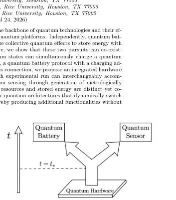
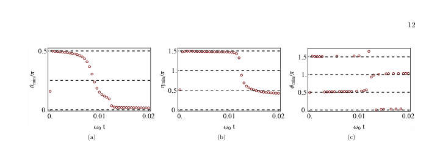
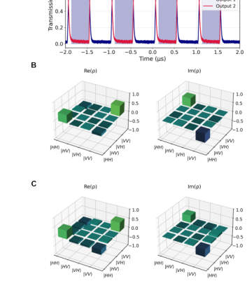
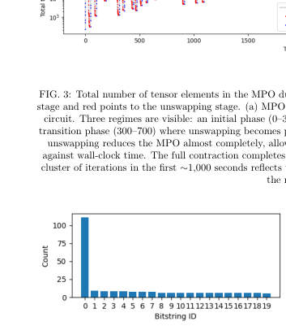

# arxiv digest (quant-ph + cond-mat) — 2026-04-24

*5 papers · 1 highlighted*

## ⭐ Highlighted (1)

*Papers by authors on your watch list. Full entries appear only once in their normal category below.*

- ⭐ [Algorithmic Locality via Provable Convergence in Quantum Tensor Networks](http://arxiv.org/abs/2604.21919v1) — Sarang Gopalakrishnan

## quantum information and computing (2)

### [Dual-use quantum hardware for quantum resource generation and energy storage](http://arxiv.org/abs/2604.21913v1)

**Authors:** Vaibhav Sharma, Yiming Wang, Shouvik Sur  
**Type:** theory · **PDF:** <https://arxiv.org/pdf/2604.21913v1>  
**Analysis basis:** full PDF text, analyzed in chunks

Figures

| Figure 1 | Figure 2 | Figure 3 | Figure 4 | Figure 5 |
| --- | --- | --- | --- | --- |
|  |  |  |  |  |
| FIG. 1. The same quantum hardware can serve either as a quantum battery or a quantum sensor because the process of charging a quantum battery generates quantum resources. Here, we demonstrate a concrete protocol where the quantum hardware remains agnostic of its intended use until a time t = t∗where a suitable metrological resource peaks. One can then choose to either time-evolve into a fully charged quantum battery or perform quantum sensing. As a bonus, after sensing, there exists a finite probability to obtain a fully charged battery. | FIG. 2. Time-evolution of the variance of the numerically optimized squeezed two-mode operator Xmin. Here, we have fixed (n, ω0, gn) = (4, 1, 1/ √ | FIG. 3. (a) Protocol combining charging (for time 2t1 with λ(t) = 1) and sensing (for time ts with λ(t) = 0) using the two coupled superconducting LC resonator based quantum battery model in Eq. 6. (b) Bloch sphere representation of the evolution of quantum state during this protocol, starting from a discharged state &#124;ψi⟩to a partially charged state &#124;ψm⟩ while sensing an unknown parameter ϕ for time ts. | FIG. 4. A schematic portrayal of potential inter-connectivity among standard quantum technologies. Here, X →Y implies Y enabled by X. This work enumerates such relationships between a quantum battery and a quantum sensor. Solid (dashed) arrows indicate established (hypothesized) proto- cols. The hypothetical protocols can be devised by combining the protocols developed here and in Refs. [59, 60]. | FIG. 5. Time evolution of the optimal angles for which the variance of the two-mode quadrature ˆ Xθ,η,ϕ is minimized. |

**Main problem.** Investigating whether quantum hardware can be designed for dual-use, simultaneously acting as a quantum battery for energy storage and a quantum sensor for metrology without additional hardware cost.

**Main result.** The authors prove that protocols for fast quantum state generation (like one-axis twisting) can simultaneously function as quantum battery charging protocols with a charging advantage, and that the hardware can switch between sensing and storage functions.

**Method.** The study uses analytical derivations (Heisenberg picture, short-time expansions, and Mandelstam-Tamm speed limits) and numerical exact diagonalization to map state preparation operators to battery charging protocols.

**Summary.** This paper demonstrates that quantum batteries and quantum sensors can share the same physical hardware. By using non-linear coupling in superconducting circuits, the authors show that the same process used to charge a battery can generate highly entangled states useful for sensing. This allows a single device to switch between storing energy and performing precision measurements. This approach promises more efficient, modular quantum architectures by maximizing the utility of every experimental run.

Detailed structure

**Model / system.** The proposed hardware consists of superconducting circuits, specifically two coupled superconducting LC resonators with non-linear coupling, and a model of N spin-1/2 particles under a one-axis twisting Hamiltonian.

**Key observables.** Quantum Fisher Information (QFI), entanglement, spin squeezing, charging power, and quadrature variance.

**Important parameters / regimes.** Twisting strength (chi), coupling strength (g_n), number of particles (N), evolution time (T), and non-linearity index (n).

**Assumptions / limitations.** The charging advantage may be lost in the true thermodynamic limit if the twisting strength is rescaled to keep energy extensive; the analysis also considers the short-time limit.

**Figures summary.** Figure 1 illustrates the dual-use concept and hardware trajectory; Figure 3 shows the protocol for combining charging and sensing; Figure 5 and 6 show the time evolution of optimal angular parameters and minimum quadrature variance.

**Paper structure.** The paper introduces the dual-use concept, establishes the mathematical connection between state preparation and battery charging, proposes a specific superconducting circuit implementation, provides analytical and numerical evidence for simultaneous resource generation, and concludes with a vision for integrated quantum architectures.

**Why it may be interesting.** It presents a novel way to unify two distinct fields—quantum metrology and quantum thermodynamics—suggesting that the 'waste' or intermediate stages of energy storage can be harvested for high-precision sensing.

Abstract

Quantum resources such as entanglement form the backbone of quantum technologies and their efficient generation is a central objective of modern quantum platforms. Independently, quantum batteries have emerged as nanoscale devices that utilize collective quantum effects to store energy with a charging advantage over classical strategies. Here, we show that these two pursuits can co-exist: protocols for fast generation of resourceful quantum states can simultaneously charge a quantum battery with a collective advantage, and conversely, a quantum battery protocol with a charging advantage can produce resource-rich states. Using this connection, we propose an integrated hardware protocol on superconducting circuits in which each experimental run can interchangeably accomplish either quantum battery charging, or quantum sensing through generation of metrologically useful states. Our results establish that quantum resources and stored energy are distinct yet co-producable quantities, opening the door to modular quantum architectures that dynamically switch between sensing and energy-storage functions, thereby producing additional functionalities without extra hardware cost.

### [A Universal Quantum Information Preserving Photonic Switch for Scalable Quantum Networks](http://arxiv.org/abs/2604.21902v1)

**Authors:** Jiapeng Zhao, Stéphane Vinet, Amir Minoofar, Michael Kilzer, Lucas Wang, Galan Moody, Vijoy Pandey, Ramana Kompella, Reza Nejabati  
**Type:** both · **PDF:** <https://arxiv.org/pdf/2604.21902v1>  
**Analysis basis:** full PDF text, analyzed in chunks

Figures

| Figure 1 | Figure 2 | Figure 3 | Figure 4 | Figure 5 |
| --- | --- | --- | --- | --- |
|  |  |  |  |  |
| FIG. 1: Switched Quantum Network. Conceptual quantum network centered around the quantum switch. The system ensures quantum state integrity and entanglement preservation while providing encoding-agnostic operation across diverse modalities. The switch supports time- and space-multiplexed utilization of shared critical resources whilst providing a scalable framework for the interconnection of quantum computers and quantum sensor. | FIG. 2: Architecture of the Universal Quantum Switch. The input quantum state converters (QSCs) enable conversion to path-encoding to ensure quantum information is routed through two identical photonic switches. The output QSCs convert the quantum information back to the desired output encoding modality. Both QSCs can be implemented in either an integrated or pluggable manner with an arbitrary combination of encoding modality. | FIG. 3: Schematic of the quantum switch. (a) Simplified sketch of the device for polarization encoding. (b) TFLN photonic integrated circuit combining both QSCs and the switch matrix, respectively highlighted in green and purple. (c) Normalized optical power when varying the driving voltage of TO phase shifters to characterize the half-wave power and ER of MZI. (d) Fast switching between two output ports when driving the EO modulator with a sinusoidal waveform at 1 GHz rate to determine half-wave voltage. | FIG. 4: Quantum state tomography (a) Simplified sketch of the experimental setup for quantum characterization. An entangled photon source produces polarization-entangled photons at 1551.72 nm (signal) and 1564.68 nm (idler). The signal photon is routed through the UQS. After the PIC, both photons are sent to the polarization tomography system. Reconstructed density matrices for the input ρin (b) and output ρout (c) for connection 1 →1 (input →output ports). A fidelity F(ρin, ρout) = 0.98 is obtained with purity Tr(ρ2 out) = 1. | FIG. 5: Dynamic switching. (a) Dynamic switching of the device when driving the EO modulator with a rectangular pulse at 1 MHz. The gated section used for quantum state tomography is shown in the shaded region. Reconstructed density matrices for the input ρin (b) and output ρout (c) for connection 2 →1 (input → output ports). A fidelity F(ρin, ρout) = 0.90 is obtained with purity Tr(ρ2 out) = 1. |

**Main problem.** Existing quantum networks are limited to static point-to-point links due to the lack of a switching paradigm that can dynamically route fragile quantum entanglement without introducing significant decoherence.

**Main result.** The authors demonstrated a Universal Quantum Switch (UQS) in thin-film lithium niobate that achieves high-speed (up to 1 GHz) routing of arbitrary entangled states with low decoherence (less than 4%) and high fidelity (over 94%).

**Method.** The researchers developed a three-stage architecture (Input QSC, Switch Matrix, Output QSC) and implemented it using a 2x2 TFLN photonic integrated circuit utilizing both thermo-optic and electro-optic modulation.

**Summary.** This paper presents a new 'Universal Quantum Switch' designed to enable scalable, dynamic quantum networks. Using thin-film lithium niobate technology, the authors created a device that can route different types of quantum encodings without destroying their fragile entanglement. The switch operates at extremely high speeds (up to 1 GHz) and maintains very high fidelity. This architecture is significant because it is designed to be scalable, meaning the decoherence does not increase as the network grows larger, providing a foundational building block for a future quantum internet.

Detailed structure

**Model / system.** The experimental platform is a thin-film lithium niobate (TFLN) photonic integrated circuit (PIC) featuring Mach-Zehnder interferometers, polarization rotator-splitters, and AlGaAs microring resonators for photon pair generation.

**Key observables.** Uhlmann fidelity, purity, concurrence, polarization extinction ratio (PER), polarization-dependent loss (PDL), and insertion loss (IL).

**Important parameters / regimes.** Switching speeds up to 1 GHz, decoherence penalty < 4%, insertion loss ~5.2 dB (including coupling), and reconfiguration speeds up to 1 GHz.

**Assumptions / limitations.** The input is an ideal polarization-entangled Bell state; path mismatch between logical 0 and 1 is negligible; and the extinction ratio of MZIs is assumed to be identical for both paths.

**Figures summary.** Figure 1 shows a conceptual switched network; Figure 2 illustrates the UQS architecture; Figure 3 details the TFLN PIC components; Table I summarizes classical performance; and Figure 6 shows the scaling potential regarding fidelity and PDL.

**Paper structure.** The paper introduces the scalability problem of static networks, proposes the UQS architecture, describes the TFLN physical implementation, details the experimental characterization of quantum states, provides a theoretical model for hardware-induced error, and discusses the scalability and future potential of the platform.

**Why it may be interesting.** This work is highly relevant to quantum optics and open quantum systems as it demonstrates a method for high-speed routing of entanglement while explicitly modeling and mitigating hardware-induced decoherence and noise.

Abstract

Quantum networks are a keystone of the quantum internet. However, existing implementations remain largely confined to static point-to-point links due to the absence of a switching paradigm capable of dynamically routing fragile quantum entanglement without introducing decoherence. Here, we propose the Universal Quantum Switch, a foundational building block allowing on-demand, non-blocking, and encoding-agnostic routing of quantum information, as well as seamless modality conversion between disparate quantum platforms. We develop a prototype in thin-film lithium niobate and experimentally demonstrate robust switching with $\le 4\%$ decoherence via thermo-optic modulation and high-speed electro-optic switching of arbitrary entangled states at 1 MHz. Moreover, we show that our platform can support reconfiguration speeds up to 1 GHz. To our knowledge, this work represents the first demonstration of multi-node dynamic entanglement distribution at these speeds. Complementing these experimental results, we project the architecture's scalability, showing dimension-independent decoherence, and provide a scalable, interoperable building block for heterogeneous quantum network fabrics.

## numerical methods (2)

### ⭐ [Algorithmic Locality via Provable Convergence in Quantum Tensor Networks](http://arxiv.org/abs/2604.21919v1)

**Highlighted author(s):** Sarang Gopalakrishnan  
**Authors:** Siddhant Midha, Yifan F. Zhang, Daniel Malz, Dmitry A. Abanin, Sarang Gopalakrishnan  
**Type:** theory · **PDF:** <https://arxiv.org/pdf/2604.21919v1>  
**Analysis basis:** full PDF text, analyzed in chunks

Figures

| Figure 1 |
| --- |
|  |
| FIG. 1. (a) Algorithmic locality in tensor networks: The ef- fect of a perturbation at the center of the network on the fixed-point messages living on edges of the graph decays ex- ponentially with distance from perturbation. Loops (see Eq. (6)) and clusters (see Eq. (7)) built out of the fixed-point mes- sages inherit the locality subsequently. (b) Phase diagram of injective PEPS: Theorem 1 shows existence (for all 0 ≤ε < 1) and uniqueness (for ε < ε∗= O(1/∆)) of fixed points, where ∆is the degree of the graph. Theorem 2 shows convergence of cluster expansion for ε < ε∗∗= O  min{1/D, (D/∆)∆/2}  |

**Main problem.** Establishing a rigorous theoretical foundation for Tensor Network Belief Propagation (TN-BP) in higher dimensions, specifically addressing the gap between its empirical success and provable algorithmic performance.

**Main result.** The authors prove the existence, uniqueness, and efficient convergence of BP fixed points for strongly injective PEPS and introduce 'algorithmic locality,' where local perturbations decay exponentially in their effect on the network.

**Method.** The work utilizes message-passing dynamics, cluster expansion techniques from statistical mechanics, and Banach contraction mapping to provide error bounds and convergence guarantees.

**Summary.** This paper provides the first end-to-end rigorous theory for using Belief Propagation to contract higher-dimensional tensor networks like PEPS. It proves that for sufficiently injective states, the algorithm converges efficiently and that local changes to the network only affect local observables exponentially far away. This 'algorithmic locality' justifies the use of local recomputation for efficient classical simulation. The work bridges the gap between widely used numerical practices and formal algorithmic guarantees.

Detailed structure

**Model / system.** The study focuses on Projected Entangled Pair States (PEPS) on arbitrary graphs, specifically a class of states satisfying strong injectivity.

**Key observables.** Local expectation values, connected correlation functions, and the partition function (norm of the state).

**Important parameters / regimes.** The injectivity parameter (epsilon), bond dimension (D), maximum vertex degree (Delta), and the correlation/decay length scales (xi).

**Assumptions / limitations.** The proofs primarily apply to a subclass of PEPS satisfying 'strong injectivity' and assume sufficiently small epsilon to ensure convergence and loop decay.

**Figures summary.** Figure 1(a) illustrates the concept of algorithmic locality via decaying perturbations; Figure 1(b) presents a phase diagram showing thresholds for existence, uniqueness, and cluster expansion convergence relative to a hardness threshold.

**Paper structure.** The paper progresses from establishing the existence and uniqueness of BP fixed points to proving the convergence of cluster-corrected BP, and finally demonstrating the algorithmic locality of both fixed points and observables.

Abstract

Belief propagation has recently emerged as a powerful framework for evaluating tensor networks in higher dimensions, combining computational efficiency with provable analytical guarantees. In this work, we develop the first end-to-end theory of tensor network belief propagation for a class of projected entangled pair states satisfying \emph{strong injectivity}. We show that when the injectivity parameter exceeds a constant threshold, BP fixed points can be found efficiently, and a cluster-corrected BP algorithm computes physical quantities to $1/\mathrm{poly}(N)$ error in $\mathrm{poly}(N)$ time for an $N$ qubit system. We identify a striking phenomenon we term \emph{algorithmic locality}: local perturbations of the tensor network affect the BP fixed point with an influence decaying rapidly with distance. As a result, updates to the fixed point after a local perturbation can be carried out using only local recomputation. Moreover, through the cluster expansion, this locality extends to observables, implying that local expectation values can be approximated from local data with controlled accuracy. Our results provide the first rigorous guarantee for the effectiveness of tensor-network belief propagation on a wide class of many-body states, bridging a gap between widely used numerical practice and provable algorithmic performance.

### [Efficient Classical Simulation of Heuristic Peaked Quantum Circuits](http://arxiv.org/abs/2604.21908v1)

**Authors:** David Kremer, Nicolas Dupuis  
**Type:** theory · **PDF:** <https://arxiv.org/pdf/2604.21908v1>  
**Analysis basis:** full PDF text, analyzed in chunks

Figures

| Figure 1 | Figure 2 | Figure 3 | Figure 4 |
| --- | --- | --- | --- |
|  |  |  |  |
| FIG. 1: The three stages of the iterative contraction method. (a) The transpiled circuit is split at the temporal midpoint into a left circuit CL and a right circuit CR, with an identity MPO inserted between them. (b) The greedy unswapping procedure: qubit pairs in the MPO are ranked by bond dimension, and swaps are applied from the left, right, or both sides. Swaps that reduce the bond dimension are accepted, yielding the decomposition M = PL ˜ MPR. (c) Rewiring: the extracted permutations PL and PR are absorbed into the remaining circuits by removing existing transpilation SWAPs, reindexing qubits, and re-transpiling to linear connectivity. | FIG. 2: Overview of the iterative contraction procedure. Starting from a small MPO between the left and right circuits, the method cycles through three stages: (1) absorption of circuit layers into the MPO, which causes it to grow; (2) unswapping, which extracts permutations PL and PR and reduces the MPO to a smaller ˜ M; and (3) rewiring, which propagates the extracted permutations into the remaining circuits and re-transpiles to linear connectivity. | FIG. 3: Total number of tensor elements in the MPO during contraction. Blue points correspond to the absorption stage and red points to the unswapping stage. (a) MPO size as a function of two-qubit unitaries consumed from the circuit. Three regimes are visible: an initial phase (0–300 unitaries) with rapid absorption–unswapping cycling; a transition phase (300–700) where unswapping becomes progressively more effective; and a final phase (700+) where unswapping reduces the MPO almost completely, allowing long absorption runs. (b) The same quantity plotted against wall-clock time. The full contraction completes in 4,059 seconds on a single Nvidia A100 GPU. The dense cluster of iterations in... | FIG. 4: Frequency of the top 20 most-sampled bitstrings from 1,000 samples drawn from the contracted MPS. The peak bitstring (ID 0) appears approximately 110 times (∼11%), consistent with the designed peak weight of ∼10%. The sharp separation from the remaining bitstrings confirms successful recovery of the peak. |

**Main problem.** The paper challenges a recent claim of heuristic quantum advantage by demonstrating that 'peaked' quantum circuits, which use obfuscation to increase complexity, can be efficiently simulated classically.

**Main result.** The authors developed a tensor network method that can simulate a 56-qubit circuit in approximately one hour on a single GPU, outperforming the execution time of the original quantum hardware.

**Method.** The method uses an iterative Matrix Product Operator (MPO) contraction process involving absorption, a greedy 'unswapping' heuristic to reduce bond dimension by extracting permutations, and circuit rewiring.

**Summary.** This paper refutes a claim of quantum advantage by showing that certain complex-looking quantum circuits are actually easy to simulate classically. By using a specialized tensor network technique called 'unswapping,' the authors can undo the permutations intended to hide the circuit's structure. They successfully simulated a 56-qubit circuit in about an hour, which was faster than the actual quantum computer run. This demonstrates that the specific architectural vulnerabilities in these peaked circuits prevent them from achieving true computational supremacy.

Detailed structure

**Model / system.** The study focuses on peaked quantum circuits with a $UU^\dagger$ mirror architecture, specifically targeting the 56-qubit $P9_{Hqap}$ circuit previously executed on Quantinuum's H2 trapped-ion processor.

**Key observables.** Peak bitstring weight (probability of the target bitstring) and MPO bond dimension.

**Important parameters / regimes.** SVD singular value cutoff ($\epsilon = 2 	imes 10^{-3}$), maximum bond dimension ($\chi_{max} = 8192$), and unswapping threshold ($	au = 10^6$).

**Assumptions / limitations.** The method assumes the circuit possesses a mirrored $UU^\dagger$ structure and relies on a small SVD truncation error for efficiency.

**Figures summary.** Figure 1 shows the three stages of contraction (splitting, unswapping, rewiring); Figure 2 illustrates the iterative absorption-unswapping-rewiring cycle; Figure 3 shows MPO size dynamics and wall-clock time; Figure 4 displays the frequency distribution of sampled bitstrings.

**Paper structure.** The paper introduces the problem of peaked circuit simulation, describes the proposed MPO contraction and unswapping algorithm, presents performance benchmarks against quantum hardware, and discusses the implications for quantum advantage claims.

Abstract

Peaked quantum circuits, whose output distribution is sharply concentrated on a single bitstring, have emerged as a promising candidate for verifiable quantum advantage, as the correctness of the quantum output can be checked by simply comparing against the known peak. Recent work by Gharibyan et al. arXiv:2510.25838 claimed heuristic quantum advantage using peaked circuits executed on Quantinuum's 56-qubit H2 processor. These peaked circuits concentrate their output on a single hidden bitstring by training a shallow simulable circuit variationally and inserting an obfuscated permutation to increase the depth to a level that makes classical simulation intractable, with estimated runtimes of years for the largest instances. We show that these circuits can be efficiently simulated classically. We describe a method that efficiently performs a full tensor network contraction, allowing near-exact sampling and extraction of the peaked bitstring. The method exploits the mirrored structure of the circuit and iteratively cancels both halves into a Matrix Product Operator (MPO), and avoids the obfuscated permutation by greedily reducing the MPO bond dimension through a process we call unswapping. The method can fully contract and extract the peak of the largest circuit in approximately one hour on a single GPU, around half the time it took to run on the quantum hardware.

## other (1)

### [Subsystem-Resolved Spectral Theory for Quantum Many-Body Hamiltonians](http://arxiv.org/abs/2604.21929v1)

**Authors:** MD Nahidul Hasan Sabit  
**Type:** theory · **PDF:** <https://arxiv.org/pdf/2604.21929v1>  
**Analysis basis:** full PDF text, analyzed in chunks

Figures

| Figure 1 | Figure 2 | Figure 3 | Figure 4 | Figure 5 |
| --- | --- | --- | --- | --- |
|  |  |  |  |  |
| Low-resolution page preview, page 2 | Low-resolution page preview, page 3 | Low-resolution page preview, page 4 | Low-resolution page preview, page 5 | Low-resolution page preview, page 6 |

**Main problem.** Standard spectral theory for many-body systems fails to capture how local interaction structures contribute to the global spectrum. The paper seeks to develop a subsystem-resolved framework to organize spectral data according to the geometry of interactions.

**Main result.** The authors prove that subsystem spectra are stable under local truncation and exhibit approximate additivity for spatially separated subsystems, with errors decaying exponentially with distance.

**Method.** The study uses operator algebra, spectral perturbation theory (Hausdorff distance), and a specialized interaction norm to bound the error between true and truncated subsystem Hamiltonians.

**Summary.** This paper introduces a new way to study the spectra of quantum many-body systems by looking at them through the lens of subsystems. Instead of just looking at the global energy spectrum, the authors show that you can organize spectral data based on local interaction structures. They prove that the spectra of local regions are stable even when you truncate distant interactions and that the spectra of two far-apart regions can be approximately added together. This demonstrates that the locality of a Hamiltonian is reflected not just in its operators, but in its energy levels as well.

Detailed structure

**Model / system.** The framework applies to general quantum many-body Hamiltonians acting on a tensor product Hilbert space, where the Hamiltonian is a sum of local interaction terms defined on a lattice.

**Key observables.** Subsystem spectrum (sigma(H_S)) and the Hausdorff distance between spectra.

**Important parameters / regimes.** Interaction norm (Phi_mu), truncation radius (r), spatial separation (D), and interaction range (R).

**Assumptions / limitations.** The system is assumed to have an exponentially decaying interaction strength (finite interaction norm) and is initially presented for a finite index set.

**Paper structure.** The paper introduces a subsystem-based spectral framework, defines the mathematical tools (interaction norms and subsystem Hamiltonians), proves spectral stability under local truncation, establishes the approximate additivity of spectra for distant subsystems, and concludes with implications for the locality of spectral properties.

**Why it may be interesting.** This provides a 'static' counterpart to the dynamical Lieb-Robinson bounds, offering a new way to understand how the spatial geometry of a many-body system is encoded directly in its spectral properties.

Abstract

We study spectral properties of quantum many-body Hamiltonians through a subsystem-based framework. Given a Hamiltonian of the form $H = \sum_{X \subseteq Λ} Φ(X)$ acting on a tensor product Hilbert space, we associate to each subset $S \subseteq Λ$ a subsystem Hamiltonian $H_S$ and its spectrum $\mathcal{S}(S) = σ(H_S)$. This produces a family of spectra indexed by subsystems, allowing spectral data to be organized according to interaction structure. We show that subsystem Hamiltonians admit local approximations: $H_S$ can be approximated by operators supported on finite neighborhoods with an error bounded by $\|H_S - H_{S,r}\| \le |S| e^{-μr} \|Φ\|_μ$. As a consequence, subsystem spectra are stable under truncation in the sense that $d_H(\mathcal{S}(S), σ(H_{S,r})) \le |S| e^{-μr} \|Φ\|_μ.$ We then prove that for disjoint subsets $S_1, S_2 \subseteq Λ$, the subsystem spectrum is approximately additive: $d_H\big(\mathcal{S}(S_1 \cup S_2), \mathcal{S}(S_1) + \mathcal{S}(S_2)\big) \le (|S_1| + |S_2|) e^{-μD} \|Φ\|_μ,$ where $D = d(S_1, S_2)$. In the finite-range case, this relation becomes exact. The results show that spectral properties reflect the locality of interactions not only at the level of operators, but also at the level of spectra. The framework provides a way to study many-body systems in which interaction geometry directly shapes spectral behavior.

