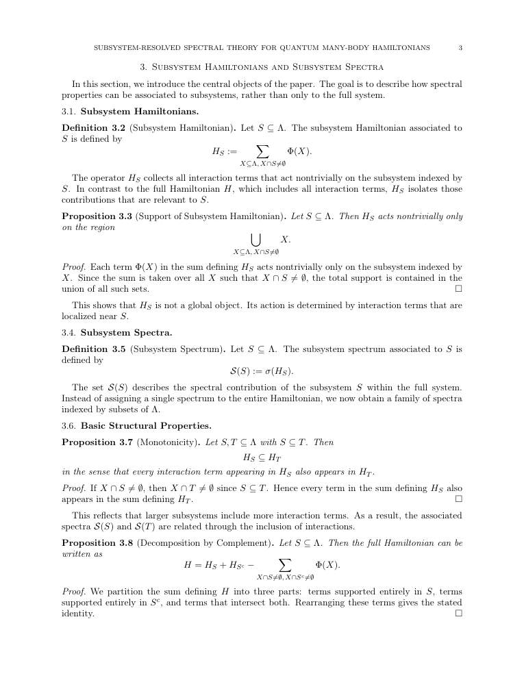

# arxiv digest (quant-ph + cond-mat) — 2026-04-24

*2 papers · 1 highlighted*

## ⭐ Highlighted (1)

*Papers by authors on your watch list. Full entries appear only once in their normal category below.*

- ⭐ [Algorithmic Locality via Provable Convergence in Quantum Tensor Networks](http://arxiv.org/abs/2604.21919v1) — Sarang Gopalakrishnan

## numerical methods (1)

### ⭐ [Algorithmic Locality via Provable Convergence in Quantum Tensor Networks](http://arxiv.org/abs/2604.21919v1)

**Highlighted author(s):** Sarang Gopalakrishnan  
**Authors:** Siddhant Midha, Yifan F. Zhang, Daniel Malz, Dmitry A. Abanin, Sarang Gopalakrishnan  
**Type:** theory · **PDF:** <https://arxiv.org/pdf/2604.21919v1>  
**Analysis basis:** full PDF text, analyzed in chunks

📷 Fig 1

 
FIG. 1. (a) Algorithmic locality in tensor networks: The ef- fect of a perturbation at the center of the network on the fixed-point messages living on edges of the graph decays ex- ponentially with distance from perturbation. Loops (see Eq. (6)) and clusters (see Eq. (7)) built out of the fixed-point mes- sages inherit the locality subsequently. (b) Phase diagram of injective PEPS: Theorem 1 shows existence (for all 0 ≤ε &lt; 1) and uniqueness (for ε &lt; ε∗= O(1/∆)) of fixed points, where ∆is the degree of the graph. Theorem 2 shows convergence of cluster expansion for ε &lt; ε∗∗= O  min{1/D, (D/∆)∆/2} 

**Main problem.** Establishing rigorous theoretical foundations for Tensor Network Belief Propagation (TN-BP) in higher dimensions, specifically addressing the gap between empirical success and provable algorithmic performance.

**Main result.** The authors prove 'algorithmic locality,' demonstrating that local perturbations in a PEPS lead to exponentially decaying changes in BP fixed-point messages and local observables, and establish conditions for efficient polynomial-time classical simulation.

**Method.** The work utilizes message-passing dynamics, cluster expansion techniques from lattice statistical mechanics, and Banach contraction mapping to analyze the convergence and stability of the BP algorithm.

**Summary.** This paper provides the first rigorous mathematical guarantee for the effectiveness of Tensor Network Belief Propagation on a wide class of many-body states. It introduces the concept of 'algorithmic locality,' proving that local changes to a tensor network only affect the algorithm's fixed points and observables locally. By establishing convergence thresholds for cluster expansions, the authors bridge the gap between widely used numerical practices and provable algorithmic performance. This work is significant for the development of reliable classical simulation techniques for 2D quantum systems.

Detailed structure

**Model / system.** The study focuses on Projected Entangled Pair States (PEPS) defined on arbitrary graphs with a fixed maximum degree and bond dimension, specifically focusing on a class of strongly injective tensors.

**Key observables.** Local expectation values, connected correlation functions, and the PEPS norm (partition function).

**Important parameters / regimes.** Injectivity parameter (epsilon), bond dimension (D), maximum vertex degree (Delta), and the correlation length (xi).

**Assumptions / limitations.** The results assume the PEPS satisfies a strong injectivity condition and that the bond dimension and vertex degree are O(1).

**Figures summary.** Figure 1(a) illustrates the concept of algorithmic locality via decaying message changes; Figure 1(b) presents a phase diagram showing regimes of existence, uniqueness, and computational hardness based on the injectivity parameter.

**Paper structure.** The paper progresses from establishing the existence and uniqueness of BP fixed points to proving the convergence of loop/cluster expansions, and finally demonstrating the locality of the resulting algorithm under perturbations.

Abstract

Belief propagation has recently emerged as a powerful framework for evaluating tensor networks in higher dimensions, combining computational efficiency with provable analytical guarantees. In this work, we develop the first end-to-end theory of tensor network belief propagation for a class of projected entangled pair states satisfying \emph{strong injectivity}. We show that when the injectivity parameter exceeds a constant threshold, BP fixed points can be found efficiently, and a cluster-corrected BP algorithm computes physical quantities to $1/\mathrm{poly}(N)$ error in $\mathrm{poly}(N)$ time for an $N$ qubit system. We identify a striking phenomenon we term \emph{algorithmic locality}: local perturbations of the tensor network affect the BP fixed point with an influence decaying rapidly with distance. As a result, updates to the fixed point after a local perturbation can be carried out using only local recomputation. Moreover, through the cluster expansion, this locality extends to observables, implying that local expectation values can be approximated from local data with controlled accuracy. Our results provide the first rigorous guarantee for the effectiveness of tensor-network belief propagation on a wide class of many-body states, bridging a gap between widely used numerical practice and provable algorithmic performance.

## other (1)

### [Subsystem-Resolved Spectral Theory for Quantum Many-Body Hamiltonians](http://arxiv.org/abs/2604.21929v1)

**Authors:** MD Nahidul Hasan Sabit  
**Type:** theory · **PDF:** <https://arxiv.org/pdf/2604.21929v1>  
**Analysis basis:** full PDF text, analyzed in chunks

📷 Fig 1

 
Low-resolution page preview, page 2

📷 Fig 2

 
Low-resolution page preview, page 3

📷 Fig 3

 
Low-resolution page preview, page 4

📷 Fig 4

 
Low-resolution page preview, page 5

📷 Fig 5

 
Low-resolution page preview, page 6

📷 Fig 6

 
Low-resolution page preview, page 7

📷 Fig 7

 
Low-resolution page preview, page 8

📷 Fig 8

 
Low-resolution page preview, page 9

📷 Fig 9

 
Low-resolution page preview, page 10

📷 Fig 10

 
Low-resolution page preview, page 11

**Main problem.** Standard spectral theory for many-body systems fails to capture how interaction locality influences the distribution of spectral properties across different spatial regions.

**Main result.** The paper establishes a subsystem-resolved spectral theory where subsystem spectra are stable under local truncation and approximately additive for spatially separated regions, with errors decaying exponentially with distance.

**Method.** The authors use operator algebra, spectral perturbation theory (Hausdorff distance bounds), and interaction norms to relate operator-level local approximations to spectral stability.

**Summary.** This paper develops a new framework to study the spectral properties of quantum many-body systems by resolving them at the subsystem level. It proves that the spectra of local subsystems are stable under truncation and that the spectra of distant subsystems are approximately additive. These results show that the locality of interactions is reflected not just in the operators themselves, but also in their energy spectra. This provides a structured way to link interaction geometry to spectral behavior.

Detailed structure

**Model / system.** Quantum many-body Hamiltonians acting on a tensor product Hilbert space, where the Hamiltonian is a sum of local interaction terms with exponentially decaying strengths.

**Key observables.** Subsystem spectrum (sigma(H_S)) and the Hausdorff distance between spectra.

**Important parameters / regimes.** Decay parameter (mu), neighborhood radius (r), interaction range (R), and spatial distance (D) between subsystems.

**Assumptions / limitations.** The interactions must exhibit exponential decay in strength relative to the diameter of the interaction set.

**Paper structure.** The paper introduces a subsystem-based framework, defines the interaction norm and subsystem Hamiltonians, proves local approximation and spectral stability, demonstrates spectral additivity for disjoint sets, and discusses the finite-range regime and potential extensions to infinite systems.

**Why it may be interesting.** This provides a static, spectral counterpart to dynamical locality phenomena like Lieb-Robinson bounds, offering a new way to study how interaction geometry shapes the energy landscape of many-body systems.

Abstract

We study spectral properties of quantum many-body Hamiltonians through a subsystem-based framework. Given a Hamiltonian of the form $H = \sum_{X \subseteq Λ} Φ(X)$ acting on a tensor product Hilbert space, we associate to each subset $S \subseteq Λ$ a subsystem Hamiltonian $H_S$ and its spectrum $\mathcal{S}(S) = σ(H_S)$. This produces a family of spectra indexed by subsystems, allowing spectral data to be organized according to interaction structure. We show that subsystem Hamiltonians admit local approximations: $H_S$ can be approximated by operators supported on finite neighborhoods with an error bounded by $\|H_S - H_{S,r}\| \le |S| e^{-μr} \|Φ\|_μ$. As a consequence, subsystem spectra are stable under truncation in the sense that $d_H(\mathcal{S}(S), σ(H_{S,r})) \le |S| e^{-μr} \|Φ\|_μ.$ We then prove that for disjoint subsets $S_1, S_2 \subseteq Λ$, the subsystem spectrum is approximately additive: $d_H\big(\mathcal{S}(S_1 \cup S_2), \mathcal{S}(S_1) + \mathcal{S}(S_2)\big) \le (|S_1| + |S_2|) e^{-μD} \|Φ\|_μ,$ where $D = d(S_1, S_2)$. In the finite-range case, this relation becomes exact. The results show that spectral properties reflect the locality of interactions not only at the level of operators, but also at the level of spectra. The framework provides a way to study many-body systems in which interaction geometry directly shapes spectral behavior.

