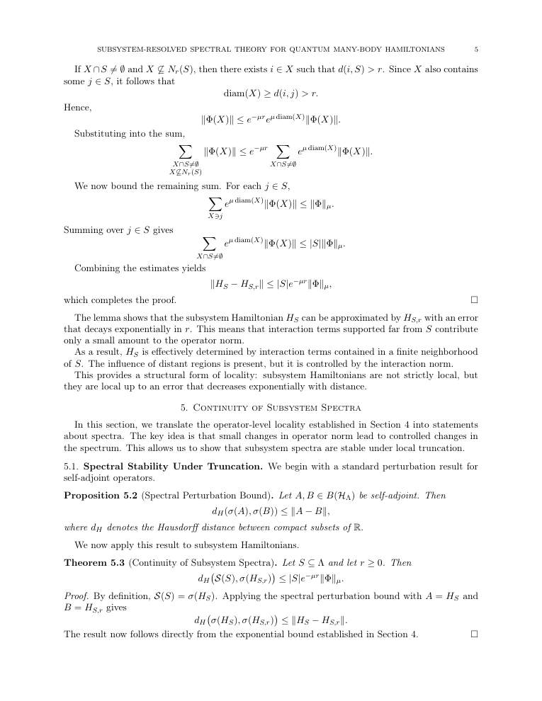
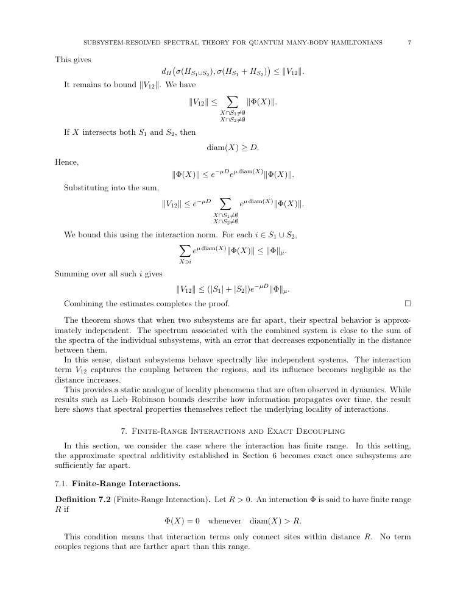
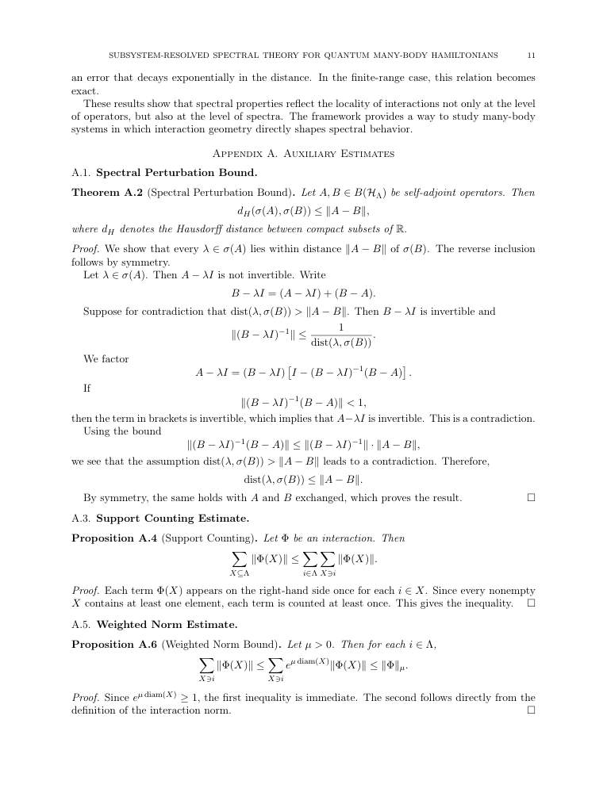

# arxiv digest (quant-ph + cond-mat) — 2026-04-24

*2 papers · 1 highlighted*

## ⭐ Highlighted (1)

*Papers by authors on your watch list. Full entries appear only once in their normal category below.*

- ⭐ [Algorithmic Locality via Provable Convergence in Quantum Tensor Networks](http://arxiv.org/abs/2604.21919v1) — Sarang Gopalakrishnan

## numerical methods (1)

### ⭐ [Algorithmic Locality via Provable Convergence in Quantum Tensor Networks](http://arxiv.org/abs/2604.21919v1)

**Highlighted author(s):** Sarang Gopalakrishnan  
**Authors:** Siddhant Midha, Yifan F. Zhang, Daniel Malz, Dmitry A. Abanin, Sarang Gopalakrishnan  
**Type:** theory · **PDF:** <https://arxiv.org/pdf/2604.21919v1>  
**Analysis basis:** full PDF text, analyzed in chunks

📷 Fig 1

 
FIG. 1. (a) Algorithmic locality in tensor networks: The ef- fect of a perturbation at the center of the network on the fixed-point messages living on edges of the graph decays ex- ponentially with distance from perturbation. Loops (see Eq. (6)) and clusters (see Eq. (7)) built out of the fixed-point mes- sages inherit the locality subsequently. (b) Phase diagram of injective PEPS: Theorem 1 shows existence (for all 0 ≤ε &lt; 1) and uniqueness (for ε &lt; ε∗= O(1/∆)) of fixed points, where ∆is the degree of the graph. Theorem 2 shows convergence of cluster expansion for ε &lt; ε∗∗= O  min{1/D, (D/∆)∆/2} 

**Main problem.** Establishing rigorous theoretical foundations for Tensor Network Belief Propagation (TN-BP) and proving the 'algorithmic locality' of its fixed points and observables.

**Main result.** The authors prove that for strongly injective PEPS, BP fixed points are unique, efficiently findable, and that local perturbations to the network cause exponentially decaying changes in both messages and local expectation values.

**Method.** The work utilizes the Banach contraction mapping principle, cluster expansion techniques from statistical mechanics, and perturbation theory to analyze message-passing dynamics and loop excitations.

**Summary.** This paper provides the first rigorous theoretical guarantee for the effectiveness of Tensor Network Belief Propagation on a wide class of many-body states. It proves that for sufficiently injective PEPS, the algorithm converges to a unique fixed point and that local changes to the system only affect local observables within a bounded distance. This 'algorithmic locality' justifies the use of local recomputation and validates the empirical success of TN-BP in higher dimensions. The work bridges the gap between widely used numerical practices and provable algorithmic performance.

Detailed structure

**Model / system.** The study focuses on Projected Entangled Pair States (PEPS) defined on arbitrary graphs with constant maximum degree and bond dimension, specifically in the regime of strong injectivity.

**Key observables.** Local expectation values, connected correlation functions, and the norm of the state.

**Important parameters / regimes.** Injectivity parameter (epsilon), maximum degree (Delta), bond dimension (D), and the correlation/decay length scales (xi* and xi**).

**Assumptions / limitations.** The results are contingent on the PEPS satisfying a strong injectivity condition and assume a regime where the deviation from isometry is sufficiently small.

**Figures summary.** Figure 1(a) illustrates the concept of algorithmic locality via decaying message influence, and Figure 1(b) presents a phase diagram of injective PEPS showing various convergence and existence thresholds.

**Paper structure.** The paper progresses from mathematical preliminaries on injective tensors to the analysis of BP fixed-point existence and uniqueness, followed by the study of loop/cluster expansions, and concludes with the proof of algorithmic locality under perturbations.

Abstract

Belief propagation has recently emerged as a powerful framework for evaluating tensor networks in higher dimensions, combining computational efficiency with provable analytical guarantees. In this work, we develop the first end-to-end theory of tensor network belief propagation for a class of projected entangled pair states satisfying \emph{strong injectivity}. We show that when the injectivity parameter exceeds a constant threshold, BP fixed points can be found efficiently, and a cluster-corrected BP algorithm computes physical quantities to $1/\mathrm{poly}(N)$ error in $\mathrm{poly}(N)$ time for an $N$ qubit system. We identify a striking phenomenon we term \emph{algorithmic locality}: local perturbations of the tensor network affect the BP fixed point with an influence decaying rapidly with distance. As a result, updates to the fixed point after a local perturbation can be carried out using only local recomputation. Moreover, through the cluster expansion, this locality extends to observables, implying that local expectation values can be approximated from local data with controlled accuracy. Our results provide the first rigorous guarantee for the effectiveness of tensor-network belief propagation on a wide class of many-body states, bridging a gap between widely used numerical practice and provable algorithmic performance.

## other (1)

### [Subsystem-Resolved Spectral Theory for Quantum Many-Body Hamiltonians](http://arxiv.org/abs/2604.21929v1)

**Authors:** MD Nahidul Hasan Sabit  
**Type:** theory · **PDF:** <https://arxiv.org/pdf/2604.21929v1>  
**Analysis basis:** full PDF text, analyzed in chunks

📷 Fig 1

 
Low-resolution page preview, page 2

📷 Fig 2

 
Low-resolution page preview, page 3

📷 Fig 3

 
Low-resolution page preview, page 4

📷 Fig 4

 
Low-resolution page preview, page 5

📷 Fig 5

 
Low-resolution page preview, page 6

📷 Fig 6

 
Low-resolution page preview, page 7

📷 Fig 7

 
Low-resolution page preview, page 8

📷 Fig 8

 
Low-resolution page preview, page 9

📷 Fig 9

 
Low-resolution page preview, page 10

📷 Fig 10

 
Low-resolution page preview, page 11

**Main problem.** Standard spectral theory for many-body systems fails to capture how local interaction structures contribute to the global spectrum. The paper seeks to develop a subsystem-resolved framework to organize spectral data according to interaction geometry.

**Main result.** The authors prove that subsystem Hamiltonians can be locally approximated with exponentially small error and that their spectra are stable under such truncations. Furthermore, they show that the spectra of disjoint subsystems are approximately additive, with the error decaying exponentially with the distance between them.

**Method.** The study uses operator algebra, spectral perturbation theory (Hausdorff distance), and interaction norms to relate operator-level local approximations to spectral stability and additivity.

**Summary.** This paper introduces a new way to study the energy spectra of many-body systems by looking at subsystems rather than just the global Hamiltonian. It proves that the energy levels of a local region can be accurately approximated by looking at a finite neighborhood and that the energy levels of two distant regions can be treated as approximately independent (additive). This provides a static, spectral version of the Lieb-Robinson bounds, showing that the geometry of interactions directly shapes the structure of the energy spectrum.

Detailed structure

**Model / system.** The framework applies to quantum many-body Hamiltonians acting on a tensor product Hilbert space, where the Hamiltonian is a sum of local interaction terms with exponentially decaying strengths.

**Key observables.** Subsystem spectrum (sigma(H_S)) and the Hausdorff distance between spectra.

**Important parameters / regimes.** Interaction norm (Phi_mu), truncation radius (r), distance between subsystems (D), and interaction decay rate (mu).

**Assumptions / limitations.** The interactions must exhibit exponential decay in strength relative to their diameter, and the current results are formulated for finite-dimensional systems.

**Paper structure.** The paper introduces a subsystem-based spectral framework, defines the mathematical tools (interaction norms and subsystem Hamiltonians), proves local approximability and spectral stability, demonstrates spectral additivity for disjoint sets, and concludes with implications for the locality of spectral properties.

Abstract

We study spectral properties of quantum many-body Hamiltonians through a subsystem-based framework. Given a Hamiltonian of the form $H = \sum_{X \subseteq Λ} Φ(X)$ acting on a tensor product Hilbert space, we associate to each subset $S \subseteq Λ$ a subsystem Hamiltonian $H_S$ and its spectrum $\mathcal{S}(S) = σ(H_S)$. This produces a family of spectra indexed by subsystems, allowing spectral data to be organized according to interaction structure. We show that subsystem Hamiltonians admit local approximations: $H_S$ can be approximated by operators supported on finite neighborhoods with an error bounded by $\|H_S - H_{S,r}\| \le |S| e^{-μr} \|Φ\|_μ$. As a consequence, subsystem spectra are stable under truncation in the sense that $d_H(\mathcal{S}(S), σ(H_{S,r})) \le |S| e^{-μr} \|Φ\|_μ.$ We then prove that for disjoint subsets $S_1, S_2 \subseteq Λ$, the subsystem spectrum is approximately additive: $d_H\big(\mathcal{S}(S_1 \cup S_2), \mathcal{S}(S_1) + \mathcal{S}(S_2)\big) \le (|S_1| + |S_2|) e^{-μD} \|Φ\|_μ,$ where $D = d(S_1, S_2)$. In the finite-range case, this relation becomes exact. The results show that spectral properties reflect the locality of interactions not only at the level of operators, but also at the level of spectra. The framework provides a way to study many-body systems in which interaction geometry directly shapes spectral behavior.

